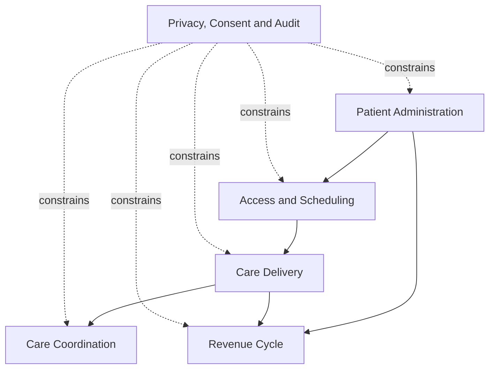
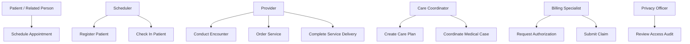
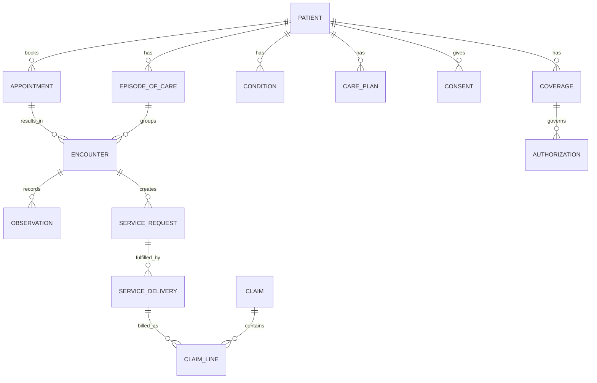
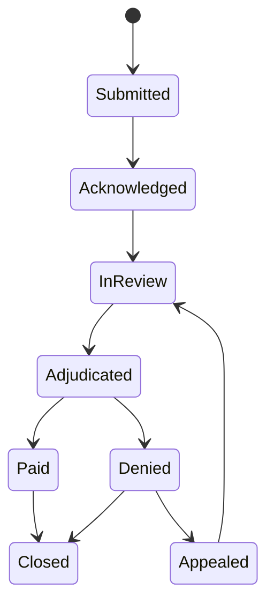
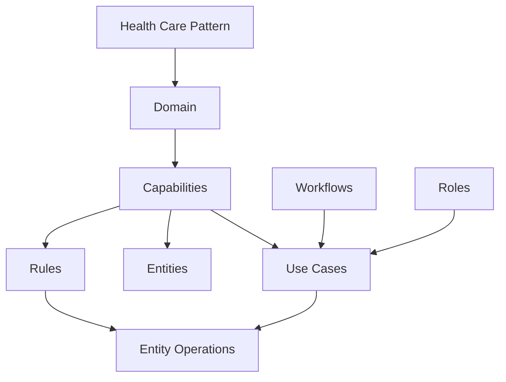

# Architecture and Requirements Diagrams

## Capability relationships

## Use-case view

## Logical data model

## Key state machines

# Architecture Diagrams

This knowledge base is requirements-only. The consuming application must maintain its system architecture, physical data, interaction, and deployment diagrams.

## Knowledge topology

