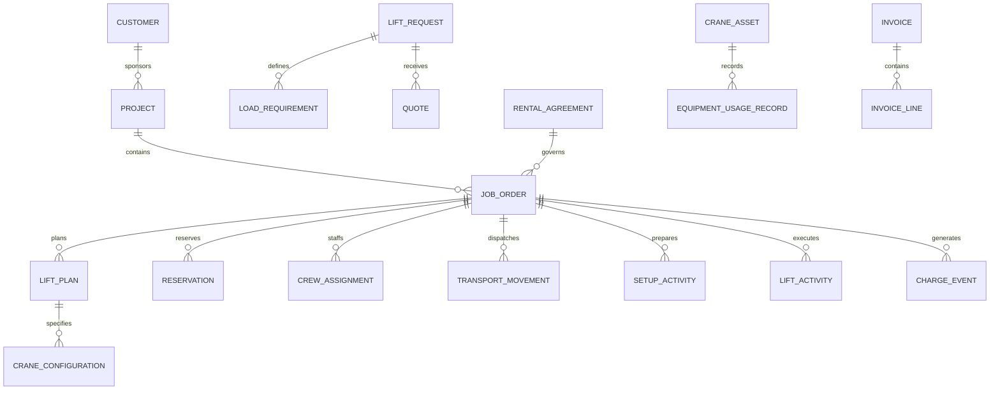

# Industrial & Commercial Crane Rental Orchestration Model Pattern

## Classification

**Applied industry extension — outside the original industry subject list.**

This pattern specializes Cross-Industry Party, Role, Organization, Product, Asset, Equipment, Offering, Quote, Agreement, Order, Schedule, Work Effort, Location, Inspection, Measurement, Charge, Invoice, Payment, Event, Status, and Document concepts.

## Intent

Model organizations that rent mobile, tower, crawler, rough-terrain, all-terrain, carry-deck, boom-truck, and other lifting equipment; evaluate lift requirements; select appropriate equipment and configurations; quote and contract work; reserve fleet and qualified personnel; coordinate permits, transport, setup, inspection, lift execution, standby, teardown, return, maintenance, billing, and compliance evidence.

The term **orchestration** is intentional. A crane-rental engagement coordinates many independently governed resources and decisions: customer demand, job site, load, radius, capacity, configuration, ground conditions, lift plan, equipment availability, transport, operators, riggers, signal persons, permits, inspections, weather, execution, utilization, and commercial settlement.

This is a logical business and operations pattern, not an engineering calculation method, lift-planning standard, regulatory rule, or safety procedure. Implementations must use qualified professionals and the standards, manufacturer requirements, labor rules, permits, and laws applicable to each jurisdiction and lift.

## Business overview

**Customer Need → Lift Request → Site/Load Assessment → Equipment Selection → Quote → Contract → Lift Plan/Permits → Reservation → Dispatch → Delivery/Setup → Inspection → Lift Execution → Teardown/Return → Utilization/Billing → Maintenance**

A Customer submits a Lift Request describing the load, site, dates, access, reach, height, radius, duty, and service expectations. A rental organization evaluates the request, surveys the site where needed, determines risk and planning requirements, and proposes a Crane Configuration, accessories, transport, personnel, schedule, and commercial terms. An accepted Quote creates a Rental Agreement and Job Order.

The organization reserves compatible Equipment, attachments, transport units, Operators, Riggers, Signal Persons, Lift Directors, technicians, and permits. Before work begins, required Lift Plans, engineering reviews, ground assessments, traffic plans, permits, credentials, and pre-lift documents must be approved. Assets are dispatched, delivered, assembled or configured, inspected, and released for service. Operational events record setup, lifts, delays, weather holds, standby, breakdowns, substitutions, and completion. Teardown and return inspections determine damage, maintenance, and release back to the fleet. Time, utilization, transport, labor, accessories, fuel, permits, standby, overtime, damage, and other charge events feed invoicing and settlement.

## Pattern variants

### Simple

Use for bare rental of one equipment category or a dispatch prototype.

Core concepts: Customer; Job Site; Crane Asset; Rental Offering; Quote; Rental Agreement; Reservation; Dispatch; Delivery; Return; Usage Record; Invoice; Payment.

### Standard

Use as the default for operated crane rental and project-based lifting work.

Adds: Lift Request; Load Requirement; Site Survey; Ground Condition; Equipment Model; Crane Configuration; Attachment; Capacity Evidence; Job Order; Lift Plan; Permit; Personnel Qualification; Crew Assignment; Transport Movement; Setup; Inspection; Lift Activity; Weather Observation; Delay; Standby; Fuel; Damage Report; Maintenance Work Order; Charge Event.

### Enterprise

Use for multi-branch fleets, engineered lifts, tower-crane projects, long-duration rentals, multiple subcontractors, union labor, or regulated heavy-haul operations.

Adds: Legal Entity; Branch; Fleet Pool; Territory; Master Service Agreement; Customer Credit Profile; Rate Card; Project; Work Package; Critical Lift Review; Engineering Calculation; Rigging Plan; Traffic Management Plan; Route Survey; Oversize Permit; Escort Assignment; Assembly Component; Counterweight Set; Telematics Reading; Certification; Competency Record; Shift; Timesheet; Subcontract; Purchase Order; Incident Investigation; Utilization Forecast; Fleet Transfer; Depreciation Measure.

## Actors and roles

| Role | Meaning |
|---|---|
| Customer | Party requesting or purchasing rental or lifting services. |
| Site Owner | Party controlling the location where work occurs. |
| General Contractor | Party coordinating the broader construction or industrial project. |
| Rental Provider | Party supplying equipment, personnel, or lifting services. |
| Sales Representative | Role qualifying demand, pricing, and commercial terms. |
| Lift Planner | Qualified role translating requirements into a Lift Plan and resource configuration. |
| Engineer | Qualified Party responsible for required engineered analysis or approval. |
| Dispatcher | Role allocating assets, transport, personnel, and timing. |
| Crane Operator | Qualified Person operating the Crane under the applicable rules. |
| Lift Director | Role directing lift execution and coordination. |
| Rigger | Qualified Person selecting, inspecting, attaching, or controlling rigging. |
| Signal Person | Qualified Person communicating movement instructions to the Operator. |
| Assembly Director | Role directing assembly, disassembly, or configuration where required. |
| Driver | Qualified Person transporting equipment or components. |
| Technician | Role inspecting, servicing, repairing, or commissioning Equipment. |
| Inspector | Qualified Party performing required inspections. |
| Subcontractor | External Party supplying equipment, transport, labor, engineering, or permits. |

Rule: a Person's application account does not establish operational qualification. Each Job Assignment must verify the required role, credential, competency, employer, jurisdiction, equipment category, and effective dates.

## Customer, project, and site concepts

### Customer Account

Canonical concept: [Customer Account](../model/requirements/crane-rental/customer-account/customer-account.md).

The canonical page contains the definition, logical attributes, rules, and source-specific detail.

### Project

Canonical concept: [Project](../model/requirements/crane-rental/customer-account/project.md).

The canonical page contains the definition, logical attributes, rules, and source-specific detail.

### Job Site

Canonical concept: [Job Site](../model/requirements/crane-rental/customer-account/job-site.md).

The canonical page contains the definition, logical attributes, rules, and source-specific detail.

### Site Access Constraint

Canonical concept: [Site Access Constraint](../model/requirements/crane-rental/customer-account/site-access-constraint.md).

The canonical page contains the definition, logical attributes, rules, and source-specific detail.

### Ground Condition

Canonical concept: [Ground Condition](../model/requirements/crane-rental/customer-account/ground-condition.md).

The canonical page contains the definition, logical attributes, rules, and source-specific detail.

## Lift demand and assessment

### Lift Request

Canonical concept: [Lift Request](../model/requirements/crane-rental/lift-request/lift-request.md).

The canonical page contains the definition, logical attributes, rules, and source-specific detail.

### Load Requirement

Canonical concept: [Load Requirement](../model/requirements/crane-rental/lift-request/load-requirement.md).

The canonical page contains the definition, logical attributes, rules, and source-specific detail.

### Lift Condition

Canonical concept: [Lift Condition](../model/requirements/crane-rental/lift-request/lift-condition.md).

The canonical page contains the definition, logical attributes, rules, and source-specific detail.

### Site Survey

Canonical concept: [Site Survey](../model/requirements/crane-rental/lift-request/site-survey.md).

The canonical page contains the definition, logical attributes, rules, and source-specific detail.

### Lift Classification

Canonical concept: [Lift Classification](../model/requirements/crane-rental/lift-request/lift-classification.md).

The canonical page contains the definition, logical attributes, rules, and source-specific detail.

## Equipment and configuration concepts

### Equipment Model

Canonical concept: [Equipment Model](../model/requirements/crane-rental/equipment-model/equipment-model.md).

The canonical page contains the definition, logical attributes, rules, and source-specific detail.

### Crane Asset

Canonical concept: [Crane Asset](../model/requirements/crane-rental/equipment-model/crane-asset.md).

The canonical page contains the definition, logical attributes, rules, and source-specific detail.

### Equipment Component

Canonical concept: [Equipment Component](../model/requirements/crane-rental/equipment-model/equipment-component.md).

The canonical page contains the definition, logical attributes, rules, and source-specific detail.

### Crane Configuration

Canonical concept: [Crane Configuration](../model/requirements/crane-rental/equipment-model/crane-configuration.md).

The canonical page contains the definition, logical attributes, rules, and source-specific detail.

### Capacity Evidence

Canonical concept: [Capacity Evidence](../model/requirements/crane-rental/equipment-model/capacity-evidence.md).

The canonical page contains the definition, logical attributes, rules, and source-specific detail.

### Equipment Compatibility

Canonical concept: [Equipment Compatibility](../model/requirements/crane-rental/equipment-model/equipment-compatibility.md).

The canonical page contains the definition, logical attributes, rules, and source-specific detail.

## Commercial offering, quote, and agreement

### Rental Offering

Canonical concept: [Rental Offering](../model/requirements/crane-rental/rental-offering/rental-offering.md).

The canonical page contains the definition, logical attributes, rules, and source-specific detail.

### Rate Card

Canonical concept: [Rate Card](../model/requirements/crane-rental/rental-offering/rate-card.md).

The canonical page contains the definition, logical attributes, rules, and source-specific detail.

### Quote

Canonical concept: [Quote](../model/requirements/crane-rental/rental-offering/quote.md).

The canonical page contains the definition, logical attributes, rules, and source-specific detail.

### Quote Line

Canonical concept: [Quote Line](../model/requirements/crane-rental/rental-offering/quote-line.md).

The canonical page contains the definition, logical attributes, rules, and source-specific detail.

### Rental Agreement

Canonical concept: [Rental Agreement](../model/requirements/crane-rental/rental-offering/rental-agreement.md).

The canonical page contains the definition, logical attributes, rules, and source-specific detail.

### Job Order

Canonical concept: [Job Order](../model/requirements/crane-rental/rental-offering/job-order.md).

The canonical page contains the definition, logical attributes, rules, and source-specific detail.

### Change Order

Canonical concept: [Change Order](../model/requirements/crane-rental/rental-offering/change-order.md).

The canonical page contains the definition, logical attributes, rules, and source-specific detail.

## Planning and compliance concepts

### Lift Plan

Canonical concept: [Lift Plan](../model/requirements/crane-rental/lift-plan/lift-plan.md).

The canonical page contains the definition, logical attributes, rules, and source-specific detail.

### Lift Plan Item

Canonical concept: [Lift Plan Item](../model/requirements/crane-rental/lift-plan/lift-plan-item.md).

The canonical page contains the definition, logical attributes, rules, and source-specific detail.

### Rigging Plan

Canonical concept: [Rigging Plan](../model/requirements/crane-rental/lift-plan/rigging-plan.md).

The canonical page contains the definition, logical attributes, rules, and source-specific detail.

### Permit

Canonical concept: [Permit](../model/requirements/crane-rental/lift-plan/permit.md).

The canonical page contains the definition, logical attributes, rules, and source-specific detail.

### Qualification

Canonical concept: [Qualification](../model/requirements/crane-rental/lift-plan/qualification.md).

The canonical page contains the definition, logical attributes, rules, and source-specific detail.

### Planning Requirement

Canonical concept: [Planning Requirement](../model/requirements/crane-rental/lift-plan/planning-requirement.md).

The canonical page contains the definition, logical attributes, rules, and source-specific detail.

### Readiness Review

Canonical concept: [Readiness Review](../model/requirements/crane-rental/lift-plan/readiness-review.md).

The canonical page contains the definition, logical attributes, rules, and source-specific detail.

## Reservation, dispatch, and transport

### Resource Requirement

Canonical concept: [Resource Requirement](../model/requirements/crane-rental/resource-requirement/resource-requirement.md).

The canonical page contains the definition, logical attributes, rules, and source-specific detail.

### Reservation

Canonical concept: [Reservation](../model/requirements/crane-rental/resource-requirement/reservation.md).

The canonical page contains the definition, logical attributes, rules, and source-specific detail.

### Crew Assignment

Canonical concept: [Crew Assignment](../model/requirements/crane-rental/resource-requirement/crew-assignment.md).

The canonical page contains the definition, logical attributes, rules, and source-specific detail.

### Dispatch Plan

Canonical concept: [Dispatch Plan](../model/requirements/crane-rental/resource-requirement/dispatch-plan.md).

The canonical page contains the definition, logical attributes, rules, and source-specific detail.

### Transport Movement

Canonical concept: [Transport Movement](../model/requirements/crane-rental/resource-requirement/transport-movement.md).

The canonical page contains the definition, logical attributes, rules, and source-specific detail.

### Fleet Transfer

Canonical concept: [Fleet Transfer](../model/requirements/crane-rental/resource-requirement/fleet-transfer.md).

The canonical page contains the definition, logical attributes, rules, and source-specific detail.

## Delivery, setup, and inspection

### Delivery

Canonical concept: [Delivery](../model/requirements/crane-rental/delivery/delivery.md).

The canonical page contains the definition, logical attributes, rules, and source-specific detail.

### Setup Activity

Canonical concept: [Setup Activity](../model/requirements/crane-rental/delivery/setup-activity.md).

The canonical page contains the definition, logical attributes, rules, and source-specific detail.

### Inspection

Canonical concept: [Inspection](../model/requirements/crane-rental/delivery/inspection.md).

The canonical page contains the definition, logical attributes, rules, and source-specific detail.

### Inspection Finding

Canonical concept: [Inspection Finding](../model/requirements/crane-rental/delivery/inspection-finding.md).

The canonical page contains the definition, logical attributes, rules, and source-specific detail.

### Release for Service

Canonical concept: [Release for Service](../model/requirements/crane-rental/delivery/release-for-service.md).

The canonical page contains the definition, logical attributes, rules, and source-specific detail.

## Lift execution and operational events

### Pre-Lift Meeting

Canonical concept: [Pre-Lift Meeting](../model/requirements/crane-rental/pre-lift-meeting/pre-lift-meeting.md).

The canonical page contains the definition, logical attributes, rules, and source-specific detail.

### Lift Activity

Canonical concept: [Lift Activity](../model/requirements/crane-rental/pre-lift-meeting/lift-activity.md).

The canonical page contains the definition, logical attributes, rules, and source-specific detail.

### Operational Observation

Canonical concept: [Operational Observation](../model/requirements/crane-rental/pre-lift-meeting/operational-observation.md).

The canonical page contains the definition, logical attributes, rules, and source-specific detail.

### Operational Delay

Canonical concept: [Operational Delay](../model/requirements/crane-rental/pre-lift-meeting/operational-delay.md).

The canonical page contains the definition, logical attributes, rules, and source-specific detail.

### Standby Period

Canonical concept: [Standby Period](../model/requirements/crane-rental/pre-lift-meeting/standby-period.md).

The canonical page contains the definition, logical attributes, rules, and source-specific detail.

### Stop-Work Event

Canonical concept: [Stop-Work Event](../model/requirements/crane-rental/pre-lift-meeting/stop-work-event.md).

The canonical page contains the definition, logical attributes, rules, and source-specific detail.

### Incident

Canonical concept: [Incident](../model/requirements/crane-rental/pre-lift-meeting/incident.md).

The canonical page contains the definition, logical attributes, rules, and source-specific detail.

## Utilization, return, and maintenance

### Equipment Usage Record

Canonical concept: [Equipment Usage Record](../model/requirements/crane-rental/equipment-usage-record/equipment-usage-record.md).

The canonical page contains the definition, logical attributes, rules, and source-specific detail.

### Fuel or Consumable Record

Canonical concept: [Fuel or Consumable Record](../model/requirements/crane-rental/equipment-usage-record/fuel-or-consumable-record.md).

The canonical page contains the definition, logical attributes, rules, and source-specific detail.

### Teardown Activity

Canonical concept: [Teardown Activity](../model/requirements/crane-rental/equipment-usage-record/teardown-activity.md).

The canonical page contains the definition, logical attributes, rules, and source-specific detail.

### Return

Canonical concept: [Return](../model/requirements/crane-rental/equipment-usage-record/return.md).

The canonical page contains the definition, logical attributes, rules, and source-specific detail.

### Damage Report

Canonical concept: [Damage Report](../model/requirements/crane-rental/equipment-usage-record/damage-report.md).

The canonical page contains the definition, logical attributes, rules, and source-specific detail.

### Maintenance Work Order

Canonical concept: [Maintenance Work Order](../model/requirements/crane-rental/equipment-usage-record/maintenance-work-order.md).

The canonical page contains the definition, logical attributes, rules, and source-specific detail.

### Asset Availability

Canonical concept: [Asset Availability](../model/requirements/crane-rental/equipment-usage-record/asset-availability.md).

The canonical page contains the definition, logical attributes, rules, and source-specific detail.

## Charges, invoicing, and settlement

### Charge Event

Canonical concept: [Charge Event](../model/requirements/crane-rental/charge-event/charge-event.md).

The canonical page contains the definition, logical attributes, rules, and source-specific detail.

### Timesheet

Canonical concept: [Timesheet](../model/requirements/crane-rental/charge-event/timesheet.md).

The canonical page contains the definition, logical attributes, rules, and source-specific detail.

### Invoice

Canonical concept: [Invoice](../model/requirements/finance/invoice/invoice.md).

The canonical page contains the definition, logical attributes, rules, and source-specific detail.

### Invoice Line

Canonical concept: [Invoice Line](../model/requirements/finance/invoice/invoice-line.md).

The canonical page contains the definition, logical attributes, rules, and source-specific detail.

### Payment

Canonical concept: [Payment](../model/requirements/finance/invoice/payment.md).

The canonical page contains the definition, logical attributes, rules, and source-specific detail.

### Commercial Dispute

Canonical concept: [Commercial Dispute](../model/requirements/crane-rental/charge-event/commercial-dispute.md).

The canonical page contains the definition, logical attributes, rules, and source-specific detail.

## Relationship model

| Source | Relationship | Target | Cardinality |
|---|---|---|---|
| Customer | owns | Customer Account | 1:M by provider |
| Customer | sponsors | Project | 1:M |
| Project | contains | Job Order | 1:M |
| Lift Request | concerns | Job Site | M:1 |
| Lift Request | contains | Load Requirement | 1:M |
| Lift Request | receives | Site Survey | 1:M |
| Lift Request | produces | Quote | 1:M |
| Quote | contains | Quote Line | 1:M |
| Accepted Quote | establishes | Rental Agreement or Job Order | 1:M |
| Rental Agreement | governs | Job Order | 1:M |
| Job Order | has | Lift Plan | 1:M versions |
| Lift Plan | references | Load Requirement | M:M |
| Lift Plan | specifies | Crane Configuration | 1:M |
| Crane Configuration | uses | Crane Asset or Equipment Model | M:1 |
| Crane Configuration | contains | Equipment Component | M:M |
| Lift Plan | supported by | Capacity Evidence | 1:M |
| Job Order | has | Resource Requirement | 1:M |
| Resource Requirement | fulfilled by | Reservation | 1:M |
| Reservation | allocates | Asset, Component, Person, or service | M:1 |
| Job Order | has | Crew Assignment | 1:M |
| Dispatch Plan | contains | Transport Movement | 1:M |
| Transport Movement | carries | Asset or Component | M:M |
| Delivery | completes | Transport Movement | M:1 |
| Job Order | has | Setup Activity | 1:M |
| Asset or Setup | receives | Inspection | 1:M |
| Inspection | contains | Inspection Finding | 1:M |
| Release for Service | applies to | Asset and Configuration | M:1 each |
| Job Order | contains | Lift Activity | 1:M |
| Lift Activity | follows | Lift Plan Version | M:1 |
| Lift Activity | uses | Crane Asset and Configuration | M:1 each |
| Lift Activity | records | Operational Observation | 1:M |
| Job Order | records | Delay, Standby, Stop-Work, or Incident | 1:M each |
| Asset | produces | Equipment Usage Record | 1:M |
| Job Order | concludes with | Teardown and Return | 1:M |
| Return | may produce | Damage Report or Maintenance Work Order | 1:M |
| Job Order | produces | Charge Event | 1:M |
| Invoice | contains | Invoice Line | 1:M |
| Invoice Line | derives from | Charge Event | M:M |
| Invoice | receives | Payment | M:M through allocation |

## Lifecycle models

### Lift request

Draft → Submitted → Qualified → Assessed → Quoted → Accepted

Exception outcomes: More Information Required; Declined; Withdrawn; Expired.

### Quote

Draft → Reviewed → Issued → Accepted → Converted

Exception outcomes: Revised; Rejected; Expired; Withdrawn; Superseded.

### Job order

Proposed → Planning → Ready for Dispatch → Mobilizing → On Site → In Service → Demobilizing → Completed → Closed

Exception outcomes: On Hold; Cancelled; Suspended; Terminated.

### Lift plan

Draft → Technical Review → Customer/Site Review → Approved → Released for Execution → Completed

Exception outcomes: Revision Required; Rejected; Suspended; Superseded; Withdrawn.

### Reservation

Requested → Tentative → Confirmed → Dispatched → Consumed → Released

Exception outcomes: Conflict; Substituted; Cancelled; No Longer Available.

### Crane asset

Available → Reserved → In Transit → On Site → In Service → Return Transit → Inspection → Available

Exception outcomes: Held; Out of Service; Maintenance; Quarantined; Retired.

### Lift activity

Planned → Briefed → Ready → In Progress → Load Placed → Completed

Exception outcomes: Delayed; Stopped; Aborted; Incident; Replanned.

### Maintenance work order

Open → Assessed → Planned → In Progress → Verification → Released → Closed

Exception outcomes: Waiting for Parts; Deferred; Outsourced; Asset Retired.

## Business events

- Lift Request Submitted, Qualified, Declined, or Withdrawn
- Site Survey Scheduled or Completed
- Load Information Verified
- Lift Classified
- Equipment Configuration Proposed or Approved
- Quote Issued, Revised, Accepted, Rejected, or Expired
- Agreement Executed
- Job Order Released
- Lift Plan Submitted, Reviewed, Approved, Revised, or Suspended
- Permit Requested, Issued, Expired, or Revoked
- Qualification Verified or Expired
- Asset Reserved, Substituted, Dispatched, Delivered, Returned, or Released
- Crew Assigned, Reassigned, Checked In, or Released
- Setup Started or Completed
- Inspection Completed; Finding Opened or Resolved
- Equipment Released for Service
- Pre-Lift Meeting Completed
- Lift Started, Stopped, Resumed, Completed, or Aborted
- Weather Hold, Delay, Standby, Breakdown, or Incident Recorded
- Teardown Completed
- Damage Detected
- Maintenance Work Order Opened or Closed
- Usage, Fuel, Labor, or Charge Event Recorded
- Invoice Issued, Disputed, Adjusted, or Paid

## Baseline business and integrity rules

1. A Lift Request must identify the Customer, Job Site, requested period, service model, and sufficient load and movement information before equipment is committed.
2. Customer-supplied load, site, access, ground, utility, and schedule information must retain source and verification status.
3. Equipment selection must trace to the verified Load Requirement, required radius and height, configuration, capacity evidence, deductions, site conditions, and applicable planning rules.
4. A Quote must identify assumptions, exclusions, validity period, configuration basis, included services, rates, and responsibility boundaries.
5. A Job Order cannot become ready for dispatch until required commercial approval, resource reservations, planning requirements, and credit conditions are satisfied or explicitly waived by authority.
6. Each reserved Asset and Component must be compatible, available, certified, and free of conflicting reservations for the required period.
7. Every operational Person must have verified qualifications for the assigned role, equipment, employer, jurisdiction, and work date.
8. The released Lift Plan version must identify load, equipment, actual configuration, site position, radius, rigging, ground support, roles, communications, hazards, controls, limits, and approvals required by the Lift Classification.
9. Permit, engineering, route, traffic, utility, and site-control requirements must be satisfied before the stage they govern.
10. Delivery, setup, inspection, release for service, and Lift execution are independent milestones with separate evidence.
11. Equipment cannot be released for service while a blocking Inspection Finding, expired certification, incompatible configuration, or unresolved safety restriction exists.
12. The actual Crane Configuration must be verified against the released Lift Plan before execution.
13. A material change to load, radius, configuration, rigging, ground, access, weather, personnel, or method triggers review and, where required, a revised approval.
14. Stop-work authority is available to designated participants; resumption must record corrected conditions and authorized release.
15. Lift Activities preserve actual start/end times, Asset, configuration, responsible roles, observations, delays, outcome, and Plan version.
16. Usage, standby, labor, travel, overtime, fuel, transport, and damage quantities must trace to authoritative evidence and applicable Agreement terms.
17. Substituted Equipment or personnel must pass the same suitability, compatibility, qualification, planning, notification, and approval checks as the original reservation.
18. Return condition is compared with delivery condition; damage responsibility and charges require evidence, review, and contractual basis.
19. An Asset with a blocking defect or due mandatory maintenance cannot return to Available status until authorized release.
20. Every Invoice Line must trace to approved Charge Events, rates, quantities, taxes, and Agreement or Change Order terms.
21. Signed plans, inspections, logs, tickets, and incident evidence are immutable; corrections use attributed amendments or superseding versions.
22. Operational and personal information access is governed by role, purpose, contract, jurisdiction, and minimum-necessary scope.

## AI modeling questions

1. Which service models are offered: bare rental, operated rental, managed lift, taxi crane, tower crane, long-term rental, or consultation?
2. Which crane and lifting-equipment categories, attachments, rigging, transport units, and accessories are in scope?
3. Which branches, territories, legal entities, currencies, taxes, labor agreements, and jurisdictions apply?
4. How are load weight, center of gravity, dimensions, lift points, pick/set locations, radius, height, and path verified?
5. Which Lift Classifications exist, and what planning, engineering, review, and approval does each require?
6. Who is responsible for site access, ground bearing, underground services, power lines, traffic control, permits, rigging, and exclusion zones?
7. How are capacity charts, deductions, configurations, component compatibility, and manufacturer information governed?
8. Which Personnel roles, credentials, competencies, medical requirements, and supervision rules must be verified?
9. How are fleet availability, tentative reservations, conflicts, substitutions, extensions, and branch transfers handled?
10. Which transport, route survey, oversize permit, escort, loading, sequencing, and delivery constraints apply?
11. Which inspections are required daily, per shift, after assembly, periodically, after repair, or before release?
12. Which weather, wind, visibility, ground, equipment, or site thresholds cause warning, hold, or stop-work?
13. How are setup, operating, standby, delay, breakdown, teardown, and return times captured and approved?
14. Which customer contracts, rate cards, minimums, overtime, standby, fuel, transport, permit, engineering, damage, and cancellation charges apply?
15. How are long-duration rentals, maintenance access, meter readings, consumables, and replacement equipment managed?
16. Which subcontracted equipment, labor, transport, engineering, inspection, or permit services are used?
17. How are incidents, near misses, damage, claims, commercial disputes, and regulatory notifications managed?
18. Which fleet-utilization, safety, commercial, maintenance, customer, and project-performance measures are required?
19. Which external systems are authoritative for CRM, fleet, telematics, scheduling, qualifications, maintenance, accounting, weather, mapping, permits, and documents?
20. Which records must remain immutable and for how long?

## Candidate capabilities and use cases

| Capability | Candidate actor-goal use cases |
|---|---|
| Customer and Demand | Register Customer; Submit Lift Request; Qualify Opportunity; Capture Site and Load Requirements |
| Assessment | Conduct Site Survey; Classify Lift; Evaluate Ground and Access; Select Equipment Configuration |
| Commercial | Build Quote; Apply Rate Card; Review Credit; Accept Quote; Execute Agreement; Approve Change Order |
| Lift Planning | Create Lift Plan; Create Rigging Plan; Request Engineering Review; Obtain Plan Approval |
| Compliance | Obtain Permit; Verify Qualification; Verify Certification; Complete Readiness Review |
| Resource Planning | Reserve Crane; Reserve Components; Assign Crew; Resolve Conflict; Approve Substitution |
| Dispatch and Transport | Build Dispatch Plan; Plan Route; Dispatch Asset; Record Delivery; Transfer Fleet Asset |
| Site Operations | Complete Setup; Perform Inspection; Release Equipment; Conduct Pre-Lift Meeting |
| Lift Execution | Start Lift; Record Observations; Stop or Resume Work; Complete Lift; Record Delay or Standby |
| Fleet Return | Complete Teardown; Return Equipment; Reconcile Components; Record Damage; Release Asset |
| Maintenance | Open Work Order; Repair Asset; Verify Maintenance; Return Asset to Service |
| Billing | Record Usage; Approve Timesheet; Create Charge Events; Generate Invoice; Resolve Dispute; Allocate Payment |
| Governance | Amend Lift Plan; Record Incident; Audit Evidence; Publish Utilization and Safety Measures |

## MDE modeling guidance

- Model Crane Asset as an individual Asset and Equipment Model as the reusable technical definition.
- Keep Equipment Model, Crane Asset, Crane Configuration, Component, Capacity Evidence, and Lift Plan distinct.
- Keep Lift Request, Quote, Rental Agreement, Job Order, Reservation, Dispatch, and Lift Activity distinct.
- Treat qualifications, inspections, permits, certifications, engineering approvals, and readiness decisions as first-class effective-dated evidence.
- Separate planned resources from reservations and actual assignments or usage.
- Model bare rental, operated rental, and managed lift as service-model variations with explicit responsibility boundaries.
- Attach rules to authoritative operations such as propose configuration, reserve asset, release job, approve plan, release equipment, start lift, substitute resource, create charge, and return asset.
- Let use cases orchestrate actor goals and branching; do not bury capacity, qualification, readiness, or billing rules in workflow prose.
- Treat customer-supplied data, telematics, weather, maps, and external documents as sourced assertions with provenance and verification status.
- Use specialized patterns for tower crane, heavy haul, rigging-only, personnel lifting, or engineered lifts only where behavior and governance materially differ.

## Anti-patterns

### Crane Model Equals Crane Asset

A model defines reusable characteristics. An Asset has a serial number, location, condition, certification, maintenance, reservations, and history.

### Rated Capacity Equals Lift Capacity

Nameplate or maximum capacity does not determine suitability for a specific radius, boom, configuration, deductions, ground condition, and Lift.

### Quote Equals Lift Plan

The Quote is a commercial proposal. The Lift Plan is controlled operational and technical evidence.

### Reservation Equals Availability

A reservation allocates a Resource. Actual readiness also depends on condition, certification, maintenance, transport, configuration, and location.

### Job Status Controls Everything

Quote, Agreement, Reservation, Asset, Transport, Setup, Inspection, Lift, Maintenance, Invoice, and Dispute each require independent lifecycles.

### Operator Equals Logged-In User

System identity does not prove qualification, assignment, employer, equipment category, or authority.

### Scheduled Time Equals Billable Time

Planned duration, dispatch time, travel, setup, operation, standby, overtime, teardown, and minimum-charge periods are different measures.

### Free-Text Equipment Configuration

Configuration must be structured enough to verify compatibility, capacity evidence, inspections, substitutions, and actual execution.

### Overwriting the Lift Plan

Once reviewed or released, a Plan version is durable evidence. Changes create a new version with impact assessment and approval.

### Maintenance as a Note on the Asset

Defects, inspections, work orders, parts, repairs, verification, certification, and release decisions require separate traceable records.

## Physical mapping examples

| Logical name | Example physical name |
|---|---|
| Lift Request | `lift_request` |
| Load Requirement | `load_requirement` |
| Crane Asset | `crane_asset` |
| Crane Configuration | `crane_configuration` |
| Capacity Evidence | `capacity_evidence` |
| Rental Agreement | `rental_agreement` |
| Job Order | `job_order` |
| Lift Plan | `lift_plan` |
| Resource Requirement | `resource_requirement` |
| Crew Assignment | `crew_assignment` |
| Transport Movement | `transport_movement` |
| Lift Activity | `lift_activity` |
| Equipment Usage Record | `equipment_usage_record` |
| Maintenance Work Order | `maintenance_work_order` |
| Charge Event | `charge_event` |

Logical names remain authoritative. Stack, jurisdiction, fleet, safety, labor, and contract rules generate physical names only after the logical model is accepted.

## Future knowledge-base expansion

A metamodel-conformant Crane Rental Orchestration knowledge base should instantiate separate capability, entity, role, business-rule, use-case, page, workflow, scenario, and test artifacts from this logical pattern. The first end-to-end vertical slice should be:

**Submit Lift Request → Conduct Site Survey → Select Crane Configuration → Issue and Accept Quote → Approve Lift Plan → Reserve Asset and Crew → Dispatch and Deliver → Inspect and Release → Execute Lift → Record Usage → Return Asset → Generate Invoice**

Recommended verification scenarios include incomplete load information, unverified ground condition, equipment reservation conflict, expired operator qualification, unavailable component, permit delay, substitute crane, blocking inspection defect, wind hold, stop-work and resume, breakdown with replacement Asset, overtime and standby billing, missing return component, damage dispute, mandatory maintenance due, and Lift Plan revision after site conditions change.

## Canonical model bindings

This pattern selects and connects concepts in the [coherent model](../model/README.md). The sections below are views of those definitions. Industry lifecycles, events, baseline rules, and variant choices continue to constrain the selected concepts.

| Source term | Canonical concept | ABE |
|---|---|---|
| Customer Account | [Customer Account](../model/requirements/crane-rental/customer-account/customer-account.md) | [Customer Account](../model/requirements/crane-rental/customer-account/README.md) |
| Project | [Project](../model/requirements/crane-rental/customer-account/project.md) | [Customer Account](../model/requirements/crane-rental/customer-account/README.md) |
| Job Site | [Job Site](../model/requirements/crane-rental/customer-account/job-site.md) | [Customer Account](../model/requirements/crane-rental/customer-account/README.md) |
| Site Access Constraint | [Site Access Constraint](../model/requirements/crane-rental/customer-account/site-access-constraint.md) | [Customer Account](../model/requirements/crane-rental/customer-account/README.md) |
| Ground Condition | [Ground Condition](../model/requirements/crane-rental/customer-account/ground-condition.md) | [Customer Account](../model/requirements/crane-rental/customer-account/README.md) |
| Lift Request | [Lift Request](../model/requirements/crane-rental/lift-request/lift-request.md) | [Lift Request](../model/requirements/crane-rental/lift-request/README.md) |
| Load Requirement | [Load Requirement](../model/requirements/crane-rental/lift-request/load-requirement.md) | [Lift Request](../model/requirements/crane-rental/lift-request/README.md) |
| Lift Condition | [Lift Condition](../model/requirements/crane-rental/lift-request/lift-condition.md) | [Lift Request](../model/requirements/crane-rental/lift-request/README.md) |
| Site Survey | [Site Survey](../model/requirements/crane-rental/lift-request/site-survey.md) | [Lift Request](../model/requirements/crane-rental/lift-request/README.md) |
| Lift Classification | [Lift Classification](../model/requirements/crane-rental/lift-request/lift-classification.md) | [Lift Request](../model/requirements/crane-rental/lift-request/README.md) |
| Equipment Model | [Equipment Model](../model/requirements/crane-rental/equipment-model/equipment-model.md) | [Equipment Model](../model/requirements/crane-rental/equipment-model/README.md) |
| Crane Asset | [Crane Asset](../model/requirements/crane-rental/equipment-model/crane-asset.md) | [Equipment Model](../model/requirements/crane-rental/equipment-model/README.md) |
| Equipment Component | [Equipment Component](../model/requirements/crane-rental/equipment-model/equipment-component.md) | [Equipment Model](../model/requirements/crane-rental/equipment-model/README.md) |
| Crane Configuration | [Crane Configuration](../model/requirements/crane-rental/equipment-model/crane-configuration.md) | [Equipment Model](../model/requirements/crane-rental/equipment-model/README.md) |
| Capacity Evidence | [Capacity Evidence](../model/requirements/crane-rental/equipment-model/capacity-evidence.md) | [Equipment Model](../model/requirements/crane-rental/equipment-model/README.md) |
| Equipment Compatibility | [Equipment Compatibility](../model/requirements/crane-rental/equipment-model/equipment-compatibility.md) | [Equipment Model](../model/requirements/crane-rental/equipment-model/README.md) |
| Rental Offering | [Rental Offering](../model/requirements/crane-rental/rental-offering/rental-offering.md) | [Rental Offering](../model/requirements/crane-rental/rental-offering/README.md) |
| Rate Card | [Rate Card](../model/requirements/crane-rental/rental-offering/rate-card.md) | [Rental Offering](../model/requirements/crane-rental/rental-offering/README.md) |
| Quote | [Quote](../model/requirements/crane-rental/rental-offering/quote.md) | [Rental Offering](../model/requirements/crane-rental/rental-offering/README.md) |
| Quote Line | [Quote Line](../model/requirements/crane-rental/rental-offering/quote-line.md) | [Rental Offering](../model/requirements/crane-rental/rental-offering/README.md) |
| Rental Agreement | [Rental Agreement](../model/requirements/crane-rental/rental-offering/rental-agreement.md) | [Rental Offering](../model/requirements/crane-rental/rental-offering/README.md) |
| Job Order | [Job Order](../model/requirements/crane-rental/rental-offering/job-order.md) | [Rental Offering](../model/requirements/crane-rental/rental-offering/README.md) |
| Change Order | [Change Order](../model/requirements/crane-rental/rental-offering/change-order.md) | [Rental Offering](../model/requirements/crane-rental/rental-offering/README.md) |
| Lift Plan | [Lift Plan](../model/requirements/crane-rental/lift-plan/lift-plan.md) | [Lift Plan](../model/requirements/crane-rental/lift-plan/README.md) |
| Lift Plan Item | [Lift Plan Item](../model/requirements/crane-rental/lift-plan/lift-plan-item.md) | [Lift Plan](../model/requirements/crane-rental/lift-plan/README.md) |
| Rigging Plan | [Rigging Plan](../model/requirements/crane-rental/lift-plan/rigging-plan.md) | [Lift Plan](../model/requirements/crane-rental/lift-plan/README.md) |
| Permit | [Permit](../model/requirements/crane-rental/lift-plan/permit.md) | [Lift Plan](../model/requirements/crane-rental/lift-plan/README.md) |
| Qualification | [Qualification](../model/requirements/crane-rental/lift-plan/qualification.md) | [Lift Plan](../model/requirements/crane-rental/lift-plan/README.md) |
| Planning Requirement | [Planning Requirement](../model/requirements/crane-rental/lift-plan/planning-requirement.md) | [Lift Plan](../model/requirements/crane-rental/lift-plan/README.md) |
| Readiness Review | [Readiness Review](../model/requirements/crane-rental/lift-plan/readiness-review.md) | [Lift Plan](../model/requirements/crane-rental/lift-plan/README.md) |
| Resource Requirement | [Resource Requirement](../model/requirements/crane-rental/resource-requirement/resource-requirement.md) | [Resource Requirement](../model/requirements/crane-rental/resource-requirement/README.md) |
| Reservation | [Reservation](../model/requirements/crane-rental/resource-requirement/reservation.md) | [Resource Requirement](../model/requirements/crane-rental/resource-requirement/README.md) |
| Crew Assignment | [Crew Assignment](../model/requirements/crane-rental/resource-requirement/crew-assignment.md) | [Resource Requirement](../model/requirements/crane-rental/resource-requirement/README.md) |
| Dispatch Plan | [Dispatch Plan](../model/requirements/crane-rental/resource-requirement/dispatch-plan.md) | [Resource Requirement](../model/requirements/crane-rental/resource-requirement/README.md) |
| Transport Movement | [Transport Movement](../model/requirements/crane-rental/resource-requirement/transport-movement.md) | [Resource Requirement](../model/requirements/crane-rental/resource-requirement/README.md) |
| Fleet Transfer | [Fleet Transfer](../model/requirements/crane-rental/resource-requirement/fleet-transfer.md) | [Resource Requirement](../model/requirements/crane-rental/resource-requirement/README.md) |
| Delivery | [Delivery](../model/requirements/crane-rental/delivery/delivery.md) | [Delivery](../model/requirements/crane-rental/delivery/README.md) |
| Setup Activity | [Setup Activity](../model/requirements/crane-rental/delivery/setup-activity.md) | [Delivery](../model/requirements/crane-rental/delivery/README.md) |
| Inspection | [Inspection](../model/requirements/crane-rental/delivery/inspection.md) | [Delivery](../model/requirements/crane-rental/delivery/README.md) |
| Inspection Finding | [Inspection Finding](../model/requirements/crane-rental/delivery/inspection-finding.md) | [Delivery](../model/requirements/crane-rental/delivery/README.md) |
| Release for Service | [Release for Service](../model/requirements/crane-rental/delivery/release-for-service.md) | [Delivery](../model/requirements/crane-rental/delivery/README.md) |
| Pre-Lift Meeting | [Pre-Lift Meeting](../model/requirements/crane-rental/pre-lift-meeting/pre-lift-meeting.md) | [Pre-Lift Meeting](../model/requirements/crane-rental/pre-lift-meeting/README.md) |
| Lift Activity | [Lift Activity](../model/requirements/crane-rental/pre-lift-meeting/lift-activity.md) | [Pre-Lift Meeting](../model/requirements/crane-rental/pre-lift-meeting/README.md) |
| Operational Observation | [Operational Observation](../model/requirements/crane-rental/pre-lift-meeting/operational-observation.md) | [Pre-Lift Meeting](../model/requirements/crane-rental/pre-lift-meeting/README.md) |
| Operational Delay | [Operational Delay](../model/requirements/crane-rental/pre-lift-meeting/operational-delay.md) | [Pre-Lift Meeting](../model/requirements/crane-rental/pre-lift-meeting/README.md) |
| Standby Period | [Standby Period](../model/requirements/crane-rental/pre-lift-meeting/standby-period.md) | [Pre-Lift Meeting](../model/requirements/crane-rental/pre-lift-meeting/README.md) |
| Stop-Work Event | [Stop-Work Event](../model/requirements/crane-rental/pre-lift-meeting/stop-work-event.md) | [Pre-Lift Meeting](../model/requirements/crane-rental/pre-lift-meeting/README.md) |
| Incident | [Incident](../model/requirements/crane-rental/pre-lift-meeting/incident.md) | [Pre-Lift Meeting](../model/requirements/crane-rental/pre-lift-meeting/README.md) |
| Equipment Usage Record | [Equipment Usage Record](../model/requirements/crane-rental/equipment-usage-record/equipment-usage-record.md) | [Equipment Usage Record](../model/requirements/crane-rental/equipment-usage-record/README.md) |
| Fuel or Consumable Record | [Fuel or Consumable Record](../model/requirements/crane-rental/equipment-usage-record/fuel-or-consumable-record.md) | [Equipment Usage Record](../model/requirements/crane-rental/equipment-usage-record/README.md) |
| Teardown Activity | [Teardown Activity](../model/requirements/crane-rental/equipment-usage-record/teardown-activity.md) | [Equipment Usage Record](../model/requirements/crane-rental/equipment-usage-record/README.md) |
| Return | [Return](../model/requirements/crane-rental/equipment-usage-record/return.md) | [Equipment Usage Record](../model/requirements/crane-rental/equipment-usage-record/README.md) |
| Damage Report | [Damage Report](../model/requirements/crane-rental/equipment-usage-record/damage-report.md) | [Equipment Usage Record](../model/requirements/crane-rental/equipment-usage-record/README.md) |
| Maintenance Work Order | [Maintenance Work Order](../model/requirements/crane-rental/equipment-usage-record/maintenance-work-order.md) | [Equipment Usage Record](../model/requirements/crane-rental/equipment-usage-record/README.md) |
| Asset Availability | [Asset Availability](../model/requirements/crane-rental/equipment-usage-record/asset-availability.md) | [Equipment Usage Record](../model/requirements/crane-rental/equipment-usage-record/README.md) |
| Charge Event | [Charge Event](../model/requirements/crane-rental/charge-event/charge-event.md) | [Charge Event](../model/requirements/crane-rental/charge-event/README.md) |
| Timesheet | [Timesheet](../model/requirements/crane-rental/charge-event/timesheet.md) | [Charge Event](../model/requirements/crane-rental/charge-event/README.md) |
| Invoice | [Invoice](../model/requirements/finance/invoice/invoice.md) | [Invoice](../model/requirements/finance/invoice/README.md) |
| Invoice Line | [Invoice Line](../model/requirements/finance/invoice/invoice-line.md) | [Invoice](../model/requirements/finance/invoice/README.md) |
| Payment | [Payment](../model/requirements/finance/invoice/payment.md) | [Invoice](../model/requirements/finance/invoice/README.md) |
| Commercial Dispute | [Commercial Dispute](../model/requirements/crane-rental/charge-event/commercial-dispute.md) | [Charge Event](../model/requirements/crane-rental/charge-event/README.md) |
