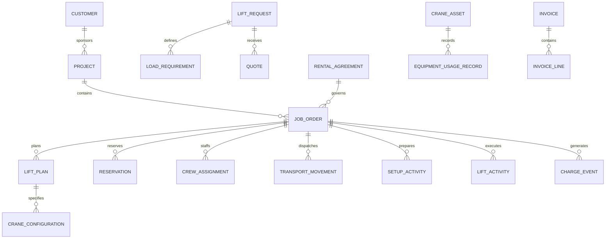

# Industrial & Commercial Crane Rental Orchestration Model Pattern

## Classification

**Applied industry extension — outside the original industry subject list.**

This pattern specializes Cross-Industry Party, Role, Organization, Product, Asset, Equipment, Offering, Quote, Agreement, Order, Schedule, Work Effort, Location, Inspection, Measurement, Charge, Invoice, Payment, Event, Status, and Document concepts.

## Intent

Model organizations that rent mobile, tower, crawler, rough-terrain, all-terrain, carry-deck, boom-truck, and other lifting equipment; evaluate lift requirements; select appropriate equipment and configurations; quote and contract work; reserve fleet and qualified personnel; coordinate permits, transport, setup, inspection, lift execution, standby, teardown, return, maintenance, billing, and compliance evidence.

The term **orchestration** is intentional. A crane-rental engagement coordinates many independently governed resources and decisions: customer demand, job site, load, radius, capacity, configuration, ground conditions, lift plan, equipment availability, transport, operators, riggers, signal persons, permits, inspections, weather, execution, utilization, and commercial settlement.

This is a logical business and operations pattern, not an engineering calculation method, lift-planning standard, regulatory rule, or safety procedure. Implementations must use qualified professionals and the standards, manufacturer requirements, labor rules, permits, and laws applicable to each jurisdiction and lift.

## Business overview

**Customer Need → Lift Request → Site/Load Assessment → Equipment Selection → Quote → Contract → Lift Plan/Permits → Reservation → Dispatch → Delivery/Setup → Inspection → Lift Execution → Teardown/Return → Utilization/Billing → Maintenance**

A Customer submits a Lift Request describing the load, site, dates, access, reach, height, radius, duty, and service expectations. A rental organization evaluates the request, surveys the site where needed, determines risk and planning requirements, and proposes a Crane Configuration, accessories, transport, personnel, schedule, and commercial terms. An accepted Quote creates a Rental Agreement and Job Order.

The organization reserves compatible Equipment, attachments, transport units, Operators, Riggers, Signal Persons, Lift Directors, technicians, and permits. Before work begins, required Lift Plans, engineering reviews, ground assessments, traffic plans, permits, credentials, and pre-lift documents must be approved. Assets are dispatched, delivered, assembled or configured, inspected, and released for service. Operational events record setup, lifts, delays, weather holds, standby, breakdowns, substitutions, and completion. Teardown and return inspections determine damage, maintenance, and release back to the fleet. Time, utilization, transport, labor, accessories, fuel, permits, standby, overtime, damage, and other charge events feed invoicing and settlement.

## Pattern variants

### Simple

Use for bare rental of one equipment category or a dispatch prototype.

Core concepts: Customer; Job Site; Crane Asset; Rental Offering; Quote; Rental Agreement; Reservation; Dispatch; Delivery; Return; Usage Record; Invoice; Payment.

### Standard

Use as the default for operated crane rental and project-based lifting work.

Adds: Lift Request; Load Requirement; Site Survey; Ground Condition; Equipment Model; Crane Configuration; Attachment; Capacity Evidence; Job Order; Lift Plan; Permit; Personnel Qualification; Crew Assignment; Transport Movement; Setup; Inspection; Lift Activity; Weather Observation; Delay; Standby; Fuel; Damage Report; Maintenance Work Order; Charge Event.

### Enterprise

Use for multi-branch fleets, engineered lifts, tower-crane projects, long-duration rentals, multiple subcontractors, union labor, or regulated heavy-haul operations.

Adds: Legal Entity; Branch; Fleet Pool; Territory; Master Service Agreement; Customer Credit Profile; Rate Card; Project; Work Package; Critical Lift Review; Engineering Calculation; Rigging Plan; Traffic Management Plan; Route Survey; Oversize Permit; Escort Assignment; Assembly Component; Counterweight Set; Telematics Reading; Certification; Competency Record; Shift; Timesheet; Subcontract; Purchase Order; Incident Investigation; Utilization Forecast; Fleet Transfer; Depreciation Measure.

## Actors and roles

| Role | Meaning |
|---|---|
| Customer | Party requesting or purchasing rental or lifting services. |
| Site Owner | Party controlling the location where work occurs. |
| General Contractor | Party coordinating the broader construction or industrial project. |
| Rental Provider | Party supplying equipment, personnel, or lifting services. |
| Sales Representative | Role qualifying demand, pricing, and commercial terms. |
| Lift Planner | Qualified role translating requirements into a Lift Plan and resource configuration. |
| Engineer | Qualified Party responsible for required engineered analysis or approval. |
| Dispatcher | Role allocating assets, transport, personnel, and timing. |
| Crane Operator | Qualified Person operating the Crane under the applicable rules. |
| Lift Director | Role directing lift execution and coordination. |
| Rigger | Qualified Person selecting, inspecting, attaching, or controlling rigging. |
| Signal Person | Qualified Person communicating movement instructions to the Operator. |
| Assembly Director | Role directing assembly, disassembly, or configuration where required. |
| Driver | Qualified Person transporting equipment or components. |
| Technician | Role inspecting, servicing, repairing, or commissioning Equipment. |
| Inspector | Qualified Party performing required inspections. |
| Subcontractor | External Party supplying equipment, transport, labor, engineering, or permits. |

Rule: a Person's application account does not establish operational qualification. Each Job Assignment must verify the required role, credential, competency, employer, jurisdiction, equipment category, and effective dates.

## Customer, project, and site concepts

### Customer Account

The Rental Provider's governed commercial relationship with a Customer.

Logical attributes: Customer Account Identifier; Account Status; Credit Status; Billing Terms; Tax Status; Responsible Branch; Effective From; Effective Through.

### Project

A Customer initiative or construction, industrial, infrastructure, energy, maintenance, or event context containing one or more crane Jobs.

Logical attributes: Project Identifier; Project Name; Project Type; Project Status; Customer; General Contractor; Start Date; End Date; Primary Site.

### Job Site

A physical location where equipment is delivered, assembled, operated, stored, or removed.

Logical attributes: Site Identifier; Site Name; Address or Coordinates; Site Type; Access Window; Operating Hours; Site Contact; Jurisdiction; Status.

### Site Access Constraint

A condition affecting equipment choice, delivery, setup, movement, or removal.

Logical attributes: Constraint Identifier; Constraint Type; Description; Dimension or Limit; Effective Time; Source; Verification Status; Required Action.

Examples: gate width, bridge limit, road restriction, turning radius, overhead obstruction, underground utility, slope, exclusion zone, noise window, or traffic restriction.

### Ground Condition

Evidence concerning the surface and subsurface supporting crane setup or travel.

Logical attributes: Ground Condition Identifier; Assessment Date; Location Zone; Surface Type; Bearing Evidence; Slope; Underground Condition; Source; Assessor; Status.

Rule: site information supplied by a Customer remains a sourced assertion until verified to the level required for the Lift.

## Lift demand and assessment

### Lift Request

A Customer request for equipment rental, lifting service, planning, or consultation.

Logical attributes: Request Identifier; Request Number; Request Status; Requested Date; Customer; Project; Job Site; Requested Start; Requested End; Service Model; Priority; Description.

Service models may include bare rental, operated rental, managed lift, taxi crane, long-term rental, tower-crane service, or consultation.

### Load Requirement

A description of the object or material to be lifted and the required movement.

Logical attributes: Load Requirement Identifier; Load Description; Load Type; Verified Weight; Estimated Weight; Dimensions; Center of Gravity Evidence; Pick Location; Set Location; Required Height; Required Radius; Orientation; Lift Points.

### Lift Condition

An operating or environmental condition relevant to planning and execution.

Logical attributes: Condition Identifier; Condition Type; Value; Unit; Source; Observed or Expected Time; Verification Status.

Examples: wind, temperature, visibility, proximity to power lines, simultaneous operations, personnel exposure, marine condition, or restricted operating window.

### Site Survey

A controlled assessment of the site, load path, access, setup area, hazards, and coordination requirements.

Logical attributes: Survey Identifier; Survey Status; Survey Date; Surveyor; Site; Request; Findings; Media Reference; Recommended Action; Approval Status.

### Lift Classification

A governed classification that determines planning, review, approval, and execution requirements.

Logical attributes: Classification Identifier; Classification Type; Basis; Risk Level; Rule Version; Classified By; Classification Date; Review Requirement.

A classification may identify routine, standard, complex, critical, engineered, tandem, blind, personnel, or another locally defined lift category.

## Equipment and configuration concepts

### Equipment Model

A manufacturer and model definition for a class of Equipment.

Logical attributes: Model Identifier; Manufacturer; Model Name; Equipment Type; Rated Capacity; Boom Range; Configuration Options; Transport Profile; Status.

### Crane Asset

An individually controlled fleet asset.

Logical attributes: Asset Identifier; Fleet Number; Serial Number; Equipment Model; Ownership Type; Asset Status; Home Branch; Current Location; Commissioned Date; Meter Reading; Certification Status.

### Equipment Component

A separately controlled component, attachment, or accessory.

Logical attributes: Component Identifier; Component Type; Serial or Fleet Number; Status; Current Location; Compatible Model; Certification Status.

Examples: boom section, jib, counterweight, outrigger mat, hook block, personnel platform, spreader beam, sling set, or remote control.

### Crane Configuration

A planned or actual assembly of a Crane Asset and compatible components for a Job.

Logical attributes: Configuration Identifier; Configuration Type; Status; Crane Asset or Model; Boom Length; Jib; Counterweight; Reeving; Outrigger Position; Matting; Applicable Chart Reference; Effective Time.

### Capacity Evidence

The governed source and evaluated result supporting equipment suitability for defined conditions.

Logical attributes: Capacity Evidence Identifier; Evidence Type; Manufacturer Reference; Configuration; Radius; Boom Length; Capacity; Deductions; Allowed Load; Unit; Evaluated By; Evaluation Date.

Rule: a generic crane capacity is not a commitment that a particular configuration can perform a Lift. Suitability must be evaluated against verified conditions, configuration, deductions, manufacturer information, and applicable rules.

### Equipment Compatibility

A governed statement that a Component or configuration option may be used with an Equipment Model or Asset under stated conditions.

Logical attributes: Compatibility Identifier; Parent Model or Asset; Component; Status; Effective From; Effective Through; Condition; Source Reference.

## Commercial offering, quote, and agreement

### Rental Offering

A governed commercial service definition.

Logical attributes: Offering Identifier; Offering Name; Offering Type; Status; Equipment Category; Service Model; Included Services; Available Territory; Effective From; Effective Through.

### Rate Card

An effective-dated set of rental, labor, transport, overtime, standby, fuel, mobilization, permit, and other rates.

Logical attributes: Rate Card Identifier; Rate Card Name; Version; Currency; Territory; Customer Segment; Effective From; Effective Through; Status.

### Quote

A time-bounded commercial proposal responding to a Lift Request.

Logical attributes: Quote Identifier; Quote Number; Quote Status; Issued Date; Expiration Date; Customer; Request; Currency; Estimated Total; Prepared By; Assumptions; Exclusions.

### Quote Line

A proposed equipment, labor, transport, accessory, permit, planning, or other charge.

Logical attributes: Quote Line Identifier; Line Type; Description; Quantity; Unit; Rate; Amount; Rate Card Reference; Tax Treatment; Optional Indicator.

### Rental Agreement

An Agreement governing equipment custody, services, responsibility, pricing, risk allocation, timing, and return.

Logical attributes: Agreement Identifier; Agreement Number; Agreement Type; Agreement Status; Customer; Provider; Effective Date; Expiration Date; Currency; Billing Terms; Master Agreement Reference.

### Job Order

An authorized operational order to plan and perform a rental or lifting engagement.

Logical attributes: Job Order Identifier; Job Number; Job Status; Agreement; Project; Site; Scheduled Start; Scheduled End; Service Model; Responsible Branch; Coordinator.

### Change Order

A governed change to scope, schedule, equipment, configuration, personnel, assumptions, price, or responsibility.

Logical attributes: Change Order Identifier; Change Type; Change Status; Requested Date; Approved Date; Reason; Scope Change; Price Change; Schedule Impact; Approved By.

## Planning and compliance concepts

### Lift Plan

A versioned plan defining the Lift, equipment, configuration, load, path, roles, hazards, controls, communications, and execution conditions.

Logical attributes: Lift Plan Identifier; Plan Number; Version; Plan Status; Job Order; Lift Classification; Prepared By; Reviewed By; Approved By; Effective Date; Execution Window.

### Lift Plan Item

A structured element of a Lift Plan.

Logical attributes: Plan Item Identifier; Item Type; Description; Sequence; Requirement; Responsible Role; Evidence Reference; Status.

Items may address load, pick/set locations, crane position, configuration, radius, rigging, ground support, exclusion zone, communications, weather limits, contingency, and emergency response.

### Rigging Plan

A governed specification of rigging equipment, arrangement, capacity, angles, connection points, and inspection requirements.

Logical attributes: Rigging Plan Identifier; Status; Load Requirement; Configuration Description; Component List; Capacity Evidence; Prepared By; Approved By.

### Permit

An authorization from a government, road authority, site owner, utility, or other authority.

Logical attributes: Permit Identifier; Permit Type; Permit Number; Permit Status; Issuing Authority; Effective From; Effective Through; Conditions; Document Reference.

### Qualification

Evidence that a Person or organization meets a training, license, certification, competency, or authorization requirement.

Logical attributes: Qualification Identifier; Qualification Type; Holder; Issuer; Reference; Status; Issued Date; Expiration Date; Scope; Evidence Document.

### Planning Requirement

A required document, decision, review, resource, or approval before a Job stage.

Logical attributes: Requirement Identifier; Requirement Type; Requirement Status; Due Date; Responsible Role; Satisfied Date; Evidence; Waiver Authority; Waiver Reason.

### Readiness Review

A controlled decision that defined prerequisites are satisfied for dispatch, setup, or Lift execution.

Logical attributes: Review Identifier; Review Type; Review Status; Performed At; Reviewer; Job Order; Findings; Outstanding Items; Decision; Rationale.

## Reservation, dispatch, and transport

### Resource Requirement

A required asset, component, person, service, or capacity for a Job Order.

Logical attributes: Requirement Identifier; Resource Type; Required Capability; Quantity; Start Time; End Time; Location; Priority; Substitution Rule.

### Reservation

A time-bounded allocation of a Resource to a Job Order.

Logical attributes: Reservation Identifier; Reservation Status; Resource; Job Order; Reserved From; Reserved Through; Quantity; Priority; Conflict Status.

### Crew Assignment

A Person's scheduled operational role on a Job Order, movement, setup, or Lift.

Logical attributes: Assignment Identifier; Person; Role; Job Order; Shift; Start Time; End Time; Status; Qualification Verification; Supervisor.

### Dispatch Plan

A coordinated plan for assets, components, transport units, drivers, crew, route, sequence, and timing.

Logical attributes: Dispatch Plan Identifier; Plan Status; Job Order; Dispatch Date; Origin; Destination; Coordinator; Planned Departure; Planned Arrival; Sequence.

### Transport Movement

A movement of Equipment or Components between locations.

Logical attributes: Movement Identifier; Movement Type; Movement Status; Origin; Destination; Planned Departure; Actual Departure; Planned Arrival; Actual Arrival; Carrier; Vehicle; Route Reference.

### Fleet Transfer

A controlled movement of an Asset between branch or fleet custody locations.

Logical attributes: Transfer Identifier; Asset; From Location; To Location; Transfer Status; Released Date; Received Date; Condition Evidence.

## Delivery, setup, and inspection

### Delivery

The arrival and transfer of Equipment, Components, or custody at a Job Site.

Logical attributes: Delivery Identifier; Delivery Status; Job Order; Movement; Delivered At; Received By; Asset List; Condition; Document Reference.

### Setup Activity

Assembly, positioning, configuration, stabilization, calibration, or commissioning work preparing Equipment for operation.

Logical attributes: Setup Identifier; Setup Type; Setup Status; Start Time; End Time; Asset; Configuration; Location Zone; Responsible Person; Completion Evidence.

### Inspection

A documented examination of Equipment, Component, configuration, setup, or work condition.

Logical attributes: Inspection Identifier; Inspection Type; Inspection Status; Inspected At; Inspector; Asset or Component; Job Order; Result; Finding Count; Document Reference.

### Inspection Finding

A condition, defect, nonconformance, or observation found during Inspection.

Logical attributes: Finding Identifier; Finding Type; Severity; Description; Status; Required Action; Responsible Party; Due Date; Resolution Evidence.

### Release for Service

An authorized decision that Equipment and required conditions are acceptable for a defined operational scope and time.

Logical attributes: Release Identifier; Release Status; Released At; Released By; Asset; Configuration; Job Order; Scope; Conditions; Expiration.

Rule: arrival at site, setup completion, inspection completion, and release for service are distinct events.

## Lift execution and operational events

### Pre-Lift Meeting

A recorded briefing confirming the Lift Plan, roles, communications, hazards, controls, stop-work authority, and changes.

Logical attributes: Meeting Identifier; Held At; Job Order; Lift Plan Version; Leader; Participant List; Topics; Questions; Acknowledgements; Outcome.

### Lift Activity

A bounded operational activity moving, holding, placing, or testing a Load.

Logical attributes: Lift Activity Identifier; Lift Number; Lift Status; Job Order; Lift Plan Version; Load Requirement; Start Time; End Time; Crane Asset; Actual Configuration; Operator; Lift Director; Outcome.

### Operational Observation

A measured or observed condition during setup or Lift execution.

Logical attributes: Observation Identifier; Observation Type; Observed At; Value; Unit; Location; Source; Observer; Threshold Status.

Examples: wind, ground movement, radius, load indication, boom angle, equipment alarm, or exclusion-zone breach.

### Operational Delay

A period in which planned work could not proceed.

Logical attributes: Delay Identifier; Delay Type; Delay Status; Start Time; End Time; Duration; Responsible Category; Reason; Job Order; Commercial Treatment.

### Standby Period

A period during which committed Equipment or personnel remain available but are not productively operating.

Logical attributes: Standby Identifier; Start Time; End Time; Resource; Reason; Authorized By; Billable Status; Rate Reference.

### Stop-Work Event

A controlled halt due to safety, condition, authority, equipment, weather, plan deviation, or other concern.

Logical attributes: Stop Event Identifier; Stopped At; Stopped By; Reason; Scope; Condition; Immediate Action; Resume Criteria; Resumed At; Authorized By.

### Incident

An injury, damage, near miss, equipment event, environmental event, or regulatory concern.

Logical attributes: Incident Identifier; Incident Type; Incident Status; Occurred At; Reported At; Job Order; Site; Severity; Description; Immediate Action; Investigation Reference.

Rule: any material change to load, radius, site, configuration, rigging, weather, personnel, or planned method must be evaluated against the approved Lift Plan before proceeding.

## Utilization, return, and maintenance

### Equipment Usage Record

A measured period or quantity of Asset use or availability.

Logical attributes: Usage Identifier; Asset; Job Order; Usage Type; Start Time; End Time; Meter Start; Meter End; Operating Hours; Standby Hours; Source; Verification Status.

### Fuel or Consumable Record

A record of fuel, lubricant, power, wear item, or other consumable supplied or used.

Logical attributes: Consumable Record Identifier; Type; Quantity; Unit; Recorded At; Asset; Job Order; Source; Chargeable Status.

### Teardown Activity

Disassembly, deconfiguration, packing, loading, or site-restoration work following service.

Logical attributes: Teardown Identifier; Status; Start Time; End Time; Asset; Configuration; Responsible Person; Component Reconciliation; Completion Evidence.

### Return

The return of Equipment or Components to a Provider-controlled location or transfer of custody.

Logical attributes: Return Identifier; Return Status; Returned At; Asset List; Receiving Location; Received By; Meter Reading; Fuel Level; Condition Summary.

### Damage Report

A documented change in condition, loss, contamination, or damage.

Logical attributes: Damage Report Identifier; Status; Detected At; Asset or Component; Job Order; Description; Severity; Probable Cause; Responsibility Status; Estimate; Evidence.

### Maintenance Work Order

A controlled request to inspect, service, repair, certify, or restore an Asset.

Logical attributes: Work Order Identifier; Work Order Type; Status; Asset; Opened Date; Priority; Reason; Assigned Technician; Planned Completion; Actual Completion; Release Decision.

### Asset Availability

A derived or declared state indicating whether an Asset may be reserved or dispatched.

Logical attributes: Availability Identifier; Asset; Availability Status; Effective From; Effective Through; Reason; Source; Restriction.

## Charges, invoicing, and settlement

### Charge Event

A billable occurrence or measured quantity arising from the Agreement or Job.

Logical attributes: Charge Event Identifier; Charge Type; Status; Occurred At; Job Order; Resource; Quantity; Unit; Rate; Amount; Currency; Source Evidence.

Charge types may include minimum rental, hourly or daily rental, operating time, standby, overtime, crew, mobilization, demobilization, transport, permit, engineering, rigging, fuel, environmental fee, damage, cleaning, cancellation, or extension.

### Timesheet

A person's recorded working, travel, standby, overtime, or allowance time.

Logical attributes: Timesheet Identifier; Person; Job Order; Work Date; Time Type; Start Time; End Time; Hours; Approval Status; Approved By.

### Invoice

A request for payment under an Agreement for one or more approved Charge Events.

Logical attributes: Invoice Identifier; Invoice Number; Invoice Date; Due Date; Invoice Status; Customer; Agreement; Currency; Subtotal; Tax; Total.

### Invoice Line

A billed line tracing to one or more Charge Events.

Logical attributes: Invoice Line Identifier; Line Number; Charge Type; Description; Quantity; Unit; Rate; Amount; Tax; Source Reference.

### Payment

Funds received and allocated to Invoices or other obligations.

Logical attributes: Payment Identifier; Payment Date; Amount; Currency; Method; Status; Customer; Reference; Allocation.

### Commercial Dispute

A Customer challenge concerning scope, time, condition, responsibility, rate, charge, damage, or Invoice.

Logical attributes: Dispute Identifier; Dispute Type; Status; Opened Date; Customer; Job Order; Invoice; Disputed Amount; Reason; Evidence; Resolution.

## Relationship model

| Source | Relationship | Target | Cardinality |
|---|---|---|---|
| Customer | owns | Customer Account | 1:M by provider |
| Customer | sponsors | Project | 1:M |
| Project | contains | Job Order | 1:M |
| Lift Request | concerns | Job Site | M:1 |
| Lift Request | contains | Load Requirement | 1:M |
| Lift Request | receives | Site Survey | 1:M |
| Lift Request | produces | Quote | 1:M |
| Quote | contains | Quote Line | 1:M |
| Accepted Quote | establishes | Rental Agreement or Job Order | 1:M |
| Rental Agreement | governs | Job Order | 1:M |
| Job Order | has | Lift Plan | 1:M versions |
| Lift Plan | references | Load Requirement | M:M |
| Lift Plan | specifies | Crane Configuration | 1:M |
| Crane Configuration | uses | Crane Asset or Equipment Model | M:1 |
| Crane Configuration | contains | Equipment Component | M:M |
| Lift Plan | supported by | Capacity Evidence | 1:M |
| Job Order | has | Resource Requirement | 1:M |
| Resource Requirement | fulfilled by | Reservation | 1:M |
| Reservation | allocates | Asset, Component, Person, or service | M:1 |
| Job Order | has | Crew Assignment | 1:M |
| Dispatch Plan | contains | Transport Movement | 1:M |
| Transport Movement | carries | Asset or Component | M:M |
| Delivery | completes | Transport Movement | M:1 |
| Job Order | has | Setup Activity | 1:M |
| Asset or Setup | receives | Inspection | 1:M |
| Inspection | contains | Inspection Finding | 1:M |
| Release for Service | applies to | Asset and Configuration | M:1 each |
| Job Order | contains | Lift Activity | 1:M |
| Lift Activity | follows | Lift Plan Version | M:1 |
| Lift Activity | uses | Crane Asset and Configuration | M:1 each |
| Lift Activity | records | Operational Observation | 1:M |
| Job Order | records | Delay, Standby, Stop-Work, or Incident | 1:M each |
| Asset | produces | Equipment Usage Record | 1:M |
| Job Order | concludes with | Teardown and Return | 1:M |
| Return | may produce | Damage Report or Maintenance Work Order | 1:M |
| Job Order | produces | Charge Event | 1:M |
| Invoice | contains | Invoice Line | 1:M |
| Invoice Line | derives from | Charge Event | M:M |
| Invoice | receives | Payment | M:M through allocation |

## Lifecycle models

### Lift request

Draft → Submitted → Qualified → Assessed → Quoted → Accepted

Exception outcomes: More Information Required; Declined; Withdrawn; Expired.

### Quote

Draft → Reviewed → Issued → Accepted → Converted

Exception outcomes: Revised; Rejected; Expired; Withdrawn; Superseded.

### Job order

Proposed → Planning → Ready for Dispatch → Mobilizing → On Site → In Service → Demobilizing → Completed → Closed

Exception outcomes: On Hold; Cancelled; Suspended; Terminated.

### Lift plan

Draft → Technical Review → Customer/Site Review → Approved → Released for Execution → Completed

Exception outcomes: Revision Required; Rejected; Suspended; Superseded; Withdrawn.

### Reservation

Requested → Tentative → Confirmed → Dispatched → Consumed → Released

Exception outcomes: Conflict; Substituted; Cancelled; No Longer Available.

### Crane asset

Available → Reserved → In Transit → On Site → In Service → Return Transit → Inspection → Available

Exception outcomes: Held; Out of Service; Maintenance; Quarantined; Retired.

### Lift activity

Planned → Briefed → Ready → In Progress → Load Placed → Completed

Exception outcomes: Delayed; Stopped; Aborted; Incident; Replanned.

### Maintenance work order

Open → Assessed → Planned → In Progress → Verification → Released → Closed

Exception outcomes: Waiting for Parts; Deferred; Outsourced; Asset Retired.

## Business events

- Lift Request Submitted, Qualified, Declined, or Withdrawn
- Site Survey Scheduled or Completed
- Load Information Verified
- Lift Classified
- Equipment Configuration Proposed or Approved
- Quote Issued, Revised, Accepted, Rejected, or Expired
- Agreement Executed
- Job Order Released
- Lift Plan Submitted, Reviewed, Approved, Revised, or Suspended
- Permit Requested, Issued, Expired, or Revoked
- Qualification Verified or Expired
- Asset Reserved, Substituted, Dispatched, Delivered, Returned, or Released
- Crew Assigned, Reassigned, Checked In, or Released
- Setup Started or Completed
- Inspection Completed; Finding Opened or Resolved
- Equipment Released for Service
- Pre-Lift Meeting Completed
- Lift Started, Stopped, Resumed, Completed, or Aborted
- Weather Hold, Delay, Standby, Breakdown, or Incident Recorded
- Teardown Completed
- Damage Detected
- Maintenance Work Order Opened or Closed
- Usage, Fuel, Labor, or Charge Event Recorded
- Invoice Issued, Disputed, Adjusted, or Paid

## Baseline business and integrity rules

1. A Lift Request must identify the Customer, Job Site, requested period, service model, and sufficient load and movement information before equipment is committed.
2. Customer-supplied load, site, access, ground, utility, and schedule information must retain source and verification status.
3. Equipment selection must trace to the verified Load Requirement, required radius and height, configuration, capacity evidence, deductions, site conditions, and applicable planning rules.
4. A Quote must identify assumptions, exclusions, validity period, configuration basis, included services, rates, and responsibility boundaries.
5. A Job Order cannot become ready for dispatch until required commercial approval, resource reservations, planning requirements, and credit conditions are satisfied or explicitly waived by authority.
6. Each reserved Asset and Component must be compatible, available, certified, and free of conflicting reservations for the required period.
7. Every operational Person must have verified qualifications for the assigned role, equipment, employer, jurisdiction, and work date.
8. The released Lift Plan version must identify load, equipment, actual configuration, site position, radius, rigging, ground support, roles, communications, hazards, controls, limits, and approvals required by the Lift Classification.
9. Permit, engineering, route, traffic, utility, and site-control requirements must be satisfied before the stage they govern.
10. Delivery, setup, inspection, release for service, and Lift execution are independent milestones with separate evidence.
11. Equipment cannot be released for service while a blocking Inspection Finding, expired certification, incompatible configuration, or unresolved safety restriction exists.
12. The actual Crane Configuration must be verified against the released Lift Plan before execution.
13. A material change to load, radius, configuration, rigging, ground, access, weather, personnel, or method triggers review and, where required, a revised approval.
14. Stop-work authority is available to designated participants; resumption must record corrected conditions and authorized release.
15. Lift Activities preserve actual start/end times, Asset, configuration, responsible roles, observations, delays, outcome, and Plan version.
16. Usage, standby, labor, travel, overtime, fuel, transport, and damage quantities must trace to authoritative evidence and applicable Agreement terms.
17. Substituted Equipment or personnel must pass the same suitability, compatibility, qualification, planning, notification, and approval checks as the original reservation.
18. Return condition is compared with delivery condition; damage responsibility and charges require evidence, review, and contractual basis.
19. An Asset with a blocking defect or due mandatory maintenance cannot return to Available status until authorized release.
20. Every Invoice Line must trace to approved Charge Events, rates, quantities, taxes, and Agreement or Change Order terms.
21. Signed plans, inspections, logs, tickets, and incident evidence are immutable; corrections use attributed amendments or superseding versions.
22. Operational and personal information access is governed by role, purpose, contract, jurisdiction, and minimum-necessary scope.

## AI modeling questions

1. Which service models are offered: bare rental, operated rental, managed lift, taxi crane, tower crane, long-term rental, or consultation?
2. Which crane and lifting-equipment categories, attachments, rigging, transport units, and accessories are in scope?
3. Which branches, territories, legal entities, currencies, taxes, labor agreements, and jurisdictions apply?
4. How are load weight, center of gravity, dimensions, lift points, pick/set locations, radius, height, and path verified?
5. Which Lift Classifications exist, and what planning, engineering, review, and approval does each require?
6. Who is responsible for site access, ground bearing, underground services, power lines, traffic control, permits, rigging, and exclusion zones?
7. How are capacity charts, deductions, configurations, component compatibility, and manufacturer information governed?
8. Which Personnel roles, credentials, competencies, medical requirements, and supervision rules must be verified?
9. How are fleet availability, tentative reservations, conflicts, substitutions, extensions, and branch transfers handled?
10. Which transport, route survey, oversize permit, escort, loading, sequencing, and delivery constraints apply?
11. Which inspections are required daily, per shift, after assembly, periodically, after repair, or before release?
12. Which weather, wind, visibility, ground, equipment, or site thresholds cause warning, hold, or stop-work?
13. How are setup, operating, standby, delay, breakdown, teardown, and return times captured and approved?
14. Which customer contracts, rate cards, minimums, overtime, standby, fuel, transport, permit, engineering, damage, and cancellation charges apply?
15. How are long-duration rentals, maintenance access, meter readings, consumables, and replacement equipment managed?
16. Which subcontracted equipment, labor, transport, engineering, inspection, or permit services are used?
17. How are incidents, near misses, damage, claims, commercial disputes, and regulatory notifications managed?
18. Which fleet-utilization, safety, commercial, maintenance, customer, and project-performance measures are required?
19. Which external systems are authoritative for CRM, fleet, telematics, scheduling, qualifications, maintenance, accounting, weather, mapping, permits, and documents?
20. Which records must remain immutable and for how long?

## Candidate capabilities and use cases

| Capability | Candidate actor-goal use cases |
|---|---|
| Customer and Demand | Register Customer; Submit Lift Request; Qualify Opportunity; Capture Site and Load Requirements |
| Assessment | Conduct Site Survey; Classify Lift; Evaluate Ground and Access; Select Equipment Configuration |
| Commercial | Build Quote; Apply Rate Card; Review Credit; Accept Quote; Execute Agreement; Approve Change Order |
| Lift Planning | Create Lift Plan; Create Rigging Plan; Request Engineering Review; Obtain Plan Approval |
| Compliance | Obtain Permit; Verify Qualification; Verify Certification; Complete Readiness Review |
| Resource Planning | Reserve Crane; Reserve Components; Assign Crew; Resolve Conflict; Approve Substitution |
| Dispatch and Transport | Build Dispatch Plan; Plan Route; Dispatch Asset; Record Delivery; Transfer Fleet Asset |
| Site Operations | Complete Setup; Perform Inspection; Release Equipment; Conduct Pre-Lift Meeting |
| Lift Execution | Start Lift; Record Observations; Stop or Resume Work; Complete Lift; Record Delay or Standby |
| Fleet Return | Complete Teardown; Return Equipment; Reconcile Components; Record Damage; Release Asset |
| Maintenance | Open Work Order; Repair Asset; Verify Maintenance; Return Asset to Service |
| Billing | Record Usage; Approve Timesheet; Create Charge Events; Generate Invoice; Resolve Dispute; Allocate Payment |
| Governance | Amend Lift Plan; Record Incident; Audit Evidence; Publish Utilization and Safety Measures |

## MDE modeling guidance

- Model Crane Asset as an individual Asset and Equipment Model as the reusable technical definition.
- Keep Equipment Model, Crane Asset, Crane Configuration, Component, Capacity Evidence, and Lift Plan distinct.
- Keep Lift Request, Quote, Rental Agreement, Job Order, Reservation, Dispatch, and Lift Activity distinct.
- Treat qualifications, inspections, permits, certifications, engineering approvals, and readiness decisions as first-class effective-dated evidence.
- Separate planned resources from reservations and actual assignments or usage.
- Model bare rental, operated rental, and managed lift as service-model variations with explicit responsibility boundaries.
- Attach rules to authoritative operations such as propose configuration, reserve asset, release job, approve plan, release equipment, start lift, substitute resource, create charge, and return asset.
- Let use cases orchestrate actor goals and branching; do not bury capacity, qualification, readiness, or billing rules in workflow prose.
- Treat customer-supplied data, telematics, weather, maps, and external documents as sourced assertions with provenance and verification status.
- Use specialized patterns for tower crane, heavy haul, rigging-only, personnel lifting, or engineered lifts only where behavior and governance materially differ.

## Anti-patterns

### Crane Model Equals Crane Asset

A model defines reusable characteristics. An Asset has a serial number, location, condition, certification, maintenance, reservations, and history.

### Rated Capacity Equals Lift Capacity

Nameplate or maximum capacity does not determine suitability for a specific radius, boom, configuration, deductions, ground condition, and Lift.

### Quote Equals Lift Plan

The Quote is a commercial proposal. The Lift Plan is controlled operational and technical evidence.

### Reservation Equals Availability

A reservation allocates a Resource. Actual readiness also depends on condition, certification, maintenance, transport, configuration, and location.

### Job Status Controls Everything

Quote, Agreement, Reservation, Asset, Transport, Setup, Inspection, Lift, Maintenance, Invoice, and Dispute each require independent lifecycles.

### Operator Equals Logged-In User

System identity does not prove qualification, assignment, employer, equipment category, or authority.

### Scheduled Time Equals Billable Time

Planned duration, dispatch time, travel, setup, operation, standby, overtime, teardown, and minimum-charge periods are different measures.

### Free-Text Equipment Configuration

Configuration must be structured enough to verify compatibility, capacity evidence, inspections, substitutions, and actual execution.

### Overwriting the Lift Plan

Once reviewed or released, a Plan version is durable evidence. Changes create a new version with impact assessment and approval.

### Maintenance as a Note on the Asset

Defects, inspections, work orders, parts, repairs, verification, certification, and release decisions require separate traceable records.

## Physical mapping examples

| Logical name | Example physical name |
|---|---|
| Lift Request | `lift_request` |
| Load Requirement | `load_requirement` |
| Crane Asset | `crane_asset` |
| Crane Configuration | `crane_configuration` |
| Capacity Evidence | `capacity_evidence` |
| Rental Agreement | `rental_agreement` |
| Job Order | `job_order` |
| Lift Plan | `lift_plan` |
| Resource Requirement | `resource_requirement` |
| Crew Assignment | `crew_assignment` |
| Transport Movement | `transport_movement` |
| Lift Activity | `lift_activity` |
| Equipment Usage Record | `equipment_usage_record` |
| Maintenance Work Order | `maintenance_work_order` |
| Charge Event | `charge_event` |

Logical names remain authoritative. Stack, jurisdiction, fleet, safety, labor, and contract rules generate physical names only after the logical model is accepted.

## Future knowledge-base expansion

A metamodel-conformant Crane Rental Orchestration knowledge base should instantiate separate capability, entity, role, business-rule, use-case, page, workflow, scenario, and test artifacts from this logical pattern. The first end-to-end vertical slice should be:

**Submit Lift Request → Conduct Site Survey → Select Crane Configuration → Issue and Accept Quote → Approve Lift Plan → Reserve Asset and Crew → Dispatch and Deliver → Inspect and Release → Execute Lift → Record Usage → Return Asset → Generate Invoice**

Recommended verification scenarios include incomplete load information, unverified ground condition, equipment reservation conflict, expired operator qualification, unavailable component, permit delay, substitute crane, blocking inspection defect, wind hold, stop-work and resume, breakdown with replacement Asset, overtime and standby billing, missing return component, damage dispute, mandatory maintenance due, and Lift Plan revision after site conditions change.
