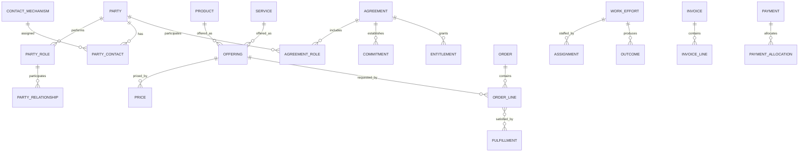

# Cross-Industry Concepts

| Concept | Purpose |
|---|---|
| Party and Party Role | Represent people and organizations independently of the roles they perform. |
| Party Relationship | Represent relationships among people and organizations. |
| Product and Service | Represent what an organization offers or delivers. |
| Agreement | Represent contracts, policies, subscriptions, engagements, and service agreements. |
| Order or Request | Represent a request for a product, service, or action. |
| Status Lifecycle | Represent changes in the state of an agreement, order, claim, project, or service. |
| Contact Mechanism | Represent addresses, telephone numbers, email addresses, and communication identifiers. |
| Classification | Represent types, categories, segments, and hierarchies. |
| Subscription | Represent continuing entitlement to a product or service. |
| Invoice and Payment | Represent amounts charged and their settlement. |
| Recursive Relationship | Represent compositions and hierarchies such as product structures and nested work. |
| Analytics/Star Schema | Organize operational facts and dimensions for analysis. |

These are reusable modeling primitives, not fixed application schemas. Each industry pattern specializes and combines them.

## Purpose and boundary

The Cross-Industry pattern supplies stable business primitives that recur across domains. An industry pattern selects, specializes, and connects these primitives; an application pattern further constrains them.

It is not a single universal database schema. Concepts should be adopted only when the business needs the distinctions they provide.

## 1. Party and role

### Party

A person, organization, or other legally or operationally recognized participant.

Logical attributes: Party Identifier; Party Type; Display Name; Legal Name; Party Status; Effective From; Effective Through.

### Person

A human Party.

Logical attributes: Given Name; Middle Name; Family Name; Preferred Name; Birth Date where legitimately required.

### Organization

A business, government body, nonprofit, household, team, or other organized Party.

Logical attributes: Organization Name; Legal Form; Registration Number; Parent Organization reference.

### Party Role

The capacity in which a Party participates in a context, such as Customer, Supplier, Employee, Provider, Insurer, Patient, Professional, or Account Holder.

Logical attributes: Party Role Identifier; Role Type; Role Status; Effective From; Effective Through.

Rule: a Party is not permanently equated with one role. The same Party may perform several roles concurrently or over time.

### Party Relationship

A typed, time-bounded relationship between two Parties or Party Roles.

Logical attributes: Party Relationship Identifier; Relationship Type; Relationship Status; Effective From; Effective Through; Description.

Examples: Organization employs Person; Organization owns Organization; Agent represents Customer; Provider serves Client.

## 2. Contact and location

### Contact Mechanism

A means by which a Party can be contacted.

Logical attributes: Contact Mechanism Identifier; Mechanism Type; Value; Status; Verified Indicator; Effective From; Effective Through.

Specializations: Postal Address; Email Address; Telephone Number; Web Address; Communication Identifier.

### Party Contact

Assignment of a Contact Mechanism to a Party for a stated purpose.

Logical attributes: Party Contact Identifier; Purpose Type; Primary Indicator; Effective From; Effective Through.

Examples of purpose: billing, shipping, legal, service, emergency, personal, or work.

### Geographic Location

A physical, administrative, service, or market location.

Logical attributes: Location Identifier; Location Type; Location Name; Geographic Coordinates; Parent Location reference.

## 3. Classification

### Classification Scheme

A governed vocabulary or taxonomy.

Logical attributes: Scheme Identifier; Scheme Name; Scheme Version; Scheme Status; Effective From; Effective Through.

### Classification

A category within a Classification Scheme.

Logical attributes: Classification Identifier; Classification Code; Classification Name; Description; Parent Classification reference; Effective From; Effective Through.

### Classification Assignment

A time-bounded assignment of a Classification to a business subject.

Logical attributes: Assignment Identifier; Subject Type; Assigned Date; Effective From; Effective Through; Assignment Source.

Rule: use classification when categories vary by organization, jurisdiction, or time; use a first-class concept when the category has its own behavior and relationships.

## 4. Product, service, and offering

### Product

Something an organization defines, supplies, sells, leases, licenses, or otherwise provides.

Logical attributes: Product Identifier; Product Name; Product Type; Product Status; Description; Effective From; Effective Through.

### Product Component

A recursive whole-part relationship between Products.

Logical attributes: Component Identifier; Quantity; Unit of Measure; Effective From; Effective Through; Sequence.

### Service

An act, capability, or continuing provision delivered for a beneficiary.

Logical attributes: Service Identifier; Service Name; Service Type; Service Status; Description; Service Level reference.

### Offering

A market- or context-specific way a Product or Service is made available.

Logical attributes: Offering Identifier; Offering Name; Offering Status; Available From; Available Through; Market; Channel.

### Price

A monetary charge applicable to an Offering under stated conditions.

Logical attributes: Price Identifier; Price Type; Amount; Currency; Unit of Measure; Effective From; Effective Through.

## 5. Agreement, commitment, and entitlement

### Agreement

A recorded understanding among Parties that establishes rights, obligations, terms, or constraints.

Logical attributes: Agreement Identifier; Agreement Number; Agreement Type; Agreement Status; Effective Date; Expiration Date; Description.

### Agreement Role

The capacity in which a Party participates in an Agreement.

Logical attributes: Agreement Role Identifier; Role Type; Effective From; Effective Through.

Examples: buyer, seller, policyholder, insurer, client, provider, guarantor, or beneficiary.

### Agreement Term

A structured condition of an Agreement.

Logical attributes: Agreement Term Identifier; Term Type; Term Value; Unit; Effective From; Effective Through.

### Commitment

An obligation by a Party to perform, deliver, pay, refrain, or meet a condition.

Logical attributes: Commitment Identifier; Commitment Type; Commitment Status; Due Date; Fulfilled Date; Description.

### Entitlement

A right granted to a Party by an Agreement, purchase, policy, subscription, or authority.

Logical attributes: Entitlement Identifier; Entitlement Type; Entitlement Status; Quantity or Limit; Effective From; Effective Through.

### Subscription

A continuing Agreement or Entitlement to receive a Product or Service.

Logical attributes: Subscription Identifier; Subscription Status; Start Date; Renewal Date; End Date; Billing Frequency; Quantity.

## 6. Request, order, and fulfillment

### Request

An expressed need for information, evaluation, authorization, service, product, or action.

Logical attributes: Request Identifier; Request Type; Request Status; Requested Date; Needed By Date; Priority; Description.

### Order

An authorized request to supply Products or Services under commercial or operational terms.

Logical attributes: Order Identifier; Order Number; Order Type; Order Status; Order Date; Required Date; Currency; Total Amount.

### Order Line

One requested Product, Service, or chargeable unit within an Order.

Logical attributes: Order Line Identifier; Line Number; Quantity; Unit of Measure; Unit Price; Line Amount; Line Status.

### Fulfillment

The performance, delivery, shipment, activation, or provision that satisfies a Request, Order Line, Commitment, or Entitlement.

Logical attributes: Fulfillment Identifier; Fulfillment Type; Fulfillment Status; Planned Date; Actual Date; Quantity; Evidence Reference.

## 7. Work, event, and outcome

### Business Event

A fact of business significance that occurs at a point in time and may trigger evaluation or action.

Logical attributes: Event Identifier; Event Type; Occurred At; Recorded At; Source; Correlation Reference; Description.

### Work Effort

A planned or performed unit of work, including a process, project, phase, task, activity, case step, or service action.

Logical attributes: Work Effort Identifier; Work Type; Work Name; Work Status; Planned Start; Planned End; Actual Start; Actual End; Parent Work Effort reference.

### Assignment

The allocation of a Party Role or resource to a Work Effort with a stated responsibility.

Logical attributes: Assignment Identifier; Assignment Role; Assignment Status; Allocation; Assigned From; Assigned Through.

### Outcome

A meaningful result produced or recognized by business activity.

Logical attributes: Outcome Identifier; Outcome Type; Outcome Status; Achieved At; Description; Evidence Reference.

## 8. Status and lifecycle

### Status Type

A named condition applicable to a type of business subject.

Logical attributes: Status Type Identifier; Subject Type; Status Code; Status Name; Terminal Indicator.

### Status Transition

An allowed change from one Status Type to another.

Logical attributes: Transition Identifier; Transition Name; Trigger Type; Condition Reference; Effective From; Effective Through.

### Status History

Evidence that a subject entered or left a status.

Logical attributes: Status History Identifier; Entered At; Exited At; Reason; Changed By; Event Reference.

Rule: a status field alone is sufficient only when transition rules and history are not material. Otherwise, use the full lifecycle pattern.

## 9. Charge, invoice, and payment

### Charge

An amount a Party is expected to pay because of a Product, Service, Usage, Event, Fee, Penalty, Tax, or Adjustment.

Logical attributes: Charge Identifier; Charge Type; Charge Date; Amount; Currency; Charge Status; Source Reference.

### Invoice

A document requesting settlement of one or more Charges.

Logical attributes: Invoice Identifier; Invoice Number; Invoice Date; Due Date; Invoice Status; Subtotal; Tax Amount; Total Amount; Currency.

### Invoice Line

An explainable component of an Invoice linked to its source Charge or business event.

Logical attributes: Invoice Line Identifier; Line Number; Description; Quantity; Unit Price; Line Amount; Tax Amount.

### Payment

A transfer of value intended to settle an Invoice, Charge, Account, or obligation.

Logical attributes: Payment Identifier; Payment Date; Payment Amount; Currency; Payment Method; Payment Status; Payment Reference.

### Payment Allocation

Application of some or all of a Payment to an Invoice or Charge.

Logical attributes: Allocation Identifier; Allocated Amount; Allocation Date; Allocation Status.

Rule: keep Payment separate from its allocation so one payment may settle several invoices and one invoice may receive several payments.

## 10. Measurement and analytics

### Measure

A defined quantity used to evaluate activity, performance, condition, or outcome.

Logical attributes: Measure Identifier; Measure Name; Measure Type; Unit of Measure; Definition; Calculation Rule reference.

### Measurement

An observed or calculated Measure for a subject, place, and period or point in time.

Logical attributes: Measurement Identifier; Measured Value; Measured At; Period Start; Period End; Source; Quality Status.

### Analytic Fact

A measurable business occurrence at an explicitly declared grain.

Logical attributes: Fact Identifier; Fact Type; Occurred Date; Quantity; Amount; Duration; Source Record reference.

Rule: operational concepts remain authoritative; analytic facts and dimensions are derived projections with declared lineage.

## Core relationship model

| Source | Relationship | Target | Cardinality |
|---|---|---|---|
| Party | specializes as | Person or Organization | 1:0..1 each |
| Party | performs | Party Role | 1:M |
| Party Role | relates to | Party Role | M:M through Party Relationship |
| Party | uses | Contact Mechanism | M:M through Party Contact |
| Classification Scheme | contains | Classification | 1:M |
| Classification | has parent | Classification | M:0..1 |
| Product | contains | Product | M:M through Product Component |
| Offering | makes available | Product or Service | M:1 |
| Offering | has | Price | 1:M |
| Agreement | includes | Agreement Role | 1:M |
| Party | participates through | Agreement Role | 1:M |
| Agreement | contains | Agreement Term | 1:M |
| Agreement | establishes | Commitment or Entitlement | 1:M |
| Subscription | grants | Entitlement | 1:M |
| Request | may become | Order | 1:0..1 |
| Order | contains | Order Line | 1:M |
| Order Line | requests | Offering | M:1 |
| Fulfillment | satisfies | Order Line or Commitment | M:M |
| Business Event | may trigger | Work Effort | 1:M |
| Work Effort | contains | Work Effort | 1:M |
| Party Role | receives | Assignment | 1:M |
| Assignment | allocates to | Work Effort | M:1 |
| Work Effort | produces | Outcome | 1:M |
| Status Transition | changes | Status Type | from/to |
| Business subject | records | Status History | 1:M |
| Charge | may arise from | Order Line, Usage, Fulfillment, or Event | M:1 |
| Invoice | contains | Invoice Line | 1:M |
| Invoice Line | explains | Charge | M:1 |
| Payment | applies through | Payment Allocation | 1:M |
| Payment Allocation | settles | Invoice or Charge | M:1 |

## Specialization rules

- Prefer a stable general concept plus typed roles over duplicated domain-specific party tables.
- Specialize a concept when the subtype introduces distinct behavior, rules, attributes, or relationships.
- Do not force Product and Service into one meaning when delivery, inventory, usage, or entitlement rules differ.
- Keep Agreement separate from Order: an Agreement establishes terms; an Order requests fulfillment under those terms.
- Keep Request separate from Order when evaluation or authorization occurs before commitment.
- Keep Work Effort separate from Use Case: Work Effort records business work; a Use Case specifies system-supported behavior toward an outcome.
- Keep Business Event immutable; corrections create superseding evidence rather than rewriting history where audit matters.
- Model effective dates on relationships whose truth changes over time.
- Use identifiers that remain stable across system migrations; keep external-system identifiers as mappings rather than primary business identity.

## Baseline integrity rules

1. Every Party Role must reference exactly one Party.
2. Effective-through dates cannot precede effective-from dates.
3. An Agreement Role must be active within the relevant Agreement period.
4. An Order Line must identify what is requested and its quantity or scope.
5. Fulfilled quantity cannot exceed ordered quantity unless an explicit tolerance or change authorization permits it.
6. A Status Transition must be allowed for the subject's current status.
7. Every Invoice Line must have an explainable source.
8. Payment Allocations cannot exceed the Payment amount.
9. A Measurement must identify its Measure, subject, time context, and source.
10. Derived analytic facts must retain lineage to authoritative operational records.

## Questions the AI should ask

1. Which Party types and roles exist, and may one Party perform several roles?
2. Which relationships require history or effective dating?
3. Are Products, Services, Offerings, and Prices meaningfully distinct here?
4. What Agreements establish the terms, rights, and obligations?
5. Does a Request require evaluation before it becomes an Order?
6. What constitutes fulfillment, and what evidence proves it?
7. Which events trigger work, rules, notifications, or lifecycle transitions?
8. Which statuses need governed transitions and history?
9. What creates a Charge, and must every Invoice Line trace to its source?
10. Can Payments cover multiple Invoices or be partial?
11. What measures and analytic grains are required?
12. Which concepts should the selected industry pattern specialize?

## MDE application

For a new industry pattern:

1. Select only the relevant cross-industry primitives.
2. Rename display terminology without losing canonical meaning.
3. Add industry-specific specializations, roles, events, states, and rules.
4. Define entity operations on the resulting domain concepts.
5. Define capabilities and actor-goal Use Cases that invoke those operations.
6. Add pages, scenarios, verification, and analytics as separate but traceable knowledge.
