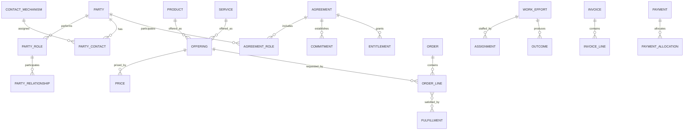

# Cross-Industry Concepts

| Concept | Purpose |
|---|---|
| Party and Party Role | Represent people and organizations independently of the roles they perform. |
| Party Relationship | Represent relationships among people and organizations. |
| Product and Service | Represent what an organization offers or delivers. |
| Agreement | Represent contracts, policies, subscriptions, engagements, and service agreements. |
| Order or Request | Represent a request for a product, service, or action. |
| Status Lifecycle | Represent changes in the state of an agreement, order, claim, project, or service. |
| Contact Mechanism | Represent addresses, telephone numbers, email addresses, and communication identifiers. |
| Classification | Represent types, categories, segments, and hierarchies. |
| Subscription | Represent continuing entitlement to a product or service. |
| Invoice and Payment | Represent amounts charged and their settlement. |
| Recursive Relationship | Represent compositions and hierarchies such as product structures and nested work. |
| Analytics/Star Schema | Organize operational facts and dimensions for analysis. |

These are reusable modeling primitives, not fixed application schemas. Each industry pattern specializes and combines them.

## Purpose and boundary

The Cross-Industry pattern supplies stable business primitives that recur across domains. An industry pattern selects, specializes, and connects these primitives; an application pattern further constrains them.

It is not a single universal database schema. Concepts should be adopted only when the business needs the distinctions they provide.

## 1. Party and role

### Party

Canonical concept: [Party](../model/requirements/party/party/party.md).

The canonical page contains the definition, logical attributes, rules, and source-specific detail.

### Person

Canonical concept: [Person](../model/requirements/party/party/person.md).

The canonical page contains the definition, logical attributes, rules, and source-specific detail.

### Organization

Canonical concept: [Organization](../model/requirements/party/party/organization.md).

The canonical page contains the definition, logical attributes, rules, and source-specific detail.

### Party Role

Canonical concept: [Party Role](../model/requirements/party/party/party-role.md).

The canonical page contains the definition, logical attributes, rules, and source-specific detail.

### Party Relationship

Canonical concept: [Party Relationship](../model/requirements/party/party/party-relationship.md).

The canonical page contains the definition, logical attributes, rules, and source-specific detail.

## 2. Contact and location

### Contact Mechanism

Canonical concept: [Contact Mechanism](../model/requirements/party/contact-mechanism/contact-mechanism.md).

The canonical page contains the definition, logical attributes, rules, and source-specific detail.

### Party Contact

Canonical concept: [Party Contact](../model/requirements/party/contact-mechanism/party-contact.md).

The canonical page contains the definition, logical attributes, rules, and source-specific detail.

### Geographic Location

Canonical concept: [Geographic Location](../model/requirements/party/contact-mechanism/geographic-location.md).

The canonical page contains the definition, logical attributes, rules, and source-specific detail.

## 3. Classification

### Classification Scheme

Canonical concept: [Classification Scheme](../model/requirements/classification/classification/classification-scheme.md).

The canonical page contains the definition, logical attributes, rules, and source-specific detail.

### Classification

Canonical concept: [Classification](../model/requirements/classification/classification/classification.md).

The canonical page contains the definition, logical attributes, rules, and source-specific detail.

### Classification Assignment

Canonical concept: [Classification Assignment](../model/requirements/classification/classification/classification-assignment.md).

The canonical page contains the definition, logical attributes, rules, and source-specific detail.

## 4. Product, service, and offering

### Product

Canonical concept: [Product](../model/requirements/product-and-service/product/product.md).

The canonical page contains the definition, logical attributes, rules, and source-specific detail.

### Product Component

Canonical concept: [Product Component](../model/requirements/product-and-service/product/product-component.md).

The canonical page contains the definition, logical attributes, rules, and source-specific detail.

### Service

Canonical concept: [Service](../model/requirements/product-and-service/product/service.md).

The canonical page contains the definition, logical attributes, rules, and source-specific detail.

### Offering

Canonical concept: [Offering](../model/requirements/product-and-service/product/offering.md).

The canonical page contains the definition, logical attributes, rules, and source-specific detail.

### Price

Canonical concept: [Price](../model/requirements/product-and-service/product/price.md).

The canonical page contains the definition, logical attributes, rules, and source-specific detail.

## 5. Agreement, commitment, and entitlement

### Agreement

Canonical concept: [Agreement](../model/requirements/agreement/agreement/agreement.md).

The canonical page contains the definition, logical attributes, rules, and source-specific detail.

### Agreement Role

Canonical concept: [Agreement Role](../model/requirements/agreement/agreement/agreement-role.md).

The canonical page contains the definition, logical attributes, rules, and source-specific detail.

### Agreement Term

Canonical concept: [Agreement Term](../model/requirements/agreement/agreement/agreement-term.md).

The canonical page contains the definition, logical attributes, rules, and source-specific detail.

### Commitment

Canonical concept: [Commitment](../model/requirements/agreement/agreement/commitment.md).

The canonical page contains the definition, logical attributes, rules, and source-specific detail.

### Entitlement

Canonical concept: [Entitlement](../model/requirements/agreement/agreement/entitlement.md).

The canonical page contains the definition, logical attributes, rules, and source-specific detail.

### Subscription

Canonical concept: [Subscription](../model/requirements/agreement/agreement/subscription.md).

The canonical page contains the definition, logical attributes, rules, and source-specific detail.

## 6. Request, order, and fulfillment

### Request

Canonical concept: [Request](../model/requirements/request-and-fulfillment/request/request.md).

The canonical page contains the definition, logical attributes, rules, and source-specific detail.

### Order

Canonical concept: [Order](../model/requirements/request-and-fulfillment/request/order.md).

The canonical page contains the definition, logical attributes, rules, and source-specific detail.

### Order Line

Canonical concept: [Order Line](../model/requirements/request-and-fulfillment/request/order-line.md).

The canonical page contains the definition, logical attributes, rules, and source-specific detail.

### Fulfillment

Canonical concept: [Fulfillment](../model/requirements/request-and-fulfillment/request/fulfillment.md).

The canonical page contains the definition, logical attributes, rules, and source-specific detail.

## 7. Work, event, and outcome

### Business Event

Canonical concept: [Business Event](../model/requirements/work-management/work-effort/business-event.md).

The canonical page contains the definition, logical attributes, rules, and source-specific detail.

### Work Effort

Canonical concept: [Work Effort](../model/requirements/work-management/work-effort/work-effort.md).

The canonical page contains the definition, logical attributes, rules, and source-specific detail.

### Assignment

Canonical concept: [Assignment](../model/requirements/work-management/work-effort/assignment.md).

The canonical page contains the definition, logical attributes, rules, and source-specific detail.

### Outcome

Canonical concept: [Outcome](../model/requirements/work-management/work-effort/outcome.md).

The canonical page contains the definition, logical attributes, rules, and source-specific detail.

## 8. Status and lifecycle

### Status Type

Canonical concept: [Status Type](../model/requirements/work-management/status-type/status-type.md).

The canonical page contains the definition, logical attributes, rules, and source-specific detail.

### Status Transition

Canonical concept: [Status Transition](../model/requirements/work-management/status-type/status-transition.md).

The canonical page contains the definition, logical attributes, rules, and source-specific detail.

### Status History

Canonical concept: [Status History](../model/requirements/work-management/status-type/status-history.md).

The canonical page contains the definition, logical attributes, rules, and source-specific detail.

## 9. Charge, invoice, and payment

### Charge

Canonical concept: [Charge](../model/requirements/finance/invoice/charge.md).

The canonical page contains the definition, logical attributes, rules, and source-specific detail.

### Invoice

Canonical concept: [Invoice](../model/requirements/finance/invoice/invoice.md).

The canonical page contains the definition, logical attributes, rules, and source-specific detail.

### Invoice Line

Canonical concept: [Invoice Line](../model/requirements/finance/invoice/invoice-line.md).

The canonical page contains the definition, logical attributes, rules, and source-specific detail.

### Payment

Canonical concept: [Payment](../model/requirements/finance/invoice/payment.md).

The canonical page contains the definition, logical attributes, rules, and source-specific detail.

### Payment Allocation

Canonical concept: [Payment Allocation](../model/requirements/finance/invoice/payment-allocation.md).

The canonical page contains the definition, logical attributes, rules, and source-specific detail.

## 10. Measurement and analytics

### Measure

Canonical concept: [Measure](../model/requirements/measurement/measure/measure.md).

The canonical page contains the definition, logical attributes, rules, and source-specific detail.

### Measurement

Canonical concept: [Measurement](../model/requirements/measurement/measure/measurement.md).

The canonical page contains the definition, logical attributes, rules, and source-specific detail.

### Analytic Fact

Canonical concept: [Analytic Fact](../model/requirements/measurement/measure/analytic-fact.md).

The canonical page contains the definition, logical attributes, rules, and source-specific detail.

## Core relationship model

| Source | Relationship | Target | Cardinality |
|---|---|---|---|
| Party | specializes as | Person or Organization | 1:0..1 each |
| Party | performs | Party Role | 1:M |
| Party Role | relates to | Party Role | M:M through Party Relationship |
| Party | uses | Contact Mechanism | M:M through Party Contact |
| Classification Scheme | contains | Classification | 1:M |
| Classification | has parent | Classification | M:0..1 |
| Product | contains | Product | M:M through Product Component |
| Offering | makes available | Product or Service | M:1 |
| Offering | has | Price | 1:M |
| Agreement | includes | Agreement Role | 1:M |
| Party | participates through | Agreement Role | 1:M |
| Agreement | contains | Agreement Term | 1:M |
| Agreement | establishes | Commitment or Entitlement | 1:M |
| Subscription | grants | Entitlement | 1:M |
| Request | may become | Order | 1:0..1 |
| Order | contains | Order Line | 1:M |
| Order Line | requests | Offering | M:1 |
| Fulfillment | satisfies | Order Line or Commitment | M:M |
| Business Event | may trigger | Work Effort | 1:M |
| Work Effort | contains | Work Effort | 1:M |
| Party Role | receives | Assignment | 1:M |
| Assignment | allocates to | Work Effort | M:1 |
| Work Effort | produces | Outcome | 1:M |
| Status Transition | changes | Status Type | from/to |
| Business subject | records | Status History | 1:M |
| Charge | may arise from | Order Line, Usage, Fulfillment, or Event | M:1 |
| Invoice | contains | Invoice Line | 1:M |
| Invoice Line | explains | Charge | M:1 |
| Payment | applies through | Payment Allocation | 1:M |
| Payment Allocation | settles | Invoice or Charge | M:1 |

## Specialization rules

- Prefer a stable general concept plus typed roles over duplicated domain-specific party tables.
- Specialize a concept when the subtype introduces distinct behavior, rules, attributes, or relationships.
- Do not force Product and Service into one meaning when delivery, inventory, usage, or entitlement rules differ.
- Keep Agreement separate from Order: an Agreement establishes terms; an Order requests fulfillment under those terms.
- Keep Request separate from Order when evaluation or authorization occurs before commitment.
- Keep Work Effort separate from Use Case: Work Effort records business work; a Use Case specifies system-supported behavior toward an outcome.
- Keep Business Event immutable; corrections create superseding evidence rather than rewriting history where audit matters.
- Model effective dates on relationships whose truth changes over time.
- Use identifiers that remain stable across system migrations; keep external-system identifiers as mappings rather than primary business identity.

## Baseline integrity rules

1. Every Party Role must reference exactly one Party.
2. Effective-through dates cannot precede effective-from dates.
3. An Agreement Role must be active within the relevant Agreement period.
4. An Order Line must identify what is requested and its quantity or scope.
5. Fulfilled quantity cannot exceed ordered quantity unless an explicit tolerance or change authorization permits it.
6. A Status Transition must be allowed for the subject's current status.
7. Every Invoice Line must have an explainable source.
8. Payment Allocations cannot exceed the Payment amount.
9. A Measurement must identify its Measure, subject, time context, and source.
10. Derived analytic facts must retain lineage to authoritative operational records.

## Questions the AI should ask

1. Which Party types and roles exist, and may one Party perform several roles?
2. Which relationships require history or effective dating?
3. Are Products, Services, Offerings, and Prices meaningfully distinct here?
4. What Agreements establish the terms, rights, and obligations?
5. Does a Request require evaluation before it becomes an Order?
6. What constitutes fulfillment, and what evidence proves it?
7. Which events trigger work, rules, notifications, or lifecycle transitions?
8. Which statuses need governed transitions and history?
9. What creates a Charge, and must every Invoice Line trace to its source?
10. Can Payments cover multiple Invoices or be partial?
11. What measures and analytic grains are required?
12. Which concepts should the selected industry pattern specialize?

## MDE application

For a new industry pattern:

1. Select only the relevant cross-industry primitives.
2. Rename display terminology without losing canonical meaning.
3. Add industry-specific specializations, roles, events, states, and rules.
4. Define entity operations on the resulting domain concepts.
5. Define capabilities and actor-goal Use Cases that invoke those operations.
6. Add pages, scenarios, verification, and analytics as separate but traceable knowledge.

## Canonical model bindings

This pattern selects and connects concepts in the [coherent model](../model/README.md). The sections below are views of those definitions. Industry lifecycles, events, baseline rules, and variant choices continue to constrain the selected concepts.

| Source term | Canonical concept | ABE |
|---|---|---|
| Party | [Party](../model/requirements/party/party/party.md) | [Party](../model/requirements/party/party/README.md) |
| Person | [Person](../model/requirements/party/party/person.md) | [Party](../model/requirements/party/party/README.md) |
| Organization | [Organization](../model/requirements/party/party/organization.md) | [Party](../model/requirements/party/party/README.md) |
| Party Role | [Party Role](../model/requirements/party/party/party-role.md) | [Party](../model/requirements/party/party/README.md) |
| Party Relationship | [Party Relationship](../model/requirements/party/party/party-relationship.md) | [Party](../model/requirements/party/party/README.md) |
| Contact Mechanism | [Contact Mechanism](../model/requirements/party/contact-mechanism/contact-mechanism.md) | [Contact Mechanism](../model/requirements/party/contact-mechanism/README.md) |
| Party Contact | [Party Contact](../model/requirements/party/contact-mechanism/party-contact.md) | [Contact Mechanism](../model/requirements/party/contact-mechanism/README.md) |
| Geographic Location | [Geographic Location](../model/requirements/party/contact-mechanism/geographic-location.md) | [Contact Mechanism](../model/requirements/party/contact-mechanism/README.md) |
| Classification Scheme | [Classification Scheme](../model/requirements/classification/classification/classification-scheme.md) | [Classification](../model/requirements/classification/classification/README.md) |
| Classification | [Classification](../model/requirements/classification/classification/classification.md) | [Classification](../model/requirements/classification/classification/README.md) |
| Classification Assignment | [Classification Assignment](../model/requirements/classification/classification/classification-assignment.md) | [Classification](../model/requirements/classification/classification/README.md) |
| Product | [Product](../model/requirements/product-and-service/product/product.md) | [Product](../model/requirements/product-and-service/product/README.md) |
| Product Component | [Product Component](../model/requirements/product-and-service/product/product-component.md) | [Product](../model/requirements/product-and-service/product/README.md) |
| Service | [Service](../model/requirements/product-and-service/product/service.md) | [Product](../model/requirements/product-and-service/product/README.md) |
| Offering | [Offering](../model/requirements/product-and-service/product/offering.md) | [Product](../model/requirements/product-and-service/product/README.md) |
| Price | [Price](../model/requirements/product-and-service/product/price.md) | [Product](../model/requirements/product-and-service/product/README.md) |
| Agreement | [Agreement](../model/requirements/agreement/agreement/agreement.md) | [Agreement](../model/requirements/agreement/agreement/README.md) |
| Agreement Role | [Agreement Role](../model/requirements/agreement/agreement/agreement-role.md) | [Agreement](../model/requirements/agreement/agreement/README.md) |
| Agreement Term | [Agreement Term](../model/requirements/agreement/agreement/agreement-term.md) | [Agreement](../model/requirements/agreement/agreement/README.md) |
| Commitment | [Commitment](../model/requirements/agreement/agreement/commitment.md) | [Agreement](../model/requirements/agreement/agreement/README.md) |
| Entitlement | [Entitlement](../model/requirements/agreement/agreement/entitlement.md) | [Agreement](../model/requirements/agreement/agreement/README.md) |
| Subscription | [Subscription](../model/requirements/agreement/agreement/subscription.md) | [Agreement](../model/requirements/agreement/agreement/README.md) |
| Request | [Request](../model/requirements/request-and-fulfillment/request/request.md) | [Request](../model/requirements/request-and-fulfillment/request/README.md) |
| Order | [Order](../model/requirements/request-and-fulfillment/request/order.md) | [Request](../model/requirements/request-and-fulfillment/request/README.md) |
| Order Line | [Order Line](../model/requirements/request-and-fulfillment/request/order-line.md) | [Request](../model/requirements/request-and-fulfillment/request/README.md) |
| Fulfillment | [Fulfillment](../model/requirements/request-and-fulfillment/request/fulfillment.md) | [Request](../model/requirements/request-and-fulfillment/request/README.md) |
| Business Event | [Business Event](../model/requirements/work-management/work-effort/business-event.md) | [Work Effort](../model/requirements/work-management/work-effort/README.md) |
| Work Effort | [Work Effort](../model/requirements/work-management/work-effort/work-effort.md) | [Work Effort](../model/requirements/work-management/work-effort/README.md) |
| Assignment | [Assignment](../model/requirements/work-management/work-effort/assignment.md) | [Work Effort](../model/requirements/work-management/work-effort/README.md) |
| Outcome | [Outcome](../model/requirements/work-management/work-effort/outcome.md) | [Work Effort](../model/requirements/work-management/work-effort/README.md) |
| Status Type | [Status Type](../model/requirements/work-management/status-type/status-type.md) | [Status Type](../model/requirements/work-management/status-type/README.md) |
| Status Transition | [Status Transition](../model/requirements/work-management/status-type/status-transition.md) | [Status Type](../model/requirements/work-management/status-type/README.md) |
| Status History | [Status History](../model/requirements/work-management/status-type/status-history.md) | [Status Type](../model/requirements/work-management/status-type/README.md) |
| Charge | [Charge](../model/requirements/finance/invoice/charge.md) | [Invoice](../model/requirements/finance/invoice/README.md) |
| Invoice | [Invoice](../model/requirements/finance/invoice/invoice.md) | [Invoice](../model/requirements/finance/invoice/README.md) |
| Invoice Line | [Invoice Line](../model/requirements/finance/invoice/invoice-line.md) | [Invoice](../model/requirements/finance/invoice/README.md) |
| Payment | [Payment](../model/requirements/finance/invoice/payment.md) | [Invoice](../model/requirements/finance/invoice/README.md) |
| Payment Allocation | [Payment Allocation](../model/requirements/finance/invoice/payment-allocation.md) | [Invoice](../model/requirements/finance/invoice/README.md) |
| Measure | [Measure](../model/requirements/measurement/measure/measure.md) | [Measure](../model/requirements/measurement/measure/README.md) |
| Measurement | [Measurement](../model/requirements/measurement/measure/measurement.md) | [Measure](../model/requirements/measurement/measure/README.md) |
| Analytic Fact | [Analytic Fact](../model/requirements/measurement/measure/analytic-fact.md) | [Measure](../model/requirements/measurement/measure/README.md) |
