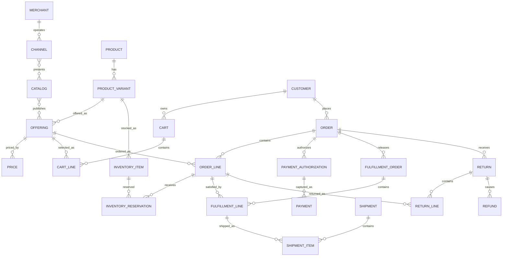

# E-Commerce Model Pattern

## Intent

Model businesses that present products or services through digital catalogs, accept customer orders, collect payment, fulfill goods or services, and manage cancellations, returns, refunds, and customer service.

This pattern specializes the Cross-Industry Party, Product, Offering, Agreement, Order, Fulfillment, Invoice, Payment, Classification, Status, Event, and Measurement concepts.

## Business overview

**Customer → Catalog/Offering → Cart → Order → Payment → Fulfillment → Delivery → Return/Refund**

A Merchant publishes Offerings through one or more Catalogs and Channels. A Customer selects an Offering and builds a Cart. Checkout converts the Cart into an Order with immutable commercial terms. Payment is authorized or collected. Order Lines are allocated to fulfillment sources and satisfied through Shipments, pickup, digital delivery, or service activation. Exceptions may cause cancellation, return, replacement, or refund.

## Pattern variants

### Simple

Use for a single merchant, one storefront, simple pricing, and direct fulfillment.

Core concepts: Customer; Product; Offering; Cart; Cart Line; Order; Order Line; Payment; Shipment.

### Standard

Use as the default for production commerce.

Adds: Merchant; Channel; Catalog; Category; Product Variant; Price; Inventory Item; Inventory Reservation; Address; Promotion; Tax; Payment Authorization; Fulfillment Order; Shipment Item; Delivery; Cancellation; Return; Return Line; Refund.

### Enterprise

Use for marketplaces, multiple sellers or legal entities, multiple fulfillment nodes, complex pricing, subscriptions, cross-border commerce, or omnichannel operations.

Adds: Seller; Marketplace Listing; Seller Offer; Price List; Contract Price; Warehouse/Fulfillment Location; Sourcing Rule; Fulfillment Split; Package; Carrier Service; Subscription; Digital Entitlement; Fraud Assessment; Dispute; Settlement; Commission; Payout; Currency Conversion; Trade Compliance.

## Actors and roles

| Role | Meaning |
|---|---|
| Customer | Party that shops, orders, receives value, or pays. |
| Buyer | Party Role authorized to place an Order. |
| Recipient | Party or contact designated to receive fulfillment. |
| Merchant | Party responsible for the storefront and customer commercial relationship. |
| Seller | Party supplying an Offering in a marketplace. |
| Fulfillment Provider | Party that picks, packs, ships, activates, or delivers. |
| Carrier | Party transporting a Shipment. |
| Payment Provider | Party authorizing, capturing, settling, or refunding money. |

Rule: Customer, Buyer, Recipient, and Payer may be different Parties or roles.

## Catalog and merchandising concepts

### Channel

A customer-facing context through which Offerings are presented or sold.

Logical attributes: Channel Identifier; Channel Name; Channel Type; Channel Status; Locale; Default Currency; Effective From; Effective Through.

Examples: website, mobile application, marketplace, call center, social storefront, or physical point of sale.

### Catalog

A governed collection of Offerings available for a market, channel, customer segment, or time period.

Logical attributes: Catalog Identifier; Catalog Name; Catalog Type; Catalog Status; Market; Currency; Effective From; Effective Through.

### Category

A navigational or merchandising classification used within a Catalog.

Logical attributes: Category Identifier; Category Name; Category Code; Category Status; Parent Category reference; Display Sequence.

### Product

The stable definition of a good, digital item, bundle, subscription, or service.

Logical attributes: Product Identifier; Product Name; Product Type; Product Status; Brand; Description; Effective From; Effective Through.

### Product Variant

A sellable variation of a Product distinguished by selected characteristics.

Logical attributes: Variant Identifier; SKU; Variant Name; Variant Status; Barcode; Weight; Dimensions; Effective From; Effective Through.

Examples: size, color, capacity, format, license tier, or package size.

### Offering

A Product or Product Variant made available through a Channel under specified commercial conditions.

Logical attributes: Offering Identifier; Offering Name; Offering Status; Available From; Available Through; Minimum Quantity; Maximum Quantity; Market; Channel reference.

Rule: Product describes what something is; Offering describes how and where it can be acquired.

### Price

A monetary amount applicable to an Offering under stated conditions.

Logical attributes: Price Identifier; Price Type; Amount; Currency; Unit of Measure; Minimum Quantity; Customer Segment; Effective From; Effective Through.

### Promotion

A governed offer that may create a discount, benefit, free item, shipping adjustment, or other reward when its eligibility conditions are satisfied.

Logical attributes: Promotion Identifier; Promotion Code; Promotion Name; Promotion Type; Promotion Status; Start Date; End Date; Eligibility Rule reference; Benefit Rule reference; Usage Limit.

## Shopping concepts

### Shopping Session

A period of customer interaction that provides context for browsing and shopping.

Logical attributes: Session Identifier; Started At; Last Activity At; Channel; Locale; Currency; Customer reference; Anonymous Identifier.

### Cart

A mutable collection of intended purchases before

Logical attributes: Cart Identifier; Cart Status; Created At; Updated At; Currency; Customer reference; Expiration Date.

### Cart Line

A requested quantity of an Offering in a Cart.

Logical attributes: Cart Line Identifier; Quantity; Selected Unit Price; Estimated Discount; Estimated Tax; Estimated Total; Added At.

Rule: cart price, availability, tax, and delivery values are estimates until checkout validates them.

### Saved List

A named collection of Products or Offerings retained for later consideration.

Logical attributes: Saved List Identifier; List Name; List Type; Visibility; Created At; Updated At.

## Order concepts

### Order

The Merchant's accepted commercial record of a Customer request.

Logical attributes: Order Identifier; Order Number; Order Type; Order Status; Order Date; Currency; Subtotal; Discount Total; Tax Total; Shipping Total; Grand Total; Customer reference; Buyer reference.

### Order Line

An immutable commercial record of one ordered Offering.

Logical attributes: Order Line Identifier; Line Number; Product Name Snapshot; SKU Snapshot; Quantity Ordered; Unit Price; Discount Amount; Tax Amount; Line Total; Line Status; Requested Fulfillment Method.

Rule: retain product, description, price, tax, and promotion snapshots needed to explain the accepted Order even when the current Catalog later changes.

### Order Adjustment

A discount, surcharge, credit, fee, tax, or manual correction applied to an Order or Order Line.

Logical attributes: Adjustment Identifier; Adjustment Type; Description; Amount; Tax Included Indicator; Source reference.

### Order Address

An immutable address snapshot used for billing, shipping, pickup, or service delivery.

Logical attributes: Order Address Identifier; Address Purpose; Recipient Name; Address Lines; City; Region; Postal Code; Country; Phone Number.

## Inventory and availability

### Inventory Item

Stock or capacity for a Product Variant at a fulfillment location.

Logical attributes: Inventory Item Identifier; SKU; Location reference; Inventory Status; Quantity On Hand; Quantity Reserved; Quantity Available; Reorder Level; Updated At.

### Inventory Reservation

A time-bounded hold of inventory for a Cart, Order Line, or Fulfillment Order.

Logical attributes: Reservation Identifier; Reserved Quantity; Reservation Status; Reserved At; Expires At; Released At.

### Availability Promise

A calculated promise that a quantity can be delivered or made available by a stated date.

Logical attributes: Promise Identifier; Promised Quantity; Promise Date; Fulfillment Method; Promise Status; Calculated At.

Rule: distinguish physical on-hand quantity from available-to-promise quantity.

## Payment concepts

### Payment Method

A tokenized or referenced means by which a Customer intends to pay.

Logical attributes: Payment Method Identifier; Method Type; Provider; Masked Display; Token Reference; Expiration; Method Status.

Never store raw payment-card credentials in the domain model.

### Payment Authorization

Approval by a Payment Provider to reserve spending capacity.

Logical attributes: Authorization Identifier; Provider Reference; Requested Amount; Authorized Amount; Currency; Authorization Status; Authorized At; Expires At.

### Payment

A captured or received transfer of value.

Logical attributes: Payment Identifier; Provider Reference; Payment Date; Amount; Currency; Payment Method Type; Payment Status.

### Payment Allocation

Application of a Payment to an Order, Invoice, or Charge.

Logical attributes: Allocation Identifier; Allocated Amount; Allocation Date; Allocation Status.

### Refund

A transfer of value back to a Customer or Payer.

Logical attributes: Refund Identifier; Refund Reference; Refund Amount; Currency; Refund Reason; Refund Status; Requested At; Completed At.

## Fulfillment concepts

### Fulfillment Order

Instructions to a fulfillment location or provider to satisfy one or more Order Lines.

Logical attributes: Fulfillment Order Identifier; Fulfillment Type; Fulfillment Status; Source Location; Planned Date; Released At; Completed At.

### Fulfillment Line

The quantity of an Order Line assigned to a Fulfillment Order.

Logical attributes: Fulfillment Line Identifier; Quantity Assigned; Quantity Fulfilled; Fulfillment Line Status.

### Shipment

A physical dispatch from a fulfillment location to a destination.

Logical attributes: Shipment Identifier; Shipment Number; Shipment Status; Ship Date; Carrier; Service Level; Tracking Number; Estimated Delivery Date; Actual Delivery Date.

### Shipment Item

The quantity of a Fulfillment Line placed in a Shipment.

Logical attributes: Shipment Item Identifier; Quantity Shipped; Package reference.

### Package

A physical container within a Shipment.

Logical attributes: Package Identifier; Package Type; Weight; Dimensions; Tracking Reference.

### Delivery

Evidence that fulfillment reached its destination or recipient.

Logical attributes: Delivery Identifier; Delivery Status; Delivered At; Recipient Name; Evidence Reference; Exception Reason.

### Digital Entitlement

A right to access or use a digital Product or Service.

Logical attributes: Entitlement Identifier; Entitlement Type; Entitlement Status; Granted At; Effective From; Effective Through; Quantity or Limit; Access Reference.

## Cancellation, return, and after-sale concepts

### Cancellation

An accepted request to stop an unfulfilled or partially fulfilled Order or Order Line.

Logical attributes: Cancellation Identifier; Cancellation Reason; Cancellation Status; Requested At; Accepted At; Cancelled Quantity.

### Return

Authorization and tracking for goods or value being returned after fulfillment.

Logical attributes: Return Identifier; Return Number; Return Status; Requested At; Authorized At; Received At; Return Method; Return Reason.

### Return Line

A quantity from an Order Line included in a Return.

Logical attributes: Return Line Identifier; Requested Quantity; Authorized Quantity; Received Quantity; Disposition; Condition.

### Disposition

Decision about a returned item.

Logical attributes: Disposition Identifier; Disposition Type; Decision Date; Restock Quantity; Write-off Amount; Notes.

Examples: restock, refurbish, quarantine, return to supplier, destroy, or reject.

### Customer Case

A service inquiry, complaint, delivery problem, dispute, or exception related to commerce activity.

Logical attributes: Case Identifier; Case Type; Case Status; Priority; Opened At; Closed At; Resolution; Customer reference.

## Standard relationship model

| Source | Relationship | Target | Cardinality |
|---|---|---|---|
| Merchant | operates | Channel | 1:M |
| Channel | presents | Catalog | M:M |
| Catalog | contains | Category | 1:M |
| Category | classifies | Offering | M:M |
| Product | has | Product Variant | 1:M |
| Offering | offers | Product or Product Variant | M:1 |
| Catalog | publishes | Offering | M:M |
| Offering | has | Price | 1:M |
| Promotion | applies to | Offering, Cart, Order, or Order Line | M:M |
| Customer | owns | Cart | 1:M |
| Cart | contains | Cart Line | 1:M |
| Cart Line | selects | Offering | M:1 |
| Cart | converts to | Order | 1:0..1 |
| Customer | places | Order | 1:M |
| Order | contains | Order Line | 1:M |
| Order Line | snapshots | Offering | M:1 |
| Order | uses | Order Address | 1:M |
| Inventory Item | stocks | Product Variant | M:1 |
| Inventory Reservation | reserves | Inventory Item | M:1 |
| Order Line | receives | Inventory Reservation | 1:M |
| Order | receives | Payment Authorization | 1:M |
| Payment Authorization | may produce | Payment | 1:M |
| Payment | applies through | Payment Allocation | 1:M |
| Payment Allocation | settles | Order, Invoice, or Charge | M:1 |
| Order | releases | Fulfillment Order | 1:M |
| Fulfillment Order | contains | Fulfillment Line | 1:M |
| Fulfillment Line | satisfies | Order Line | M:1 |
| Shipment | contains | Shipment Item | 1:M |
| Shipment Item | fulfills | Fulfillment Line | M:1 |
| Shipment | results in | Delivery | 1:M |
| Order or Order Line | receives | Cancellation | 1:M |
| Order | receives | Return | 1:M |
| Return | contains | Return Line | 1:M |
| Return Line | refers to | Order Line | M:1 |
| Return | may cause | Refund | 1:M |
| Customer | opens | Customer Case | 1:M |

## Lifecycle models

### Cart

Active → Converted | Abandoned | Expired

### Order

Draft → Submitted → Accepted → Allocated → Partially Fulfilled → Fulfilled → Completed

Exception outcomes: On Hold; Partially Cancelled; Cancelled.

### Payment authorization

Requested → Authorized → Partially Captured → Captured

Exception outcomes: Declined; Expired; Voided.

### Fulfillment

Planned → Released → In Progress → Partially Fulfilled → Fulfilled

Exception outcomes: On Hold; Failed; Cancelled.

### Shipment

Planned → Packed → Shipped → In Transit → Delivered

Exception outcomes: Delayed; Delivery Failed; Lost; Returned.

### Return

Requested → Authorized → In Transit → Received → Inspected → Resolved

Exception outcomes: Rejected; Cancelled.

## Business events

- Product Published
- Price Activated
- Promotion Activated
- Item Added to Cart
- Checkout Started
- Order Submitted
- Order Accepted or Rejected
- Inventory Reserved or Released
- Payment Authorized, Declined, Captured, or Failed
- Fulfillment Released
- Shipment Dispatched
- Delivery Confirmed or Failed
- Cancellation Requested or Accepted
- Return Requested, Authorized, Received, or Rejected
- Refund Requested or Completed

Events record what happened; lifecycle transitions define what changes are allowed because of those events.

## Baseline business and integrity rules

1. An Offering must be active in the selected Channel, market, and time period before it can be ordered.
2. Checkout must revalidate price, promotion, tax, inventory, entitlement, and delivery promise.
3. An accepted Order retains the commercial snapshots necessary to reproduce its totals.
4. Order Total = line totals + charges + tax − discounts, subject to declared rounding rules.
5. Reserved inventory cannot exceed available inventory unless backorder rules explicitly permit it.
6. The same Order Line may be split across several Fulfillment Orders and Shipments.
7. Fulfilled quantity plus cancelled quantity cannot exceed ordered quantity.
8. Captured payment cannot exceed the amount authorized unless the payment method explicitly supports incremental authorization.
9. Refunds cannot exceed captured value net of prior refunds, unless an explicit goodwill-credit policy applies.
10. Return quantity cannot exceed delivered quantity net of prior accepted returns.
11. Every financial adjustment must retain its reason, source, currency, and calculation evidence.
12. Raw card credentials must not be stored; retain provider tokens and masked display data only.

## AI modeling questions

1. Is this single-merchant commerce or a multi-seller marketplace?
2. Are Customers people, organizations, or both?
3. Are Products physical goods, digital goods, subscriptions, services, or bundles?
4. Do Product and SKU/Product Variant need to be distinct?
5. Which Channels, markets, languages, and currencies are supported?
6. Are prices global, channel-specific, customer-specific, quantity-based, or contract-based?
7. How are promotions qualified, combined, prioritized, and limited?
8. Is inventory tracked, and at which locations and units?
9. Are backorders, preorders, reservations, or substitutions permitted?
10. Which fulfillment methods exist: shipment, pickup, digital delivery, activation, or service?
11. Can one Order split across sellers, locations, shipments, or delivery dates?
12. When is payment authorized and captured?
13. Are partial payment, multiple tenders, invoicing, or payment-on-delivery allowed?
14. What cancellation, return, exchange, and refund policies apply?
15. Which taxes, duties, trade restrictions, privacy requirements, and jurisdictions apply?
16. Which events and measures must be retained for audit and analytics?

## MDE modeling guidance

- Use the Cross-Industry Party and Party Role pattern; do not equate Customer with login identity.
- Treat Catalog data as current merchandising knowledge and Order Lines as historical commercial evidence.
- Keep Product, Product Variant, Offering, and Price separate whenever they change independently.
- Keep Order, Payment, and Fulfillment as separate lifecycles; do not overload Order Status with every downstream condition.
- Model splits explicitly through Fulfillment Lines, Shipment Items, Payment Allocations, and Return Lines.
- Put calculation and eligibility rules on the operations they govern; use cases orchestrate choices and outcomes.
- Add marketplace Seller, Commission, Settlement, and Payout only when multiple commercial principals exist.

## Anti-patterns

### Product Equals SKU Equals Offering

This prevents several variants, channels, markets, prices, or availability windows from representing the same product cleanly.

### Cart as the Order

A Cart is mutable and estimated; an accepted Order is durable commercial evidence.

### One Order, One Shipment, One Payment

This fails under partial shipment, split fulfillment, backorders, partial capture, multiple tenders, and refunds.

### Order Status as Everything

Payment, fulfillment, shipment, return, and refund each need their own lifecycle and evidence.

### Current Catalog Reconstructs History

Catalog descriptions and prices change. Historical Orders require accepted snapshots and traceable adjustments.

## Physical mapping examples

| Logical name | Example physical name |
|---|---|
| Product Variant | `product_variant` |
| Offering | `offering` |
| Cart Line | `cart_line` |
| Order Line | `order_line` |
| Inventory Reservation | `inventory_reservation` |
| Payment Authorization | `payment_authorization` |
| Fulfillment Order | `fulfillment_order` |
| Fulfillment Line | `fulfillment_line` |
| Shipment Item | `shipment_item` |
| Return Line | `return_line` |

Logical names remain authoritative; stack rules generate physical naming after logical acceptance.

## Future behavioral expansion

This file is now an actual logical industry pattern. A later behavioral layer should define capabilities and actor-goal use cases such as Browse Catalog, Maintain Cart, Checkout, Place Order, Authorize Payment, Fulfill Order, Track Delivery, Cancel Order, Return Item, and Issue Refund, along with rules, pages, and test scenarios.
