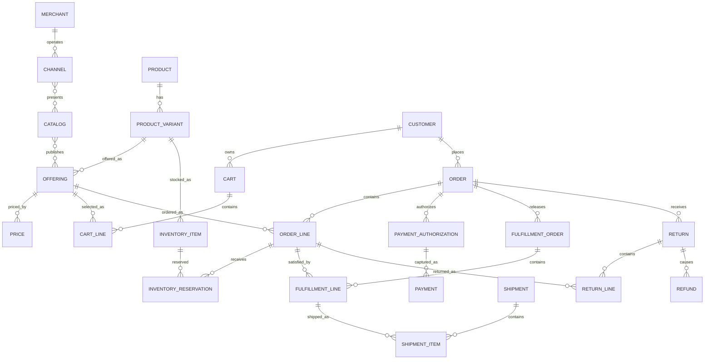

# E-Commerce Model Pattern

## Intent

Model businesses that present products or services through digital catalogs, accept customer orders, collect payment, fulfill goods or services, and manage cancellations, returns, refunds, and customer service.

This pattern specializes the Cross-Industry Party, Product, Offering, Agreement, Order, Fulfillment, Invoice, Payment, Classification, Status, Event, and Measurement concepts.

## Business overview

**Customer → Catalog/Offering → Cart → Order → Payment → Fulfillment → Delivery → Return/Refund**

A Merchant publishes Offerings through one or more Catalogs and Channels. A Customer selects an Offering and builds a Cart. Checkout converts the Cart into an Order with immutable commercial terms. Payment is authorized or collected. Order Lines are allocated to fulfillment sources and satisfied through Shipments, pickup, digital delivery, or service activation. Exceptions may cause cancellation, return, replacement, or refund.

## Pattern variants

### Simple

Use for a single merchant, one storefront, simple pricing, and direct fulfillment.

Core concepts: Customer; Product; Offering; Cart; Cart Line; Order; Order Line; Payment; Shipment.

### Standard

Use as the default for production commerce.

Adds: Merchant; Channel; Catalog; Category; Product Variant; Price; Inventory Item; Inventory Reservation; Address; Promotion; Tax; Payment Authorization; Fulfillment Order; Shipment Item; Delivery; Cancellation; Return; Return Line; Refund.

### Enterprise

Use for marketplaces, multiple sellers or legal entities, multiple fulfillment nodes, complex pricing, subscriptions, cross-border commerce, or omnichannel operations.

Adds: Seller; Marketplace Listing; Seller Offer; Price List; Contract Price; Warehouse/Fulfillment Location; Sourcing Rule; Fulfillment Split; Package; Carrier Service; Subscription; Digital Entitlement; Fraud Assessment; Dispute; Settlement; Commission; Payout; Currency Conversion; Trade Compliance.

## Actors and roles

| Role | Meaning |
|---|---|
| Customer | Party that shops, orders, receives value, or pays. |
| Buyer | Party Role authorized to place an Order. |
| Recipient | Party or contact designated to receive fulfillment. |
| Merchant | Party responsible for the storefront and customer commercial relationship. |
| Seller | Party supplying an Offering in a marketplace. |
| Fulfillment Provider | Party that picks, packs, ships, activates, or delivers. |
| Carrier | Party transporting a Shipment. |
| Payment Provider | Party authorizing, capturing, settling, or refunding money. |

Rule: Customer, Buyer, Recipient, and Payer may be different Parties or roles.

## Catalog and merchandising concepts

### Channel

Canonical concept: [Channel](../model/requirements/e-commerce/channel/channel.md).

The canonical page contains the definition, logical attributes, rules, and source-specific detail.

### Catalog

Canonical concept: [Catalog](../model/requirements/e-commerce/channel/catalog.md).

The canonical page contains the definition, logical attributes, rules, and source-specific detail.

### Category

Canonical concept: [Category](../model/requirements/e-commerce/channel/category.md).

The canonical page contains the definition, logical attributes, rules, and source-specific detail.

### Product

Canonical concept: [Product](../model/requirements/e-commerce/channel/product.md).

The canonical page contains the definition, logical attributes, rules, and source-specific detail.

### Product Variant

Canonical concept: [Product Variant](../model/requirements/e-commerce/channel/product-variant.md).

The canonical page contains the definition, logical attributes, rules, and source-specific detail.

### Offering

Canonical concept: [Offering](../model/requirements/e-commerce/channel/offering.md).

The canonical page contains the definition, logical attributes, rules, and source-specific detail.

### Price

Canonical concept: [Price](../model/requirements/product-and-service/product/price.md).

The canonical page contains the definition, logical attributes, rules, and source-specific detail.

### Promotion

Canonical concept: [Promotion](../model/requirements/e-commerce/channel/promotion.md).

The canonical page contains the definition, logical attributes, rules, and source-specific detail.

## Shopping concepts

### Shopping Session

Canonical concept: [Shopping Session](../model/requirements/e-commerce/shopping-session/shopping-session.md).

The canonical page contains the definition, logical attributes, rules, and source-specific detail.

### Cart

Canonical concept: [Cart](../model/requirements/e-commerce/shopping-session/cart.md).

The canonical page contains the definition, logical attributes, rules, and source-specific detail.

### Cart Line

Canonical concept: [Cart Line](../model/requirements/e-commerce/shopping-session/cart-line.md).

The canonical page contains the definition, logical attributes, rules, and source-specific detail.

### Saved List

Canonical concept: [Saved List](../model/requirements/e-commerce/shopping-session/saved-list.md).

The canonical page contains the definition, logical attributes, rules, and source-specific detail.

## Order concepts

### Order

Canonical concept: [Order](../model/requirements/e-commerce/order/order.md).

The canonical page contains the definition, logical attributes, rules, and source-specific detail.

### Order Line

Canonical concept: [Order Line](../model/requirements/e-commerce/order/order-line.md).

The canonical page contains the definition, logical attributes, rules, and source-specific detail.

### Order Adjustment

Canonical concept: [Order Adjustment](../model/requirements/e-commerce/order/order-adjustment.md).

The canonical page contains the definition, logical attributes, rules, and source-specific detail.

### Order Address

Canonical concept: [Order Address](../model/requirements/e-commerce/order/order-address.md).

The canonical page contains the definition, logical attributes, rules, and source-specific detail.

## Inventory and availability

### Inventory Item

Canonical concept: [Inventory Item](../model/requirements/e-commerce/inventory-item/inventory-item.md).

The canonical page contains the definition, logical attributes, rules, and source-specific detail.

### Inventory Reservation

Canonical concept: [Inventory Reservation](../model/requirements/e-commerce/inventory-item/inventory-reservation.md).

The canonical page contains the definition, logical attributes, rules, and source-specific detail.

### Availability Promise

Canonical concept: [Availability Promise](../model/requirements/e-commerce/inventory-item/availability-promise.md).

The canonical page contains the definition, logical attributes, rules, and source-specific detail.

## Payment concepts

### Payment Method

Canonical concept: [Payment Method](../model/requirements/e-commerce/payment-method/payment-method.md).

The canonical page contains the definition, logical attributes, rules, and source-specific detail.

### Payment Authorization

Canonical concept: [Payment Authorization](../model/requirements/e-commerce/payment-method/payment-authorization.md).

The canonical page contains the definition, logical attributes, rules, and source-specific detail.

### Payment

Canonical concept: [Payment](../model/requirements/finance/invoice/payment.md).

The canonical page contains the definition, logical attributes, rules, and source-specific detail.

### Payment Allocation

Canonical concept: [Payment Allocation](../model/requirements/finance/invoice/payment-allocation.md).

The canonical page contains the definition, logical attributes, rules, and source-specific detail.

### Refund

Canonical concept: [Refund](../model/requirements/e-commerce/payment-method/refund.md).

The canonical page contains the definition, logical attributes, rules, and source-specific detail.

## Fulfillment concepts

### Fulfillment Order

Canonical concept: [Fulfillment Order](../model/requirements/e-commerce/fulfillment-order/fulfillment-order.md).

The canonical page contains the definition, logical attributes, rules, and source-specific detail.

### Fulfillment Line

Canonical concept: [Fulfillment Line](../model/requirements/e-commerce/fulfillment-order/fulfillment-line.md).

The canonical page contains the definition, logical attributes, rules, and source-specific detail.

### Shipment

Canonical concept: [Shipment](../model/requirements/e-commerce/fulfillment-order/shipment.md).

The canonical page contains the definition, logical attributes, rules, and source-specific detail.

### Shipment Item

Canonical concept: [Shipment Item](../model/requirements/e-commerce/fulfillment-order/shipment-item.md).

The canonical page contains the definition, logical attributes, rules, and source-specific detail.

### Package

Canonical concept: [Package](../model/requirements/e-commerce/fulfillment-order/package.md).

The canonical page contains the definition, logical attributes, rules, and source-specific detail.

### Delivery

Canonical concept: [Delivery](../model/requirements/e-commerce/fulfillment-order/delivery.md).

The canonical page contains the definition, logical attributes, rules, and source-specific detail.

### Digital Entitlement

Canonical concept: [Digital Entitlement](../model/requirements/e-commerce/fulfillment-order/digital-entitlement.md).

The canonical page contains the definition, logical attributes, rules, and source-specific detail.

## Cancellation, return, and after-sale concepts

### Cancellation

Canonical concept: [Cancellation](../model/requirements/e-commerce/cancellation/cancellation.md).

The canonical page contains the definition, logical attributes, rules, and source-specific detail.

### Return

Canonical concept: [Return](../model/requirements/e-commerce/cancellation/return.md).

The canonical page contains the definition, logical attributes, rules, and source-specific detail.

### Return Line

Canonical concept: [Return Line](../model/requirements/e-commerce/cancellation/return-line.md).

The canonical page contains the definition, logical attributes, rules, and source-specific detail.

### Disposition

Canonical concept: [Disposition](../model/requirements/e-commerce/cancellation/disposition.md).

The canonical page contains the definition, logical attributes, rules, and source-specific detail.

### Customer Case

Canonical concept: [Customer Case](../model/requirements/e-commerce/cancellation/customer-case.md).

The canonical page contains the definition, logical attributes, rules, and source-specific detail.

## Standard relationship model

| Source | Relationship | Target | Cardinality |
|---|---|---|---|
| Merchant | operates | Channel | 1:M |
| Channel | presents | Catalog | M:M |
| Catalog | contains | Category | 1:M |
| Category | classifies | Offering | M:M |
| Product | has | Product Variant | 1:M |
| Offering | offers | Product or Product Variant | M:1 |
| Catalog | publishes | Offering | M:M |
| Offering | has | Price | 1:M |
| Promotion | applies to | Offering, Cart, Order, or Order Line | M:M |
| Customer | owns | Cart | 1:M |
| Cart | contains | Cart Line | 1:M |
| Cart Line | selects | Offering | M:1 |
| Cart | converts to | Order | 1:0..1 |
| Customer | places | Order | 1:M |
| Order | contains | Order Line | 1:M |
| Order Line | snapshots | Offering | M:1 |
| Order | uses | Order Address | 1:M |
| Inventory Item | stocks | Product Variant | M:1 |
| Inventory Reservation | reserves | Inventory Item | M:1 |
| Order Line | receives | Inventory Reservation | 1:M |
| Order | receives | Payment Authorization | 1:M |
| Payment Authorization | may produce | Payment | 1:M |
| Payment | applies through | Payment Allocation | 1:M |
| Payment Allocation | settles | Order, Invoice, or Charge | M:1 |
| Order | releases | Fulfillment Order | 1:M |
| Fulfillment Order | contains | Fulfillment Line | 1:M |
| Fulfillment Line | satisfies | Order Line | M:1 |
| Shipment | contains | Shipment Item | 1:M |
| Shipment Item | fulfills | Fulfillment Line | M:1 |
| Shipment | results in | Delivery | 1:M |
| Order or Order Line | receives | Cancellation | 1:M |
| Order | receives | Return | 1:M |
| Return | contains | Return Line | 1:M |
| Return Line | refers to | Order Line | M:1 |
| Return | may cause | Refund | 1:M |
| Customer | opens | Customer Case | 1:M |

## Lifecycle models

### Cart

Active → Converted | Abandoned | Expired

### Order

Draft → Submitted → Accepted → Allocated → Partially Fulfilled → Fulfilled → Completed

Exception outcomes: On Hold; Partially Cancelled; Cancelled.

### Payment authorization

Requested → Authorized → Partially Captured → Captured

Exception outcomes: Declined; Expired; Voided.

### Fulfillment

Planned → Released → In Progress → Partially Fulfilled → Fulfilled

Exception outcomes: On Hold; Failed; Cancelled.

### Shipment

Planned → Packed → Shipped → In Transit → Delivered

Exception outcomes: Delayed; Delivery Failed; Lost; Returned.

### Return

Requested → Authorized → In Transit → Received → Inspected → Resolved

Exception outcomes: Rejected; Cancelled.

## Business events

- Product Published
- Price Activated
- Promotion Activated
- Item Added to Cart
- Checkout Started
- Order Submitted
- Order Accepted or Rejected
- Inventory Reserved or Released
- Payment Authorized, Declined, Captured, or Failed
- Fulfillment Released
- Shipment Dispatched
- Delivery Confirmed or Failed
- Cancellation Requested or Accepted
- Return Requested, Authorized, Received, or Rejected
- Refund Requested or Completed

Events record what happened; lifecycle transitions define what changes are allowed because of those events.

## Baseline business and integrity rules

1. An Offering must be active in the selected Channel, market, and time period before it can be ordered.
2. Checkout must revalidate price, promotion, tax, inventory, entitlement, and delivery promise.
3. An accepted Order retains the commercial snapshots necessary to reproduce its totals.
4. Order Total = line totals + charges + tax − discounts, subject to declared rounding rules.
5. Reserved inventory cannot exceed available inventory unless backorder rules explicitly permit it.
6. The same Order Line may be split across several Fulfillment Orders and Shipments.
7. Fulfilled quantity plus cancelled quantity cannot exceed ordered quantity.
8. Captured payment cannot exceed the amount authorized unless the payment method explicitly supports incremental authorization.
9. Refunds cannot exceed captured value net of prior refunds, unless an explicit goodwill-credit policy applies.
10. Return quantity cannot exceed delivered quantity net of prior accepted returns.
11. Every financial adjustment must retain its reason, source, currency, and calculation evidence.
12. Raw card credentials must not be stored; retain provider tokens and masked display data only.

## AI modeling questions

1. Is this single-merchant commerce or a multi-seller marketplace?
2. Are Customers people, organizations, or both?
3. Are Products physical goods, digital goods, subscriptions, services, or bundles?
4. Do Product and SKU/Product Variant need to be distinct?
5. Which Channels, markets, languages, and currencies are supported?
6. Are prices global, channel-specific, customer-specific, quantity-based, or contract-based?
7. How are promotions qualified, combined, prioritized, and limited?
8. Is inventory tracked, and at which locations and units?
9. Are backorders, preorders, reservations, or substitutions permitted?
10. Which fulfillment methods exist: shipment, pickup, digital delivery, activation, or service?
11. Can one Order split across sellers, locations, shipments, or delivery dates?
12. When is payment authorized and captured?
13. Are partial payment, multiple tenders, invoicing, or payment-on-delivery allowed?
14. What cancellation, return, exchange, and refund policies apply?
15. Which taxes, duties, trade restrictions, privacy requirements, and jurisdictions apply?
16. Which events and measures must be retained for audit and analytics?

## MDE modeling guidance

- Use the Cross-Industry Party and Party Role pattern; do not equate Customer with login identity.
- Treat Catalog data as current merchandising knowledge and Order Lines as historical commercial evidence.
- Keep Product, Product Variant, Offering, and Price separate whenever they change independently.
- Keep Order, Payment, and Fulfillment as separate lifecycles; do not overload Order Status with every downstream condition.
- Model splits explicitly through Fulfillment Lines, Shipment Items, Payment Allocations, and Return Lines.
- Put calculation and eligibility rules on the operations they govern; use cases orchestrate choices and outcomes.
- Add marketplace Seller, Commission, Settlement, and Payout only when multiple commercial principals exist.

## Anti-patterns

### Product Equals SKU Equals Offering

This prevents several variants, channels, markets, prices, or availability windows from representing the same product cleanly.

### Cart as the Order

A Cart is mutable and estimated; an accepted Order is durable commercial evidence.

### One Order, One Shipment, One Payment

This fails under partial shipment, split fulfillment, backorders, partial capture, multiple tenders, and refunds.

### Order Status as Everything

Payment, fulfillment, shipment, return, and refund each need their own lifecycle and evidence.

### Current Catalog Reconstructs History

Catalog descriptions and prices change. Historical Orders require accepted snapshots and traceable adjustments.

## Physical mapping examples

| Logical name | Example physical name |
|---|---|
| Product Variant | `product_variant` |
| Offering | `offering` |
| Cart Line | `cart_line` |
| Order Line | `order_line` |
| Inventory Reservation | `inventory_reservation` |
| Payment Authorization | `payment_authorization` |
| Fulfillment Order | `fulfillment_order` |
| Fulfillment Line | `fulfillment_line` |
| Shipment Item | `shipment_item` |
| Return Line | `return_line` |

Logical names remain authoritative; stack rules generate physical naming after logical acceptance.

## Future behavioral expansion

This file is now an actual logical industry pattern. A later behavioral layer should define capabilities and actor-goal use cases such as Browse Catalog, Maintain Cart, Checkout, Place Order, Authorize Payment, Fulfill Order, Track Delivery, Cancel Order, Return Item, and Issue Refund, along with rules, pages, and test scenarios.

## Canonical model bindings

This pattern selects and connects concepts in the [coherent model](../model/README.md). The sections below are views of those definitions. Industry lifecycles, events, baseline rules, and variant choices continue to constrain the selected concepts.

| Source term | Canonical concept | ABE |
|---|---|---|
| Channel | [Channel](../model/requirements/e-commerce/channel/channel.md) | [Channel](../model/requirements/e-commerce/channel/README.md) |
| Catalog | [Catalog](../model/requirements/e-commerce/channel/catalog.md) | [Channel](../model/requirements/e-commerce/channel/README.md) |
| Category | [Category](../model/requirements/e-commerce/channel/category.md) | [Channel](../model/requirements/e-commerce/channel/README.md) |
| Product | [Product](../model/requirements/e-commerce/channel/product.md) | [Channel](../model/requirements/e-commerce/channel/README.md) |
| Product Variant | [Product Variant](../model/requirements/e-commerce/channel/product-variant.md) | [Channel](../model/requirements/e-commerce/channel/README.md) |
| Offering | [Offering](../model/requirements/e-commerce/channel/offering.md) | [Channel](../model/requirements/e-commerce/channel/README.md) |
| Price | [Price](../model/requirements/product-and-service/product/price.md) | [Product](../model/requirements/product-and-service/product/README.md) |
| Promotion | [Promotion](../model/requirements/e-commerce/channel/promotion.md) | [Channel](../model/requirements/e-commerce/channel/README.md) |
| Shopping Session | [Shopping Session](../model/requirements/e-commerce/shopping-session/shopping-session.md) | [Shopping Session](../model/requirements/e-commerce/shopping-session/README.md) |
| Cart | [Cart](../model/requirements/e-commerce/shopping-session/cart.md) | [Shopping Session](../model/requirements/e-commerce/shopping-session/README.md) |
| Cart Line | [Cart Line](../model/requirements/e-commerce/shopping-session/cart-line.md) | [Shopping Session](../model/requirements/e-commerce/shopping-session/README.md) |
| Saved List | [Saved List](../model/requirements/e-commerce/shopping-session/saved-list.md) | [Shopping Session](../model/requirements/e-commerce/shopping-session/README.md) |
| Order | [Order](../model/requirements/e-commerce/order/order.md) | [Order](../model/requirements/e-commerce/order/README.md) |
| Order Line | [Order Line](../model/requirements/e-commerce/order/order-line.md) | [Order](../model/requirements/e-commerce/order/README.md) |
| Order Adjustment | [Order Adjustment](../model/requirements/e-commerce/order/order-adjustment.md) | [Order](../model/requirements/e-commerce/order/README.md) |
| Order Address | [Order Address](../model/requirements/e-commerce/order/order-address.md) | [Order](../model/requirements/e-commerce/order/README.md) |
| Inventory Item | [Inventory Item](../model/requirements/e-commerce/inventory-item/inventory-item.md) | [Inventory Item](../model/requirements/e-commerce/inventory-item/README.md) |
| Inventory Reservation | [Inventory Reservation](../model/requirements/e-commerce/inventory-item/inventory-reservation.md) | [Inventory Item](../model/requirements/e-commerce/inventory-item/README.md) |
| Availability Promise | [Availability Promise](../model/requirements/e-commerce/inventory-item/availability-promise.md) | [Inventory Item](../model/requirements/e-commerce/inventory-item/README.md) |
| Payment Method | [Payment Method](../model/requirements/e-commerce/payment-method/payment-method.md) | [Payment Method](../model/requirements/e-commerce/payment-method/README.md) |
| Payment Authorization | [Payment Authorization](../model/requirements/e-commerce/payment-method/payment-authorization.md) | [Payment Method](../model/requirements/e-commerce/payment-method/README.md) |
| Payment | [Payment](../model/requirements/finance/invoice/payment.md) | [Invoice](../model/requirements/finance/invoice/README.md) |
| Payment Allocation | [Payment Allocation](../model/requirements/finance/invoice/payment-allocation.md) | [Invoice](../model/requirements/finance/invoice/README.md) |
| Refund | [Refund](../model/requirements/e-commerce/payment-method/refund.md) | [Payment Method](../model/requirements/e-commerce/payment-method/README.md) |
| Fulfillment Order | [Fulfillment Order](../model/requirements/e-commerce/fulfillment-order/fulfillment-order.md) | [Fulfillment Order](../model/requirements/e-commerce/fulfillment-order/README.md) |
| Fulfillment Line | [Fulfillment Line](../model/requirements/e-commerce/fulfillment-order/fulfillment-line.md) | [Fulfillment Order](../model/requirements/e-commerce/fulfillment-order/README.md) |
| Shipment | [Shipment](../model/requirements/e-commerce/fulfillment-order/shipment.md) | [Fulfillment Order](../model/requirements/e-commerce/fulfillment-order/README.md) |
| Shipment Item | [Shipment Item](../model/requirements/e-commerce/fulfillment-order/shipment-item.md) | [Fulfillment Order](../model/requirements/e-commerce/fulfillment-order/README.md) |
| Package | [Package](../model/requirements/e-commerce/fulfillment-order/package.md) | [Fulfillment Order](../model/requirements/e-commerce/fulfillment-order/README.md) |
| Delivery | [Delivery](../model/requirements/e-commerce/fulfillment-order/delivery.md) | [Fulfillment Order](../model/requirements/e-commerce/fulfillment-order/README.md) |
| Digital Entitlement | [Digital Entitlement](../model/requirements/e-commerce/fulfillment-order/digital-entitlement.md) | [Fulfillment Order](../model/requirements/e-commerce/fulfillment-order/README.md) |
| Cancellation | [Cancellation](../model/requirements/e-commerce/cancellation/cancellation.md) | [Cancellation](../model/requirements/e-commerce/cancellation/README.md) |
| Return | [Return](../model/requirements/e-commerce/cancellation/return.md) | [Cancellation](../model/requirements/e-commerce/cancellation/README.md) |
| Return Line | [Return Line](../model/requirements/e-commerce/cancellation/return-line.md) | [Cancellation](../model/requirements/e-commerce/cancellation/README.md) |
| Disposition | [Disposition](../model/requirements/e-commerce/cancellation/disposition.md) | [Cancellation](../model/requirements/e-commerce/cancellation/README.md) |
| Customer Case | [Customer Case](../model/requirements/e-commerce/cancellation/customer-case.md) | [Cancellation](../model/requirements/e-commerce/cancellation/README.md) |
