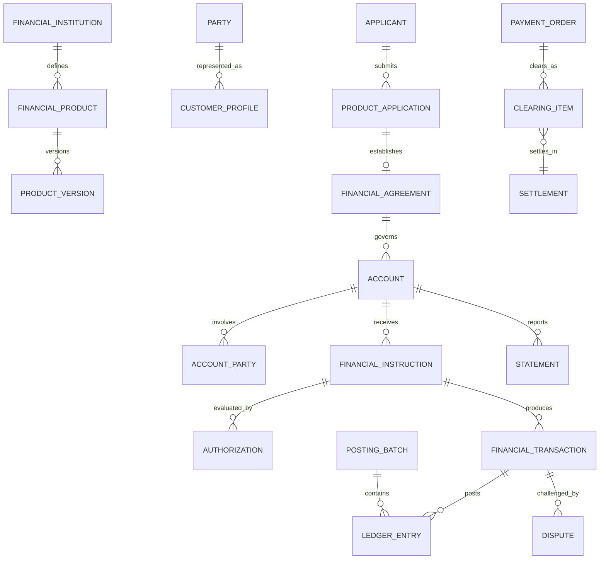

# Financial Services Model Pattern

## Intent

Model banks, credit unions, payment institutions, lenders, investment firms, and financial intermediaries that offer financial products; onboard and identify customers; establish agreements and accounts; accept instructions; authorize, post, clear, and settle transactions; manage balances, fees, interest, limits, risk, disputes, and regulatory obligations.

This pattern specializes the Cross-Industry Party, Role, Product, Offering, Agreement, Account, Classification, Event, Status, Charge, Payment, Document, Work Effort, and Outcome concepts.

## Business overview

**Customer Need → Product/Offering → Application → Due Diligence → Agreement → Account → Instruction → Authorization → Transaction/Posting → Clearing/Settlement → Statement/Reconciliation**

A Financial Institution defines Financial Products and Offerings. A prospective Customer submits an Application and identity, ownership, tax, and risk information. Customer due diligence and product eligibility checks support an approval decision. An accepted application establishes a Financial Agreement and one or more Accounts with authorized Account Parties. Customers or connected systems submit Instructions for deposits, withdrawals, transfers, payments, trades, or credit usage. The institution authenticates the initiating Party, checks authority, limits, funds, sanctions, fraud, and product rules, then records Transactions and balanced Ledger Entries. Inter-institution activity may pass through clearing and settlement. Statements, reconciliations, disputes, holds, fees, interest, and regulatory reporting complete the operational lifecycle.

## Pattern variants

### Simple

Use for a focused account or payment prototype.

Core concepts: Customer; Financial Product; Application; Financial Agreement; Account; Account Party; Instruction; Financial Transaction; Ledger Entry; Balance; Payment.

### Standard

Use as the default for an operational financial-services application.

Adds: Financial Institution; Branch; Product Version; Offering; Customer Profile; Identity Evidence; Due Diligence Case; Beneficial Owner; Mandate; Account Relationship; Authorization; Hold; Posting Batch; Fee; Interest Accrual; Statement; Payment Order; Clearing Item; Settlement; Reconciliation; Dispute.

### Enterprise

Use for multiple legal entities, jurisdictions, currencies, channels, regulated books, correspondent relationships, lending, investments, or enterprise risk.

Adds: Legal Entity; Business Unit; Correspondent Institution; Product Catalog; Pricing Plan; Limit; Credit Facility; Collateral; Loan; Repayment Schedule; Financial Instrument; Position; Order; Trade; Portfolio; General Ledger Account; Journal; Sanctions Screening; Fraud Case; Regulatory Classification; Regulatory Report; Liquidity Position; Capital Measure.

## Financial-services roles

| Role | Meaning |
|---|---|
| Financial Institution | Regulated or authorized Party providing financial services. |
| Customer | Party receiving or applying for a financial service. |
| Applicant | Party submitting a product or account application. |
| Account Owner | Party holding legal or beneficial ownership of an Account. |
| Authorized Signer | Party permitted to issue defined Instructions on an Account. |
| Beneficial Owner | Natural person who ultimately owns or controls a Customer or assets. |
| Beneficiary | Party intended to receive money, assets, or contractual benefit. |
| Payer | Party whose funds or credit support a Payment. |
| Payee | Party designated to receive a Payment. |
| Borrower | Party obligated under a credit Agreement. |
| Guarantor | Party promising performance of another Party's obligation. |
| Advisor | Party or role providing regulated financial guidance. |
| Custodian | Party safeguarding financial assets. |
| Correspondent Institution | Institution providing services to another institution. |
| Compliance Officer | Role reviewing due diligence, sanctions, monitoring, or reporting decisions. |

Rule: Party identity is independent of role. A Party may hold several roles, and every role is scoped and effective-dated by relationship, Account, Agreement, or Transaction.

## Institution, product, and offering concepts

### Financial Institution

Canonical concept: [Financial Institution](../model/requirements/financial-services/financial-institution/financial-institution.md).

The canonical page contains the definition, logical attributes, rules, and source-specific detail.

### Institution Unit

Canonical concept: [Institution Unit](../model/requirements/financial-services/financial-institution/institution-unit.md).

The canonical page contains the definition, logical attributes, rules, and source-specific detail.

### Financial Product

Canonical concept: [Financial Product](../model/requirements/financial-services/financial-institution/financial-product.md).

The canonical page contains the definition, logical attributes, rules, and source-specific detail.

### Product Version

Canonical concept: [Product Version](../model/requirements/financial-services/financial-institution/product-version.md).

The canonical page contains the definition, logical attributes, rules, and source-specific detail.

### Financial Offering

Canonical concept: [Financial Offering](../model/requirements/financial-services/financial-institution/financial-offering.md).

The canonical page contains the definition, logical attributes, rules, and source-specific detail.

### Pricing Plan

Canonical concept: [Pricing Plan](../model/requirements/financial-services/financial-institution/pricing-plan.md).

The canonical page contains the definition, logical attributes, rules, and source-specific detail.

## Customer onboarding and due diligence

### Customer Profile

Canonical concept: [Customer Profile](../model/requirements/financial-services/customer-profile/customer-profile.md).

The canonical page contains the definition, logical attributes, rules, and source-specific detail.

### Product Application

Canonical concept: [Product Application](../model/requirements/financial-services/customer-profile/product-application.md).

The canonical page contains the definition, logical attributes, rules, and source-specific detail.

### Identity Evidence

Canonical concept: [Identity Evidence](../model/requirements/financial-services/customer-profile/identity-evidence.md).

The canonical page contains the definition, logical attributes, rules, and source-specific detail.

### Due Diligence Case

Canonical concept: [Due Diligence Case](../model/requirements/financial-services/customer-profile/due-diligence-case.md).

The canonical page contains the definition, logical attributes, rules, and source-specific detail.

### Beneficial Ownership

Canonical concept: [Beneficial Ownership](../model/requirements/financial-services/customer-profile/beneficial-ownership.md).

The canonical page contains the definition, logical attributes, rules, and source-specific detail.

### Screening Result

Canonical concept: [Screening Result](../model/requirements/financial-services/customer-profile/screening-result.md).

The canonical page contains the definition, logical attributes, rules, and source-specific detail.

## Agreement and account concepts

### Financial Agreement

Canonical concept: [Financial Agreement](../model/requirements/financial-services/financial-agreement/financial-agreement.md).

The canonical page contains the definition, logical attributes, rules, and source-specific detail.

### Account

Canonical concept: [Account](../model/requirements/financial-services/financial-agreement/account.md).

The canonical page contains the definition, logical attributes, rules, and source-specific detail.

### Account Party

Canonical concept: [Account Party](../model/requirements/financial-services/financial-agreement/account-party.md).

The canonical page contains the definition, logical attributes, rules, and source-specific detail.

### Account Relationship

Canonical concept: [Account Relationship](../model/requirements/financial-services/financial-agreement/account-relationship.md).

The canonical page contains the definition, logical attributes, rules, and source-specific detail.

### Mandate

Canonical concept: [Mandate](../model/requirements/financial-services/financial-agreement/mandate.md).

The canonical page contains the definition, logical attributes, rules, and source-specific detail.

### Limit

Canonical concept: [Limit](../model/requirements/financial-services/financial-agreement/limit.md).

The canonical page contains the definition, logical attributes, rules, and source-specific detail.

### Hold

Canonical concept: [Hold](../model/requirements/financial-services/financial-agreement/hold.md).

The canonical page contains the definition, logical attributes, rules, and source-specific detail.

### Balance

Canonical concept: [Balance](../model/requirements/financial-services/financial-agreement/balance.md).

The canonical page contains the definition, logical attributes, rules, and source-specific detail.

## Instruction, transaction, and ledger concepts

### Financial Instruction

Canonical concept: [Financial Instruction](../model/requirements/financial-services/financial-instruction/financial-instruction.md).

The canonical page contains the definition, logical attributes, rules, and source-specific detail.

### Authorization

Canonical concept: [Authorization](../model/requirements/financial-services/financial-instruction/authorization.md).

The canonical page contains the definition, logical attributes, rules, and source-specific detail.

### Financial Transaction

Canonical concept: [Financial Transaction](../model/requirements/financial-services/financial-instruction/financial-transaction.md).

The canonical page contains the definition, logical attributes, rules, and source-specific detail.

### Transaction Relationship

Canonical concept: [Transaction Relationship](../model/requirements/financial-services/financial-instruction/transaction-relationship.md).

The canonical page contains the definition, logical attributes, rules, and source-specific detail.

### Ledger Account

Canonical concept: [Ledger Account](../model/requirements/financial-services/financial-instruction/ledger-account.md).

The canonical page contains the definition, logical attributes, rules, and source-specific detail.

### Ledger Entry

Canonical concept: [Ledger Entry](../model/requirements/financial-services/financial-instruction/ledger-entry.md).

The canonical page contains the definition, logical attributes, rules, and source-specific detail.

### Posting Batch

Canonical concept: [Posting Batch](../model/requirements/financial-services/financial-instruction/posting-batch.md).

The canonical page contains the definition, logical attributes, rules, and source-specific detail.

### Fee

Canonical concept: [Fee](../model/requirements/financial-services/financial-instruction/fee.md).

The canonical page contains the definition, logical attributes, rules, and source-specific detail.

### Interest Accrual

Canonical concept: [Interest Accrual](../model/requirements/financial-services/financial-instruction/interest-accrual.md).

The canonical page contains the definition, logical attributes, rules, and source-specific detail.

## Payment, clearing, and settlement

### Payment Order

Canonical concept: [Payment Order](../model/requirements/financial-services/payment-order/payment-order.md).

The canonical page contains the definition, logical attributes, rules, and source-specific detail.

### Payment Party

Canonical concept: [Payment Party](../model/requirements/financial-services/payment-order/payment-party.md).

The canonical page contains the definition, logical attributes, rules, and source-specific detail.

### Clearing Item

Canonical concept: [Clearing Item](../model/requirements/financial-services/payment-order/clearing-item.md).

The canonical page contains the definition, logical attributes, rules, and source-specific detail.

### Settlement

Canonical concept: [Settlement](../model/requirements/financial-services/payment-order/settlement.md).

The canonical page contains the definition, logical attributes, rules, and source-specific detail.

### Reconciliation

Canonical concept: [Reconciliation](../model/requirements/financial-services/payment-order/reconciliation.md).

The canonical page contains the definition, logical attributes, rules, and source-specific detail.

### Reconciliation Exception

Canonical concept: [Reconciliation Exception](../model/requirements/financial-services/payment-order/reconciliation-exception.md).

The canonical page contains the definition, logical attributes, rules, and source-specific detail.

## Credit and lending extensions

### Credit Facility

Canonical concept: [Credit Facility](../model/requirements/financial-services/credit-facility/credit-facility.md).

The canonical page contains the definition, logical attributes, rules, and source-specific detail.

### Loan

Canonical concept: [Loan](../model/requirements/financial-services/credit-facility/loan.md).

The canonical page contains the definition, logical attributes, rules, and source-specific detail.

### Repayment Schedule

Canonical concept: [Repayment Schedule](../model/requirements/financial-services/credit-facility/repayment-schedule.md).

The canonical page contains the definition, logical attributes, rules, and source-specific detail.

### Scheduled Payment

Canonical concept: [Scheduled Payment](../model/requirements/financial-services/credit-facility/scheduled-payment.md).

The canonical page contains the definition, logical attributes, rules, and source-specific detail.

### Collateral

Canonical concept: [Collateral](../model/requirements/financial-services/credit-facility/collateral.md).

The canonical page contains the definition, logical attributes, rules, and source-specific detail.

## Investment and custody extensions

### Financial Instrument

Canonical concept: [Financial Instrument](../model/requirements/financial-services/financial-instrument/financial-instrument.md).

The canonical page contains the definition, logical attributes, rules, and source-specific detail.

### Order

Canonical concept: [Order](../model/requirements/financial-services/financial-instrument/order.md).

The canonical page contains the definition, logical attributes, rules, and source-specific detail.

### Trade

Canonical concept: [Trade](../model/requirements/financial-services/financial-instrument/trade.md).

The canonical page contains the definition, logical attributes, rules, and source-specific detail.

### Position

Canonical concept: [Position](../model/requirements/financial-services/financial-instrument/position.md).

The canonical page contains the definition, logical attributes, rules, and source-specific detail.

## Statements, servicing, and disputes

### Statement

Canonical concept: [Statement](../model/requirements/financial-services/statement/statement.md).

The canonical page contains the definition, logical attributes, rules, and source-specific detail.

### Service Request

Canonical concept: [Service Request](../model/requirements/financial-services/statement/service-request.md).

The canonical page contains the definition, logical attributes, rules, and source-specific detail.

### Dispute

Canonical concept: [Dispute](../model/requirements/financial-services/statement/dispute.md).

The canonical page contains the definition, logical attributes, rules, and source-specific detail.

### Adjustment

Canonical concept: [Adjustment](../model/requirements/financial-services/statement/adjustment.md).

The canonical page contains the definition, logical attributes, rules, and source-specific detail.

## Relationship model

| Source | Relationship | Target | Cardinality |
|---|---|---|---|
| Financial Institution | defines | Financial Product | 1:M |
| Financial Product | has | Product Version | 1:M |
| Financial Offering | makes available | Product Version | M:1 |
| Party | has | Customer Profile | 1:M by institution |
| Applicant | submits | Product Application | 1:M |
| Due Diligence Case | evaluates | Customer, Application, or relationship | M:1 |
| Customer | has | Beneficial Ownership | 1:M |
| Accepted Application | establishes | Financial Agreement | 1:0..M |
| Financial Agreement | governs | Account | 1:M |
| Account | has | Account Party | 1:M |
| Account | relates to | Account | M:M through Account Relationship |
| Party | grants | Mandate | 1:M |
| Mandate | authorizes | Party on Account | M:M |
| Account | has | Balance, Limit, and Hold | 1:M each |
| Account or Party | submits | Financial Instruction | 1:M |
| Instruction | receives | Authorization | 1:M |
| Instruction | produces | Financial Transaction | 1:0..M |
| Financial Transaction | produces | Ledger Entry | 1:M |
| Posting Batch | contains | Ledger Entry | 1:M |
| Financial Transaction | relates to | Financial Transaction | M:M |
| Payment Order | has | Payment Party | 1:M |
| Payment Order | produces | Financial Transaction | 1:M |
| Payment Order | exchanges through | Clearing Item | 1:M |
| Clearing Item | resolves through | Settlement | M:1 |
| Reconciliation | compares | Transactions, entries, or external items | 1:M |
| Reconciliation | identifies | Reconciliation Exception | 1:M |
| Credit Facility | governs | Loan | 1:M |
| Loan | has | Repayment Schedule | 1:M versions |
| Repayment Schedule | contains | Scheduled Payment | 1:M |
| Credit obligation | is supported by | Collateral | M:M |
| Order | executes as | Trade | 1:0..M |
| Trade | changes | Position | M:M |
| Account | produces | Statement | 1:M |
| Transaction | may be challenged by | Dispute | 1:M |
| Dispute | may produce | Adjustment | 1:M |

## Lifecycle models

### Product application

Draft → Submitted → Due Diligence → Decision Made → Agreement Established

Exception outcomes: More Information Required; Referred; Declined; Withdrawn; Expired.

### Customer relationship

Prospect → Pending Verification → Active → Restricted → Dormant → Closed

Exception outcomes: Review Required; Exit Pending; Prohibited.

### Financial agreement

Proposed → Approved → Effective → Suspended → Matured/Terminated

Possible return: Suspended → Effective.

### Account

Pending → Open → Active → Restricted/Frozen → Dormant → Closed

Exception outcomes: Blocked; Escheatment Pending; Written Off.

### Financial instruction

Received → Validating → Authorized → Processing → Completed

Exception outcomes: Pending Approval; Declined; Cancelled; Expired; Failed; Returned.

### Financial transaction

Pending → Authorized → Booked → Posted → Cleared → Settled → Final

Correction outcomes: Reversed; Returned; Adjusted; Disputed.

### Payment order

Initiated → Accepted → Authorized → Submitted → Cleared → Settled → Completed

Exception outcomes: Rejected; Cancelled; Failed; Returned; Recalled.

### Dispute

Opened → Acknowledged → Investigating → Decision Made → Adjustment/Recovery → Closed

Exception outcomes: Withdrawn; Escalated; Reopened.

## Business events

- Customer Application Submitted, Approved, Referred, Declined, or Withdrawn
- Identity Evidence Received or Verified
- Due Diligence Review Opened, Completed, or Escalated
- Screening Match Detected or Disposed
- Financial Agreement Established, Amended, Suspended, or Terminated
- Account Opened, Activated, Restricted, Frozen, Dormant, or Closed
- Account Party or Mandate Added, Changed, or Revoked
- Limit Established, Changed, Breached, or Released
- Hold Placed, Adjusted, Expired, Captured, or Released
- Instruction Received, Authorized, Declined, Cancelled, or Completed
- Transaction Booked, Posted, Reversed, Returned, Adjusted, or Settled
- Fee Assessed, Waived, Refunded, or Written Off
- Interest Accrued, Capitalized, Paid, or Corrected
- Payment Submitted, Cleared, Settled, Returned, Recalled, or Rejected
- Reconciliation Exception Detected or Resolved
- Statement Generated or Delivered
- Dispute Opened, Decided, Adjusted, or Closed
- Suspicious Activity Alert or Fraud Case Opened, Escalated, or Closed
- Regulatory Report Submitted or Corrected

## Baseline business and integrity rules

1. A Financial Agreement must identify the institution, Customer or obligated Parties, Product Version, governing terms, currency policy, and effective date before activation.
2. Product, pricing, disclosure, eligibility, and accounting-rule versions must be effective for the jurisdiction and transaction date.
3. Customer onboarding decisions preserve identity evidence, beneficial ownership, screening, risk assessment, reviewer, authority, rationale, and time.
4. Every Account Party role, ownership interest, signing authority, and Mandate is scoped and effective-dated.
5. Account status controls permitted operations; restrictions and freezes must identify source, reason, authority, scope, and duration.
6. An Instruction must preserve initiator, channel, received time, source reference, requested action, and authenticated authority.
7. Authorization must check the applicable mandate, Account status, limits, available funds or credit, product rules, and required risk controls.
8. Financial Transactions are immutable business records; corrections use linked reversals, returns, or adjustments.
9. Every posted Transaction must produce Ledger Entries whose debits and credits balance within the defined currency and accounting rules.
10. Booking date, value date, transaction time, posting time, clearing date, and settlement date are distinct where the business requires them.
11. Balance types must declare their calculation basis and must reconcile to authoritative Transactions and Ledger Entries.
12. Holds affect availability but do not themselves represent final settlement or accounting unless explicitly captured and posted.
13. Payment status, Transaction status, clearing status, and settlement status are independent and cannot be collapsed into one field.
14. Fees and interest retain their pricing plan, rate, basis, period, rounding method, waivers, and source obligation.
15. Duplicate Instructions, Transactions, clearing items, and settlement messages must be detected using stable idempotency and external references.
16. Sensitive data access is governed by role, purpose, jurisdiction, consent or authority, and minimum-necessary scope.
17. Disputes preserve the original Transaction, evidence, provisional actions, decision, rationale, deadlines, and resulting adjustments.
18. Operational Transactions, subledgers, settlement records, and general-ledger postings must reconcile, with exceptions assigned and resolved audibly.
19. Screening or monitoring alerts are not findings; disposition requires evidence, authorized review, and recorded rationale.
20. Finalized evidence, decisions, statements, postings, and reports are corrected by supersession or compensating records, not destructive overwrite.

## AI modeling questions

1. Which financial-services sectors are in scope: deposits, payments, cards, lending, investments, custody, foreign exchange, insurance-linked services, or another sector?
2. Is the organization a bank, credit union, payment institution, lender, broker-dealer, asset manager, custodian, fintech, or service provider?
3. Which legal entities, booking units, jurisdictions, currencies, languages, and regulatory regimes apply?
4. Which Party roles, legal ownership types, beneficial ownership thresholds, and authority models are required?
5. What customer due-diligence, identity, tax, sanctions, and periodic-review evidence must be retained?
6. Are Product, Product Version, Offering, Pricing Plan, Agreement, and Account independently governed?
7. Which Account types, balance types, Account relationships, limits, holds, mandates, and restrictions are required?
8. Which channels and actors may submit Instructions, and what authentication, approval, and signing rules apply?
9. Which transaction types are supported, and how are authorization, booking, posting, clearing, settlement, reversal, and return separated?
10. Is double-entry accounting required at the operational, subledger, or general-ledger level?
11. Which payment schemes, clearing networks, correspondent institutions, message standards, and settlement arrangements are used?
12. How are fees, interest, exchange rates, commissions, taxes, and rounding calculated and evidenced?
13. Which lending concepts are needed: facilities, loans, schedules, collateral, delinquency, impairment, or collections?
14. Which investment concepts are needed: instruments, orders, trades, positions, portfolios, custody, and corporate actions?
15. How are statements, notices, service requests, complaints, disputes, and adjustments handled?
16. Which fraud, transaction-monitoring, sanctions, liquidity, credit, market, and operational-risk controls are required?
17. Which reconciliations, regulatory reports, audit evidence, retention periods, and data-lineage requirements apply?
18. Which decisions may be automated, and which require human review or authority limits?

## MDE modeling guidance

- Reuse Cross-Industry Party and Party Role; do not create separate identities for Customer, Applicant, Owner, Signer, Beneficiary, Payer, Payee, Borrower, and Advisor.
- Keep Financial Product, Product Version, Offering, Application, Agreement, and Account distinct.
- Keep Account, Ledger Account, Balance, Financial Transaction, and Ledger Entry distinct.
- Keep Instruction, Authorization, Transaction, Posting, Clearing, and Settlement as separate concepts and lifecycles.
- Treat all contractual, authority, pricing, and ownership relationships as versioned and effective-dated.
- Put eligibility, authority, limit, balance, posting, pricing, and risk rules on the entity operations they govern.
- Use cases orchestrate actor goals and branching but invoke authoritative entity operations for business decisions.
- Model external messages, evidence, prices, rates, and screening results as sourced assertions with provenance.
- Add sector specializations only when attributes, behavior, relationships, accounting, or regulation materially differ.
- Treat statements, regulatory reports, risk measures, and analytics as derived views with lineage to operational records.

## Anti-patterns

### Customer Equals Person

Customers may be people, organizations, households, trusts, or other legal arrangements. Party identity and Customer role must remain separate.

### Product Equals Account

A Product defines reusable terms and behavior; an Account is one serviced instance governed by a particular Agreement and Product Version.

### Account Equals Ledger

The customer Account and the accounting Ledger Account serve different purposes and may map many-to-many through posting rules.

### Transaction as a Mutable Balance Change

A Transaction is durable evidence of a business occurrence. Corrections require reversals, returns, or adjustments rather than overwriting history.

### One Status for the Entire Payment

Instruction, authorization, transaction, clearing, settlement, reconciliation, and dispute each require independent states.

### Available Balance Equals Ledger Balance

Availability may include holds, pending items, value dates, limits, uncollected funds, and credit. Balance type and calculation basis must be explicit.

### Payment Equals Settlement

A Payment expresses a transfer obligation and process; Settlement discharges obligations between participants and may occur later or in aggregate.

### User Equals Account Signer

Authenticated identity is not customer identity, Account role, Mandate, transaction authority, employment role, or approval limit.

### Compliance Alert Equals Violation

A screening or monitoring alert is a signal requiring review. It is not itself a confirmed match, offense, or reportable conclusion.

### Business Rules Hidden in Channel Code

Channel-specific code must not become the untraceable authority for eligibility, limits, pricing, posting, or compliance decisions.

## Physical mapping examples

| Logical name | Example physical name |
|---|---|
| Product Version | `product_version` |
| Customer Profile | `customer_profile` |
| Due Diligence Case | `due_diligence_case` |
| Beneficial Ownership | `beneficial_ownership` |
| Financial Agreement | `financial_agreement` |
| Account Party | `account_party` |
| Financial Instruction | `financial_instruction` |
| Financial Transaction | `financial_transaction` |
| Transaction Relationship | `transaction_relationship` |
| Ledger Account | `ledger_account` |
| Ledger Entry | `ledger_entry` |
| Payment Order | `payment_order` |
| Reconciliation Exception | `reconciliation_exception` |

Logical names remain authoritative. Technology-stack, jurisdiction, accounting, and sector rules generate physical names only after the logical model is accepted.

## Future behavioral expansion

This file is an actual logical industry pattern. A metamodel-conformant Financial Services knowledge base should create separate capabilities, entities, roles, rules, use cases, and workflows for Product Management, Customer Onboarding, Account Administration, Transaction Processing, Payments, Ledger and Posting, Statements and Servicing, Reconciliation, Disputes, Lending, Investments, Risk, and Compliance. Candidate actor-goal use cases include Configure Product Version, Onboard Customer, Verify Beneficial Ownership, Open Account, Manage Account Authority, Submit Instruction, Authorize Transaction, Place or Release Hold, Post Transaction, Initiate Payment, Clear and Settle Payment, Reconcile Activity, Generate Statement, Open Dispute, Reverse or Adjust Transaction, Establish Credit Facility, Disburse Loan, Execute Trade, and Complete Regulatory Review.

## Canonical model bindings

This pattern selects and connects concepts in the [coherent model](../model/README.md). The sections below are views of those definitions. Industry lifecycles, events, baseline rules, and variant choices continue to constrain the selected concepts.

| Source term | Canonical concept | ABE |
|---|---|---|
| Financial Institution | [Financial Institution](../model/requirements/financial-services/financial-institution/financial-institution.md) | [Financial Institution](../model/requirements/financial-services/financial-institution/README.md) |
| Institution Unit | [Institution Unit](../model/requirements/financial-services/financial-institution/institution-unit.md) | [Financial Institution](../model/requirements/financial-services/financial-institution/README.md) |
| Financial Product | [Financial Product](../model/requirements/financial-services/financial-institution/financial-product.md) | [Financial Institution](../model/requirements/financial-services/financial-institution/README.md) |
| Product Version | [Product Version](../model/requirements/financial-services/financial-institution/product-version.md) | [Financial Institution](../model/requirements/financial-services/financial-institution/README.md) |
| Financial Offering | [Financial Offering](../model/requirements/financial-services/financial-institution/financial-offering.md) | [Financial Institution](../model/requirements/financial-services/financial-institution/README.md) |
| Pricing Plan | [Pricing Plan](../model/requirements/financial-services/financial-institution/pricing-plan.md) | [Financial Institution](../model/requirements/financial-services/financial-institution/README.md) |
| Customer Profile | [Customer Profile](../model/requirements/financial-services/customer-profile/customer-profile.md) | [Customer Profile](../model/requirements/financial-services/customer-profile/README.md) |
| Product Application | [Product Application](../model/requirements/financial-services/customer-profile/product-application.md) | [Customer Profile](../model/requirements/financial-services/customer-profile/README.md) |
| Identity Evidence | [Identity Evidence](../model/requirements/financial-services/customer-profile/identity-evidence.md) | [Customer Profile](../model/requirements/financial-services/customer-profile/README.md) |
| Due Diligence Case | [Due Diligence Case](../model/requirements/financial-services/customer-profile/due-diligence-case.md) | [Customer Profile](../model/requirements/financial-services/customer-profile/README.md) |
| Beneficial Ownership | [Beneficial Ownership](../model/requirements/financial-services/customer-profile/beneficial-ownership.md) | [Customer Profile](../model/requirements/financial-services/customer-profile/README.md) |
| Screening Result | [Screening Result](../model/requirements/financial-services/customer-profile/screening-result.md) | [Customer Profile](../model/requirements/financial-services/customer-profile/README.md) |
| Financial Agreement | [Financial Agreement](../model/requirements/financial-services/financial-agreement/financial-agreement.md) | [Financial Agreement](../model/requirements/financial-services/financial-agreement/README.md) |
| Account | [Account](../model/requirements/financial-services/financial-agreement/account.md) | [Financial Agreement](../model/requirements/financial-services/financial-agreement/README.md) |
| Account Party | [Account Party](../model/requirements/financial-services/financial-agreement/account-party.md) | [Financial Agreement](../model/requirements/financial-services/financial-agreement/README.md) |
| Account Relationship | [Account Relationship](../model/requirements/financial-services/financial-agreement/account-relationship.md) | [Financial Agreement](../model/requirements/financial-services/financial-agreement/README.md) |
| Mandate | [Mandate](../model/requirements/financial-services/financial-agreement/mandate.md) | [Financial Agreement](../model/requirements/financial-services/financial-agreement/README.md) |
| Limit | [Limit](../model/requirements/financial-services/financial-agreement/limit.md) | [Financial Agreement](../model/requirements/financial-services/financial-agreement/README.md) |
| Hold | [Hold](../model/requirements/financial-services/financial-agreement/hold.md) | [Financial Agreement](../model/requirements/financial-services/financial-agreement/README.md) |
| Balance | [Balance](../model/requirements/financial-services/financial-agreement/balance.md) | [Financial Agreement](../model/requirements/financial-services/financial-agreement/README.md) |
| Financial Instruction | [Financial Instruction](../model/requirements/financial-services/financial-instruction/financial-instruction.md) | [Financial Instruction](../model/requirements/financial-services/financial-instruction/README.md) |
| Authorization | [Authorization](../model/requirements/financial-services/financial-instruction/authorization.md) | [Financial Instruction](../model/requirements/financial-services/financial-instruction/README.md) |
| Financial Transaction | [Financial Transaction](../model/requirements/financial-services/financial-instruction/financial-transaction.md) | [Financial Instruction](../model/requirements/financial-services/financial-instruction/README.md) |
| Transaction Relationship | [Transaction Relationship](../model/requirements/financial-services/financial-instruction/transaction-relationship.md) | [Financial Instruction](../model/requirements/financial-services/financial-instruction/README.md) |
| Ledger Account | [Ledger Account](../model/requirements/financial-services/financial-instruction/ledger-account.md) | [Financial Instruction](../model/requirements/financial-services/financial-instruction/README.md) |
| Ledger Entry | [Ledger Entry](../model/requirements/financial-services/financial-instruction/ledger-entry.md) | [Financial Instruction](../model/requirements/financial-services/financial-instruction/README.md) |
| Posting Batch | [Posting Batch](../model/requirements/financial-services/financial-instruction/posting-batch.md) | [Financial Instruction](../model/requirements/financial-services/financial-instruction/README.md) |
| Fee | [Fee](../model/requirements/financial-services/financial-instruction/fee.md) | [Financial Instruction](../model/requirements/financial-services/financial-instruction/README.md) |
| Interest Accrual | [Interest Accrual](../model/requirements/financial-services/financial-instruction/interest-accrual.md) | [Financial Instruction](../model/requirements/financial-services/financial-instruction/README.md) |
| Payment Order | [Payment Order](../model/requirements/financial-services/payment-order/payment-order.md) | [Payment Order](../model/requirements/financial-services/payment-order/README.md) |
| Payment Party | [Payment Party](../model/requirements/financial-services/payment-order/payment-party.md) | [Payment Order](../model/requirements/financial-services/payment-order/README.md) |
| Clearing Item | [Clearing Item](../model/requirements/financial-services/payment-order/clearing-item.md) | [Payment Order](../model/requirements/financial-services/payment-order/README.md) |
| Settlement | [Settlement](../model/requirements/financial-services/payment-order/settlement.md) | [Payment Order](../model/requirements/financial-services/payment-order/README.md) |
| Reconciliation | [Reconciliation](../model/requirements/financial-services/payment-order/reconciliation.md) | [Payment Order](../model/requirements/financial-services/payment-order/README.md) |
| Reconciliation Exception | [Reconciliation Exception](../model/requirements/financial-services/payment-order/reconciliation-exception.md) | [Payment Order](../model/requirements/financial-services/payment-order/README.md) |
| Credit Facility | [Credit Facility](../model/requirements/financial-services/credit-facility/credit-facility.md) | [Credit Facility](../model/requirements/financial-services/credit-facility/README.md) |
| Loan | [Loan](../model/requirements/financial-services/credit-facility/loan.md) | [Credit Facility](../model/requirements/financial-services/credit-facility/README.md) |
| Repayment Schedule | [Repayment Schedule](../model/requirements/financial-services/credit-facility/repayment-schedule.md) | [Credit Facility](../model/requirements/financial-services/credit-facility/README.md) |
| Scheduled Payment | [Scheduled Payment](../model/requirements/financial-services/credit-facility/scheduled-payment.md) | [Credit Facility](../model/requirements/financial-services/credit-facility/README.md) |
| Collateral | [Collateral](../model/requirements/financial-services/credit-facility/collateral.md) | [Credit Facility](../model/requirements/financial-services/credit-facility/README.md) |
| Financial Instrument | [Financial Instrument](../model/requirements/financial-services/financial-instrument/financial-instrument.md) | [Financial Instrument](../model/requirements/financial-services/financial-instrument/README.md) |
| Order | [Order](../model/requirements/financial-services/financial-instrument/order.md) | [Financial Instrument](../model/requirements/financial-services/financial-instrument/README.md) |
| Trade | [Trade](../model/requirements/financial-services/financial-instrument/trade.md) | [Financial Instrument](../model/requirements/financial-services/financial-instrument/README.md) |
| Position | [Position](../model/requirements/financial-services/financial-instrument/position.md) | [Financial Instrument](../model/requirements/financial-services/financial-instrument/README.md) |
| Statement | [Statement](../model/requirements/financial-services/statement/statement.md) | [Statement](../model/requirements/financial-services/statement/README.md) |
| Service Request | [Service Request](../model/requirements/financial-services/statement/service-request.md) | [Statement](../model/requirements/financial-services/statement/README.md) |
| Dispute | [Dispute](../model/requirements/financial-services/statement/dispute.md) | [Statement](../model/requirements/financial-services/statement/README.md) |
| Adjustment | [Adjustment](../model/requirements/financial-services/statement/adjustment.md) | [Statement](../model/requirements/financial-services/statement/README.md) |
