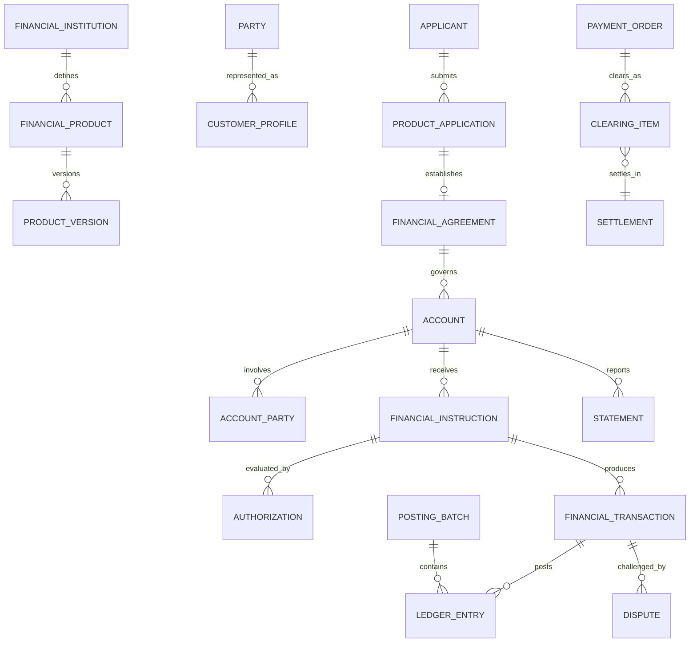

# Financial Services Model Pattern

## Intent

Model banks, credit unions, payment institutions, lenders, investment firms, and financial intermediaries that offer financial products; onboard and identify customers; establish agreements and accounts; accept instructions; authorize, post, clear, and settle transactions; manage balances, fees, interest, limits, risk, disputes, and regulatory obligations.

This pattern specializes the Cross-Industry Party, Role, Product, Offering, Agreement, Account, Classification, Event, Status, Charge, Payment, Document, Work Effort, and Outcome concepts.

## Business overview

**Customer Need → Product/Offering → Application → Due Diligence → Agreement → Account → Instruction → Authorization → Transaction/Posting → Clearing/Settlement → Statement/Reconciliation**

A Financial Institution defines Financial Products and Offerings. A prospective Customer submits an Application and identity, ownership, tax, and risk information. Customer due diligence and product eligibility checks support an approval decision. An accepted application establishes a Financial Agreement and one or more Accounts with authorized Account Parties. Customers or connected systems submit Instructions for deposits, withdrawals, transfers, payments, trades, or credit usage. The institution authenticates the initiating Party, checks authority, limits, funds, sanctions, fraud, and product rules, then records Transactions and balanced Ledger Entries. Inter-institution activity may pass through clearing and settlement. Statements, reconciliations, disputes, holds, fees, interest, and regulatory reporting complete the operational lifecycle.

## Pattern variants

### Simple

Use for a focused account or payment prototype.

Core concepts: Customer; Financial Product; Application; Financial Agreement; Account; Account Party; Instruction; Financial Transaction; Ledger Entry; Balance; Payment.

### Standard

Use as the default for an operational financial-services application.

Adds: Financial Institution; Branch; Product Version; Offering; Customer Profile; Identity Evidence; Due Diligence Case; Beneficial Owner; Mandate; Account Relationship; Authorization; Hold; Posting Batch; Fee; Interest Accrual; Statement; Payment Order; Clearing Item; Settlement; Reconciliation; Dispute.

### Enterprise

Use for multiple legal entities, jurisdictions, currencies, channels, regulated books, correspondent relationships, lending, investments, or enterprise risk.

Adds: Legal Entity; Business Unit; Correspondent Institution; Product Catalog; Pricing Plan; Limit; Credit Facility; Collateral; Loan; Repayment Schedule; Financial Instrument; Position; Order; Trade; Portfolio; General Ledger Account; Journal; Sanctions Screening; Fraud Case; Regulatory Classification; Regulatory Report; Liquidity Position; Capital Measure.

## Financial-services roles

| Role | Meaning |
|---|---|
| Financial Institution | Regulated or authorized Party providing financial services. |
| Customer | Party receiving or applying for a financial service. |
| Applicant | Party submitting a product or account application. |
| Account Owner | Party holding legal or beneficial ownership of an Account. |
| Authorized Signer | Party permitted to issue defined Instructions on an Account. |
| Beneficial Owner | Natural person who ultimately owns or controls a Customer or assets. |
| Beneficiary | Party intended to receive money, assets, or contractual benefit. |
| Payer | Party whose funds or credit support a Payment. |
| Payee | Party designated to receive a Payment. |
| Borrower | Party obligated under a credit Agreement. |
| Guarantor | Party promising performance of another Party's obligation. |
| Advisor | Party or role providing regulated financial guidance. |
| Custodian | Party safeguarding financial assets. |
| Correspondent Institution | Institution providing services to another institution. |
| Compliance Officer | Role reviewing due diligence, sanctions, monitoring, or reporting decisions. |

Rule: Party identity is independent of role. A Party may hold several roles, and every role is scoped and effective-dated by relationship, Account, Agreement, or Transaction.

## Institution, product, and offering concepts

### Financial Institution

A legal Party authorized to provide one or more financial services.

Logical attributes: Institution Identifier; Legal Name; Institution Type; Regulatory Status; Jurisdiction; License Reference; Effective From; Effective Through.

### Institution Unit

A branch, business unit, booking entity, service center, or operating location.

Logical attributes: Unit Identifier; Unit Name; Unit Type; Parent Unit; Location; Status; Effective From; Effective Through.

### Financial Product

A governed definition of a deposit, payment, credit, investment, custody, foreign-exchange, or other financial service.

Logical attributes: Product Identifier; Product Name; Product Type; Product Status; Currency Policy; Customer Segment; Jurisdiction; Effective From; Effective Through.

### Product Version

A versioned set of eligibility, terms, rates, fees, limits, disclosures, accounting rules, and servicing behavior.

Logical attributes: Product Version Identifier; Version; Status; Effective From; Effective Through; Approval Reference; Superseded By.

### Financial Offering

A Product Version made available through a channel, market, region, or customer segment under stated commercial conditions.

Logical attributes: Offering Identifier; Offering Name; Offering Status; Channel; Market; Customer Segment; Available From; Available Through.

### Pricing Plan

A governed definition of rates, fees, waivers, tiers, and calculation methods.

Logical attributes: Pricing Plan Identifier; Plan Name; Version; Currency; Status; Effective From; Effective Through; Calculation Rule Reference.

## Customer onboarding and due diligence

### Customer Profile

The institution's governed view of a Party as a Customer.

Logical attributes: Customer Identifier; Customer Type; Customer Status; Risk Rating; Service Segment; Onboarded Date; Review Due Date; Responsible Unit.

### Product Application

A request to establish or change a Financial Agreement or Account.

Logical attributes: Application Identifier; Application Number; Application Type; Application Status; Submitted Date; Requested Product Version; Applicant; Channel; Decision Date.

### Identity Evidence

A sourced document, assertion, or verification result used to establish identity or authority.

Logical attributes: Evidence Identifier; Evidence Type; Issuer; Reference; Issued Date; Expiration Date; Verification Status; Verified Date; Source; Integrity Hash.

### Due Diligence Case

A managed evaluation of identity, ownership, purpose, eligibility, sanctions, adverse information, and financial-crime risk.

Logical attributes: Case Identifier; Case Type; Case Status; Opened Date; Risk Rating; Assigned Role; Review Due Date; Decision; Decision Date.

### Beneficial Ownership

An effective-dated relationship identifying natural persons who ultimately own or control a legal entity, arrangement, Account, or assets.

Logical attributes: Ownership Identifier; Ownership Type; Ownership Percentage; Control Basis; Effective From; Effective Through; Verification Status.

### Screening Result

A possible or confirmed match produced by sanctions, politically exposed person, adverse-media, or other screening.

Logical attributes: Screening Result Identifier; Screening Type; Result Status; Screened Date; Source List; Match Score; Disposition; Disposition Reason.

Rule: identity evidence and screening results are sourced assertions. Preserve source, time, method, reviewer, disposition, and supporting evidence.

## Agreement and account concepts

### Financial Agreement

A contract governing a financial relationship, product, facility, or service.

Logical attributes: Agreement Identifier; Agreement Number; Agreement Type; Agreement Status; Effective Date; Expiration Date; Governing Law; Product Version; Institution.

### Account

An operational record used to hold, track, service, or report financial value or obligations under an Agreement.

Logical attributes: Account Identifier; Account Number; Account Type; Account Status; Currency; Opened Date; Closed Date; Product Version; Servicing Unit.

### Account Party

A Party participating in an Account in a stated role.

Logical attributes: Account Party Identifier; Role Type; Role Status; Ownership Percentage; Authority Level; Effective From; Effective Through.

### Account Relationship

A relationship among Accounts, such as parent/subaccount, sweep, settlement, offset, linked funding, or servicing relationship.

Logical attributes: Relationship Identifier; Relationship Type; Status; Effective From; Effective Through; Priority; Terms Reference.

### Mandate

An authorization from a Party defining who may initiate or approve which actions and under what conditions.

Logical attributes: Mandate Identifier; Mandate Type; Mandate Status; Granted By; Effective From; Effective Through; Action Scope; Amount Limit; Approval Rule.

### Limit

A governed restriction or capacity for an Account, Customer, Product, channel, transaction type, or risk exposure.

Logical attributes: Limit Identifier; Limit Type; Limit Amount; Currency; Period; Used Amount; Available Amount; Status; Effective From; Effective Through.

### Hold

A temporary reservation or restriction on funds, assets, or Account activity.

Logical attributes: Hold Identifier; Hold Type; Hold Status; Amount; Currency; Placed Date; Expiration Date; Reason; Source Instruction; Released Date.

### Balance

A measured amount for an Account, ledger dimension, position, or obligation at a point in time.

Logical attributes: Balance Identifier; Balance Type; Amount; Currency; As Of Time; Value Date; Source; Calculation Reference.

Balance types may include ledger, available, collected, pending, reserved, principal, accrued interest, and credit available.

Rule: Account is not the accounting ledger. An Account is a customer or operational arrangement; Ledger Accounts and Ledger Entries provide the controlled accounting representation.

## Instruction, transaction, and ledger concepts

### Financial Instruction

A request or command to perform a financial action.

Logical attributes: Instruction Identifier; Instruction Type; Instruction Status; Received Time; Requested Execution Time; Initiating Party; Channel; Account; Amount; Currency; Reference.

### Authorization

An evidence-based decision permitting or declining an Instruction or Transaction.

Logical attributes: Authorization Identifier; Authorization Type; Authorization Status; Requested Time; Decision Time; Decision Reason; Authorized Amount; Currency; Actor or System; Rule Evidence.

### Financial Transaction

A business occurrence that changes or confirms financial value, rights, obligations, or position.

Logical attributes: Transaction Identifier; Transaction Type; Transaction Status; Transaction Time; Value Date; Booking Date; Amount; Currency; Account; Counterparty; External Reference.

### Transaction Relationship

A typed link among Transactions, such as reversal, correction, refund, return, fee, interest, original transaction, or settlement.

Logical attributes: Relationship Identifier; Relationship Type; Source Transaction; Related Transaction; Amount; Effective Date; Reason.

### Ledger Account

A controlled accounting classification to which entries are posted.

Logical attributes: Ledger Account Identifier; Ledger Account Code; Ledger Account Name; Ledger Account Type; Currency Policy; Institution Unit; Status.

### Ledger Entry

One debit or credit component of a balanced financial posting.

Logical attributes: Ledger Entry Identifier; Posting Date; Value Date; Debit/Credit Indicator; Amount; Currency; Ledger Account; Transaction; Accounting Dimension; Posting Status.

### Posting Batch

A controlled group of Ledger Entries submitted and posted together.

Logical attributes: Posting Batch Identifier; Batch Type; Batch Status; Created Time; Posted Time; Entry Count; Debit Total; Credit Total; Currency or Currency Set.

### Fee

A charge assessed for a product, service, event, or exception.

Logical attributes: Fee Identifier; Fee Type; Fee Status; Assessment Date; Amount; Currency; Pricing Plan; Waiver Reason; Source Transaction.

### Interest Accrual

Interest earned or charged over a defined period before or at posting.

Logical attributes: Accrual Identifier; Accrual Type; Start Date; End Date; Rate; Basis; Principal Amount; Accrued Amount; Currency; Posting Status.

Rule: an Instruction expresses intent, an Authorization records a permission decision, a Transaction records the business occurrence, and Ledger Entries record its accounting effect. They are related but not interchangeable.

## Payment, clearing, and settlement

### Payment Order

An Instruction to transfer money from a Payer to a Payee.

Logical attributes: Payment Order Identifier; Payment Type; Payment Status; Initiated Time; Requested Execution Date; Payer; Payee; Amount; Currency; Purpose; End-to-End Reference.

### Payment Party

A Party participating in a Payment Order in a specified role.

Logical attributes: Payment Party Identifier; Role Type; Party; Account Reference; Institution Reference; Name and Address Snapshot; Effective Time.

### Clearing Item

A claim, message, or item exchanged through a payment, cheque, card, securities, or other clearing arrangement.

Logical attributes: Clearing Item Identifier; Clearing Scheme; Item Type; Item Status; Submitted Time; Clearing Date; Amount; Currency; Network Reference.

### Settlement

The discharge of financial obligations between participating Parties or institutions.

Logical attributes: Settlement Identifier; Settlement Type; Settlement Status; Settlement Date; Amount; Currency; Settlement Account; Scheme; Finality Time.

### Reconciliation

A comparison of internal and external records to identify matches, breaks, and required corrections.

Logical attributes: Reconciliation Identifier; Reconciliation Type; Period; Status; Source A; Source B; Matched Count; Exception Count; Completed Time.

### Reconciliation Exception

An unmatched, inconsistent, duplicated, or out-of-balance item requiring resolution.

Logical attributes: Exception Identifier; Exception Type; Exception Status; Detected Time; Amount Difference; Currency; Assigned Role; Resolution; Resolved Time.

## Credit and lending extensions

### Credit Facility

An Agreement defining credit capacity and borrowing terms.

Logical attributes: Facility Identifier; Facility Type; Facility Status; Approved Limit; Available Amount; Currency; Start Date; Maturity Date; Borrower.

### Loan

A funded credit obligation governed by a Financial Agreement or Credit Facility.

Logical attributes: Loan Identifier; Loan Type; Loan Status; Original Principal; Outstanding Principal; Currency; Disbursement Date; Maturity Date; Interest Method.

### Repayment Schedule

A versioned plan of expected principal, interest, fee, and escrow obligations.

Logical attributes: Schedule Identifier; Version; Effective Date; Payment Frequency; Installment Count; Status; Calculation Reference.

### Scheduled Payment

One expected obligation within a Repayment Schedule.

Logical attributes: Scheduled Payment Identifier; Due Date; Principal Due; Interest Due; Fee Due; Total Due; Currency; Payment Status.

### Collateral

An asset or right supporting an obligation.

Logical attributes: Collateral Identifier; Collateral Type; Description; Owner; Valuation; Valuation Date; Currency; Lien Priority; Status.

## Investment and custody extensions

### Financial Instrument

A governed definition or issued instance of a security, fund, derivative, currency, or other tradable financial asset.

Logical attributes: Instrument Identifier; Instrument Type; Instrument Name; Issuer; Currency; Market Identifier; Issue Date; Maturity Date; Status.

### Order

An Instruction to buy, sell, subscribe, redeem, or otherwise transact in a Financial Instrument.

Logical attributes: Order Identifier; Order Type; Order Status; Entered Time; Account; Instrument; Side; Quantity; Limit Price; Time in Force.

### Trade

An executed agreement to exchange a Financial Instrument, money, or risk.

Logical attributes: Trade Identifier; Trade Type; Trade Status; Trade Date; Settlement Date; Instrument; Quantity; Price; Gross Amount; Currency; Counterparty.

### Position

The quantity, cost, value, and exposure for an Instrument in an Account or Portfolio.

Logical attributes: Position Identifier; Position Date; Account or Portfolio; Instrument; Quantity; Cost Basis; Market Value; Currency; Source.

## Statements, servicing, and disputes

### Statement

A governed presentation of Account activity, balances, fees, interest, and required disclosures for a period.

Logical attributes: Statement Identifier; Statement Type; Period Start; Period End; Generated Date; Account; Opening Balance; Closing Balance; Currency; Delivery Status.

### Service Request

A Customer request concerning an Account, Transaction, access, document, limit, or profile.

Logical attributes: Service Request Identifier; Request Type; Request Status; Received Date; Customer; Account; Priority; Assigned Role; Resolution Date.

### Dispute

A formal challenge to a Transaction, fee, balance, service, or decision.

Logical attributes: Dispute Identifier; Dispute Type; Dispute Status; Opened Date; Customer; Account; Transaction; Disputed Amount; Currency; Reason; Resolution.

### Adjustment

An authorized correction or compensating Transaction that preserves the original record.

Logical attributes: Adjustment Identifier; Adjustment Type; Status; Requested Date; Approved Date; Amount; Currency; Reason; Original Transaction; Resulting Transaction.

## Relationship model

| Source | Relationship | Target | Cardinality |
|---|---|---|---|
| Financial Institution | defines | Financial Product | 1:M |
| Financial Product | has | Product Version | 1:M |
| Financial Offering | makes available | Product Version | M:1 |
| Party | has | Customer Profile | 1:M by institution |
| Applicant | submits | Product Application | 1:M |
| Due Diligence Case | evaluates | Customer, Application, or relationship | M:1 |
| Customer | has | Beneficial Ownership | 1:M |
| Accepted Application | establishes | Financial Agreement | 1:0..M |
| Financial Agreement | governs | Account | 1:M |
| Account | has | Account Party | 1:M |
| Account | relates to | Account | M:M through Account Relationship |
| Party | grants | Mandate | 1:M |
| Mandate | authorizes | Party on Account | M:M |
| Account | has | Balance, Limit, and Hold | 1:M each |
| Account or Party | submits | Financial Instruction | 1:M |
| Instruction | receives | Authorization | 1:M |
| Instruction | produces | Financial Transaction | 1:0..M |
| Financial Transaction | produces | Ledger Entry | 1:M |
| Posting Batch | contains | Ledger Entry | 1:M |
| Financial Transaction | relates to | Financial Transaction | M:M |
| Payment Order | has | Payment Party | 1:M |
| Payment Order | produces | Financial Transaction | 1:M |
| Payment Order | exchanges through | Clearing Item | 1:M |
| Clearing Item | resolves through | Settlement | M:1 |
| Reconciliation | compares | Transactions, entries, or external items | 1:M |
| Reconciliation | identifies | Reconciliation Exception | 1:M |
| Credit Facility | governs | Loan | 1:M |
| Loan | has | Repayment Schedule | 1:M versions |
| Repayment Schedule | contains | Scheduled Payment | 1:M |
| Credit obligation | is supported by | Collateral | M:M |
| Order | executes as | Trade | 1:0..M |
| Trade | changes | Position | M:M |
| Account | produces | Statement | 1:M |
| Transaction | may be challenged by | Dispute | 1:M |
| Dispute | may produce | Adjustment | 1:M |

## Lifecycle models

### Product application

Draft → Submitted → Due Diligence → Decision Made → Agreement Established

Exception outcomes: More Information Required; Referred; Declined; Withdrawn; Expired.

### Customer relationship

Prospect → Pending Verification → Active → Restricted → Dormant → Closed

Exception outcomes: Review Required; Exit Pending; Prohibited.

### Financial agreement

Proposed → Approved → Effective → Suspended → Matured/Terminated

Possible return: Suspended → Effective.

### Account

Pending → Open → Active → Restricted/Frozen → Dormant → Closed

Exception outcomes: Blocked; Escheatment Pending; Written Off.

### Financial instruction

Received → Validating → Authorized → Processing → Completed

Exception outcomes: Pending Approval; Declined; Cancelled; Expired; Failed; Returned.

### Financial transaction

Pending → Authorized → Booked → Posted → Cleared → Settled → Final

Correction outcomes: Reversed; Returned; Adjusted; Disputed.

### Payment order

Initiated → Accepted → Authorized → Submitted → Cleared → Settled → Completed

Exception outcomes: Rejected; Cancelled; Failed; Returned; Recalled.

### Dispute

Opened → Acknowledged → Investigating → Decision Made → Adjustment/Recovery → Closed

Exception outcomes: Withdrawn; Escalated; Reopened.

## Business events

- Customer Application Submitted, Approved, Referred, Declined, or Withdrawn
- Identity Evidence Received or Verified
- Due Diligence Review Opened, Completed, or Escalated
- Screening Match Detected or Disposed
- Financial Agreement Established, Amended, Suspended, or Terminated
- Account Opened, Activated, Restricted, Frozen, Dormant, or Closed
- Account Party or Mandate Added, Changed, or Revoked
- Limit Established, Changed, Breached, or Released
- Hold Placed, Adjusted, Expired, Captured, or Released
- Instruction Received, Authorized, Declined, Cancelled, or Completed
- Transaction Booked, Posted, Reversed, Returned, Adjusted, or Settled
- Fee Assessed, Waived, Refunded, or Written Off
- Interest Accrued, Capitalized, Paid, or Corrected
- Payment Submitted, Cleared, Settled, Returned, Recalled, or Rejected
- Reconciliation Exception Detected or Resolved
- Statement Generated or Delivered
- Dispute Opened, Decided, Adjusted, or Closed
- Suspicious Activity Alert or Fraud Case Opened, Escalated, or Closed
- Regulatory Report Submitted or Corrected

## Baseline business and integrity rules

1. A Financial Agreement must identify the institution, Customer or obligated Parties, Product Version, governing terms, currency policy, and effective date before activation.
2. Product, pricing, disclosure, eligibility, and accounting-rule versions must be effective for the jurisdiction and transaction date.
3. Customer onboarding decisions preserve identity evidence, beneficial ownership, screening, risk assessment, reviewer, authority, rationale, and time.
4. Every Account Party role, ownership interest, signing authority, and Mandate is scoped and effective-dated.
5. Account status controls permitted operations; restrictions and freezes must identify source, reason, authority, scope, and duration.
6. An Instruction must preserve initiator, channel, received time, source reference, requested action, and authenticated authority.
7. Authorization must check the applicable mandate, Account status, limits, available funds or credit, product rules, and required risk controls.
8. Financial Transactions are immutable business records; corrections use linked reversals, returns, or adjustments.
9. Every posted Transaction must produce Ledger Entries whose debits and credits balance within the defined currency and accounting rules.
10. Booking date, value date, transaction time, posting time, clearing date, and settlement date are distinct where the business requires them.
11. Balance types must declare their calculation basis and must reconcile to authoritative Transactions and Ledger Entries.
12. Holds affect availability but do not themselves represent final settlement or accounting unless explicitly captured and posted.
13. Payment status, Transaction status, clearing status, and settlement status are independent and cannot be collapsed into one field.
14. Fees and interest retain their pricing plan, rate, basis, period, rounding method, waivers, and source obligation.
15. Duplicate Instructions, Transactions, clearing items, and settlement messages must be detected using stable idempotency and external references.
16. Sensitive data access is governed by role, purpose, jurisdiction, consent or authority, and minimum-necessary scope.
17. Disputes preserve the original Transaction, evidence, provisional actions, decision, rationale, deadlines, and resulting adjustments.
18. Operational Transactions, subledgers, settlement records, and general-ledger postings must reconcile, with exceptions assigned and resolved audibly.
19. Screening or monitoring alerts are not findings; disposition requires evidence, authorized review, and recorded rationale.
20. Finalized evidence, decisions, statements, postings, and reports are corrected by supersession or compensating records, not destructive overwrite.

## AI modeling questions

1. Which financial-services sectors are in scope: deposits, payments, cards, lending, investments, custody, foreign exchange, insurance-linked services, or another sector?
2. Is the organization a bank, credit union, payment institution, lender, broker-dealer, asset manager, custodian, fintech, or service provider?
3. Which legal entities, booking units, jurisdictions, currencies, languages, and regulatory regimes apply?
4. Which Party roles, legal ownership types, beneficial ownership thresholds, and authority models are required?
5. What customer due-diligence, identity, tax, sanctions, and periodic-review evidence must be retained?
6. Are Product, Product Version, Offering, Pricing Plan, Agreement, and Account independently governed?
7. Which Account types, balance types, Account relationships, limits, holds, mandates, and restrictions are required?
8. Which channels and actors may submit Instructions, and what authentication, approval, and signing rules apply?
9. Which transaction types are supported, and how are authorization, booking, posting, clearing, settlement, reversal, and return separated?
10. Is double-entry accounting required at the operational, subledger, or general-ledger level?
11. Which payment schemes, clearing networks, correspondent institutions, message standards, and settlement arrangements are used?
12. How are fees, interest, exchange rates, commissions, taxes, and rounding calculated and evidenced?
13. Which lending concepts are needed: facilities, loans, schedules, collateral, delinquency, impairment, or collections?
14. Which investment concepts are needed: instruments, orders, trades, positions, portfolios, custody, and corporate actions?
15. How are statements, notices, service requests, complaints, disputes, and adjustments handled?
16. Which fraud, transaction-monitoring, sanctions, liquidity, credit, market, and operational-risk controls are required?
17. Which reconciliations, regulatory reports, audit evidence, retention periods, and data-lineage requirements apply?
18. Which decisions may be automated, and which require human review or authority limits?

## MDE modeling guidance

- Reuse Cross-Industry Party and Party Role; do not create separate identities for Customer, Applicant, Owner, Signer, Beneficiary, Payer, Payee, Borrower, and Advisor.
- Keep Financial Product, Product Version, Offering, Application, Agreement, and Account distinct.
- Keep Account, Ledger Account, Balance, Financial Transaction, and Ledger Entry distinct.
- Keep Instruction, Authorization, Transaction, Posting, Clearing, and Settlement as separate concepts and lifecycles.
- Treat all contractual, authority, pricing, and ownership relationships as versioned and effective-dated.
- Put eligibility, authority, limit, balance, posting, pricing, and risk rules on the entity operations they govern.
- Use cases orchestrate actor goals and branching but invoke authoritative entity operations for business decisions.
- Model external messages, evidence, prices, rates, and screening results as sourced assertions with provenance.
- Add sector specializations only when attributes, behavior, relationships, accounting, or regulation materially differ.
- Treat statements, regulatory reports, risk measures, and analytics as derived views with lineage to operational records.

## Anti-patterns

### Customer Equals Person

Customers may be people, organizations, households, trusts, or other legal arrangements. Party identity and Customer role must remain separate.

### Product Equals Account

A Product defines reusable terms and behavior; an Account is one serviced instance governed by a particular Agreement and Product Version.

### Account Equals Ledger

The customer Account and the accounting Ledger Account serve different purposes and may map many-to-many through posting rules.

### Transaction as a Mutable Balance Change

A Transaction is durable evidence of a business occurrence. Corrections require reversals, returns, or adjustments rather than overwriting history.

### One Status for the Entire Payment

Instruction, authorization, transaction, clearing, settlement, reconciliation, and dispute each require independent states.

### Available Balance Equals Ledger Balance

Availability may include holds, pending items, value dates, limits, uncollected funds, and credit. Balance type and calculation basis must be explicit.

### Payment Equals Settlement

A Payment expresses a transfer obligation and process; Settlement discharges obligations between participants and may occur later or in aggregate.

### User Equals Account Signer

Authenticated identity is not customer identity, Account role, Mandate, transaction authority, employment role, or approval limit.

### Compliance Alert Equals Violation

A screening or monitoring alert is a signal requiring review. It is not itself a confirmed match, offense, or reportable conclusion.

### Business Rules Hidden in Channel Code

Channel-specific code must not become the untraceable authority for eligibility, limits, pricing, posting, or compliance decisions.

## Physical mapping examples

| Logical name | Example physical name |
|---|---|
| Product Version | `product_version` |
| Customer Profile | `customer_profile` |
| Due Diligence Case | `due_diligence_case` |
| Beneficial Ownership | `beneficial_ownership` |
| Financial Agreement | `financial_agreement` |
| Account Party | `account_party` |
| Financial Instruction | `financial_instruction` |
| Financial Transaction | `financial_transaction` |
| Transaction Relationship | `transaction_relationship` |
| Ledger Account | `ledger_account` |
| Ledger Entry | `ledger_entry` |
| Payment Order | `payment_order` |
| Reconciliation Exception | `reconciliation_exception` |

Logical names remain authoritative. Technology-stack, jurisdiction, accounting, and sector rules generate physical names only after the logical model is accepted.

## Future behavioral expansion

This file is an actual logical industry pattern. A metamodel-conformant Financial Services knowledge base should create separate capabilities, entities, roles, rules, use cases, and workflows for Product Management, Customer Onboarding, Account Administration, Transaction Processing, Payments, Ledger and Posting, Statements and Servicing, Reconciliation, Disputes, Lending, Investments, Risk, and Compliance. Candidate actor-goal use cases include Configure Product Version, Onboard Customer, Verify Beneficial Ownership, Open Account, Manage Account Authority, Submit Instruction, Authorize Transaction, Place or Release Hold, Post Transaction, Initiate Payment, Clear and Settle Payment, Reconcile Activity, Generate Statement, Open Dispute, Reverse or Adjust Transaction, Establish Credit Facility, Disburse Loan, Execute Trade, and Complete Regulatory Review.
