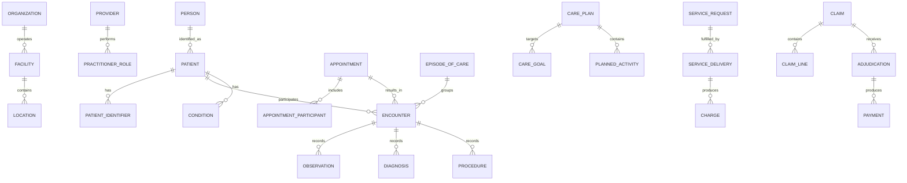

# Health Care Model Pattern

## Intent

Model organizations that register patients, coordinate providers and facilities, schedule and deliver care, record encounters and clinical evidence, manage care plans and cases, obtain consent and authorization, and support claims and payment.

This is a logical business pattern, not a clinical terminology, interoperability, privacy, or regulatory standard. Implementations should map relevant concepts to applicable standards and jurisdictional requirements.

## Business overview

**Patient Need → Access/Appointment → Encounter → Assessment → Order/Plan → Service Delivery → Outcome → Claim/Payment**

A Patient receives care from one or more Providers at a Facility or through a virtual Channel. An Appointment may schedule an Encounter. During the Encounter, Providers record observations, conditions, diagnoses, procedures, orders, and a plan of care. Services may be authorized, delivered, and evaluated over an Episode or Case. Consent, privacy, provenance, and access controls govern sensitive information. Charges may be assembled into Claims submitted to a Payer and resolved through adjudication and payment.

## Pattern variants

### Simple

Use for a focused clinic or prototype.

Core concepts: Patient; Provider; Facility; Appointment; Encounter; Clinical Note; Service; Invoice; Payment.

### Standard

Use as the default for operational health-care applications.

Adds: Patient Identifier; Related Person; Practitioner Role; Organization; Location; Schedule; Episode of Care; Medical Case; Care Team; Condition; Diagnosis; Observation; Procedure; Service Request; Medication Order; Care Plan; Consent; Coverage; Authorization; Charge; Claim; Claim Line; Adjudication; Document; Audit Event.

### Enterprise

Use for integrated delivery networks, hospitals, insurers, public health, research, multi-jurisdiction operations, or longitudinal records.

Adds: Organization Network; Department; Bed and Capacity Management; Referral; Transfer; Clinical Pathway; Cohort; Registry; Terminology Mapping; Master Patient Index; Provider Directory; Contract; Fee Schedule; Risk Assessment; Utilization Management; Quality Measure; Population Measure; Research Consent; Data Sharing Agreement.

## Actors and roles

| Role | Meaning |
|---|---|
| Patient | Person who is the subject and recipient of care. |
| Related Person | Parent, guardian, caregiver, family member, or representative connected to a Patient. |
| Practitioner | Person qualified or assigned to participate in care. |
| Practitioner Role | Capacity in which a Practitioner acts for an Organization or Facility. |
| Care Coordinator | Party Role coordinating services across an Episode or Case. |
| Referring Provider | Provider requesting evaluation or care from another Provider. |
| Payer | Party responsible for adjudicating or funding covered services. |
| Guarantor | Party financially responsible for charges not paid by a Payer. |

Rule: Patient is a Party Role, not a duplicate of Person. Practitioner identity, employment, credentials, and application-user identity remain separate concerns.

## Identity and demographic concepts

### Patient

A Person acting as the subject or recipient of health care.

Logical attributes: Patient Identifier; Patient Status; Date of Birth; Administrative Sex; Preferred Name; Preferred Language; Deceased Indicator; Deceased Date; Primary Contact reference.

### Patient Identifier

An identifier assigned to a Patient by an organization, jurisdiction, payer, or external system.

Logical attributes: Identifier Record Identifier; Identifier Type; Identifier Value; Assigning Authority; Status; Effective From; Effective Through.

Rule: support multiple identifiers and never assume that one organization's medical-record number is universal identity.

### Related Person

A Person related to a Patient for care, consent, contact, or financial purposes.

Logical attributes: Related Person Identifier; Relationship Type; Relationship Status; Effective From; Effective Through; Contact Priority.

### Patient Contact

A purpose-specific contact mechanism or address for a Patient.

Logical attributes: Patient Contact Identifier; Purpose; Preferred Indicator; Confidential Indicator; Effective From; Effective Through.

## organization, provider, facility, and location

### Health Care Organization

An organization responsible for arranging, governing, funding, or delivering health-care services.

Logical attributes: Organization Identifier; Organization Name; Organization Type; Organization Status; Accreditation reference; Effective From; Effective Through.

### Provider

A Party authorized or assigned to deliver, order, supervise, interpret, or coordinate care.

Logical attributes: Provider Identifier; Provider Type; Provider Status; Primary Specialty; License reference; Effective From; Effective Through.

### Practitioner Role

A Provider's role within an Organization, Facility, specialty, or service context.

Logical attributes: Practitioner Role Identifier; Role Type; Specialty; Role Status; Effective From; Effective Through; Supervising Provider reference.

### Facility

A physical or virtual environment operated for care delivery.

Logical attributes: Facility Identifier; Facility Name; Facility Type; Facility Status; Operator Organization reference; Contact reference.

### Location

A place within or associated with a Facility, such as campus, building, ward, room, bed, clinic, mobile unit, or virtual endpoint.

Logical attributes: Location Identifier; Location Name; Location Type; Location Status; Parent Location reference; Capacity; Operational Status.

## Access and scheduling concepts

### Schedule

Planned availability of a Provider, service, resource, or Location.

Logical attributes: Schedule Identifier; Schedule Type; Effective From; Effective Through; Time Zone; Capacity; Schedule Status.

### Appointment

A planned allocation of time and resources for a Patient to receive or discuss care.

Logical attributes: Appointment Identifier; Appointment Type; Appointment Status; Scheduled Start; Scheduled End; Priority; Reason; Channel; Cancellation Reason.

### Appointment Participant

A Patient, Provider, Related Person, Location, device, interpreter, or other resource expected to participate.

Logical attributes: Participant Identifier; Participant Type; Participation Status; Required Indicator; Response Date.

### Referral

A Provider's request that another Provider or Organization evaluate, advise, or deliver care.

Logical attributes: Referral Identifier; Referral Type; Referral Status; Requested Date; Priority; Reason; Referred From; Referred To; Expiration Date.

## Care context

### Encounter

A bounded interaction in which care is assessed, discussed, delivered, or documented.

Logical attributes: Encounter Identifier; Encounter Type; Encounter Status; Start Date/Time; End Date/Time; Service Setting; Priority; Reason; Disposition.

Examples: office visit, emergency visit, inpatient stay, telehealth visit, home visit, or asynchronous consultation.

### Episode of Care

A period during which related care is coordinated toward a health concern or objective.

Logical attributes: Episode Identifier; Episode Type; Episode Status; Start Date; End Date; Managing Organization; Primary Coordinator.

### Medical Case

A managed body of work concerning a Patient's condition, event, investigation, authorization, or service need.

Logical attributes: Case Identifier; Case Type; Case Status; Opened Date; Closed Date; Priority; Case Reason; Outcome.

### Care Team

A group of participants responsible for an Episode, Case, Encounter, or Care Plan.

Logical attributes: Care Team Identifier; Care Team Name; Care Team Status; Effective From; Effective Through.

### Care Team Member

A Party Role's participation in a Care Team.

Logical attributes: Membership Identifier; Team Role; Membership Status; Effective From; Effective Through; Responsibility.

## Clinical evidence and assessment

### Clinical Note

A versioned clinical narrative authored in a declared context.

Logical attributes: Note Identifier; Note Type; Note Status; Authored At; Author; Encounter reference; Version; Supersedes Note reference.

### Observation

A measured, asserted, or observed fact about a Patient or specimen.

Logical attributes: Observation Identifier; Observation Code; Observation Status; Observed Date/Time; Value; Unit; Interpretation; Method; Body Site; Reference Range; Performer; Source.

### Condition

A health concern, problem, disease, symptom, or other condition associated with a Patient.

Logical attributes: Condition Identifier; Condition Code; Clinical Status; Verification Status; Onset Date; Abatement Date; Severity; Body Site; Recorded Date.

### Diagnosis

A Provider's diagnostic assertion made in a particular Encounter, Episode, or Case.

Logical attributes: Diagnosis Identifier; Diagnosis Code; Diagnosis Type; Diagnosis Status; Rank; Diagnosed Date; Diagnosing Provider; Evidence reference.

Rule: keep longitudinal Condition separate from an Encounter-specific Diagnosis when both meanings are required.

### Procedure

A clinical intervention or diagnostic action performed for a Patient.

Logical attributes: Procedure Identifier; Procedure Code; Procedure Status; Performed Start; Performed End; Performer; Location; Outcome; Complication; Body Site.

### Specimen

Material collected for examination or testing.

Logical attributes: Specimen Identifier; Specimen Type; Specimen Status; Collected At; Collected By; Body Site; Received At; Container reference.

## Requests, orders, and care planning

### Service Request

A request or order for evaluation, procedure, diagnostic test, therapy, referral, consultation, device, or other service.

Logical attributes: Service Request Identifier; Request Type; Service Code; Request Status; Intent; Priority; Authored Date; Requester; Requested Performer; Occurrence Window; Reason.

### Medication Order

An instruction or authorization to supply or administer medication.

Logical attributes: Medication Order Identifier; Medication Code; Order Status; Intent; Dose; Route; Frequency; Duration; Quantity; Repeats; Authored Date; Prescriber.

### Care Plan

An organized set of goals and planned activities for a Patient.

Logical attributes: Care Plan Identifier; Care Plan Type; Care Plan Status; Start Date; End Date; Author; Description.

### Care Goal

A desired measurable health or care outcome.

Logical attributes: Goal Identifier; Goal Description; Goal Status; Priority; Target Measure; Target Value; Target Date; Outcome reference.

### Planned Activity

A proposed service, observation, education, intervention, or coordination activity in a Care Plan.

Logical attributes: Activity Identifier; Activity Type; Activity Status; Scheduled Timing; Performer Role; Instructions.

## Service delivery

### Health Care Service

A defined clinical, diagnostic, administrative, or supportive service.

Logical attributes: Service Identifier; Service Code; Service Name; Service Type; Service Status; Standard Duration; Delivering Specialty.

### Service Delivery

Evidence that a requested or planned Health Care Service was performed or supplied.

Logical attributes: Delivery Identifier; Delivery Status; Delivered Start; Delivered End; Quantity; Unit; Delivering Provider; Location; Result reference.

### Authorization

A decision permitting specified care or financial coverage under stated conditions.

Logical attributes: Authorization Identifier; Authorization Number; Authorization Type; Authorization Status; Requested Date; Decision Date; Effective From; Effective Through; Authorized Quantity; Conditions.

Rule: clinical orders, patient consent, organizational approval, and payer authorization are distinct concepts.

## Consent, privacy, and provenance

### Consent

A Patient's or authorized representative's permission, refusal, or directive concerning care, disclosure, research, or another specified activity.

Logical attributes: Consent Identifier; Consent Type; Consent Status; Decision; Given By; Recorded By; Effective From; Effective Through; Scope; Revocation Date.

### Access Restriction

A rule or directive restricting access, use, or disclosure of specified information.

Logical attributes: Restriction Identifier; Restriction Type; Restriction Status; Scope; Reason; Effective From; Effective Through.

### Provenance

Evidence of who created, asserted, transformed, imported, or attested to a record.

Logical attributes: Provenance Identifier; Recorded At; Activity Type; Agent; Source System; Source Record Identifier; Signature reference.

### Audit Event

Evidence of access to or action upon protected health information or system functionality.

Logical attributes: Audit Event Identifier; Event Type; Occurred At; Actor; Action; Subject; Purpose; Outcome; Source; Correlation Reference.

## Coverage, claim, and payment

### Coverage

A Patient's entitlement to funded or insured services.

Logical attributes: Coverage Identifier; Coverage Type; Coverage Status; Subscriber Identifier; Member Identifier; Effective From; Effective Through; Payer; Plan reference.

### Guarantor

A Party accepting financial responsibility for some or all Patient charges.

Logical attributes: Guarantor Identifier; Relationship to Patient; Responsibility Status; Effective From; Effective Through.

### Charge

A billable amount arising from a delivered service, supply, facility use, or adjustment.

Logical attributes: Charge Identifier; Charge Code; Charge Type; Charge Status; Service Date; Quantity; Unit Price; Amount; Currency; Source reference.

### Claim

A request to a Payer for adjudication and payment of covered health-care charges.

Logical attributes: Claim Identifier; Claim Number; Claim Type; Claim Status; Submitted Date; Service Period Start; Service Period End; Total Claimed Amount; Patient; Provider; Payer.

### Claim Line

A detailed service or charge submitted within a Claim.

Logical attributes: Claim Line Identifier; Line Number; Service Code; Service Date; Quantity; Claimed Amount; Diagnosis reference; Authorization reference.

### Adjudication

A Payer decision concerning coverage and financial responsibility.

Logical attributes: Adjudication Identifier; Decision Date; Decision Status; Allowed Amount; Paid Amount; Patient Responsibility Amount; Denial Reason; Adjustment Reason.

### Payment

A transfer of funds settling an adjudicated Claim, Invoice, or Patient balance.

Logical attributes: Payment Identifier; Payment Date; Payment Amount; Currency; Payment Type; Payment Status; Remittance Reference.

## Relationship model

| Source | Relationship | Target | Cardinality |
|---|---|---|---|
| Person | performs role of | Patient | 1:M over time |
| Patient | has | Patient Identifier | 1:M |
| Patient | relates to | Related Person | M:M |
| Health Care Organization | operates | Facility | 1:M |
| Facility | contains | Location | 1:M recursive |
| Provider | performs | Practitioner Role | 1:M |
| Practitioner Role | acts for | Health Care Organization | M:1 |
| Schedule | allocates availability for | Provider, Service, or Location | M:1 |
| Appointment | includes | Appointment Participant | 1:M |
| Appointment | may result in | Encounter | 1:0..M |
| Patient | participates in | Encounter | 1:M |
| Provider | participates in | Encounter | M:M |
| Episode of Care | groups | Encounter | 1:M |
| Medical Case | concerns | Patient | M:1 |
| Care Team | supports | Episode, Case, or Care Plan | M:1 |
| Care Team | contains | Care Team Member | 1:M |
| Encounter | records | Observation, Diagnosis, Procedure, or Clinical Note | 1:M each |
| Patient | has | Condition | 1:M |
| Diagnosis | may assert | Condition | M:1 |
| Service Request | requests | Health Care Service | M:1 |
| Service Request | may produce | Service Delivery or Procedure | 1:M |
| Care Plan | contains | Care Goal and Planned Activity | 1:M each |
| Service Delivery | occurs within | Encounter, Episode, or Case | M:1 |
| Consent | given by | Patient or Related Person | M:1 |
| Coverage | covers | Patient | M:1 |
| Authorization | authorizes | Service Request or Service Delivery | M:M |
| Service Delivery | produces | Charge | 1:M |
| Claim | contains | Claim Line | 1:M |
| Claim Line | references | Charge or Service Delivery | M:1 |
| Claim | receives | Adjudication | 1:M |
| Adjudication | may produce | Payment | 1:M |
| Provenance | describes | Clinical or administrative record | M:1 |
| Audit Event | records access or action upon | Patient information | M:1 |

## Lifecycle models

### Appointment

Proposed → Booked → Arrived → In Progress → Fulfilled

Exception outcomes: Waitlisted; No Show; Cancelled; Rescheduled.

### Encounter

Planned → Arrived → In Progress → Completed

Exception outcomes: On Hold; Cancelled; Entered in Error.

### Service request

Draft → Active → Accepted → In Progress → Completed

Exception outcomes: On Hold; Revoked; Rejected; Cancelled; Entered in Error.

### Episode of care

Planned → Active → On Hold → Finished

Exception outcomes: Cancelled; Entered in Error.

### Claim

Draft → Submitted → Acknowledged → In Review → Adjudicated → Paid → Closed

Exception outcomes: Rejected; Denied; Partially Paid; Appealed; Voided.

### Consent

Proposed → Active → Inactive

Exception outcomes: Rejected; Revoked; Entered in Error.

## Business events

- Patient Registered or Identity Reconciled
- Appointment Requested, Booked, Rescheduled, or Cancelled
- Patient Arrived
- Encounter Started or Completed
- Condition Recorded
- Observation Recorded or Corrected
- Diagnosis Asserted
- Service or Medication Ordered
- Care Plan Activated
- Consent Granted, Refused, or Revoked
- Authorization Requested, Approved, or Denied
- Service Delivered
- Claim Submitted, Rejected, Adjudicated, or Appealed
- Payment Received
- Protected Record Accessed or Disclosed

## Baseline business and integrity rules

1. A clinical or administrative record must identify its Patient, author or source, time, status, and provenance as applicable.
2. Corrections to signed or finalized clinical records preserve prior versions and record the reason for change.
3. A Provider may act only within an active role, credential, organization, location, and permitted scope.
4. An Encounter cannot be completed before it starts.
5. A Service Delivery must trace to the Patient, performer, service, time, location or channel, and relevant request or plan.
6. Payer Authorization never substitutes for Patient Consent or a clinical order.
7. Consent and access restrictions must be evaluated for the requested purpose, data scope, actor, and time.
8. A Claim Line must trace to a delivered service or valid charge.
9. Paid, allowed, adjustment, and patient-responsibility amounts must reconcile under the applicable adjudication rules.
10. Patient identity merges and splits preserve identifier history and record lineage.
11. Sensitive data collection should be limited to a legitimate purpose and applicable policy.
12. Every access or disclosure requiring audit must create immutable evidence of actor, purpose, subject, action, time, and outcome.

## Interoperability and terminology guidance

- Keep the logical MDE model independent of transport formats.
- Map concepts to applicable interoperability resources only at an integration boundary.
- Store terminology system, code, display, version, and mapping provenance when coded clinical meaning matters.
- Do not silently translate between terminology systems without retaining the source concept and mapping evidence.
- Treat externally received records as assertions with source and provenance, not automatically as locally verified truth.
- Use jurisdiction-specific profiles for required identifiers, consent, privacy, claims, and reporting.

## AI modeling questions

1. Is the scope clinic, hospital, laboratory, pharmacy, home care, insurer, public health, research, or a combination?
2. Which jurisdictions, privacy obligations, professional regulations, and data residency rules apply?
3. Which Party roles exist for Patients, guardians, Providers, guarantors, and Payers?
4. How is Patient identity established, matched, merged, corrected, and audited?
5. Which care settings and Encounter types are supported?
6. Are Episodes, Cases, and Care Plans distinct in this organization?
7. Which services require clinical orders, consent, organizational approval, or payer authorization?
8. Which clinical observations, conditions, diagnoses, procedures, medications, and documents are in scope?
9. Which terminology systems and interoperability profiles are required?
10. What information may each actor access, for which purpose, and under which consent or policy?
11. Does billing use direct invoices, insurance Claims, public funding, capitation, bundled payment, or several methods?
12. Which quality, safety, operational, financial, and population outcomes must be measured?
13. What must be retained as immutable legal or clinical evidence?
14. Which external systems are authoritative for identity, scheduling, clinical data, pharmacy, laboratory, imaging, claims, or payment?

## MDE modeling guidance

- Begin with Party and Party Role; do not duplicate Person as Patient, Provider, User, and Guarantor.
- Keep Appointment, Encounter, Episode, Case, and Care Plan distinct because they answer different questions.
- Separate clinical fact, Provider assertion, longitudinal condition, and billing classification.
- Put clinical and administrative rules on the operations they govern; use cases orchestrate actions and outcomes.
- Treat provenance, consent, authorization, access control, and audit as first-class knowledge.
- Keep operational concepts canonical and integration representations mapped and versioned.
- Apply data minimization: include sensitive attributes only when the application's purpose requires them.

## Anti-patterns

### Patient Equals Person Equals User

Patient is a business role. Some Patients have no application account, and guardians, Providers, or proxy users may act in the system.

### Appointment Equals Encounter

An Appointment is a plan; an Encounter is actual care interaction. Either may exist without the other.

### One Giant Medical Record

Combining observations, diagnoses, notes, orders, procedures, and documents destroys their distinct provenance, lifecycle, authorship, and meaning.

### Authorization Equals Consent

Payer authorization, clinical authorization, organizational approval, and Patient consent answer different questions.

### Claim as the Clinical Truth

A Claim is a financial request and may simplify or classify clinical activity for payment. It is not the authoritative clinical record.

### Mutable Final Notes

Overwriting finalized clinical evidence removes history required for safety, trust, and audit.

## Physical mapping examples

| Logical name | Example physical name |
|---|---|
| Patient Identifier | `patient_identifier` |
| Practitioner Role | `practitioner_role` |
| Episode of Care | `episode_of_care` |
| Medical Case | `medical_case` |
| Care Team Member | `care_team_member` |
| Service Request | `service_request` |
| Service Delivery | `service_delivery` |
| Claim Line | `claim_line` |
| Access Restriction | `access_restriction` |
| Audit Event | `audit_event` |

Logical names remain authoritative. Stack and jurisdiction rules generate physical naming only after the logical model is accepted.

## Future behavioral expansion

This file is an actual logical industry pattern. A later behavioral layer should define capabilities and actor-goal use cases such as Register Patient, Schedule Appointment, Conduct Encounter, Record Observation, Establish Diagnosis, Order Service, Manage Care Plan, Capture Consent, Authorize Service, Deliver Service, Submit Claim, Adjudicate Claim, and Receive Payment, with pages, rules, scenarios, and tests.
