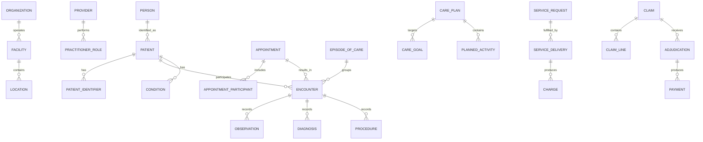

# Health Care Model Pattern

## Intent

Model organizations that register patients, coordinate providers and facilities, schedule and deliver care, record encounters and clinical evidence, manage care plans and cases, obtain consent and authorization, and support claims and payment.

This is a logical business pattern, not a clinical terminology, interoperability, privacy, or regulatory standard. Implementations should map relevant concepts to applicable standards and jurisdictional requirements.

## Business overview

**Patient Need → Access/Appointment → Encounter → Assessment → Order/Plan → Service Delivery → Outcome → Claim/Payment**

A Patient receives care from one or more Providers at a Facility or through a virtual Channel. An Appointment may schedule an Encounter. During the Encounter, Providers record observations, conditions, diagnoses, procedures, orders, and a plan of care. Services may be authorized, delivered, and evaluated over an Episode or Case. Consent, privacy, provenance, and access controls govern sensitive information. Charges may be assembled into Claims submitted to a Payer and resolved through adjudication and payment.

## Pattern variants

### Simple

Use for a focused clinic or prototype.

Core concepts: Patient; Provider; Facility; Appointment; Encounter; Clinical Note; Service; Invoice; Payment.

### Standard

Use as the default for operational health-care applications.

Adds: Patient Identifier; Related Person; Practitioner Role; Organization; Location; Schedule; Episode of Care; Medical Case; Care Team; Condition; Diagnosis; Observation; Procedure; Service Request; Medication Order; Care Plan; Consent; Coverage; Authorization; Charge; Claim; Claim Line; Adjudication; Document; Audit Event.

### Enterprise

Use for integrated delivery networks, hospitals, insurers, public health, research, multi-jurisdiction operations, or longitudinal records.

Adds: Organization Network; Department; Bed and Capacity Management; Referral; Transfer; Clinical Pathway; Cohort; Registry; Terminology Mapping; Master Patient Index; Provider Directory; Contract; Fee Schedule; Risk Assessment; Utilization Management; Quality Measure; Population Measure; Research Consent; Data Sharing Agreement.

## Actors and roles

| Role | Meaning |
|---|---|
| Patient | Person who is the subject and recipient of care. |
| Related Person | Parent, guardian, caregiver, family member, or representative connected to a Patient. |
| Practitioner | Person qualified or assigned to participate in care. |
| Practitioner Role | Capacity in which a Practitioner acts for an Organization or Facility. |
| Care Coordinator | Party Role coordinating services across an Episode or Case. |
| Referring Provider | Provider requesting evaluation or care from another Provider. |
| Payer | Party responsible for adjudicating or funding covered services. |
| Guarantor | Party financially responsible for charges not paid by a Payer. |

Rule: Patient is a Party Role, not a duplicate of Person. Practitioner identity, employment, credentials, and application-user identity remain separate concerns.

## Identity and demographic concepts

### Patient

Canonical concept: [Patient](../model/requirements/health-care/patient/patient.md).

The canonical page contains the definition, logical attributes, rules, and source-specific detail.

### Patient Identifier

Canonical concept: [Patient Identifier](../model/requirements/health-care/patient/patient-identifier.md).

The canonical page contains the definition, logical attributes, rules, and source-specific detail.

### Related Person

Canonical concept: [Related Person](../model/requirements/health-care/patient/related-person.md).

The canonical page contains the definition, logical attributes, rules, and source-specific detail.

### Patient Contact

Canonical concept: [Patient Contact](../model/requirements/health-care/patient/patient-contact.md).

The canonical page contains the definition, logical attributes, rules, and source-specific detail.

## organization, provider, facility, and location

### Health Care Organization

Canonical concept: [Health Care Organization](../model/requirements/health-care/health-care-organization/health-care-organization.md).

The canonical page contains the definition, logical attributes, rules, and source-specific detail.

### Provider

Canonical concept: [Provider](../model/requirements/health-care/health-care-organization/provider.md).

The canonical page contains the definition, logical attributes, rules, and source-specific detail.

### Practitioner Role

Canonical concept: [Practitioner Role](../model/requirements/health-care/health-care-organization/practitioner-role.md).

The canonical page contains the definition, logical attributes, rules, and source-specific detail.

### Facility

Canonical concept: [Facility](../model/requirements/health-care/health-care-organization/facility.md).

The canonical page contains the definition, logical attributes, rules, and source-specific detail.

### Location

Canonical concept: [Location](../model/requirements/health-care/health-care-organization/location.md).

The canonical page contains the definition, logical attributes, rules, and source-specific detail.

## Access and scheduling concepts

### Schedule

Canonical concept: [Schedule](../model/requirements/health-care/schedule/schedule.md).

The canonical page contains the definition, logical attributes, rules, and source-specific detail.

### Appointment

Canonical concept: [Appointment](../model/requirements/health-care/schedule/appointment.md).

The canonical page contains the definition, logical attributes, rules, and source-specific detail.

### Appointment Participant

Canonical concept: [Appointment Participant](../model/requirements/health-care/schedule/appointment-participant.md).

The canonical page contains the definition, logical attributes, rules, and source-specific detail.

### Referral

Canonical concept: [Referral](../model/requirements/health-care/schedule/referral.md).

The canonical page contains the definition, logical attributes, rules, and source-specific detail.

## Care context

### Encounter

Canonical concept: [Encounter](../model/requirements/health-care/encounter/encounter.md).

The canonical page contains the definition, logical attributes, rules, and source-specific detail.

### Episode of Care

Canonical concept: [Episode of Care](../model/requirements/health-care/encounter/episode-of-care.md).

The canonical page contains the definition, logical attributes, rules, and source-specific detail.

### Medical Case

Canonical concept: [Medical Case](../model/requirements/health-care/encounter/medical-case.md).

The canonical page contains the definition, logical attributes, rules, and source-specific detail.

### Care Team

Canonical concept: [Care Team](../model/requirements/health-care/encounter/care-team.md).

The canonical page contains the definition, logical attributes, rules, and source-specific detail.

### Care Team Member

Canonical concept: [Care Team Member](../model/requirements/health-care/encounter/care-team-member.md).

The canonical page contains the definition, logical attributes, rules, and source-specific detail.

## Clinical evidence and assessment

### Clinical Note

Canonical concept: [Clinical Note](../model/requirements/health-care/clinical-note/clinical-note.md).

The canonical page contains the definition, logical attributes, rules, and source-specific detail.

### Observation

Canonical concept: [Observation](../model/requirements/health-care/clinical-note/observation.md).

The canonical page contains the definition, logical attributes, rules, and source-specific detail.

### Condition

Canonical concept: [Condition](../model/requirements/health-care/clinical-note/condition.md).

The canonical page contains the definition, logical attributes, rules, and source-specific detail.

### Diagnosis

Canonical concept: [Diagnosis](../model/requirements/health-care/clinical-note/diagnosis.md).

The canonical page contains the definition, logical attributes, rules, and source-specific detail.

### Procedure

Canonical concept: [Procedure](../model/requirements/health-care/clinical-note/procedure.md).

The canonical page contains the definition, logical attributes, rules, and source-specific detail.

### Specimen

Canonical concept: [Specimen](../model/requirements/health-care/clinical-note/specimen.md).

The canonical page contains the definition, logical attributes, rules, and source-specific detail.

## Requests, orders, and care planning

### Service Request

Canonical concept: [Service Request](../model/requirements/health-care/service-request/service-request.md).

The canonical page contains the definition, logical attributes, rules, and source-specific detail.

### Medication Order

Canonical concept: [Medication Order](../model/requirements/health-care/service-request/medication-order.md).

The canonical page contains the definition, logical attributes, rules, and source-specific detail.

### Care Plan

Canonical concept: [Care Plan](../model/requirements/health-care/service-request/care-plan.md).

The canonical page contains the definition, logical attributes, rules, and source-specific detail.

### Care Goal

Canonical concept: [Care Goal](../model/requirements/health-care/service-request/care-goal.md).

The canonical page contains the definition, logical attributes, rules, and source-specific detail.

### Planned Activity

Canonical concept: [Planned Activity](../model/requirements/health-care/service-request/planned-activity.md).

The canonical page contains the definition, logical attributes, rules, and source-specific detail.

## Service delivery

### Health Care Service

Canonical concept: [Health Care Service](../model/requirements/health-care/health-care-service/health-care-service.md).

The canonical page contains the definition, logical attributes, rules, and source-specific detail.

### Service Delivery

Canonical concept: [Service Delivery](../model/requirements/health-care/health-care-service/service-delivery.md).

The canonical page contains the definition, logical attributes, rules, and source-specific detail.

### Authorization

Canonical concept: [Authorization](../model/requirements/health-care/health-care-service/authorization.md).

The canonical page contains the definition, logical attributes, rules, and source-specific detail.

## Consent, privacy, and provenance

### Consent

Canonical concept: [Consent](../model/requirements/health-care/consent/consent.md).

The canonical page contains the definition, logical attributes, rules, and source-specific detail.

### Access Restriction

Canonical concept: [Access Restriction](../model/requirements/health-care/consent/access-restriction.md).

The canonical page contains the definition, logical attributes, rules, and source-specific detail.

### Provenance

Canonical concept: [Provenance](../model/requirements/health-care/consent/provenance.md).

The canonical page contains the definition, logical attributes, rules, and source-specific detail.

### Audit Event

Canonical concept: [Audit Event](../model/requirements/health-care/consent/audit-event.md).

The canonical page contains the definition, logical attributes, rules, and source-specific detail.

## Coverage, claim, and payment

### Coverage

Canonical concept: [Coverage](../model/requirements/health-care/coverage/coverage.md).

The canonical page contains the definition, logical attributes, rules, and source-specific detail.

### Guarantor

Canonical concept: [Guarantor](../model/requirements/health-care/coverage/guarantor.md).

The canonical page contains the definition, logical attributes, rules, and source-specific detail.

### Charge

Canonical concept: [Charge](../model/requirements/health-care/coverage/charge.md).

The canonical page contains the definition, logical attributes, rules, and source-specific detail.

### Claim

Canonical concept: [Claim](../model/requirements/health-care/coverage/claim.md).

The canonical page contains the definition, logical attributes, rules, and source-specific detail.

### Claim Line

Canonical concept: [Claim Line](../model/requirements/health-care/coverage/claim-line.md).

The canonical page contains the definition, logical attributes, rules, and source-specific detail.

### Adjudication

Canonical concept: [Adjudication](../model/requirements/health-care/coverage/adjudication.md).

The canonical page contains the definition, logical attributes, rules, and source-specific detail.

### Payment

Canonical concept: [Payment](../model/requirements/finance/invoice/payment.md).

The canonical page contains the definition, logical attributes, rules, and source-specific detail.

## Relationship model

| Source | Relationship | Target | Cardinality |
|---|---|---|---|
| Person | performs role of | Patient | 1:M over time |
| Patient | has | Patient Identifier | 1:M |
| Patient | relates to | Related Person | M:M |
| Health Care Organization | operates | Facility | 1:M |
| Facility | contains | Location | 1:M recursive |
| Provider | performs | Practitioner Role | 1:M |
| Practitioner Role | acts for | Health Care Organization | M:1 |
| Schedule | allocates availability for | Provider, Service, or Location | M:1 |
| Appointment | includes | Appointment Participant | 1:M |
| Appointment | may result in | Encounter | 1:0..M |
| Patient | participates in | Encounter | 1:M |
| Provider | participates in | Encounter | M:M |
| Episode of Care | groups | Encounter | 1:M |
| Medical Case | concerns | Patient | M:1 |
| Care Team | supports | Episode, Case, or Care Plan | M:1 |
| Care Team | contains | Care Team Member | 1:M |
| Encounter | records | Observation, Diagnosis, Procedure, or Clinical Note | 1:M each |
| Patient | has | Condition | 1:M |
| Diagnosis | may assert | Condition | M:1 |
| Service Request | requests | Health Care Service | M:1 |
| Service Request | may produce | Service Delivery or Procedure | 1:M |
| Care Plan | contains | Care Goal and Planned Activity | 1:M each |
| Service Delivery | occurs within | Encounter, Episode, or Case | M:1 |
| Consent | given by | Patient or Related Person | M:1 |
| Coverage | covers | Patient | M:1 |
| Authorization | authorizes | Service Request or Service Delivery | M:M |
| Service Delivery | produces | Charge | 1:M |
| Claim | contains | Claim Line | 1:M |
| Claim Line | references | Charge or Service Delivery | M:1 |
| Claim | receives | Adjudication | 1:M |
| Adjudication | may produce | Payment | 1:M |
| Provenance | describes | Clinical or administrative record | M:1 |
| Audit Event | records access or action upon | Patient information | M:1 |

## Lifecycle models

### Appointment

Proposed → Booked → Arrived → In Progress → Fulfilled

Exception outcomes: Waitlisted; No Show; Cancelled; Rescheduled.

### Encounter

Planned → Arrived → In Progress → Completed

Exception outcomes: On Hold; Cancelled; Entered in Error.

### Service request

Draft → Active → Accepted → In Progress → Completed

Exception outcomes: On Hold; Revoked; Rejected; Cancelled; Entered in Error.

### Episode of care

Planned → Active → On Hold → Finished

Exception outcomes: Cancelled; Entered in Error.

### Claim

Draft → Submitted → Acknowledged → In Review → Adjudicated → Paid → Closed

Exception outcomes: Rejected; Denied; Partially Paid; Appealed; Voided.

### Consent

Proposed → Active → Inactive

Exception outcomes: Rejected; Revoked; Entered in Error.

## Business events

- Patient Registered or Identity Reconciled
- Appointment Requested, Booked, Rescheduled, or Cancelled
- Patient Arrived
- Encounter Started or Completed
- Condition Recorded
- Observation Recorded or Corrected
- Diagnosis Asserted
- Service or Medication Ordered
- Care Plan Activated
- Consent Granted, Refused, or Revoked
- Authorization Requested, Approved, or Denied
- Service Delivered
- Claim Submitted, Rejected, Adjudicated, or Appealed
- Payment Received
- Protected Record Accessed or Disclosed

## Baseline business and integrity rules

1. A clinical or administrative record must identify its Patient, author or source, time, status, and provenance as applicable.
2. Corrections to signed or finalized clinical records preserve prior versions and record the reason for change.
3. A Provider may act only within an active role, credential, organization, location, and permitted scope.
4. An Encounter cannot be completed before it starts.
5. A Service Delivery must trace to the Patient, performer, service, time, location or channel, and relevant request or plan.
6. Payer Authorization never substitutes for Patient Consent or a clinical order.
7. Consent and access restrictions must be evaluated for the requested purpose, data scope, actor, and time.
8. A Claim Line must trace to a delivered service or valid charge.
9. Paid, allowed, adjustment, and patient-responsibility amounts must reconcile under the applicable adjudication rules.
10. Patient identity merges and splits preserve identifier history and record lineage.
11. Sensitive data collection should be limited to a legitimate purpose and applicable policy.
12. Every access or disclosure requiring audit must create immutable evidence of actor, purpose, subject, action, time, and outcome.

## Interoperability and terminology guidance

- Keep the logical MDE model independent of transport formats.
- Map concepts to applicable interoperability resources only at an integration boundary.
- Store terminology system, code, display, version, and mapping provenance when coded clinical meaning matters.
- Do not silently translate between terminology systems without retaining the source concept and mapping evidence.
- Treat externally received records as assertions with source and provenance, not automatically as locally verified truth.
- Use jurisdiction-specific profiles for required identifiers, consent, privacy, claims, and reporting.

## AI modeling questions

1. Is the scope clinic, hospital, laboratory, pharmacy, home care, insurer, public health, research, or a combination?
2. Which jurisdictions, privacy obligations, professional regulations, and data residency rules apply?
3. Which Party roles exist for Patients, guardians, Providers, guarantors, and Payers?
4. How is Patient identity established, matched, merged, corrected, and audited?
5. Which care settings and Encounter types are supported?
6. Are Episodes, Cases, and Care Plans distinct in this organization?
7. Which services require clinical orders, consent, organizational approval, or payer authorization?
8. Which clinical observations, conditions, diagnoses, procedures, medications, and documents are in scope?
9. Which terminology systems and interoperability profiles are required?
10. What information may each actor access, for which purpose, and under which consent or policy?
11. Does billing use direct invoices, insurance Claims, public funding, capitation, bundled payment, or several methods?
12. Which quality, safety, operational, financial, and population outcomes must be measured?
13. What must be retained as immutable legal or clinical evidence?
14. Which external systems are authoritative for identity, scheduling, clinical data, pharmacy, laboratory, imaging, claims, or payment?

## MDE modeling guidance

- Begin with Party and Party Role; do not duplicate Person as Patient, Provider, User, and Guarantor.
- Keep Appointment, Encounter, Episode, Case, and Care Plan distinct because they answer different questions.
- Separate clinical fact, Provider assertion, longitudinal condition, and billing classification.
- Put clinical and administrative rules on the operations they govern; use cases orchestrate actions and outcomes.
- Treat provenance, consent, authorization, access control, and audit as first-class knowledge.
- Keep operational concepts canonical and integration representations mapped and versioned.
- Apply data minimization: include sensitive attributes only when the application's purpose requires them.

## Anti-patterns

### Patient Equals Person Equals User

Patient is a business role. Some Patients have no application account, and guardians, Providers, or proxy users may act in the system.

### Appointment Equals Encounter

An Appointment is a plan; an Encounter is actual care interaction. Either may exist without the other.

### One Giant Medical Record

Combining observations, diagnoses, notes, orders, procedures, and documents destroys their distinct provenance, lifecycle, authorship, and meaning.

### Authorization Equals Consent

Payer authorization, clinical authorization, organizational approval, and Patient consent answer different questions.

### Claim as the Clinical Truth

A Claim is a financial request and may simplify or classify clinical activity for payment. It is not the authoritative clinical record.

### Mutable Final Notes

Overwriting finalized clinical evidence removes history required for safety, trust, and audit.

## Physical mapping examples

| Logical name | Example physical name |
|---|---|
| Patient Identifier | `patient_identifier` |
| Practitioner Role | `practitioner_role` |
| Episode of Care | `episode_of_care` |
| Medical Case | `medical_case` |
| Care Team Member | `care_team_member` |
| Service Request | `service_request` |
| Service Delivery | `service_delivery` |
| Claim Line | `claim_line` |
| Access Restriction | `access_restriction` |
| Audit Event | `audit_event` |

Logical names remain authoritative. Stack and jurisdiction rules generate physical naming only after the logical model is accepted.

## Future behavioral expansion

This file is an actual logical industry pattern. A later behavioral layer should define capabilities and actor-goal use cases such as Register Patient, Schedule Appointment, Conduct Encounter, Record Observation, Establish Diagnosis, Order Service, Manage Care Plan, Capture Consent, Authorize Service, Deliver Service, Submit Claim, Adjudicate Claim, and Receive Payment, with pages, rules, scenarios, and tests.

## Canonical model bindings

This pattern selects and connects concepts in the [coherent model](../model/README.md). The sections below are views of those definitions. Industry lifecycles, events, baseline rules, and variant choices continue to constrain the selected concepts.

| Source term | Canonical concept | ABE |
|---|---|---|
| Patient | [Patient](../model/requirements/health-care/patient/patient.md) | [Patient](../model/requirements/health-care/patient/README.md) |
| Patient Identifier | [Patient Identifier](../model/requirements/health-care/patient/patient-identifier.md) | [Patient](../model/requirements/health-care/patient/README.md) |
| Related Person | [Related Person](../model/requirements/health-care/patient/related-person.md) | [Patient](../model/requirements/health-care/patient/README.md) |
| Patient Contact | [Patient Contact](../model/requirements/health-care/patient/patient-contact.md) | [Patient](../model/requirements/health-care/patient/README.md) |
| Health Care Organization | [Health Care Organization](../model/requirements/health-care/health-care-organization/health-care-organization.md) | [Health Care Organization](../model/requirements/health-care/health-care-organization/README.md) |
| Provider | [Provider](../model/requirements/health-care/health-care-organization/provider.md) | [Health Care Organization](../model/requirements/health-care/health-care-organization/README.md) |
| Practitioner Role | [Practitioner Role](../model/requirements/health-care/health-care-organization/practitioner-role.md) | [Health Care Organization](../model/requirements/health-care/health-care-organization/README.md) |
| Facility | [Facility](../model/requirements/health-care/health-care-organization/facility.md) | [Health Care Organization](../model/requirements/health-care/health-care-organization/README.md) |
| Location | [Location](../model/requirements/health-care/health-care-organization/location.md) | [Health Care Organization](../model/requirements/health-care/health-care-organization/README.md) |
| Schedule | [Schedule](../model/requirements/health-care/schedule/schedule.md) | [Schedule](../model/requirements/health-care/schedule/README.md) |
| Appointment | [Appointment](../model/requirements/health-care/schedule/appointment.md) | [Schedule](../model/requirements/health-care/schedule/README.md) |
| Appointment Participant | [Appointment Participant](../model/requirements/health-care/schedule/appointment-participant.md) | [Schedule](../model/requirements/health-care/schedule/README.md) |
| Referral | [Referral](../model/requirements/health-care/schedule/referral.md) | [Schedule](../model/requirements/health-care/schedule/README.md) |
| Encounter | [Encounter](../model/requirements/health-care/encounter/encounter.md) | [Encounter](../model/requirements/health-care/encounter/README.md) |
| Episode of Care | [Episode of Care](../model/requirements/health-care/encounter/episode-of-care.md) | [Encounter](../model/requirements/health-care/encounter/README.md) |
| Medical Case | [Medical Case](../model/requirements/health-care/encounter/medical-case.md) | [Encounter](../model/requirements/health-care/encounter/README.md) |
| Care Team | [Care Team](../model/requirements/health-care/encounter/care-team.md) | [Encounter](../model/requirements/health-care/encounter/README.md) |
| Care Team Member | [Care Team Member](../model/requirements/health-care/encounter/care-team-member.md) | [Encounter](../model/requirements/health-care/encounter/README.md) |
| Clinical Note | [Clinical Note](../model/requirements/health-care/clinical-note/clinical-note.md) | [Clinical Note](../model/requirements/health-care/clinical-note/README.md) |
| Observation | [Observation](../model/requirements/health-care/clinical-note/observation.md) | [Clinical Note](../model/requirements/health-care/clinical-note/README.md) |
| Condition | [Condition](../model/requirements/health-care/clinical-note/condition.md) | [Clinical Note](../model/requirements/health-care/clinical-note/README.md) |
| Diagnosis | [Diagnosis](../model/requirements/health-care/clinical-note/diagnosis.md) | [Clinical Note](../model/requirements/health-care/clinical-note/README.md) |
| Procedure | [Procedure](../model/requirements/health-care/clinical-note/procedure.md) | [Clinical Note](../model/requirements/health-care/clinical-note/README.md) |
| Specimen | [Specimen](../model/requirements/health-care/clinical-note/specimen.md) | [Clinical Note](../model/requirements/health-care/clinical-note/README.md) |
| Service Request | [Service Request](../model/requirements/health-care/service-request/service-request.md) | [Service Request](../model/requirements/health-care/service-request/README.md) |
| Medication Order | [Medication Order](../model/requirements/health-care/service-request/medication-order.md) | [Service Request](../model/requirements/health-care/service-request/README.md) |
| Care Plan | [Care Plan](../model/requirements/health-care/service-request/care-plan.md) | [Service Request](../model/requirements/health-care/service-request/README.md) |
| Care Goal | [Care Goal](../model/requirements/health-care/service-request/care-goal.md) | [Service Request](../model/requirements/health-care/service-request/README.md) |
| Planned Activity | [Planned Activity](../model/requirements/health-care/service-request/planned-activity.md) | [Service Request](../model/requirements/health-care/service-request/README.md) |
| Health Care Service | [Health Care Service](../model/requirements/health-care/health-care-service/health-care-service.md) | [Health Care Service](../model/requirements/health-care/health-care-service/README.md) |
| Service Delivery | [Service Delivery](../model/requirements/health-care/health-care-service/service-delivery.md) | [Health Care Service](../model/requirements/health-care/health-care-service/README.md) |
| Authorization | [Authorization](../model/requirements/health-care/health-care-service/authorization.md) | [Health Care Service](../model/requirements/health-care/health-care-service/README.md) |
| Consent | [Consent](../model/requirements/health-care/consent/consent.md) | [Consent](../model/requirements/health-care/consent/README.md) |
| Access Restriction | [Access Restriction](../model/requirements/health-care/consent/access-restriction.md) | [Consent](../model/requirements/health-care/consent/README.md) |
| Provenance | [Provenance](../model/requirements/health-care/consent/provenance.md) | [Consent](../model/requirements/health-care/consent/README.md) |
| Audit Event | [Audit Event](../model/requirements/health-care/consent/audit-event.md) | [Consent](../model/requirements/health-care/consent/README.md) |
| Coverage | [Coverage](../model/requirements/health-care/coverage/coverage.md) | [Coverage](../model/requirements/health-care/coverage/README.md) |
| Guarantor | [Guarantor](../model/requirements/health-care/coverage/guarantor.md) | [Coverage](../model/requirements/health-care/coverage/README.md) |
| Charge | [Charge](../model/requirements/health-care/coverage/charge.md) | [Coverage](../model/requirements/health-care/coverage/README.md) |
| Claim | [Claim](../model/requirements/health-care/coverage/claim.md) | [Coverage](../model/requirements/health-care/coverage/README.md) |
| Claim Line | [Claim Line](../model/requirements/health-care/coverage/claim-line.md) | [Coverage](../model/requirements/health-care/coverage/README.md) |
| Adjudication | [Adjudication](../model/requirements/health-care/coverage/adjudication.md) | [Coverage](../model/requirements/health-care/coverage/README.md) |
| Payment | [Payment](../model/requirements/finance/invoice/payment.md) | [Invoice](../model/requirements/finance/invoice/README.md) |
