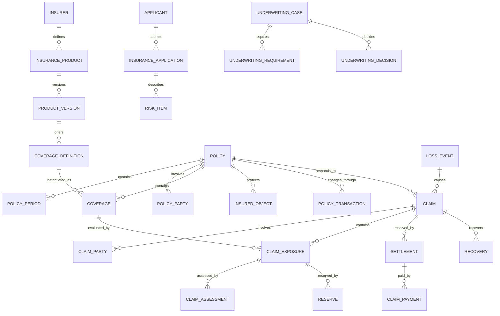

# Insurance Model Pattern

## Intent

Model insurers and intermediaries that define insurance products, evaluate risk, issue and maintain policies, collect premium, receive and investigate claims, determine coverage and liability, establish reserves, settle losses, recover amounts, and meet regulatory and financial obligations.

This pattern specializes the Cross-Industry Party, Role, Product, Offering, Agreement, Classification, Event, Status, Charge, Invoice, Payment, Work Effort, and Outcome concepts.

## Business overview

**Need/Risk → Product/Quote → Application → Underwriting → Policy/Coverage → Premium → Loss → Claim → Assessment → Reserve → Settlement/Recovery**

An Insurer defines Insurance Products and Offerings. An Applicant supplies risk information through an Application and may receive one or more Quotes. Underwriting evaluates the risk and makes an explainable decision. An accepted offer produces a Policy containing Coverages, terms, limits, deductibles, insured Parties, and insured Objects. Premium and billing obligations arise during the Policy period. A Loss Event may produce one or more Claims. Each Claim evaluates policy status, coverage, causation, liability, damages, fraud indicators, and required evidence. The Insurer establishes reserves, approves or denies covered amounts, makes payments, and may pursue recovery or subrogation.

## Pattern variants

### Simple

Use for a focused prototype or one line of business.

Core concepts: Customer; Insurance Product; Quote; Policy; Coverage; Insured Object; Premium; Claim; Claim Assessment; Claim Payment.

### Standard

Use as the default for an operational insurance application.

Adds: Insurer; Producer; Applicant; Application; Underwriting Case; Underwriting Decision; Policy Party; Policy Term; Coverage Term; Exclusion; Endorsement; Risk Item; Billing Account; Premium Transaction; Loss Event; Claim Party; Claim Exposure; Claim Assignment; Claim Note; Evidence Item; Reserve; Settlement; Recovery.

### Enterprise

Use for multiple legal entities, products, jurisdictions, distribution channels, complex claims, reinsurance, or regulated financial reporting.

Adds: Product Version; Rating Plan; Rating Factor; Rate Table; Distribution Agreement; Commission; Authority Limit; Portfolio; Catastrophe Event; Litigation; Fraud Referral; Salvage; Subrogation; Reinsurance Contract; Reinsurance Coverage; Cession; Reinsurance Claim; Regulatory Classification; Financial Posting; Actuarial Measure.

## Insurance roles

| Role | Meaning |
|---|---|
| Insurer | Party accepting insurance risk and issuing the Policy. |
| Applicant | Party seeking insurance and supplying underwriting information. |
| Policyholder | Party that owns or controls the Policy. |
| Named Insured | Party explicitly granted insured status by the Policy. |
| Additional Insured | Party receiving defined protection without being the primary Policyholder. |
| Beneficiary | Party entitled to receive a benefit under defined conditions. |
| Producer | Agent, broker, or other intermediary distributing or servicing insurance. |
| Underwriter | Role evaluating risk and deciding whether and on what terms to insure it. |
| Claimant | Party seeking compensation or another benefit. |
| Claim Adjuster | Role investigating and evaluating a Claim. |
| Service Provider | Repairer, medical provider, assessor, investigator, lawyer, or other claim participant. |
| Reinsurer | Party accepting a portion of an Insurer's risk. |

Rule: Party identity is independent of role. One Party may perform several roles, and roles may change over time or by Policy and Claim.

## Product and offering concepts

### Insurance Product

A governed definition of insurance protection offered for a line of business and market.

Logical attributes: Product Identifier; Product Name; Product Type; Line of Business; Product Status; Jurisdiction; Effective From; Effective Through.

### Product Version

A versioned set of product terms, available Coverages, rules, forms, rating behavior, and underwriting requirements.

Logical attributes: Product Version Identifier; Version; Status; Effective From; Effective Through; Approval Reference; Superseded By.

### Insurance Offering

A Product Version made available through a Channel, Producer, market, or customer segment under stated eligibility and commercial conditions.

Logical attributes: Offering Identifier; Offering Name; Offering Status; Channel; Market; Customer Segment; Available From; Available Through.

### Coverage Definition

A reusable product-level definition of a type of protection.

Logical attributes: Coverage Definition Identifier; Coverage Code; Coverage Name; Coverage Type; Required Indicator; Default Limit; Default Deductible; Effective From; Effective Through.

### Policy Form

A governed contractual document, clause, schedule, notice, or disclosure used by a Product Version.

Logical attributes: Form Identifier; Form Number; Form Title; Form Type; Form Version; Jurisdiction; Effective From; Effective Through.

### Rating Plan

A governed method for determining premium.

Logical attributes: Rating Plan Identifier; Plan Name; Version; Status; Currency; Effective From; Effective Through; Calculation Rule Reference.

### Rating Factor

A risk or commercial input used by a Rating Plan.

Logical attributes: Rating Factor Identifier; Factor Name; Factor Type; Value Type; Source; Applicability Condition.

## Quote, application, and underwriting

### Quote

A time-bounded proposed combination of Coverages, terms, premium, conditions, and assumptions.

Logical attributes: Quote Identifier; Quote Number; Quote Status; Requested Date; Quoted Date; Expiration Date; Currency; Total Premium; Producer; Product Version.

### Quote Option

One alternative configuration within a Quote.

Logical attributes: Quote Option Identifier; Option Name; Option Status; Premium; Fees; Taxes; Effective Date; Expiration Date.

### Insurance Application

A formal request for insurance containing applicant declarations and risk information.

Logical attributes: Application Identifier; Application Number; Application Type; Application Status; Submitted Date; Requested Effective Date; Applicant; Product Version; Source Channel.

### Application Answer

A recorded response to an underwriting question or required declaration.

Logical attributes: Answer Identifier; Question Code; Answer Value; Answer Date; Answered By; Source; Verification Status.

### Risk Item

A Party, property, vehicle, activity, liability, person, contract, location, or other subject being evaluated for insurance.

Logical attributes: Risk Item Identifier; Risk Type; Description; Location; Valuation; Classification; Status; Effective From; Effective Through.

### Underwriting Case

A managed evaluation of an Application, Quote, Policy change, or renewal risk.

Logical attributes: Underwriting Case Identifier; Case Type; Case Status; Opened Date; Priority; Assigned Underwriter; Decision Due Date; Product Version.

### Underwriting Requirement

Information, inspection, evidence, approval, or action required before a decision.

Logical attributes: Requirement Identifier; Requirement Type; Requirement Status; Requested Date; Due Date; Received Date; Source; Waiver Reason.

### Underwriting Decision

An explainable decision to accept, decline, refer, postpone, cancel, non-renew, or offer modified terms.

Logical attributes: Decision Identifier; Decision Type; Decision Status; Decision Date; Decided By; Reason Code; Rationale; Authority Reference; Expiration Date.

Rule: preserve the facts, rules, authority, and rationale supporting an underwriting decision.

## Policy and coverage concepts

### Policy

The insurance Agreement issued by an Insurer for a defined period.

Logical attributes: Policy Identifier; Policy Number; Policy Type; Policy Status; Issue Date; Effective Date; Expiration Date; Cancellation Date; Currency; Product Version; Insurer.

### Policy Period

A bounded period during which a Policy's terms apply.

Logical attributes: Policy Period Identifier; Period Number; Start Date; End Date; Period Status; Transaction Effective Date.

### Policy Party

A Party participating in a Policy in a stated role.

Logical attributes: Policy Party Identifier; Role Type; Role Status; Effective From; Effective Through; Interest Percentage.

### Coverage

A Policy-level grant of protection derived from a Coverage Definition.

Logical attributes: Coverage Identifier; Coverage Code; Coverage Status; Effective From; Effective Through; Limit Amount; Deductible Amount; Coinsurance Percentage; Premium.

### Coverage Term

A structured condition, limit, sublimit, waiting period, attachment point, territory, or other parameter of Coverage.

Logical attributes: Coverage Term Identifier; Term Type; Term Value; Unit; Effective From; Effective Through.

### Exclusion

A condition under which otherwise relevant loss or liability is not covered.

Logical attributes: Exclusion Identifier; Exclusion Code; Description; Effective From; Effective Through; Form Reference.

### Insured Object

A Policy-level representation of a Party, property, vehicle, person, activity, or other subject protected or scheduled by the Policy.

Logical attributes: Insured Object Identifier; Object Type; Description; External Identifier; Valuation; Location; Status; Effective From; Effective Through.

### Policy Transaction

A versioned business transaction changing the Policy or its financial effect.

Logical attributes: Policy Transaction Identifier; Transaction Type; Transaction Status; Requested Date; Effective Date; Processed Date; Reason; Prior Policy Version; Resulting Policy Version.

Types include issue, bind, endorsement, renewal, cancellation, reinstatement, rewrite, and non-renewal.

### Endorsement

A Policy Transaction or contractual form that adds, removes, or modifies Policy terms.

Logical attributes: Endorsement Identifier; Endorsement Type; Status; Requested Date; Effective Date; Description; Premium Change; Form Reference.

## Premium, billing, and commission

### Premium

The amount charged for assuming insurance risk for a Coverage, Policy Period, or transaction.

Logical attributes: Premium Identifier; Premium Type; Amount; Currency; Effective From; Effective Through; Rating Plan; Calculation Evidence.

### Premium Transaction

A financial change resulting from issue, endorsement, audit, cancellation, reinstatement, or renewal.

Logical attributes: Premium Transaction Identifier; Transaction Type; Amount; Tax Amount; Fee Amount; Effective Date; Posting Date; Status.

### Billing Account

A financial account grouping Policy charges, invoices, payments, credits, and balances.

Logical attributes: Billing Account Identifier; Account Number; Account Status; Billing Method; Billing Frequency; Currency; Responsible Party.

### Invoice

A request for payment of premium, tax, fees, or adjustments.

Logical attributes: Invoice Identifier; Invoice Number; Invoice Date; Due Date; Invoice Status; Total Amount; Currency.

### Payment

Money received and allocated to one or more insurance obligations.

Logical attributes: Payment Identifier; Payment Date; Amount; Currency; Method; Payment Status; Reference.

### Commission

Compensation payable to a Producer or distribution Party.

Logical attributes: Commission Identifier; Commission Type; Basis Amount; Rate; Commission Amount; Status; Earned Date; Payable Date.

## Loss and claim concepts

### Loss Event

An occurrence or circumstance that may give rise to one or more Claims.

Logical attributes: Loss Event Identifier; Event Type; Occurred Start; Occurred End; Reported Date; Location; Description; Catastrophe Reference; Event Status.

### Claim

A request or case seeking Policy benefits, defense, indemnity, service, or another contractual response to a Loss Event.

Logical attributes: Claim Identifier; Claim Number; Claim Type; Claim Status; Reported Date; Loss Date; Opened Date; Closed Date; Policy; Reporting Party; Assigned Adjuster.

### Claim Party

A Party participating in the Claim in a stated role.

Logical attributes: Claim Party Identifier; Role Type; Role Status; Effective From; Effective Through; Representation Reference.

Roles include claimant, insured, injured party, witness, service provider, attorney, adjuster, investigator, and recovery target.

### Claim Exposure

A separately evaluated component of potential Claim obligation.

Logical attributes: Exposure Identifier; Exposure Type; Exposure Status; Coverage; Claimant; Limit; Deductible; Opened Date; Closed Date.

Examples: property damage, bodily injury, defense expense, medical benefit, income loss, or death benefit.

### Claim Assignment

Allocation of responsibility for a Claim, Exposure, investigation, or task.

Logical attributes: Assignment Identifier; Assignment Type; Assigned Role or Party; Assignment Status; Assigned Date; Due Date; Authority Limit.

### Claim Assessment

An evidence-based evaluation of coverage, causation, liability, damage, benefit eligibility, or amount.

Logical attributes: Assessment Identifier; Assessment Type; Assessment Status; Assessed Date; Assessor; Finding; Amount; Rationale; Evidence Reference.

### Evidence Item

A document, image, statement, report, estimate, invoice, record, or other information used in claim evaluation.

Logical attributes: Evidence Identifier; Evidence Type; Evidence Status; Received Date; Source; Description; Integrity Hash; Confidentiality Classification.

### Claim Note

A versioned narrative record of significant Claim activity or reasoning.

Logical attributes: Claim Note Identifier; Note Type; Note Status; Authored At; Author; Text; Supersedes Note Reference.

### Reserve

An estimate of expected future Claim cost for an Exposure or expense category.

Logical attributes: Reserve Identifier; Reserve Type; Reserve Status; Amount; Currency; Effective Date; Established By; Reason; Prior Reserve Reference.

### Settlement

An approved resolution of all or part of a Claim or Exposure.

Logical attributes: Settlement Identifier; Settlement Type; Settlement Status; Offered Date; Accepted Date; Gross Amount; Deductible Amount; Net Amount; Payee; Release Reference.

### Claim Payment

A payment made to satisfy an approved benefit, expense, service, or Settlement.

Logical attributes: Claim Payment Identifier; Payment Type; Payment Status; Requested Date; Approved Date; Issued Date; Amount; Currency; Payee; Payment Reference.

### Recovery

Money or value recovered or expected from salvage, subrogation, contribution, deductible, excess insurer, or another responsible Party.

Logical attributes: Recovery Identifier; Recovery Type; Recovery Status; Expected Amount; Recovered Amount; Recovery Date; Responsible Party.

## Reinsurance concepts

### Reinsurance Contract

An Agreement under which a Reinsurer accepts defined insurance risk from an Insurer.

Logical attributes: Reinsurance Contract Identifier; Contract Number; Contract Type; Status; Effective Date; Expiration Date; Currency; Reinsurer.

### Reinsurance Coverage

The layer, share, limit, retention, territory, portfolio, or peril protected by a Reinsurance Contract.

Logical attributes: Reinsurance Coverage Identifier; Coverage Type; Attachment Point; Limit; Share Percentage; Reinstatement Terms.

### Cession

The portion of a Policy, Coverage, premium, reserve, or loss allocated to reinsurance.

Logical attributes: Cession Identifier; Cession Type; Ceded Percentage; Ceded Premium; Ceded Reserve; Ceded Loss; Effective Date.

### Reinsurance Claim

A request to a Reinsurer for recoverable amounts.

Logical attributes: Reinsurance Claim Identifier; Status; Reported Date; Gross Loss; Retention; Recoverable Amount; Paid Amount.

## Relationship model

| Source | Relationship | Target | Cardinality |
|---|---|---|---|
| Insurer | defines | Insurance Product | 1:M |
| Insurance Product | has | Product Version | 1:M |
| Product Version | contains | Coverage Definition | 1:M |
| Insurance Offering | makes available | Product Version | M:1 |
| Quote | contains | Quote Option | 1:M |
| Quote Option | proposes | Coverage configuration | 1:M |
| Applicant | submits | Insurance Application | 1:M |
| Insurance Application | describes | Risk Item | 1:M |
| Underwriting Case | evaluates | Application, Quote, or Policy Transaction | M:1 |
| Underwriting Case | contains | Underwriting Requirement | 1:M |
| Underwriting Case | produces | Underwriting Decision | 1:M |
| Accepted Quote/Application | produces | Policy | 1:0..1 |
| Policy | contains | Policy Period | 1:M |
| Policy | has | Policy Party | 1:M |
| Policy | covers | Insured Object | M:M through Coverage |
| Policy | contains | Coverage | 1:M |
| Coverage | derives from | Coverage Definition | M:1 |
| Coverage | has | Coverage Term or Exclusion | 1:M |
| Policy | changes through | Policy Transaction | 1:M |
| Policy Transaction | may create | Endorsement | 1:0..M |
| Coverage or Policy Period | produces | Premium | 1:M |
| Billing Account | bills | Policy | 1:M |
| Billing Account | receives | Invoice and Payment | 1:M each |
| Producer | earns | Commission | 1:M |
| Loss Event | gives rise to | Claim | 1:M |
| Policy | responds to | Claim | 1:M |
| Claim | has | Claim Party | 1:M |
| Claim | contains | Claim Exposure | 1:M |
| Claim Exposure | evaluates | Coverage | M:1 |
| Claim or Exposure | receives | Claim Assignment | 1:M |
| Claim Exposure | receives | Claim Assessment | 1:M |
| Claim | contains | Evidence Item and Claim Note | 1:M each |
| Claim Exposure | has | Reserve | 1:M over time |
| Claim or Exposure | resolves through | Settlement | 1:M |
| Settlement or approved expense | produces | Claim Payment | 1:M |
| Claim | may produce | Recovery | 1:M |
| Reinsurance Contract | contains | Reinsurance Coverage | 1:M |
| Policy or portfolio | allocates through | Cession | 1:M |
| Claim | may produce | Reinsurance Claim | 1:M |

## Lifecycle models

### Quote

Draft → Rated → Offered → Accepted

Exception outcomes: Referred; Declined; Expired; Withdrawn; Superseded.

### Insurance application

Draft → Submitted → In Review → Decision Made

Decision outcomes: Accepted; Accepted with Conditions; Declined; Postponed; Withdrawn.

### Policy

Proposed → Bound → Issued → Active → Expired

Exception outcomes: Pending Cancellation; Cancelled; Lapsed; Reinstated; Non-Renewed; Rewritten.

### Claim

Reported → Open → Assigned → Investigating → Evaluating → Decision Made → Settling → Closed

Exception outcomes: Coverage Question; Litigation; Fraud Review; Denied; Withdrawn; Reopened.

### Claim exposure

Open → Investigating → Evaluated → Approved/Denied → Settled → Closed

### Reserve

Proposed → Approved → Active → Adjusted → Released → Closed

### Settlement

Draft → Reviewed → Offered → Accepted → Approved → Paid → Completed

Exception outcomes: Rejected; Withdrawn; Voided.

## Business events

- Quote Requested, Rated, Offered, Accepted, Declined, or Expired
- Application Submitted
- Underwriting Requirement Requested or Satisfied
- Underwriting Decision Made
- Policy Bound, Issued, Endorsed, Renewed, Cancelled, Reinstated, or Expired
- Premium Calculated, Billed, Earned, Refunded, or Written Off
- Payment Received, Reversed, or Allocated
- Loss Reported
- Claim Opened, Assigned, Denied, Reopened, or Closed
- Evidence Received
- Coverage Determined
- Liability or Damage Assessed
- Reserve Established, Increased, Decreased, or Released
- Settlement Offered, Accepted, Approved, or Voided
- Claim Payment Issued, Stopped, or Recovered
- Fraud Referral Opened or Resolved
- Recovery Identified or Received
- Reinsurance Notice or Claim Submitted

## Baseline business and integrity rules

1. A Policy must identify the issuing Insurer, Product Version, Policy period, Policyholder, currency, and at least one Coverage before issuance.
2. Product, form, rate, and Coverage versions used by a Quote or Policy must be effective for its jurisdiction and transaction date.
3. Binding and underwriting decisions must identify the actor, authority, inputs, rules, rationale, and time.
4. A Coverage cannot extend beyond its Policy Period unless explicitly modeled as an extended reporting or benefit provision.
5. Policy changes are represented by effective-dated Policy Transactions; historical contractual versions are preserved.
6. Premium calculations retain rating inputs, plan version, adjustments, taxes, fees, and rounding evidence.
7. A Claim must identify a Loss Event or documented benefit-triggering circumstance and the Policy being invoked.
8. Claim coverage evaluation must use the Policy and Coverage terms effective for the relevant Loss date or trigger.
9. Authorization to pay is independent of coverage evaluation, reserve approval, and settlement authority.
10. Claim Payments cannot exceed the approved Settlement or payable amount net of prior payments, deductibles, limits, and recoveries unless a separately authorized expense applies.
11. Reserve changes preserve history, reason, authority, currency, and prior amount.
12. Claim denial must record the Coverage, exclusion, condition, evidence, authority, and rationale supporting the decision.
13. Finalized Claim evidence and decisions are corrected by amendment or supersession, not destructive overwrite.
14. Duplicate Claims and duplicate payments must be detected before approval.
15. Party access is governed by role, assignment, purpose, confidentiality, and minimum-necessary scope.
16. Financial postings, Claim Payments, Recoveries, commissions, and reinsurance amounts must reconcile to their source transactions.

## AI modeling questions

1. Which insurance lines are in scope: property, casualty, auto, liability, health, life, disability, travel, specialty, or another line?
2. Is the organization an Insurer, managing general agent, broker, third-party administrator, reinsurer, or a combination?
3. Which jurisdictions, legal entities, currencies, languages, and regulatory regimes apply?
4. Are Product, Product Version, Offering, Policy Form, Coverage Definition, and Rating Plan independently governed?
5. How are quotes generated, compared, referred, accepted, and expired?
6. Which Application questions, documents, inspections, external data, and disclosures are required?
7. Which underwriting rules are automated and which require authority-based human decisions?
8. What Party roles exist on a Policy and a Claim, and may one Party perform several roles?
9. Which insured Objects and risk characteristics are needed for each line of business?
10. Which Policy Transactions are supported, and how are effective-dated versions preserved?
11. How are premium, tax, fees, installments, commission, refunds, and cancellations calculated?
12. What constitutes a Loss Event and how may it create several Claims?
13. Which Claim Exposures, reserves, authority limits, assignments, and service providers are required?
14. How are coverage, liability, causation, damage, fraud, litigation, and settlement evaluated?
15. Which payments, salvage, subrogation, contribution, and other recoveries are supported?
16. Is reinsurance facultative, treaty, proportional, excess-of-loss, or a combination?
17. Which operational, actuarial, regulatory, and financial measures must be retained?
18. What evidence must remain immutable and auditable?

## MDE modeling guidance

- Reuse Cross-Industry Party and Party Role; do not create separate identities for Customer, Applicant, Policyholder, Insured, Claimant, Producer, and Payee.
- Keep Insurance Product, Product Version, Offering, Quote, Application, Policy, Coverage, and Policy Transaction distinct.
- Treat the Policy as a versioned Agreement and preserve the exact contractual terms applicable at any effective date.
- Keep Loss Event, Claim, Claim Exposure, Claim Assessment, Reserve, Settlement, Payment, and Recovery as separate concepts and lifecycles.
- Put eligibility, underwriting, coverage, authority, reserving, and payment rules on the entity operations they govern.
- Use cases orchestrate actor goals and branching but invoke authoritative entity operations for business decisions.
- Model external reports and data as sourced assertions with provenance, not automatically as verified truth.
- Add line-of-business specializations only where attributes, behavior, relationships, or regulation differ materially.
- Treat financial and regulatory projections as derived views with lineage to operational transactions.

## Anti-patterns

### Policy Equals Product

A Product defines reusable protection; a Policy is one effective-dated Agreement issued to particular Parties and risks.

### Coverage as a Checkbox

Coverage has terms, limits, deductibles, exclusions, effective dates, forms, insured interests, and behavior. A Boolean cannot explain contractual protection.

### One Claim, One Amount

Claims commonly contain several Exposures, assessments, reserves, settlements, payments, expenses, and recoveries.

### Claim Status as Everything

Claim, Exposure, Reserve, Settlement, Payment, litigation, fraud review, and recovery require independent states.

### Current Policy Reconstructs Historical Coverage

Endorsements and renewals change the contract. Claim decisions must use the contractual version effective for the Loss.

### Reserve Equals Payment

A Reserve estimates expected future cost; a Payment settles an approved obligation. They serve different operational and financial purposes.

### User Equals Adjuster or Underwriter

Authenticated identity is not the business role, assignment, authority, license, or employment relationship.

### Rules Hidden in Rating or Claim Code

Opaque code without durable rule, version, source, and decision evidence prevents review, explanation, and reliable change.

## Physical mapping examples

| Logical name | Example physical name |
|---|---|
| Product Version | `product_version` |
| Coverage Definition | `coverage_definition` |
| Insurance Application | `insurance_application` |
| Underwriting Case | `underwriting_case` |
| Underwriting Decision | `underwriting_decision` |
| Policy Period | `policy_period` |
| Policy Party | `policy_party` |
| Policy Transaction | `policy_transaction` |
| Claim Exposure | `claim_exposure` |
| Claim Assessment | `claim_assessment` |
| Claim Payment | `claim_payment` |
| Reinsurance Contract | `reinsurance_contract` |

Logical names remain authoritative. Technology-stack and line-of-business rules generate physical names only after the logical model is accepted.

## Future behavioral expansion

This file is an actual logical industry pattern. A metamodel-conformant Insurance knowledge base should create separate capabilities, entities, roles, rules, use cases, and workflows for Product Management, Quote and Application, Underwriting, Policy Administration, Billing, Claims, Recovery, and Reinsurance. Candidate actor-goal use cases include Configure Product Version, Generate Quote, Submit Application, Make Underwriting Decision, Bind Policy, Issue Endorsement, Renew Policy, Report Loss, Open Claim, Determine Coverage, Assess Claim Exposure, Establish Reserve, Approve Settlement, Issue Claim Payment, Pursue Recovery, and Submit Reinsurance Claim.
