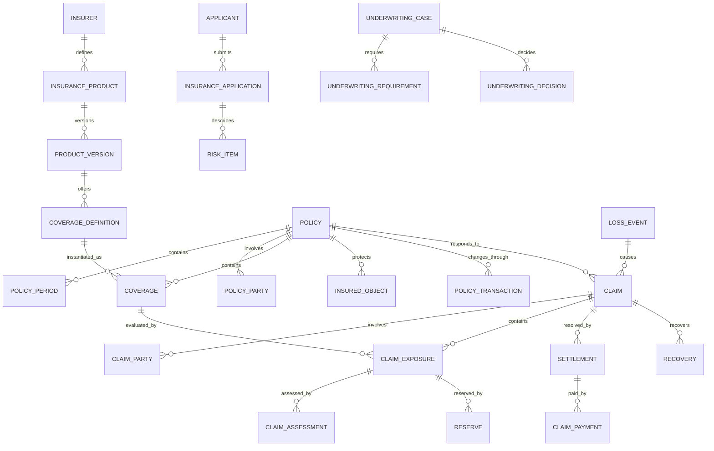

# Insurance Model Pattern

## Intent

Model insurers and intermediaries that define insurance products, evaluate risk, issue and maintain policies, collect premium, receive and investigate claims, determine coverage and liability, establish reserves, settle losses, recover amounts, and meet regulatory and financial obligations.

This pattern specializes the Cross-Industry Party, Role, Product, Offering, Agreement, Classification, Event, Status, Charge, Invoice, Payment, Work Effort, and Outcome concepts.

## Business overview

**Need/Risk → Product/Quote → Application → Underwriting → Policy/Coverage → Premium → Loss → Claim → Assessment → Reserve → Settlement/Recovery**

An Insurer defines Insurance Products and Offerings. An Applicant supplies risk information through an Application and may receive one or more Quotes. Underwriting evaluates the risk and makes an explainable decision. An accepted offer produces a Policy containing Coverages, terms, limits, deductibles, insured Parties, and insured Objects. Premium and billing obligations arise during the Policy period. A Loss Event may produce one or more Claims. Each Claim evaluates policy status, coverage, causation, liability, damages, fraud indicators, and required evidence. The Insurer establishes reserves, approves or denies covered amounts, makes payments, and may pursue recovery or subrogation.

## Pattern variants

### Simple

Use for a focused prototype or one line of business.

Core concepts: Customer; Insurance Product; Quote; Policy; Coverage; Insured Object; Premium; Claim; Claim Assessment; Claim Payment.

### Standard

Use as the default for an operational insurance application.

Adds: Insurer; Producer; Applicant; Application; Underwriting Case; Underwriting Decision; Policy Party; Policy Term; Coverage Term; Exclusion; Endorsement; Risk Item; Billing Account; Premium Transaction; Loss Event; Claim Party; Claim Exposure; Claim Assignment; Claim Note; Evidence Item; Reserve; Settlement; Recovery.

### Enterprise

Use for multiple legal entities, products, jurisdictions, distribution channels, complex claims, reinsurance, or regulated financial reporting.

Adds: Product Version; Rating Plan; Rating Factor; Rate Table; Distribution Agreement; Commission; Authority Limit; Portfolio; Catastrophe Event; Litigation; Fraud Referral; Salvage; Subrogation; Reinsurance Contract; Reinsurance Coverage; Cession; Reinsurance Claim; Regulatory Classification; Financial Posting; Actuarial Measure.

## Insurance roles

| Role | Meaning |
|---|---|
| Insurer | Party accepting insurance risk and issuing the Policy. |
| Applicant | Party seeking insurance and supplying underwriting information. |
| Policyholder | Party that owns or controls the Policy. |
| Named Insured | Party explicitly granted insured status by the Policy. |
| Additional Insured | Party receiving defined protection without being the primary Policyholder. |
| Beneficiary | Party entitled to receive a benefit under defined conditions. |
| Producer | Agent, broker, or other intermediary distributing or servicing insurance. |
| Underwriter | Role evaluating risk and deciding whether and on what terms to insure it. |
| Claimant | Party seeking compensation or another benefit. |
| Claim Adjuster | Role investigating and evaluating a Claim. |
| Service Provider | Repairer, medical provider, assessor, investigator, lawyer, or other claim participant. |
| Reinsurer | Party accepting a portion of an Insurer's risk. |

Rule: Party identity is independent of role. One Party may perform several roles, and roles may change over time or by Policy and Claim.

## Product and offering concepts

### Insurance Product

Canonical concept: [Insurance Product](../model/requirements/insurance/insurance-product/insurance-product.md).

The canonical page contains the definition, logical attributes, rules, and source-specific detail.

### Product Version

Canonical concept: [Product Version](../model/requirements/insurance/insurance-product/product-version.md).

The canonical page contains the definition, logical attributes, rules, and source-specific detail.

### Insurance Offering

Canonical concept: [Insurance Offering](../model/requirements/insurance/insurance-product/insurance-offering.md).

The canonical page contains the definition, logical attributes, rules, and source-specific detail.

### Coverage Definition

Canonical concept: [Coverage Definition](../model/requirements/insurance/insurance-product/coverage-definition.md).

The canonical page contains the definition, logical attributes, rules, and source-specific detail.

### Policy Form

Canonical concept: [Policy Form](../model/requirements/insurance/insurance-product/policy-form.md).

The canonical page contains the definition, logical attributes, rules, and source-specific detail.

### Rating Plan

Canonical concept: [Rating Plan](../model/requirements/insurance/insurance-product/rating-plan.md).

The canonical page contains the definition, logical attributes, rules, and source-specific detail.

### Rating Factor

Canonical concept: [Rating Factor](../model/requirements/insurance/insurance-product/rating-factor.md).

The canonical page contains the definition, logical attributes, rules, and source-specific detail.

## Quote, application, and underwriting

### Quote

Canonical concept: [Quote](../model/requirements/insurance/quote/quote.md).

The canonical page contains the definition, logical attributes, rules, and source-specific detail.

### Quote Option

Canonical concept: [Quote Option](../model/requirements/insurance/quote/quote-option.md).

The canonical page contains the definition, logical attributes, rules, and source-specific detail.

### Insurance Application

Canonical concept: [Insurance Application](../model/requirements/insurance/quote/insurance-application.md).

The canonical page contains the definition, logical attributes, rules, and source-specific detail.

### Application Answer

Canonical concept: [Application Answer](../model/requirements/insurance/quote/application-answer.md).

The canonical page contains the definition, logical attributes, rules, and source-specific detail.

### Risk Item

Canonical concept: [Risk Item](../model/requirements/insurance/quote/risk-item.md).

The canonical page contains the definition, logical attributes, rules, and source-specific detail.

### Underwriting Case

Canonical concept: [Underwriting Case](../model/requirements/insurance/quote/underwriting-case.md).

The canonical page contains the definition, logical attributes, rules, and source-specific detail.

### Underwriting Requirement

Canonical concept: [Underwriting Requirement](../model/requirements/insurance/quote/underwriting-requirement.md).

The canonical page contains the definition, logical attributes, rules, and source-specific detail.

### Underwriting Decision

Canonical concept: [Underwriting Decision](../model/requirements/insurance/quote/underwriting-decision.md).

The canonical page contains the definition, logical attributes, rules, and source-specific detail.

## Policy and coverage concepts

### Policy

Canonical concept: [Policy](../model/requirements/insurance/policy/policy.md).

The canonical page contains the definition, logical attributes, rules, and source-specific detail.

### Policy Period

Canonical concept: [Policy Period](../model/requirements/insurance/policy/policy-period.md).

The canonical page contains the definition, logical attributes, rules, and source-specific detail.

### Policy Party

Canonical concept: [Policy Party](../model/requirements/insurance/policy/policy-party.md).

The canonical page contains the definition, logical attributes, rules, and source-specific detail.

### Coverage

Canonical concept: [Coverage](../model/requirements/insurance/policy/coverage.md).

The canonical page contains the definition, logical attributes, rules, and source-specific detail.

### Coverage Term

Canonical concept: [Coverage Term](../model/requirements/insurance/policy/coverage-term.md).

The canonical page contains the definition, logical attributes, rules, and source-specific detail.

### Exclusion

Canonical concept: [Exclusion](../model/requirements/insurance/policy/exclusion.md).

The canonical page contains the definition, logical attributes, rules, and source-specific detail.

### Insured Object

Canonical concept: [Insured Object](../model/requirements/insurance/policy/insured-object.md).

The canonical page contains the definition, logical attributes, rules, and source-specific detail.

### Policy Transaction

Canonical concept: [Policy Transaction](../model/requirements/insurance/policy/policy-transaction.md).

The canonical page contains the definition, logical attributes, rules, and source-specific detail.

### Endorsement

Canonical concept: [Endorsement](../model/requirements/insurance/policy/endorsement.md).

The canonical page contains the definition, logical attributes, rules, and source-specific detail.

## Premium, billing, and commission

### Premium

Canonical concept: [Premium](../model/requirements/insurance/premium/premium.md).

The canonical page contains the definition, logical attributes, rules, and source-specific detail.

### Premium Transaction

Canonical concept: [Premium Transaction](../model/requirements/insurance/premium/premium-transaction.md).

The canonical page contains the definition, logical attributes, rules, and source-specific detail.

### Billing Account

Canonical concept: [Billing Account](../model/requirements/insurance/premium/billing-account.md).

The canonical page contains the definition, logical attributes, rules, and source-specific detail.

### Invoice

Canonical concept: [Invoice](../model/requirements/finance/invoice/invoice.md).

The canonical page contains the definition, logical attributes, rules, and source-specific detail.

### Payment

Canonical concept: [Payment](../model/requirements/finance/invoice/payment.md).

The canonical page contains the definition, logical attributes, rules, and source-specific detail.

### Commission

Canonical concept: [Commission](../model/requirements/insurance/premium/commission.md).

The canonical page contains the definition, logical attributes, rules, and source-specific detail.

## Loss and claim concepts

### Loss Event

Canonical concept: [Loss Event](../model/requirements/insurance/loss-event/loss-event.md).

The canonical page contains the definition, logical attributes, rules, and source-specific detail.

### Claim

Canonical concept: [Claim](../model/requirements/insurance/loss-event/claim.md).

The canonical page contains the definition, logical attributes, rules, and source-specific detail.

### Claim Party

Canonical concept: [Claim Party](../model/requirements/insurance/loss-event/claim-party.md).

The canonical page contains the definition, logical attributes, rules, and source-specific detail.

### Claim Exposure

Canonical concept: [Claim Exposure](../model/requirements/insurance/loss-event/claim-exposure.md).

The canonical page contains the definition, logical attributes, rules, and source-specific detail.

### Claim Assignment

Canonical concept: [Claim Assignment](../model/requirements/insurance/loss-event/claim-assignment.md).

The canonical page contains the definition, logical attributes, rules, and source-specific detail.

### Claim Assessment

Canonical concept: [Claim Assessment](../model/requirements/insurance/loss-event/claim-assessment.md).

The canonical page contains the definition, logical attributes, rules, and source-specific detail.

### Evidence Item

Canonical concept: [Evidence Item](../model/requirements/insurance/loss-event/evidence-item.md).

The canonical page contains the definition, logical attributes, rules, and source-specific detail.

### Claim Note

Canonical concept: [Claim Note](../model/requirements/insurance/loss-event/claim-note.md).

The canonical page contains the definition, logical attributes, rules, and source-specific detail.

### Reserve

Canonical concept: [Reserve](../model/requirements/insurance/loss-event/reserve.md).

The canonical page contains the definition, logical attributes, rules, and source-specific detail.

### Settlement

Canonical concept: [Settlement](../model/requirements/insurance/loss-event/settlement.md).

The canonical page contains the definition, logical attributes, rules, and source-specific detail.

### Claim Payment

Canonical concept: [Claim Payment](../model/requirements/insurance/loss-event/claim-payment.md).

The canonical page contains the definition, logical attributes, rules, and source-specific detail.

### Recovery

Canonical concept: [Recovery](../model/requirements/insurance/loss-event/recovery.md).

The canonical page contains the definition, logical attributes, rules, and source-specific detail.

## Reinsurance concepts

### Reinsurance Contract

Canonical concept: [Reinsurance Contract](../model/requirements/insurance/reinsurance-contract/reinsurance-contract.md).

The canonical page contains the definition, logical attributes, rules, and source-specific detail.

### Reinsurance Coverage

Canonical concept: [Reinsurance Coverage](../model/requirements/insurance/reinsurance-contract/reinsurance-coverage.md).

The canonical page contains the definition, logical attributes, rules, and source-specific detail.

### Cession

Canonical concept: [Cession](../model/requirements/insurance/reinsurance-contract/cession.md).

The canonical page contains the definition, logical attributes, rules, and source-specific detail.

### Reinsurance Claim

Canonical concept: [Reinsurance Claim](../model/requirements/insurance/reinsurance-contract/reinsurance-claim.md).

The canonical page contains the definition, logical attributes, rules, and source-specific detail.

## Relationship model

| Source | Relationship | Target | Cardinality |
|---|---|---|---|
| Insurer | defines | Insurance Product | 1:M |
| Insurance Product | has | Product Version | 1:M |
| Product Version | contains | Coverage Definition | 1:M |
| Insurance Offering | makes available | Product Version | M:1 |
| Quote | contains | Quote Option | 1:M |
| Quote Option | proposes | Coverage configuration | 1:M |
| Applicant | submits | Insurance Application | 1:M |
| Insurance Application | describes | Risk Item | 1:M |
| Underwriting Case | evaluates | Application, Quote, or Policy Transaction | M:1 |
| Underwriting Case | contains | Underwriting Requirement | 1:M |
| Underwriting Case | produces | Underwriting Decision | 1:M |
| Accepted Quote/Application | produces | Policy | 1:0..1 |
| Policy | contains | Policy Period | 1:M |
| Policy | has | Policy Party | 1:M |
| Policy | covers | Insured Object | M:M through Coverage |
| Policy | contains | Coverage | 1:M |
| Coverage | derives from | Coverage Definition | M:1 |
| Coverage | has | Coverage Term or Exclusion | 1:M |
| Policy | changes through | Policy Transaction | 1:M |
| Policy Transaction | may create | Endorsement | 1:0..M |
| Coverage or Policy Period | produces | Premium | 1:M |
| Billing Account | bills | Policy | 1:M |
| Billing Account | receives | Invoice and Payment | 1:M each |
| Producer | earns | Commission | 1:M |
| Loss Event | gives rise to | Claim | 1:M |
| Policy | responds to | Claim | 1:M |
| Claim | has | Claim Party | 1:M |
| Claim | contains | Claim Exposure | 1:M |
| Claim Exposure | evaluates | Coverage | M:1 |
| Claim or Exposure | receives | Claim Assignment | 1:M |
| Claim Exposure | receives | Claim Assessment | 1:M |
| Claim | contains | Evidence Item and Claim Note | 1:M each |
| Claim Exposure | has | Reserve | 1:M over time |
| Claim or Exposure | resolves through | Settlement | 1:M |
| Settlement or approved expense | produces | Claim Payment | 1:M |
| Claim | may produce | Recovery | 1:M |
| Reinsurance Contract | contains | Reinsurance Coverage | 1:M |
| Policy or portfolio | allocates through | Cession | 1:M |
| Claim | may produce | Reinsurance Claim | 1:M |

## Lifecycle models

### Quote

Draft → Rated → Offered → Accepted

Exception outcomes: Referred; Declined; Expired; Withdrawn; Superseded.

### Insurance application

Draft → Submitted → In Review → Decision Made

Decision outcomes: Accepted; Accepted with Conditions; Declined; Postponed; Withdrawn.

### Policy

Proposed → Bound → Issued → Active → Expired

Exception outcomes: Pending Cancellation; Cancelled; Lapsed; Reinstated; Non-Renewed; Rewritten.

### Claim

Reported → Open → Assigned → Investigating → Evaluating → Decision Made → Settling → Closed

Exception outcomes: Coverage Question; Litigation; Fraud Review; Denied; Withdrawn; Reopened.

### Claim exposure

Open → Investigating → Evaluated → Approved/Denied → Settled → Closed

### Reserve

Proposed → Approved → Active → Adjusted → Released → Closed

### Settlement

Draft → Reviewed → Offered → Accepted → Approved → Paid → Completed

Exception outcomes: Rejected; Withdrawn; Voided.

## Business events

- Quote Requested, Rated, Offered, Accepted, Declined, or Expired
- Application Submitted
- Underwriting Requirement Requested or Satisfied
- Underwriting Decision Made
- Policy Bound, Issued, Endorsed, Renewed, Cancelled, Reinstated, or Expired
- Premium Calculated, Billed, Earned, Refunded, or Written Off
- Payment Received, Reversed, or Allocated
- Loss Reported
- Claim Opened, Assigned, Denied, Reopened, or Closed
- Evidence Received
- Coverage Determined
- Liability or Damage Assessed
- Reserve Established, Increased, Decreased, or Released
- Settlement Offered, Accepted, Approved, or Voided
- Claim Payment Issued, Stopped, or Recovered
- Fraud Referral Opened or Resolved
- Recovery Identified or Received
- Reinsurance Notice or Claim Submitted

## Baseline business and integrity rules

1. A Policy must identify the issuing Insurer, Product Version, Policy period, Policyholder, currency, and at least one Coverage before issuance.
2. Product, form, rate, and Coverage versions used by a Quote or Policy must be effective for its jurisdiction and transaction date.
3. Binding and underwriting decisions must identify the actor, authority, inputs, rules, rationale, and time.
4. A Coverage cannot extend beyond its Policy Period unless explicitly modeled as an extended reporting or benefit provision.
5. Policy changes are represented by effective-dated Policy Transactions; historical contractual versions are preserved.
6. Premium calculations retain rating inputs, plan version, adjustments, taxes, fees, and rounding evidence.
7. A Claim must identify a Loss Event or documented benefit-triggering circumstance and the Policy being invoked.
8. Claim coverage evaluation must use the Policy and Coverage terms effective for the relevant Loss date or trigger.
9. Authorization to pay is independent of coverage evaluation, reserve approval, and settlement authority.
10. Claim Payments cannot exceed the approved Settlement or payable amount net of prior payments, deductibles, limits, and recoveries unless a separately authorized expense applies.
11. Reserve changes preserve history, reason, authority, currency, and prior amount.
12. Claim denial must record the Coverage, exclusion, condition, evidence, authority, and rationale supporting the decision.
13. Finalized Claim evidence and decisions are corrected by amendment or supersession, not destructive overwrite.
14. Duplicate Claims and duplicate payments must be detected before approval.
15. Party access is governed by role, assignment, purpose, confidentiality, and minimum-necessary scope.
16. Financial postings, Claim Payments, Recoveries, commissions, and reinsurance amounts must reconcile to their source transactions.

## AI modeling questions

1. Which insurance lines are in scope: property, casualty, auto, liability, health, life, disability, travel, specialty, or another line?
2. Is the organization an Insurer, managing general agent, broker, third-party administrator, reinsurer, or a combination?
3. Which jurisdictions, legal entities, currencies, languages, and regulatory regimes apply?
4. Are Product, Product Version, Offering, Policy Form, Coverage Definition, and Rating Plan independently governed?
5. How are quotes generated, compared, referred, accepted, and expired?
6. Which Application questions, documents, inspections, external data, and disclosures are required?
7. Which underwriting rules are automated and which require authority-based human decisions?
8. What Party roles exist on a Policy and a Claim, and may one Party perform several roles?
9. Which insured Objects and risk characteristics are needed for each line of business?
10. Which Policy Transactions are supported, and how are effective-dated versions preserved?
11. How are premium, tax, fees, installments, commission, refunds, and cancellations calculated?
12. What constitutes a Loss Event and how may it create several Claims?
13. Which Claim Exposures, reserves, authority limits, assignments, and service providers are required?
14. How are coverage, liability, causation, damage, fraud, litigation, and settlement evaluated?
15. Which payments, salvage, subrogation, contribution, and other recoveries are supported?
16. Is reinsurance facultative, treaty, proportional, excess-of-loss, or a combination?
17. Which operational, actuarial, regulatory, and financial measures must be retained?
18. What evidence must remain immutable and auditable?

## MDE modeling guidance

- Reuse Cross-Industry Party and Party Role; do not create separate identities for Customer, Applicant, Policyholder, Insured, Claimant, Producer, and Payee.
- Keep Insurance Product, Product Version, Offering, Quote, Application, Policy, Coverage, and Policy Transaction distinct.
- Treat the Policy as a versioned Agreement and preserve the exact contractual terms applicable at any effective date.
- Keep Loss Event, Claim, Claim Exposure, Claim Assessment, Reserve, Settlement, Payment, and Recovery as separate concepts and lifecycles.
- Put eligibility, underwriting, coverage, authority, reserving, and payment rules on the entity operations they govern.
- Use cases orchestrate actor goals and branching but invoke authoritative entity operations for business decisions.
- Model external reports and data as sourced assertions with provenance, not automatically as verified truth.
- Add line-of-business specializations only where attributes, behavior, relationships, or regulation differ materially.
- Treat financial and regulatory projections as derived views with lineage to operational transactions.

## Anti-patterns

### Policy Equals Product

A Product defines reusable protection; a Policy is one effective-dated Agreement issued to particular Parties and risks.

### Coverage as a Checkbox

Coverage has terms, limits, deductibles, exclusions, effective dates, forms, insured interests, and behavior. A Boolean cannot explain contractual protection.

### One Claim, One Amount

Claims commonly contain several Exposures, assessments, reserves, settlements, payments, expenses, and recoveries.

### Claim Status as Everything

Claim, Exposure, Reserve, Settlement, Payment, litigation, fraud review, and recovery require independent states.

### Current Policy Reconstructs Historical Coverage

Endorsements and renewals change the contract. Claim decisions must use the contractual version effective for the Loss.

### Reserve Equals Payment

A Reserve estimates expected future cost; a Payment settles an approved obligation. They serve different operational and financial purposes.

### User Equals Adjuster or Underwriter

Authenticated identity is not the business role, assignment, authority, license, or employment relationship.

### Rules Hidden in Rating or Claim Code

Opaque code without durable rule, version, source, and decision evidence prevents review, explanation, and reliable change.

## Physical mapping examples

| Logical name | Example physical name |
|---|---|
| Product Version | `product_version` |
| Coverage Definition | `coverage_definition` |
| Insurance Application | `insurance_application` |
| Underwriting Case | `underwriting_case` |
| Underwriting Decision | `underwriting_decision` |
| Policy Period | `policy_period` |
| Policy Party | `policy_party` |
| Policy Transaction | `policy_transaction` |
| Claim Exposure | `claim_exposure` |
| Claim Assessment | `claim_assessment` |
| Claim Payment | `claim_payment` |
| Reinsurance Contract | `reinsurance_contract` |

Logical names remain authoritative. Technology-stack and line-of-business rules generate physical names only after the logical model is accepted.

## Future behavioral expansion

This file is an actual logical industry pattern. A metamodel-conformant Insurance knowledge base should create separate capabilities, entities, roles, rules, use cases, and workflows for Product Management, Quote and Application, Underwriting, Policy Administration, Billing, Claims, Recovery, and Reinsurance. Candidate actor-goal use cases include Configure Product Version, Generate Quote, Submit Application, Make Underwriting Decision, Bind Policy, Issue Endorsement, Renew Policy, Report Loss, Open Claim, Determine Coverage, Assess Claim Exposure, Establish Reserve, Approve Settlement, Issue Claim Payment, Pursue Recovery, and Submit Reinsurance Claim.

## Canonical model bindings

This pattern selects and connects concepts in the [coherent model](../model/README.md). The sections below are views of those definitions. Industry lifecycles, events, baseline rules, and variant choices continue to constrain the selected concepts.

| Source term | Canonical concept | ABE |
|---|---|---|
| Insurance Product | [Insurance Product](../model/requirements/insurance/insurance-product/insurance-product.md) | [Insurance Product](../model/requirements/insurance/insurance-product/README.md) |
| Product Version | [Product Version](../model/requirements/insurance/insurance-product/product-version.md) | [Insurance Product](../model/requirements/insurance/insurance-product/README.md) |
| Insurance Offering | [Insurance Offering](../model/requirements/insurance/insurance-product/insurance-offering.md) | [Insurance Product](../model/requirements/insurance/insurance-product/README.md) |
| Coverage Definition | [Coverage Definition](../model/requirements/insurance/insurance-product/coverage-definition.md) | [Insurance Product](../model/requirements/insurance/insurance-product/README.md) |
| Policy Form | [Policy Form](../model/requirements/insurance/insurance-product/policy-form.md) | [Insurance Product](../model/requirements/insurance/insurance-product/README.md) |
| Rating Plan | [Rating Plan](../model/requirements/insurance/insurance-product/rating-plan.md) | [Insurance Product](../model/requirements/insurance/insurance-product/README.md) |
| Rating Factor | [Rating Factor](../model/requirements/insurance/insurance-product/rating-factor.md) | [Insurance Product](../model/requirements/insurance/insurance-product/README.md) |
| Quote | [Quote](../model/requirements/insurance/quote/quote.md) | [Quote](../model/requirements/insurance/quote/README.md) |
| Quote Option | [Quote Option](../model/requirements/insurance/quote/quote-option.md) | [Quote](../model/requirements/insurance/quote/README.md) |
| Insurance Application | [Insurance Application](../model/requirements/insurance/quote/insurance-application.md) | [Quote](../model/requirements/insurance/quote/README.md) |
| Application Answer | [Application Answer](../model/requirements/insurance/quote/application-answer.md) | [Quote](../model/requirements/insurance/quote/README.md) |
| Risk Item | [Risk Item](../model/requirements/insurance/quote/risk-item.md) | [Quote](../model/requirements/insurance/quote/README.md) |
| Underwriting Case | [Underwriting Case](../model/requirements/insurance/quote/underwriting-case.md) | [Quote](../model/requirements/insurance/quote/README.md) |
| Underwriting Requirement | [Underwriting Requirement](../model/requirements/insurance/quote/underwriting-requirement.md) | [Quote](../model/requirements/insurance/quote/README.md) |
| Underwriting Decision | [Underwriting Decision](../model/requirements/insurance/quote/underwriting-decision.md) | [Quote](../model/requirements/insurance/quote/README.md) |
| Policy | [Policy](../model/requirements/insurance/policy/policy.md) | [Policy](../model/requirements/insurance/policy/README.md) |
| Policy Period | [Policy Period](../model/requirements/insurance/policy/policy-period.md) | [Policy](../model/requirements/insurance/policy/README.md) |
| Policy Party | [Policy Party](../model/requirements/insurance/policy/policy-party.md) | [Policy](../model/requirements/insurance/policy/README.md) |
| Coverage | [Coverage](../model/requirements/insurance/policy/coverage.md) | [Policy](../model/requirements/insurance/policy/README.md) |
| Coverage Term | [Coverage Term](../model/requirements/insurance/policy/coverage-term.md) | [Policy](../model/requirements/insurance/policy/README.md) |
| Exclusion | [Exclusion](../model/requirements/insurance/policy/exclusion.md) | [Policy](../model/requirements/insurance/policy/README.md) |
| Insured Object | [Insured Object](../model/requirements/insurance/policy/insured-object.md) | [Policy](../model/requirements/insurance/policy/README.md) |
| Policy Transaction | [Policy Transaction](../model/requirements/insurance/policy/policy-transaction.md) | [Policy](../model/requirements/insurance/policy/README.md) |
| Endorsement | [Endorsement](../model/requirements/insurance/policy/endorsement.md) | [Policy](../model/requirements/insurance/policy/README.md) |
| Premium | [Premium](../model/requirements/insurance/premium/premium.md) | [Premium](../model/requirements/insurance/premium/README.md) |
| Premium Transaction | [Premium Transaction](../model/requirements/insurance/premium/premium-transaction.md) | [Premium](../model/requirements/insurance/premium/README.md) |
| Billing Account | [Billing Account](../model/requirements/insurance/premium/billing-account.md) | [Premium](../model/requirements/insurance/premium/README.md) |
| Invoice | [Invoice](../model/requirements/finance/invoice/invoice.md) | [Invoice](../model/requirements/finance/invoice/README.md) |
| Payment | [Payment](../model/requirements/finance/invoice/payment.md) | [Invoice](../model/requirements/finance/invoice/README.md) |
| Commission | [Commission](../model/requirements/insurance/premium/commission.md) | [Premium](../model/requirements/insurance/premium/README.md) |
| Loss Event | [Loss Event](../model/requirements/insurance/loss-event/loss-event.md) | [Loss Event](../model/requirements/insurance/loss-event/README.md) |
| Claim | [Claim](../model/requirements/insurance/loss-event/claim.md) | [Loss Event](../model/requirements/insurance/loss-event/README.md) |
| Claim Party | [Claim Party](../model/requirements/insurance/loss-event/claim-party.md) | [Loss Event](../model/requirements/insurance/loss-event/README.md) |
| Claim Exposure | [Claim Exposure](../model/requirements/insurance/loss-event/claim-exposure.md) | [Loss Event](../model/requirements/insurance/loss-event/README.md) |
| Claim Assignment | [Claim Assignment](../model/requirements/insurance/loss-event/claim-assignment.md) | [Loss Event](../model/requirements/insurance/loss-event/README.md) |
| Claim Assessment | [Claim Assessment](../model/requirements/insurance/loss-event/claim-assessment.md) | [Loss Event](../model/requirements/insurance/loss-event/README.md) |
| Evidence Item | [Evidence Item](../model/requirements/insurance/loss-event/evidence-item.md) | [Loss Event](../model/requirements/insurance/loss-event/README.md) |
| Claim Note | [Claim Note](../model/requirements/insurance/loss-event/claim-note.md) | [Loss Event](../model/requirements/insurance/loss-event/README.md) |
| Reserve | [Reserve](../model/requirements/insurance/loss-event/reserve.md) | [Loss Event](../model/requirements/insurance/loss-event/README.md) |
| Settlement | [Settlement](../model/requirements/insurance/loss-event/settlement.md) | [Loss Event](../model/requirements/insurance/loss-event/README.md) |
| Claim Payment | [Claim Payment](../model/requirements/insurance/loss-event/claim-payment.md) | [Loss Event](../model/requirements/insurance/loss-event/README.md) |
| Recovery | [Recovery](../model/requirements/insurance/loss-event/recovery.md) | [Loss Event](../model/requirements/insurance/loss-event/README.md) |
| Reinsurance Contract | [Reinsurance Contract](../model/requirements/insurance/reinsurance-contract/reinsurance-contract.md) | [Reinsurance Contract](../model/requirements/insurance/reinsurance-contract/README.md) |
| Reinsurance Coverage | [Reinsurance Coverage](../model/requirements/insurance/reinsurance-contract/reinsurance-coverage.md) | [Reinsurance Contract](../model/requirements/insurance/reinsurance-contract/README.md) |
| Cession | [Cession](../model/requirements/insurance/reinsurance-contract/cession.md) | [Reinsurance Contract](../model/requirements/insurance/reinsurance-contract/README.md) |
| Reinsurance Claim | [Reinsurance Claim](../model/requirements/insurance/reinsurance-contract/reinsurance-claim.md) | [Reinsurance Contract](../model/requirements/insurance/reinsurance-contract/README.md) |
