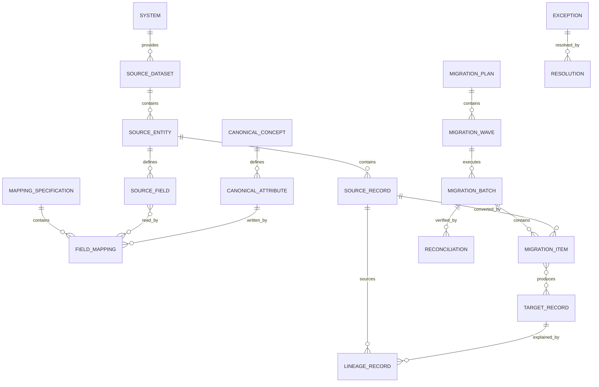

# Real-World Extensions and Legacy Conversion Pattern

## Intent

Model how existing operational data, terminology, identifiers, rules, integrations, and historical evidence are understood, mapped, migrated, reconciled, and governed when adopting an MDE application or canonical industry pattern.

This pattern supports brownfield applications, data migration, system consolidation, staged modernization, merger integration, and continuing coexistence with legacy systems.

## Business overview

**Discover → Profile → Interpret → Map → Transform → Validate → Reconcile → Cut Over → Operate/Retire**

A Source System contains Source Records that express legacy business meaning. Those records are profiled and mapped to Canonical Concepts and attributes. Transformation Rules convert values while preserving lineage. Migration Batches execute the conversion, create Target Records, and produce validation and reconciliation evidence. Exceptions are resolved explicitly. During coexistence, ownership and synchronization rules determine which system may create or change each fact. Cutover transfers operational authority, and retirement preserves required history and audit evidence.

## Pattern variants

### Simple

Use for importing one bounded dataset into a new application.

Core concepts: Source System; Source Dataset; Source Record; External Identifier; Mapping Specification; Transformation Rule; Import Batch; Import Result; Conversion Error.

### Standard

Use as the default for controlled migration or brownfield modernization.

Adds: Canonical Concept; Source Field; Target Field; Value Mapping; Record Link; Data Profile; Data Quality Rule; Data Quality Finding; Migration Plan; Migration Batch; Migration Item; Validation Result; Reconciliation; Exception; Resolution; Cutover Event; Lineage Record.

### Enterprise

Use for multiple source and target systems, continuing coexistence, master data, regulated history, mergers, or phased retirement.

Adds: System of Record Assignment; Data Ownership Rule; Golden Record; Match Candidate; Match Decision; Merge/Split History; Synchronization Contract; Change Capture; Conflict; Retention Policy; Archive Package; Legal Hold; Control Evidence; Wave; Dependency; Rollback Point; Decommission Plan.

## Core roles

| Role | Meaning |
|---|---|
| Business Owner | Accountable for the meaning and acceptable use of migrated business information. |
| Data Steward | Resolves definitions, mappings, quality issues, matches, and exceptions. |
| Source Custodian | Understands and provides the source system and its operational constraints. |
| Target Owner | Accepts converted data into the target application or canonical model. |
| Migration Operator | Executes approved migration batches and recovery actions. |
| Reviewer/Auditor | Verifies controls, reconciliation, lineage, and evidence. |

## Source landscape

### System

Canonical concept: [System](../model/requirements/legacy-conversion/system/system.md).

The canonical page contains the definition, logical attributes, rules, and source-specific detail.

### Source Dataset

Canonical concept: [Source Dataset](../model/requirements/legacy-conversion/system/source-dataset.md).

The canonical page contains the definition, logical attributes, rules, and source-specific detail.

### Source Entity

Canonical concept: [Source Entity](../model/requirements/legacy-conversion/system/source-entity.md).

The canonical page contains the definition, logical attributes, rules, and source-specific detail.

### Source Field

Canonical concept: [Source Field](../model/requirements/legacy-conversion/system/source-field.md).

The canonical page contains the definition, logical attributes, rules, and source-specific detail.

### Source Record

Canonical concept: [Source Record](../model/requirements/legacy-conversion/system/source-record.md).

The canonical page contains the definition, logical attributes, rules, and source-specific detail.

## Canonical and target concepts

### Canonical Concept

Canonical concept: [Canonical Concept](../model/requirements/legacy-conversion/canonical-concept/canonical-concept.md).

The canonical page contains the definition, logical attributes, rules, and source-specific detail.

### Canonical Attribute

Canonical concept: [Canonical Attribute](../model/requirements/legacy-conversion/canonical-concept/canonical-attribute.md).

The canonical page contains the definition, logical attributes, rules, and source-specific detail.

### Target Store

Canonical concept: [Target Store](../model/requirements/legacy-conversion/canonical-concept/target-store.md).

The canonical page contains the definition, logical attributes, rules, and source-specific detail.

### Target Record

Canonical concept: [Target Record](../model/requirements/legacy-conversion/canonical-concept/target-record.md).

The canonical page contains the definition, logical attributes, rules, and source-specific detail.

## Identity and correspondence

### External Identifier

Canonical concept: [External Identifier](../model/requirements/legacy-conversion/external-identifier/external-identifier.md).

The canonical page contains the definition, logical attributes, rules, and source-specific detail.

### Record Link

Canonical concept: [Record Link](../model/requirements/legacy-conversion/external-identifier/record-link.md).

The canonical page contains the definition, logical attributes, rules, and source-specific detail.

### Match Candidate

Canonical concept: [Match Candidate](../model/requirements/legacy-conversion/external-identifier/match-candidate.md).

The canonical page contains the definition, logical attributes, rules, and source-specific detail.

### Match Decision

Canonical concept: [Match Decision](../model/requirements/legacy-conversion/external-identifier/match-decision.md).

The canonical page contains the definition, logical attributes, rules, and source-specific detail.

### Golden Record

Canonical concept: [Golden Record](../model/requirements/legacy-conversion/external-identifier/golden-record.md).

The canonical page contains the definition, logical attributes, rules, and source-specific detail.

### Merge/Split History

Canonical concept: [Merge/Split History](../model/requirements/legacy-conversion/external-identifier/merge-split-history.md).

The canonical page contains the definition, logical attributes, rules, and source-specific detail.

## Mapping and transformation

### Mapping Specification

Canonical concept: [Mapping Specification](../model/requirements/legacy-conversion/mapping-specification/mapping-specification.md).

The canonical page contains the definition, logical attributes, rules, and source-specific detail.

### Field Mapping

Canonical concept: [Field Mapping](../model/requirements/legacy-conversion/mapping-specification/field-mapping.md).

The canonical page contains the definition, logical attributes, rules, and source-specific detail.

### Value Mapping

Canonical concept: [Value Mapping](../model/requirements/legacy-conversion/mapping-specification/value-mapping.md).

The canonical page contains the definition, logical attributes, rules, and source-specific detail.

### Transformation Rule

Canonical concept: [Transformation Rule](../model/requirements/legacy-conversion/mapping-specification/transformation-rule.md).

The canonical page contains the definition, logical attributes, rules, and source-specific detail.

### Default Rule

Canonical concept: [Default Rule](../model/requirements/legacy-conversion/mapping-specification/default-rule.md).

The canonical page contains the definition, logical attributes, rules, and source-specific detail.

## Discovery and data quality

### Data Profile

Canonical concept: [Data Profile](../model/requirements/legacy-conversion/data-profile/data-profile.md).

The canonical page contains the definition, logical attributes, rules, and source-specific detail.

### Data Quality Rule

Canonical concept: [Data Quality Rule](../model/requirements/legacy-conversion/data-profile/data-quality-rule.md).

The canonical page contains the definition, logical attributes, rules, and source-specific detail.

### Data Quality Finding

Canonical concept: [Data Quality Finding](../model/requirements/legacy-conversion/data-profile/data-quality-finding.md).

The canonical page contains the definition, logical attributes, rules, and source-specific detail.

### Semantic Issue

Canonical concept: [Semantic Issue](../model/requirements/legacy-conversion/data-profile/semantic-issue.md).

The canonical page contains the definition, logical attributes, rules, and source-specific detail.

## Migration planning and execution

### Migration Plan

Canonical concept: [Migration Plan](../model/requirements/legacy-conversion/migration-plan/migration-plan.md).

The canonical page contains the definition, logical attributes, rules, and source-specific detail.

### Migration Wave

Canonical concept: [Migration Wave](../model/requirements/legacy-conversion/migration-plan/migration-wave.md).

The canonical page contains the definition, logical attributes, rules, and source-specific detail.

### Migration Batch

Canonical concept: [Migration Batch](../model/requirements/legacy-conversion/migration-plan/migration-batch.md).

The canonical page contains the definition, logical attributes, rules, and source-specific detail.

### Migration Item

Canonical concept: [Migration Item](../model/requirements/legacy-conversion/migration-plan/migration-item.md).

The canonical page contains the definition, logical attributes, rules, and source-specific detail.

### Validation Result

Canonical concept: [Validation Result](../model/requirements/legacy-conversion/migration-plan/validation-result.md).

The canonical page contains the definition, logical attributes, rules, and source-specific detail.

### Conversion Error

Canonical concept: [Conversion Error](../model/requirements/legacy-conversion/migration-plan/conversion-error.md).

The canonical page contains the definition, logical attributes, rules, and source-specific detail.

### Exception

Canonical concept: [Exception](../model/requirements/legacy-conversion/migration-plan/exception.md).

The canonical page contains the definition, logical attributes, rules, and source-specific detail.

### Resolution

Canonical concept: [Resolution](../model/requirements/legacy-conversion/migration-plan/resolution.md).

The canonical page contains the definition, logical attributes, rules, and source-specific detail.

## Lineage, reconciliation, and evidence

### Lineage Record

Canonical concept: [Lineage Record](../model/requirements/legacy-conversion/lineage-record/lineage-record.md).

The canonical page contains the definition, logical attributes, rules, and source-specific detail.

### Reconciliation

Canonical concept: [Reconciliation](../model/requirements/legacy-conversion/lineage-record/reconciliation.md).

The canonical page contains the definition, logical attributes, rules, and source-specific detail.

### Control Evidence

Canonical concept: [Control Evidence](../model/requirements/legacy-conversion/lineage-record/control-evidence.md).

The canonical page contains the definition, logical attributes, rules, and source-specific detail.

## Coexistence and synchronization

### System of Record Assignment

Canonical concept: [System of Record Assignment](../model/requirements/legacy-conversion/system-of-record-assignment/system-of-record-assignment.md).

The canonical page contains the definition, logical attributes, rules, and source-specific detail.

### Data Ownership Rule

Canonical concept: [Data Ownership Rule](../model/requirements/legacy-conversion/system-of-record-assignment/data-ownership-rule.md).

The canonical page contains the definition, logical attributes, rules, and source-specific detail.

### Synchronization Contract

Canonical concept: [Synchronization Contract](../model/requirements/legacy-conversion/system-of-record-assignment/synchronization-contract.md).

The canonical page contains the definition, logical attributes, rules, and source-specific detail.

### Change Capture

Canonical concept: [Change Capture](../model/requirements/legacy-conversion/system-of-record-assignment/change-capture.md).

The canonical page contains the definition, logical attributes, rules, and source-specific detail.

### Conflict

Canonical concept: [Conflict](../model/requirements/legacy-conversion/system-of-record-assignment/conflict.md).

The canonical page contains the definition, logical attributes, rules, and source-specific detail.

## Cutover, archive, and retirement

### Cutover Event

Canonical concept: [Cutover Event](../model/requirements/legacy-conversion/cutover-event/cutover-event.md).

The canonical page contains the definition, logical attributes, rules, and source-specific detail.

### Rollback Point

Canonical concept: [Rollback Point](../model/requirements/legacy-conversion/cutover-event/rollback-point.md).

The canonical page contains the definition, logical attributes, rules, and source-specific detail.

### Archive Package

Canonical concept: [Archive Package](../model/requirements/legacy-conversion/cutover-event/archive-package.md).

The canonical page contains the definition, logical attributes, rules, and source-specific detail.

### Retention Policy

Canonical concept: [Retention Policy](../model/requirements/legacy-conversion/cutover-event/retention-policy.md).

The canonical page contains the definition, logical attributes, rules, and source-specific detail.

### Decommission Plan

Canonical concept: [Decommission Plan](../model/requirements/legacy-conversion/cutover-event/decommission-plan.md).

The canonical page contains the definition, logical attributes, rules, and source-specific detail.

## Relationship model

| Source | Relationship | Target | Cardinality |
|---|---|---|---|
| System | provides | Source Dataset | 1:M |
| Source Dataset | contains | Source Entity | 1:M |
| Source Entity | defines | Source Field | 1:M |
| Source Entity | contains | Source Record | 1:M |
| Canonical Concept | defines | Canonical Attribute | 1:M |
| Target Store | contains | Target Record | 1:M |
| Source Record | corresponds through | Record Link | 1:M |
| Target Record or Golden Record | corresponds through | Record Link | 1:M |
| Mapping Specification | contains | Field Mapping | 1:M |
| Field Mapping | reads | Source Field | M:M |
| Field Mapping | writes | Canonical Attribute | M:1 |
| Field Mapping | uses | Transformation Rule or Value Mapping | M:M |
| Data Profile | describes | Dataset, Entity, or Field | M:1 |
| Data Quality Rule | produces | Data Quality Finding | 1:M |
| Migration Plan | contains | Migration Wave | 1:M |
| Migration Wave | executes through | Migration Batch | 1:M |
| Migration Batch | contains | Migration Item | 1:M |
| Migration Item | reads | Source Record | M:1 |
| Migration Item | creates or updates | Target Record | M:0..M |
| Migration Item | produces | Validation Result or Conversion Error | 1:M |
| Exception | is resolved by | Resolution | 1:0..M |
| Lineage Record | connects | Source Field and Target Attribute | M:1 each |
| Reconciliation | evaluates | Migration Batch or Wave | M:1 |
| System of Record Assignment | assigns authority to | System | M:1 |
| Synchronization Contract | connects | Publisher System and Consumer System | M:1 each |
| Change Capture | may create | Conflict | M:0..M |
| Cutover Event | activates | System of Record Assignment | 1:M |
| Decommission Plan | preserves | Archive Package | 1:M |

## Lifecycle models

### Mapping specification

Draft → Reviewed → Approved → Active → Superseded → Retired

### Migration batch

Prepared → Validated → Approved → Running → Completed → Reconciled → Accepted

Exception outcomes: Partially Completed; Failed; Cancelled; Rolled Back.

### Migration item

Pending → Transformed → Validated → Applied → Verified

Exception outcomes: Rejected; Failed; Quarantined; Skipped.

### Exception

Open → Assigned → Investigating → Decision Required → Resolved → Verified → Closed

### Cutover

Planned → Ready → Started → Data Frozen → Final Sync → Verified → Activated → Stabilized → Completed

Exception outcomes: Paused; Failed; Rolled Back.

### Legacy system

Active → Read Only → Archived → Decommissioned

## Business events

- Source Dataset Registered
- Source Profile Completed
- Semantic Issue Identified
- Mapping Proposed, Approved, or Superseded
- Source Extract Frozen
- Migration Batch Started, Completed, Failed, or Rolled Back
- Record Converted, Rejected, Quarantined, or Corrected
- Match Proposed, Accepted, or Rejected
- Identity Merged or Split
- Reconciliation Passed or Failed
- Exception Opened or Resolved
- Cutover Authorized, Activated, or Rolled Back
- System of Record Changed
- Legacy System Set Read Only, Archived, or Decommissioned

## Baseline integrity and governance rules

1. Every Target Record created by conversion must trace to its Source Record, mapping version, transformation version, and batch.
2. Source data is never silently overwritten during profiling or conversion.
3. Mapping changes require a new version and do not rewrite evidence from prior batches.
4. Every ignored Source Field or excluded record population requires an explicit disposition and reason.
5. Defaulted, inferred, corrected, and manually entered values must remain distinguishable from observed source values.
6. A Migration Batch must identify immutable source scope and executable mapping versions.
7. Re-running the same approved batch input must be idempotent or declare and control its non-idempotent effects.
8. Batch acceptance requires agreed validation and reconciliation criteria to pass or documented exceptions to be approved.
9. Record-count reconciliation alone is insufficient when balances, relationships, classifications, or business meaning are material.
10. Match and merge decisions preserve candidates, evidence, decision maker, and prior identity history.
11. During coexistence, each synchronized fact must have a declared owner and conflict policy.
12. Cutover cannot proceed until rollback, access, monitoring, support, and reconciliation controls are ready.
13. Decommissioning requires verified archive, retention, legal-hold, access, and dependency disposition.
14. Sensitive source data may be copied only into authorized environments and retained only for the approved purpose and period.

## AI discovery questions

1. Which business capabilities and populations are being migrated or modernized?
2. Which systems, files, interfaces, documents, and manual processes are sources?
3. What does each source concept and code actually mean to its users?
4. Which source and target versions are in scope?
5. Which identifiers are stable, external, duplicated, reused, missing, or conflicting?
6. What is the canonical identity and how are match, merge, and split decisions made?
7. Which fields map directly, derive, split, concatenate, classify, aggregate, default, ignore, or require manual decisions?
8. Which system owns each concept and attribute before, during, and after cutover?
9. Is migration one-time, phased, bidirectional, or a continuing synchronization?
10. What volumes, time windows, dependencies, downtime limits, and performance constraints apply?
11. What data-quality thresholds and exceptions are acceptable?
12. Which counts, balances, totals, relationships, hashes, and semantic samples must reconcile?
13. What evidence is required for audit, legal, privacy, financial, clinical, or operational acceptance?
14. How will failed records be quarantined, corrected, replayed, and verified?
15. What is the rollback strategy and latest safe rollback point?
16. What history must remain accessible after the legacy system is retired?

## MDE modeling guidance

- Begin by discovering business meaning, not by copying table structures.
- Map source concepts to canonical MDE concepts before generating target schema.
- Keep source, canonical, and target representations explicitly separate.
- Treat mappings, transformations, quality rules, ownership, and reconciliation as versioned knowledge artifacts.
- Preserve External Identifiers and lineage as first-class evidence.
- Allow bounded anti-corruption mappings when a legacy meaning should not contaminate the canonical model.
- Support top-down specification and bottom-up extraction, then verify their agreement.
- Attach conversion rules to the canonical operations and constraints they must satisfy.
- Use migration scenarios to prove representative, boundary, failure, duplicate, missing-data, and recovery cases.

## Anti-patterns

### Copy the Legacy Schema

Recreating source tables in a new stack preserves accidental structure and hidden semantics rather than producing a canonical business model.

### ETL Code Is the Specification

Transformation code alone does not explain business meaning, ownership, acceptance criteria, or discarded information.

### One Identifier to Rule Them All

Assuming a single source key represents universal identity causes collisions, duplicates, and broken lineage.

### Clean Data in Place

Changing the only source evidence during migration prevents reproduction, audit, and rollback.

### Record Counts Prove Success

Equal counts do not prove correct values, relationships, balances, statuses, or business meaning.

### Big-Bang Without Coexistence Rules

Ignoring ownership and synchronization during transition creates conflicting updates and untraceable truth.

### Silent Defaults

Filling missing data without recording origin and rationale creates false confidence in inferred facts.

### Turn It Off and Hope

Decommissioning without verified archives, dependencies, retention, access, and rollback can make legally or operationally required history unavailable.

## Physical mapping examples

| Logical name | Example physical name |
|---|---|
| Source System | `source_system` |
| Source Record | `source_record` |
| External Identifier | `external_identifier` |
| Mapping Specification | `mapping_specification` |
| Field Mapping | `field_mapping` |
| Transformation Rule | `transformation_rule` |
| Migration Batch | `migration_batch` |
| Migration Item | `migration_item` |
| Lineage Record | `lineage_record` |
| Reconciliation | `reconciliation` |
| System of Record Assignment | `system_of_record_assignment` |

Logical names remain authoritative. Technology-stack rules generate physical names after the migration knowledge and canonical model are accepted.

## Future behavioral expansion

A later behavioral layer should define capabilities and actor-goal use cases such as Register Source, Profile Dataset, Define Mapping, Approve Mapping, Execute Trial Migration, Resolve Exception, Reconcile Batch, Match Identity, Execute Cutover, Roll Back Cutover, Archive Legacy Records, and Decommission System, with pages, scenarios, controls, and tests.

## Canonical model bindings

This pattern selects and connects concepts in the [coherent model](../model/README.md). The sections below are views of those definitions. Industry lifecycles, events, baseline rules, and variant choices continue to constrain the selected concepts.

| Source term | Canonical concept | ABE |
|---|---|---|
| System | [System](../model/requirements/legacy-conversion/system/system.md) | [System](../model/requirements/legacy-conversion/system/README.md) |
| Source Dataset | [Source Dataset](../model/requirements/legacy-conversion/system/source-dataset.md) | [System](../model/requirements/legacy-conversion/system/README.md) |
| Source Entity | [Source Entity](../model/requirements/legacy-conversion/system/source-entity.md) | [System](../model/requirements/legacy-conversion/system/README.md) |
| Source Field | [Source Field](../model/requirements/legacy-conversion/system/source-field.md) | [System](../model/requirements/legacy-conversion/system/README.md) |
| Source Record | [Source Record](../model/requirements/legacy-conversion/system/source-record.md) | [System](../model/requirements/legacy-conversion/system/README.md) |
| Canonical Concept | [Canonical Concept](../model/requirements/legacy-conversion/canonical-concept/canonical-concept.md) | [Canonical Concept](../model/requirements/legacy-conversion/canonical-concept/README.md) |
| Canonical Attribute | [Canonical Attribute](../model/requirements/legacy-conversion/canonical-concept/canonical-attribute.md) | [Canonical Concept](../model/requirements/legacy-conversion/canonical-concept/README.md) |
| Target Store | [Target Store](../model/requirements/legacy-conversion/canonical-concept/target-store.md) | [Canonical Concept](../model/requirements/legacy-conversion/canonical-concept/README.md) |
| Target Record | [Target Record](../model/requirements/legacy-conversion/canonical-concept/target-record.md) | [Canonical Concept](../model/requirements/legacy-conversion/canonical-concept/README.md) |
| External Identifier | [External Identifier](../model/requirements/legacy-conversion/external-identifier/external-identifier.md) | [External Identifier](../model/requirements/legacy-conversion/external-identifier/README.md) |
| Record Link | [Record Link](../model/requirements/legacy-conversion/external-identifier/record-link.md) | [External Identifier](../model/requirements/legacy-conversion/external-identifier/README.md) |
| Match Candidate | [Match Candidate](../model/requirements/legacy-conversion/external-identifier/match-candidate.md) | [External Identifier](../model/requirements/legacy-conversion/external-identifier/README.md) |
| Match Decision | [Match Decision](../model/requirements/legacy-conversion/external-identifier/match-decision.md) | [External Identifier](../model/requirements/legacy-conversion/external-identifier/README.md) |
| Golden Record | [Golden Record](../model/requirements/legacy-conversion/external-identifier/golden-record.md) | [External Identifier](../model/requirements/legacy-conversion/external-identifier/README.md) |
| Merge/Split History | [Merge/Split History](../model/requirements/legacy-conversion/external-identifier/merge-split-history.md) | [External Identifier](../model/requirements/legacy-conversion/external-identifier/README.md) |
| Mapping Specification | [Mapping Specification](../model/requirements/legacy-conversion/mapping-specification/mapping-specification.md) | [Mapping Specification](../model/requirements/legacy-conversion/mapping-specification/README.md) |
| Field Mapping | [Field Mapping](../model/requirements/legacy-conversion/mapping-specification/field-mapping.md) | [Mapping Specification](../model/requirements/legacy-conversion/mapping-specification/README.md) |
| Value Mapping | [Value Mapping](../model/requirements/legacy-conversion/mapping-specification/value-mapping.md) | [Mapping Specification](../model/requirements/legacy-conversion/mapping-specification/README.md) |
| Transformation Rule | [Transformation Rule](../model/requirements/legacy-conversion/mapping-specification/transformation-rule.md) | [Mapping Specification](../model/requirements/legacy-conversion/mapping-specification/README.md) |
| Default Rule | [Default Rule](../model/requirements/legacy-conversion/mapping-specification/default-rule.md) | [Mapping Specification](../model/requirements/legacy-conversion/mapping-specification/README.md) |
| Data Profile | [Data Profile](../model/requirements/legacy-conversion/data-profile/data-profile.md) | [Data Profile](../model/requirements/legacy-conversion/data-profile/README.md) |
| Data Quality Rule | [Data Quality Rule](../model/requirements/legacy-conversion/data-profile/data-quality-rule.md) | [Data Profile](../model/requirements/legacy-conversion/data-profile/README.md) |
| Data Quality Finding | [Data Quality Finding](../model/requirements/legacy-conversion/data-profile/data-quality-finding.md) | [Data Profile](../model/requirements/legacy-conversion/data-profile/README.md) |
| Semantic Issue | [Semantic Issue](../model/requirements/legacy-conversion/data-profile/semantic-issue.md) | [Data Profile](../model/requirements/legacy-conversion/data-profile/README.md) |
| Migration Plan | [Migration Plan](../model/requirements/legacy-conversion/migration-plan/migration-plan.md) | [Migration Plan](../model/requirements/legacy-conversion/migration-plan/README.md) |
| Migration Wave | [Migration Wave](../model/requirements/legacy-conversion/migration-plan/migration-wave.md) | [Migration Plan](../model/requirements/legacy-conversion/migration-plan/README.md) |
| Migration Batch | [Migration Batch](../model/requirements/legacy-conversion/migration-plan/migration-batch.md) | [Migration Plan](../model/requirements/legacy-conversion/migration-plan/README.md) |
| Migration Item | [Migration Item](../model/requirements/legacy-conversion/migration-plan/migration-item.md) | [Migration Plan](../model/requirements/legacy-conversion/migration-plan/README.md) |
| Validation Result | [Validation Result](../model/requirements/legacy-conversion/migration-plan/validation-result.md) | [Migration Plan](../model/requirements/legacy-conversion/migration-plan/README.md) |
| Conversion Error | [Conversion Error](../model/requirements/legacy-conversion/migration-plan/conversion-error.md) | [Migration Plan](../model/requirements/legacy-conversion/migration-plan/README.md) |
| Exception | [Exception](../model/requirements/legacy-conversion/migration-plan/exception.md) | [Migration Plan](../model/requirements/legacy-conversion/migration-plan/README.md) |
| Resolution | [Resolution](../model/requirements/legacy-conversion/migration-plan/resolution.md) | [Migration Plan](../model/requirements/legacy-conversion/migration-plan/README.md) |
| Lineage Record | [Lineage Record](../model/requirements/legacy-conversion/lineage-record/lineage-record.md) | [Lineage Record](../model/requirements/legacy-conversion/lineage-record/README.md) |
| Reconciliation | [Reconciliation](../model/requirements/legacy-conversion/lineage-record/reconciliation.md) | [Lineage Record](../model/requirements/legacy-conversion/lineage-record/README.md) |
| Control Evidence | [Control Evidence](../model/requirements/legacy-conversion/lineage-record/control-evidence.md) | [Lineage Record](../model/requirements/legacy-conversion/lineage-record/README.md) |
| System of Record Assignment | [System of Record Assignment](../model/requirements/legacy-conversion/system-of-record-assignment/system-of-record-assignment.md) | [System of Record Assignment](../model/requirements/legacy-conversion/system-of-record-assignment/README.md) |
| Data Ownership Rule | [Data Ownership Rule](../model/requirements/legacy-conversion/system-of-record-assignment/data-ownership-rule.md) | [System of Record Assignment](../model/requirements/legacy-conversion/system-of-record-assignment/README.md) |
| Synchronization Contract | [Synchronization Contract](../model/requirements/legacy-conversion/system-of-record-assignment/synchronization-contract.md) | [System of Record Assignment](../model/requirements/legacy-conversion/system-of-record-assignment/README.md) |
| Change Capture | [Change Capture](../model/requirements/legacy-conversion/system-of-record-assignment/change-capture.md) | [System of Record Assignment](../model/requirements/legacy-conversion/system-of-record-assignment/README.md) |
| Conflict | [Conflict](../model/requirements/legacy-conversion/system-of-record-assignment/conflict.md) | [System of Record Assignment](../model/requirements/legacy-conversion/system-of-record-assignment/README.md) |
| Cutover Event | [Cutover Event](../model/requirements/legacy-conversion/cutover-event/cutover-event.md) | [Cutover Event](../model/requirements/legacy-conversion/cutover-event/README.md) |
| Rollback Point | [Rollback Point](../model/requirements/legacy-conversion/cutover-event/rollback-point.md) | [Cutover Event](../model/requirements/legacy-conversion/cutover-event/README.md) |
| Archive Package | [Archive Package](../model/requirements/legacy-conversion/cutover-event/archive-package.md) | [Cutover Event](../model/requirements/legacy-conversion/cutover-event/README.md) |
| Retention Policy | [Retention Policy](../model/requirements/legacy-conversion/cutover-event/retention-policy.md) | [Cutover Event](../model/requirements/legacy-conversion/cutover-event/README.md) |
| Decommission Plan | [Decommission Plan](../model/requirements/legacy-conversion/cutover-event/decommission-plan.md) | [Cutover Event](../model/requirements/legacy-conversion/cutover-event/README.md) |
