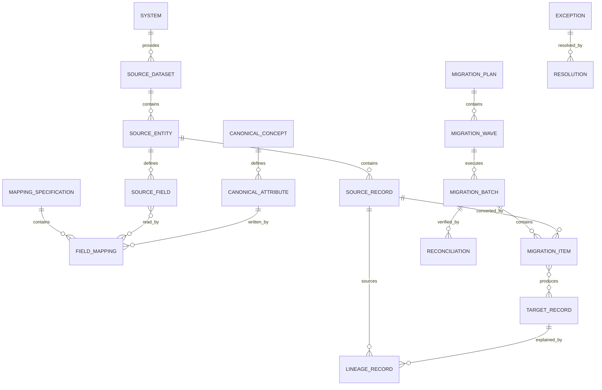

# Real-World Extensions and Legacy Conversion Pattern

## Intent

Model how existing operational data, terminology, identifiers, rules, integrations, and historical evidence are understood, mapped, migrated, reconciled, and governed when adopting an MDE application or canonical industry pattern.

This pattern supports brownfield applications, data migration, system consolidation, staged modernization, merger integration, and continuing coexistence with legacy systems.

## Business overview

**Discover → Profile → Interpret → Map → Transform → Validate → Reconcile → Cut Over → Operate/Retire**

A Source System contains Source Records that express legacy business meaning. Those records are profiled and mapped to Canonical Concepts and attributes. Transformation Rules convert values while preserving lineage. Migration Batches execute the conversion, create Target Records, and produce validation and reconciliation evidence. Exceptions are resolved explicitly. During coexistence, ownership and synchronization rules determine which system may create or change each fact. Cutover transfers operational authority, and retirement preserves required history and audit evidence.

## Pattern variants

### Simple

Use for importing one bounded dataset into a new application.

Core concepts: Source System; Source Dataset; Source Record; External Identifier; Mapping Specification; Transformation Rule; Import Batch; Import Result; Conversion Error.

### Standard

Use as the default for controlled migration or brownfield modernization.

Adds: Canonical Concept; Source Field; Target Field; Value Mapping; Record Link; Data Profile; Data Quality Rule; Data Quality Finding; Migration Plan; Migration Batch; Migration Item; Validation Result; Reconciliation; Exception; Resolution; Cutover Event; Lineage Record.

### Enterprise

Use for multiple source and target systems, continuing coexistence, master data, regulated history, mergers, or phased retirement.

Adds: System of Record Assignment; Data Ownership Rule; Golden Record; Match Candidate; Match Decision; Merge/Split History; Synchronization Contract; Change Capture; Conflict; Retention Policy; Archive Package; Legal Hold; Control Evidence; Wave; Dependency; Rollback Point; Decommission Plan.

## Core roles

| Role | Meaning |
|---|---|
| Business Owner | Accountable for the meaning and acceptable use of migrated business information. |
| Data Steward | Resolves definitions, mappings, quality issues, matches, and exceptions. |
| Source Custodian | Understands and provides the source system and its operational constraints. |
| Target Owner | Accepts converted data into the target application or canonical model. |
| Migration Operator | Executes approved migration batches and recovery actions. |
| Reviewer/Auditor | Verifies controls, reconciliation, lineage, and evidence. |

## Source landscape

### System

A bounded application, service, file-based process, database, or external provider that stores or processes business information.

Logical attributes: System Identifier; System Name; System Type; System Status; Owner; Vendor; Version; Environment; Time Zone; Character Encoding; Effective From; Effective Through.

### Source Dataset

A defined collection of source information to be analyzed or converted.

Logical attributes: Dataset Identifier; Dataset Name; Dataset Type; Source System; Location Reference; Format; Schema Version; Extract Criteria; As-of Time; Record Count; Sensitivity Classification.

### Source Entity

A structural record type in the Source Dataset, such as a table, file record, message, document type, or API resource.

Logical attributes: Source Entity Identifier; Source Name; Description; Storage Type; Natural Key Description; Estimated Volume; Retention Period.

### Source Field

A named source data element.

Logical attributes: Source Field Identifier; Field Name; Description; Data Type; Length; Nullable Indicator; Format; Default Value; Code Set; Sensitivity Classification.

### Source Record

One observed record from a Source Entity at a particular extraction point.

Logical attributes: Source Record Identifier; Source Key; Extracted At; Source Version; Source Timestamp; Raw Hash; Record Status.

Rule: Source Record identity must be stable enough to reproduce or explain a conversion result.

## Canonical and target concepts

### Canonical Concept

A technology-independent business concept accepted by the target knowledge model.

Logical attributes: Concept Identifier; Concept Name; Definition; Concept Type; Model Version; Effective From; Effective Through.

### Canonical Attribute

A defined fact belonging to a Canonical Concept.

Logical attributes: Attribute Identifier; Attribute Name; Definition; Logical Type; Required Indicator; Multiplicity; Classification Scheme reference; Constraint reference.

### Target Store

The application, service, database, index, archive, or event stream that receives converted information.

Logical attributes: Target Store Identifier; Target Name; Target Type; Target System; Schema Version; Owner; Status.

### Target Record

A created or updated representation of a Canonical Concept in a Target Store.

Logical attributes: Target Record Identifier; Target Key; Canonical Concept; Created At; Updated At; Target Version; Record Status; Record Hash.

## Identity and correspondence

### External Identifier

An identifier assigned by a source, partner, jurisdiction, or prior application.

Logical attributes: External Identifier Record; Identifier Type; Identifier Value; Assigning Authority; Source System; Status; Effective From; Effective Through.

Rule: preserve External Identifiers as mappings; do not make mutable or system-specific identifiers the canonical business identity.

### Record Link

An asserted relationship between a Source Record and a canonical or Target Record.

Logical attributes: Record Link Identifier; Link Type; Link Status; Confidence; Effective From; Effective Through; Decision reference.

Link types include exact match, probable match, created from, supersedes, duplicate of, split from, or merged into.

### Match Candidate

A proposed correspondence between records or Parties.

Logical attributes: Candidate Identifier; Match Score; Match Method; Candidate Status; Created At; Explanation.

### Match Decision

An accepted or rejected identity decision.

Logical attributes: Decision Identifier; Decision Type; Decision Status; Decided At; Decided By; Reason; Evidence Reference.

### Golden Record

A governed canonical view assembled from one or more source assertions under survivorship and ownership rules.

Logical attributes: Golden Record Identifier; Concept Type; Golden Record Status; Created At; Updated At; Survivorship Rule Version.

### Merge/Split History

Immutable evidence that canonical identities were merged or separated.

Logical attributes: Identity Change Identifier; Change Type; Effective At; Changed By; Reason; Prior Identity reference; Resulting Identity reference.

## Mapping and transformation

### Mapping Specification

A versioned declaration of how source structures and meanings correspond to canonical and target concepts.

Logical attributes: Mapping Identifier; Mapping Name; Mapping Version; Mapping Status; Source Schema Version; Target Model Version; Effective From; Effective Through; Approved By; Approved At.

### Field Mapping

A mapping from one or more Source Fields to a Canonical Attribute or Target Field.

Logical attributes: Field Mapping Identifier; Mapping Type; Source Expression; Target Attribute; Required Indicator; Default Rule; Null Handling; Sequence.

Mapping types include direct, rename, concatenate, split, derive, lookup, aggregate, classify, ignore, and manual.

### Value Mapping

A governed translation from a source value or code to a canonical value or Classification.

Logical attributes: Value Mapping Identifier; Source Value; Target Value; Mapping Status; Effective From; Effective Through; Mapping Reason.

### Transformation Rule

A deterministic rule that converts, normalizes, derives, validates, or suppresses data.

Logical attributes: Transformation Rule Identifier; Rule Name; Rule Version; Rule Type; Rule Expression; Input Contract; Output Contract; Error Behavior; Effective From; Effective Through.

### Default Rule

A declared method for supplying a value absent from the source.

Logical attributes: Default Rule Identifier; Default Type; Default Value or Expression; Applicability Condition; Evidence Requirement.

Rule: defaulted, inferred, and manually supplied values must remain distinguishable from observed source values.

## Discovery and data quality

### Data Profile

Measured characteristics of a Dataset, Source Entity, or Source Field.

Logical attributes: Profile Identifier; Profiled At; Record Count; Null Count; Distinct Count; Minimum; Maximum; Pattern Summary; Sample Reference; Source Hash.

### Data Quality Rule

A test of completeness, validity, consistency, uniqueness, timeliness, or referential integrity.

Logical attributes: Quality Rule Identifier; Rule Name; Quality Dimension; Rule Expression; Severity; Threshold; Effective From; Effective Through.

### Data Quality Finding

Evidence that source or converted data satisfied or violated a Data Quality Rule.

Logical attributes: Finding Identifier; Finding Status; Observed At; Observed Value; Expected Condition; Severity; Affected Record Count; Sample Reference.

### Semantic Issue

An ambiguity or conflict in business meaning that cannot be resolved by structural mapping alone.

Logical attributes: Semantic Issue Identifier; Issue Type; Description; Impact; Issue Status; Owner; Resolution Due Date.

Examples: overloaded legacy field, undocumented code, changed definition, conflicting dates, or one source concept representing several canonical concepts.

## Migration planning and execution

### Migration Plan

A governed plan defining scope, sequence, controls, acceptance criteria, cutover, recovery, and responsibilities.

Logical attributes: Migration Plan Identifier; Plan Name; Plan Version; Plan Status; Scope; Source Baseline; Target Version; Acceptance Criteria; Cutover Strategy; Rollback Strategy.

### Migration Wave

A business-meaningful portion of migration scope released together.

Logical attributes: Wave Identifier; Wave Name; Wave Status; Sequence; Planned Start; Planned Cutover; Actual Cutover; Scope Criteria.

### Migration Batch

One repeatable execution of an approved Mapping Specification against an identified source extract.

Logical attributes: Batch Identifier; Batch Type; Batch Status; Started At; Completed At; Source Extract reference; Mapping Version; Target Version; Submitted Count; Succeeded Count; Failed Count; Operator.

### Migration Item

The conversion outcome for one Source Record or logical group of records.

Logical attributes: Migration Item Identifier; Item Status; Source Record reference; Target Record reference; Attempt Number; Started At; Completed At; Result Code.

### Validation Result

Evidence that a Source Record, transformed record, Target Record, or batch satisfies a declared rule.

Logical attributes: Validation Result Identifier; Validation Stage; Rule reference; Result Status; Observed Value; Message; Evaluated At.

### Conversion Error

A technical or deterministic mapping failure.

Logical attributes: Error Identifier; Error Type; Error Code; Severity; Message; Occurred At; Retryable Indicator; Source Context; Rule reference.

### Exception

A business or governance decision required because automated processing cannot safely determine the result.

Logical attributes: Exception Identifier; Exception Type; Exception Status; Severity; Opened At; Owner; Due Date; Business Impact.

### Resolution

The approved disposition of an Exception or Finding.

Logical attributes: Resolution Identifier; Resolution Type; Decision; Corrective Action; Decided By; Decided At; Reason; Evidence Reference.

## Lineage, reconciliation, and evidence

### Lineage Record

Evidence connecting a target fact to its source records, mapping, transformation, execution, and decisions.

Logical attributes: Lineage Identifier; Target Record; Target Attribute; Source Record; Source Field; Mapping Version; Transformation Rule Version; Batch; Created At.

### Reconciliation

A controlled comparison between source scope and target results.

Logical attributes: Reconciliation Identifier; Reconciliation Type; Status; Source Count; Target Count; Source Total; Target Total; Difference; Tolerance; Evaluated At; Approved By.

Reconciliation types include record count, control total, monetary total, balance, status distribution, relationship count, hash, and sampled semantic comparison.

### Control Evidence

An immutable artifact proving that a required migration or cutover control was performed.

Logical attributes: Evidence Identifier; Control Type; Performed At; Performed By; Result; Artifact Reference; Hash; Retention Policy.

## Coexistence and synchronization

### System of Record Assignment

A time-bounded declaration of which System is authoritative for a Canonical Concept, attribute, population, or operation.

Logical attributes: Assignment Identifier; Scope; Authority Type; System; Effective From; Effective Through; Priority.

### Data Ownership Rule

A rule declaring who may create, update, correct, or approve a particular fact.

Logical attributes: Ownership Rule Identifier; Subject Scope; Attribute Scope; Owning Role; Permitted Operations; Condition; Effective From; Effective Through.

### Synchronization Contract

A versioned agreement governing data exchanged between Systems.

Logical attributes: Contract Identifier; Contract Version; Publisher; Consumer; Data Scope; Direction; Trigger; Delivery Guarantee; Ordering Rule; Idempotency Rule; Error Policy; Status.

### Change Capture

Evidence of a source change offered for synchronization.

Logical attributes: Change Identifier; Source Record; Change Type; Source Version; Occurred At; Captured At; Sequence; Payload Hash.

### Conflict

Competing changes or assertions that violate ownership, ordering, or consistency rules.

Logical attributes: Conflict Identifier; Conflict Type; Conflict Status; Detected At; Source Assertions; Resolution Policy; Resolved At.

## Cutover, archive, and retirement

### Cutover Event

The controlled transfer of operational responsibility from one system configuration to another.

Logical attributes: Cutover Identifier; Cutover Type; Cutover Status; Planned At; Started At; Completed At; Decision Authority; Rollback Deadline.

### Rollback Point

A verified state to which systems and data can be restored.

Logical attributes: Rollback Point Identifier; Captured At; Scope; Storage Reference; Validation Status; Expiration Date.

### Archive Package

A preserved collection of legacy records, metadata, schemas, documentation, and access instructions.

Logical attributes: Archive Identifier; Archive Type; Created At; Content Scope; Format; Encryption Reference; Hash; Retention End; Access Policy.

### Retention Policy

A rule governing how long information and evidence must be retained and how it may be disposed.

Logical attributes: Retention Policy Identifier; Record Class; Retention Period; Trigger Event; Disposition; Jurisdiction; Effective From; Effective Through.

### Decommission Plan

A governed plan for removing a legacy System from operational use.

Logical attributes: Decommission Plan Identifier; Plan Status; Preconditions; Dependency Summary; Archive Requirement; Access Requirement; Planned Date; Actual Date; Approval.

## Relationship model

| Source | Relationship | Target | Cardinality |
|---|---|---|---|
| System | provides | Source Dataset | 1:M |
| Source Dataset | contains | Source Entity | 1:M |
| Source Entity | defines | Source Field | 1:M |
| Source Entity | contains | Source Record | 1:M |
| Canonical Concept | defines | Canonical Attribute | 1:M |
| Target Store | contains | Target Record | 1:M |
| Source Record | corresponds through | Record Link | 1:M |
| Target Record or Golden Record | corresponds through | Record Link | 1:M |
| Mapping Specification | contains | Field Mapping | 1:M |
| Field Mapping | reads | Source Field | M:M |
| Field Mapping | writes | Canonical Attribute | M:1 |
| Field Mapping | uses | Transformation Rule or Value Mapping | M:M |
| Data Profile | describes | Dataset, Entity, or Field | M:1 |
| Data Quality Rule | produces | Data Quality Finding | 1:M |
| Migration Plan | contains | Migration Wave | 1:M |
| Migration Wave | executes through | Migration Batch | 1:M |
| Migration Batch | contains | Migration Item | 1:M |
| Migration Item | reads | Source Record | M:1 |
| Migration Item | creates or updates | Target Record | M:0..M |
| Migration Item | produces | Validation Result or Conversion Error | 1:M |
| Exception | is resolved by | Resolution | 1:0..M |
| Lineage Record | connects | Source Field and Target Attribute | M:1 each |
| Reconciliation | evaluates | Migration Batch or Wave | M:1 |
| System of Record Assignment | assigns authority to | System | M:1 |
| Synchronization Contract | connects | Publisher System and Consumer System | M:1 each |
| Change Capture | may create | Conflict | M:0..M |
| Cutover Event | activates | System of Record Assignment | 1:M |
| Decommission Plan | preserves | Archive Package | 1:M |

## Lifecycle models

### Mapping specification

Draft → Reviewed → Approved → Active → Superseded → Retired

### Migration batch

Prepared → Validated → Approved → Running → Completed → Reconciled → Accepted

Exception outcomes: Partially Completed; Failed; Cancelled; Rolled Back.

### Migration item

Pending → Transformed → Validated → Applied → Verified

Exception outcomes: Rejected; Failed; Quarantined; Skipped.

### Exception

Open → Assigned → Investigating → Decision Required → Resolved → Verified → Closed

### Cutover

Planned → Ready → Started → Data Frozen → Final Sync → Verified → Activated → Stabilized → Completed

Exception outcomes: Paused; Failed; Rolled Back.

### Legacy system

Active → Read Only → Archived → Decommissioned

## Business events

- Source Dataset Registered
- Source Profile Completed
- Semantic Issue Identified
- Mapping Proposed, Approved, or Superseded
- Source Extract Frozen
- Migration Batch Started, Completed, Failed, or Rolled Back
- Record Converted, Rejected, Quarantined, or Corrected
- Match Proposed, Accepted, or Rejected
- Identity Merged or Split
- Reconciliation Passed or Failed
- Exception Opened or Resolved
- Cutover Authorized, Activated, or Rolled Back
- System of Record Changed
- Legacy System Set Read Only, Archived, or Decommissioned

## Baseline integrity and governance rules

1. Every Target Record created by conversion must trace to its Source Record, mapping version, transformation version, and batch.
2. Source data is never silently overwritten during profiling or conversion.
3. Mapping changes require a new version and do not rewrite evidence from prior batches.
4. Every ignored Source Field or excluded record population requires an explicit disposition and reason.
5. Defaulted, inferred, corrected, and manually entered values must remain distinguishable from observed source values.
6. A Migration Batch must identify immutable source scope and executable mapping versions.
7. Re-running the same approved batch input must be idempotent or declare and control its non-idempotent effects.
8. Batch acceptance requires agreed validation and reconciliation criteria to pass or documented exceptions to be approved.
9. Record-count reconciliation alone is insufficient when balances, relationships, classifications, or business meaning are material.
10. Match and merge decisions preserve candidates, evidence, decision maker, and prior identity history.
11. During coexistence, each synchronized fact must have a declared owner and conflict policy.
12. Cutover cannot proceed until rollback, access, monitoring, support, and reconciliation controls are ready.
13. Decommissioning requires verified archive, retention, legal-hold, access, and dependency disposition.
14. Sensitive source data may be copied only into authorized environments and retained only for the approved purpose and period.

## AI discovery questions

1. Which business capabilities and populations are being migrated or modernized?
2. Which systems, files, interfaces, documents, and manual processes are sources?
3. What does each source concept and code actually mean to its users?
4. Which source and target versions are in scope?
5. Which identifiers are stable, external, duplicated, reused, missing, or conflicting?
6. What is the canonical identity and how are match, merge, and split decisions made?
7. Which fields map directly, derive, split, concatenate, classify, aggregate, default, ignore, or require manual decisions?
8. Which system owns each concept and attribute before, during, and after cutover?
9. Is migration one-time, phased, bidirectional, or a continuing synchronization?
10. What volumes, time windows, dependencies, downtime limits, and performance constraints apply?
11. What data-quality thresholds and exceptions are acceptable?
12. Which counts, balances, totals, relationships, hashes, and semantic samples must reconcile?
13. What evidence is required for audit, legal, privacy, financial, clinical, or operational acceptance?
14. How will failed records be quarantined, corrected, replayed, and verified?
15. What is the rollback strategy and latest safe rollback point?
16. What history must remain accessible after the legacy system is retired?

## MDE modeling guidance

- Begin by discovering business meaning, not by copying table structures.
- Map source concepts to canonical MDE concepts before generating target schema.
- Keep source, canonical, and target representations explicitly separate.
- Treat mappings, transformations, quality rules, ownership, and reconciliation as versioned knowledge artifacts.
- Preserve External Identifiers and lineage as first-class evidence.
- Allow bounded anti-corruption mappings when a legacy meaning should not contaminate the canonical model.
- Support top-down specification and bottom-up extraction, then verify their agreement.
- Attach conversion rules to the canonical operations and constraints they must satisfy.
- Use migration scenarios to prove representative, boundary, failure, duplicate, missing-data, and recovery cases.

## Anti-patterns

### Copy the Legacy Schema

Recreating source tables in a new stack preserves accidental structure and hidden semantics rather than producing a canonical business model.

### ETL Code Is the Specification

Transformation code alone does not explain business meaning, ownership, acceptance criteria, or discarded information.

### One Identifier to Rule Them All

Assuming a single source key represents universal identity causes collisions, duplicates, and broken lineage.

### Clean Data in Place

Changing the only source evidence during migration prevents reproduction, audit, and rollback.

### Record Counts Prove Success

Equal counts do not prove correct values, relationships, balances, statuses, or business meaning.

### Big-Bang Without Coexistence Rules

Ignoring ownership and synchronization during transition creates conflicting updates and untraceable truth.

### Silent Defaults

Filling missing data without recording origin and rationale creates false confidence in inferred facts.

### Turn It Off and Hope

Decommissioning without verified archives, dependencies, retention, access, and rollback can make legally or operationally required history unavailable.

## Physical mapping examples

| Logical name | Example physical name |
|---|---|
| Source System | `source_system` |
| Source Record | `source_record` |
| External Identifier | `external_identifier` |
| Mapping Specification | `mapping_specification` |
| Field Mapping | `field_mapping` |
| Transformation Rule | `transformation_rule` |
| Migration Batch | `migration_batch` |
| Migration Item | `migration_item` |
| Lineage Record | `lineage_record` |
| Reconciliation | `reconciliation` |
| System of Record Assignment | `system_of_record_assignment` |

Logical names remain authoritative. Technology-stack rules generate physical names after the migration knowledge and canonical model are accepted.

## Future behavioral expansion

A later behavioral layer should define capabilities and actor-goal use cases such as Register Source, Profile Dataset, Define Mapping, Approve Mapping, Execute Trial Migration, Resolve Exception, Reconcile Batch, Match Identity, Execute Cutover, Roll Back Cutover, Archive Legacy Records, and Decommission System, with pages, scenarios, controls, and tests.
