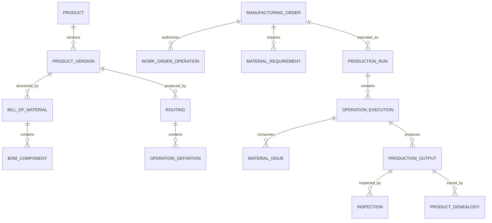

# Manufacturing Model Pattern

## Intent

Model organizations that define and engineer products, manage bills of material and process plans, source and control materials, plan capacity, authorize and execute production, record consumption and output, assure quality, maintain production resources, trace serialized or lot-controlled items, deploy finished products, and analyze cost, yield, reliability, and usage.

This pattern specializes Cross-Industry Party, Role, Product, Asset, Facility, Location, Agreement, Order, Work Effort, Schedule, Inventory, Measurement, Inspection, Cost, Event, Status, and Document concepts.

## Business overview

**Demand → Product Definition → Engineering Change → Material/Capacity Plan → Manufacturing Order → Material Issue → Production Operation → Inspection → Finished Inventory → Deployment/Usage → Feedback**

A Manufacturer defines Product Versions, Parts, Specifications, Bills of Material, Routings, and quality requirements. Customer demand, forecasts, replenishment policies, or project needs create supply requirements. Planning evaluates available inventory, lead times, supplier commitments, capacity, tooling, and labor, then recommends procurement, transfer, or Manufacturing Orders.

Released Manufacturing Orders reserve or issue components and authorize production. Production Runs and Operations record the resources, personnel, material lots, parameters, time, output, scrap, rework, inspections, and genealogy actually involved. Accepted output becomes inventory or is deployed to a customer, site, or higher assembly. Nonconformance, maintenance, warranty, field performance, and usage provide feedback into engineering, quality, planning, and service.

## Pattern variants

### Simple

Use for a small producer or production-tracking prototype.

Core concepts: Product; Part; Bill of Material; Work Center; Manufacturing Order; Production Run; Material Issue; Finished Output; Inspection; Inventory Item.

### Standard

Use as the default for operational manufacturing.

Adds: Product Version; Part Revision; Product Specification; Bill of Material Version; BOM Component; Engineering Change; Routing; Operation Definition; Resource Requirement; Facility; Work Center; Machine Asset; Tool; Material Lot; Inventory Position; Production Schedule; Work Order Operation; Labor Entry; Machine Entry; Quality Plan; Inspection Result; Nonconformance; Rework; Scrap; Product Genealogy; Cost Transaction.

### Enterprise

Use for multiple plants, global supply networks, regulated production, configured products, outsourced operations, or lifecycle integration.

Adds: Product Family; Product Configuration; Option Rule; Approved Manufacturer Part; Supplier Qualification; Contract Manufacturing Order; Master Production Schedule; Material Requirements Plan; Capacity Plan; Digital Work Instruction; Recipe; Batch Record; Calibration; Statistical Process Measure; Deviation; Corrective Action; Serialized Unit; Warranty; Product Deployment; Product Usage; Engineering and Manufacturing Change Board; Manufacturing Analytics Model.

## Roles

| Role | Meaning |
|---|---|
| Manufacturer | Organization responsible for producing or assembling products. |
| Product Owner | Role governing product purpose, market, and lifecycle. |
| Design Engineer | Role defining product design and specifications. |
| Manufacturing Engineer | Role defining producibility, routings, tooling, and work instructions. |
| Planner | Role balancing demand, materials, capacity, and order timing. |
| Production Supervisor | Role authorizing and coordinating shop-floor execution. |
| Operator | Person performing or recording production work. |
| Quality Inspector | Qualified role evaluating conformance. |
| Maintenance Technician | Role servicing production assets and tools. |
| Supplier | Party providing material, components, or outsourced operations. |
| Customer | Party purchasing or receiving manufactured output. |

Rule: Person identity, employee relationship, application user, qualification, and assigned production role remain separate and effective-dated.

## Product engineering concepts

### Product

A governed definition of an item manufactured, sold, installed, consumed, or serviced.

Logical attributes: Product Identifier; Product Name; Product Type; Product Status; Product Family; Make/Buy Policy; Lifecycle Phase.

### Product Version

An effective version or revision of a Product definition.

Logical attributes: Product Version Identifier; Revision; Status; Effective From; Effective Through; Release Date; Superseded By.

### Part

A material, component, subassembly, consumable, packaging item, or finished item used in manufacturing.

Logical attributes: Part Identifier; Part Number; Part Name; Part Type; Unit of Measure; Lot Control; Serial Control; Shelf-Life Policy; Status.

### Part Revision

A controlled version of a Part's definition and specifications.

Logical attributes: Part Revision Identifier; Revision; Status; Effective From; Effective Through; Change Reference.

### Product Specification

A controlled requirement for form, fit, function, material, performance, labeling, packaging, or acceptance.

Logical attributes: Specification Identifier; Specification Type; Version; Status; Requirement; Unit; Tolerance; Effective From; Effective Through.

### Bill of Material

A versioned product structure describing required Parts and quantities.

Logical attributes: BOM Identifier; BOM Type; Version; Status; Parent Product or Part; Effective From; Effective Through; Base Quantity.

### BOM Component

A Part's effective-dated participation in a Bill of Material.

Logical attributes: BOM Component Identifier; Component Part Revision; Quantity; Unit; Scrap Factor; Issue Method; Sequence; Effective From; Effective Through; Alternate Group.

### Engineering Change

A governed proposal and decision changing a Product, Part, BOM, Specification, process, document, or effectivity.

Logical attributes: Change Identifier; Change Number; Change Type; Change Status; Requested Date; Reason; Impact; Disposition; Approved Date; Effective Date.

Rule: Product, Product Version, Part, Part Revision, Specification, and BOM Version are distinct. Historical production must retain the definitions effective when work was executed.

## Process engineering concepts

### Routing

A versioned sequence or network of Operations required to manufacture a Product.

Logical attributes: Routing Identifier; Version; Status; Product Version; Facility; Effective From; Effective Through; Standard Lead Time.

### Operation Definition

A reusable or routing-specific definition of work.

Logical attributes: Operation Identifier; Operation Code; Name; Operation Type; Sequence; Standard Setup Time; Standard Run Time; Yield; Work Center Type.

### Resource Requirement

A required capability, labor role, machine, tool, material, instruction, or condition for an Operation.

Logical attributes: Requirement Identifier; Resource Type; Required Capability; Quantity; Duration; Qualification; Alternate Group.

### Work Instruction

A controlled instruction describing how an Operation is performed.

Logical attributes: Instruction Identifier; Instruction Type; Version; Status; Language; Effective From; Effective Through; Approval Reference.

### Recipe or Process Parameter

A governed target or limit for material, equipment, environment, or process behavior.

Logical attributes: Parameter Identifier; Parameter Name; Value Type; Target; Lower Limit; Upper Limit; Unit; Collection Method; Critical Indicator.

## Facility, capacity, and resources

### Manufacturing Facility

A plant, factory, workshop, laboratory, or contract-manufacturing location.

Logical attributes: Facility Identifier; Facility Name; Facility Type; Status; Time Zone; Address; Operating Calendar.

### Work Center

A logical or physical production capacity where Operations are performed.

Logical attributes: Work Center Identifier; Work Center Name; Work Center Type; Facility; Capacity Unit; Calendar; Status.

### Machine Asset

An individual production machine, line, cell, device, or equipment asset.

Logical attributes: Asset Identifier; Asset Number; Asset Type; Model; Serial Number; Status; Work Center; Commissioned Date; Meter Reading.

### Tool

A controlled die, fixture, mold, gauge, cutter, program, or other production aid.

Logical attributes: Tool Identifier; Tool Type; Tool Number; Revision; Status; Current Location; Life Limit; Usage Count; Calibration Due.

### Capacity Plan

A time-phased view of required and available production capacity.

Logical attributes: Capacity Plan Identifier; Period; Work Center; Required Capacity; Available Capacity; Unit; Overload; Status.

## Demand, planning, and manufacturing orders

### Manufacturing Requirement

A demand for a quantity of Product by a required date and destination.

Logical attributes: Requirement Identifier; Requirement Type; Product Version; Quantity; Unit; Required Date; Destination; Priority; Source.

### Production Schedule

A time-phased commitment or proposal for manufacturing work.

Logical attributes: Schedule Identifier; Schedule Type; Period; Facility; Status; Frozen Horizon; Planned Quantity.

### Manufacturing Order

An authorized order to produce a defined quantity of a Product Version.

Logical attributes: Order Identifier; Order Number; Order Type; Order Status; Product Version; Ordered Quantity; Unit; Facility; Planned Start; Planned End; Due Date; Priority.

### Work Order Operation

An order-specific instance of an Operation Definition.

Logical attributes: Work Operation Identifier; Sequence; Status; Work Center; Planned Start; Planned End; Actual Start; Actual End; Planned Quantity; Completed Quantity.

### Material Requirement

An order-specific need for a Part Revision or material.

Logical attributes: Material Requirement Identifier; Part Revision; Required Quantity; Issued Quantity; Unit; Need Date; Source BOM Component; Substitute Status.

Rule: planned demand, scheduled work, Manufacturing Order, Production Run, and actual output are separate states of commitment and execution.

## Inventory and material control

### Inventory Item

A controlled stock identity for a Part at a location, status, lot, serial, or ownership dimension.

Logical attributes: Inventory Item Identifier; Part Revision; Facility; Location; Lot; Serial; Inventory Status; Ownership; Quantity; Unit.

### Material Lot

A quantity of material produced or received under common traceability conditions.

Logical attributes: Lot Identifier; Lot Number; Part Revision; Origin; Manufactured Date; Expiration Date; Lot Status; Quantity.

### Inventory Transaction

A movement, receipt, issue, return, adjustment, transfer, quarantine, or disposition of inventory.

Logical attributes: Transaction Identifier; Transaction Type; Status; Transaction Time; Part; Quantity; Unit; From Location; To Location; Lot or Serial; Source Reference.

### Material Reservation

A planned allocation of inventory to a Manufacturing Order or Operation.

Logical attributes: Reservation Identifier; Order; Material Requirement; Inventory Item; Reserved Quantity; Status; Reserved At; Released At.

### Material Issue

Evidence that material was supplied to production.

Logical attributes: Issue Identifier; Order; Operation; Part Revision; Lot or Serial; Quantity; Unit; Issued At; Issued By; Source Location.

## Production execution

### Production Run

A bounded execution of manufacturing work for an Order, batch, shift, or campaign.

Logical attributes: Run Identifier; Run Number; Run Type; Run Status; Manufacturing Order; Start Time; End Time; Work Center; Supervisor.

### Operation Execution

The actual performance of a Work Order Operation.

Logical attributes: Execution Identifier; Work Operation; Status; Start Time; End Time; Work Center; Machine Asset; Good Quantity; Reject Quantity; Rework Quantity.

### Labor Entry

A Person's recorded production time or activity.

Logical attributes: Labor Entry Identifier; Operator; Role; Operation Execution; Start Time; End Time; Hours; Time Type; Approval Status.

### Machine Entry

A Machine Asset's recorded runtime, setup, idle time, or cycle activity.

Logical attributes: Machine Entry Identifier; Asset; Operation Execution; Start Time; End Time; Runtime; Cycle Count; Downtime; Source.

### Process Measurement

An observed value for an Operation, Product, machine, environment, or process parameter.

Logical attributes: Measurement Identifier; Parameter; Observed At; Value; Unit; Method; Asset; Operator; Status; Source.

### Production Output

A quantity or serialized unit produced by an Operation or Run.

Logical attributes: Output Identifier; Product or Part Revision; Quantity; Unit; Lot; Serial; Produced At; Output Status; Source Operation.

### Scrap and Rework

A disposition of nonconforming material or output.

Logical attributes: Disposition Identifier; Disposition Type; Quantity; Unit; Reason; Source Output; Authorized By; Destination; Cost.

## Quality and traceability

### Quality Plan

A versioned definition of inspections, tests, sampling, limits, and acceptance rules.

Logical attributes: Quality Plan Identifier; Version; Status; Product or Operation; Effective From; Effective Through; Sampling Rule.

### Inspection

A controlled evaluation of material, process, output, equipment, or environment.

Logical attributes: Inspection Identifier; Inspection Type; Status; Inspected At; Inspector; Source; Sample Size; Result; Quality Plan Version.

### Inspection Result

A measured or classified result for one inspection characteristic.

Logical attributes: Result Identifier; Characteristic; Value; Unit; Lower Limit; Upper Limit; Conformance; Method; Evidence.

### Nonconformance

Evidence that material, output, process, or equipment failed a requirement.

Logical attributes: Nonconformance Identifier; Type; Status; Detected At; Source; Requirement; Severity; Quantity; Containment; Disposition.

### Corrective Action

A governed response addressing the causes of a defect or process failure.

Logical attributes: Action Identifier; Action Type; Status; Owner; Opened Date; Due Date; Cause; Planned Action; Verification; Closed Date.

### Product Genealogy

A traceable relationship showing which inputs, lots, serials, resources, and processes produced an output.

Logical attributes: Genealogy Identifier; Parent Output; Input Material or Output; Quantity; Operation; Consumed At; Traceability Type.

Rule: inspection, conformance decision, nonconformance, disposition, and corrective action require separate lifecycles.

## Maintenance, deployment, and usage

### Maintenance Work Order

A controlled request to inspect, calibrate, service, or repair a Machine Asset or Tool.

Logical attributes: Maintenance Order Identifier; Type; Status; Asset or Tool; Priority; Opened Date; Due Date; Started Date; Completed Date; Release Decision.

### Product Deployment

Placement, installation, commissioning, or transfer of a finished Product to a customer, site, asset, or operational context.

Logical attributes: Deployment Identifier; Product Unit or Lot; Destination; Deployed Date; Status; Installer; Commissioned Date.

### Product Usage

A measured or reported use, cycle, operating condition, consumption, or performance event.

Logical attributes: Usage Identifier; Product Unit; Usage Type; Observed At; Value; Unit; Location; Source.

### Warranty or Field Issue

A reported failure, complaint, return, or service condition associated with deployed output.

Logical attributes: Field Issue Identifier; Issue Type; Status; Reported Date; Product Unit or Lot; Customer; Symptom; Failure Mode; Resolution.

## Relationship model

| Source | Relationship | Target | Cardinality |
|---|---|---|---|
| Product | has | Product Version | 1:M |
| Product Version | has | Product Specification | 1:M |
| Product Version | governed by | Bill of Material and Routing | 1:M versions |
| Bill of Material | contains | BOM Component | 1:M |
| BOM Component | references | Part Revision | M:1 |
| Engineering Change | changes | Product, Part, BOM, Routing, or Specification | M:M |
| Routing | contains | Operation Definition | 1:M |
| Operation Definition | has | Resource Requirement | 1:M |
| Facility | contains | Work Center | 1:M |
| Work Center | contains | Machine Asset | 1:M |
| Manufacturing Requirement | produces | Manufacturing Order | 1:M |
| Manufacturing Order | contains | Work Order Operation | 1:M |
| Manufacturing Order | contains | Material Requirement | 1:M |
| Material Requirement | receives | Material Reservation and Issue | 1:M |
| Manufacturing Order | has | Production Run | 1:M |
| Work Order Operation | receives | Operation Execution | 1:M |
| Operation Execution | consumes | Material Issue | 1:M |
| Operation Execution | produces | Production Output | 1:M |
| Operation Execution | records | Labor, Machine, and Process Measurement | 1:M each |
| Production Output | receives | Inspection | 1:M |
| Inspection | contains | Inspection Result | 1:M |
| Nonconformance | concerns | Material, Output, Process, or Asset | M:1 |
| Product Genealogy | links | Input to Output | M:M |
| Product Output | becomes | Inventory Item or Deployment | 1:M |
| Deployed Product | records | Product Usage or Field Issue | 1:M |

## Lifecycle models

### Engineering change

Proposed → Impact Analysis → Review → Approved → Scheduled → Implemented → Verified → Closed

Exception outcomes: Rejected; On Hold; Cancelled; Superseded.

### Manufacturing order

Planned → Firm → Released → In Production → Completed → Closed

Exception outcomes: On Hold; Shortage; Cancelled; Partially Completed; Terminated.

### Work order operation

Pending → Ready → Setup → Running → Inspection → Completed

Exception outcomes: Blocked; Paused; Rework; Skipped; Cancelled.

### Material lot

Created/Received → Available → Reserved → Issued/Consumed

Exception outcomes: Quarantined; Rejected; Expired; Reworked; Scrapped.

### Nonconformance

Open → Contained → Investigating → Disposition Approved → Corrected/Accepted/Scrapped → Closed

## Business events

- Product Version or Part Revision Released
- BOM, Routing, Specification, or Work Instruction Changed
- Engineering Change Proposed, Approved, or Implemented
- Demand Created or Forecast Changed
- Manufacturing Order Planned, Released, Held, Completed, or Cancelled
- Material Reserved, Issued, Returned, Transferred, or Scrapped
- Production Run or Operation Started, Paused, Resumed, or Completed
- Setup Completed
- Process Measurement Recorded
- Output Produced, Serialized, Accepted, Reworked, or Scrapped
- Inspection Completed
- Nonconformance Opened, Dispositioned, or Closed
- Machine Breakdown or Maintenance Work Order Opened
- Product Deployed, Used, Returned, or Reported Failed

## Baseline business and integrity rules

1. Released production must reference approved Product, Part, BOM, Routing, Specification, and instruction versions effective for the Order.
2. Engineering changes preserve prior versions, effectivity, approvals, impact analysis, and implementation evidence.
3. A Manufacturing Order identifies product version, quantity, facility, dates, unit, and source demand before release.
4. Required material, capacity, tools, instructions, qualifications, and quality plans must be available or explicitly exceptioned before an Operation becomes Ready.
5. Material Issues preserve Part Revision, quantity, unit, lot or serial, source location, order, operation, time, and issuer.
6. Substituted material must satisfy an approved alternate or deviation with traceable authorization.
7. Production Output cannot exceed recorded input and process logic without an explained yield, co-product, by-product, or adjustment.
8. Lot- or serial-controlled output must preserve genealogy to relevant inputs, Operations, Assets, tools, personnel, and inspections.
9. Operators and inspectors may act only under active role, qualification, assignment, and segregation-of-duty rules.
10. Critical Process Measurements outside approved limits trigger the defined hold, review, or nonconformance process.
11. Inspection results use the Quality Plan and limits effective at inspection or production time.
12. Nonconforming material cannot become available inventory without approved disposition and evidence.
13. Rework is authorized work with instructions, execution records, inspection, cost, and genealogy; it is not silent correction.
14. Completed production records are immutable; corrections use attributed adjustments or superseding records.
15. Machine Assets and Tools with blocking maintenance, calibration, or certification conditions cannot be scheduled for governed work.
16. Inventory balances reconcile to receipts, issues, output, transfers, returns, adjustments, and scrap.
17. Production quantities, labor, machine time, material consumption, scrap, and overhead retain the evidence needed for costing.
18. Deployed serialized or lot-controlled output remains traceable to production and field events.

## AI modeling questions

1. Is production discrete, process, batch, repetitive, project, configure-to-order, engineer-to-order, or mixed?
2. Which plants, lines, work centers, warehouses, subcontractors, currencies, calendars, and jurisdictions apply?
3. How are Products, Parts, Versions, Revisions, Specifications, BOMs, Routings, Recipes, and Instructions governed?
4. Which effectivity models apply: date, lot, serial, order, customer, plant, or configuration?
5. How are engineering changes requested, reviewed, approved, implemented, and verified?
6. What demand sources and planning horizons drive procurement, transfer, and production?
7. Which inventory dimensions require lot, serial, status, ownership, location, shelf life, or potency control?
8. How are material alternates, substitutions, backflush, scrap factors, co-products, and by-products handled?
9. Which resources, skills, tools, setup conditions, and capacity constraints govern Operations?
10. What production data is manual, machine-generated, derived, imported, or electronically signed?
11. Which inspections, sampling rules, tolerances, process controls, and release decisions are required?
12. How are deviations, nonconformance, rework, scrap, corrective action, and concession handled?
13. What traceability depth is required from supplier lot through deployed serialized unit?
14. Which cost methods and variance categories are required?
15. How are maintenance, calibration, tooling life, and downtime integrated with scheduling?
16. Which deployment, warranty, field failure, usage, and reliability feedback is retained?
17. Which operational, quality, delivery, inventory, cost, sustainability, and capacity measures are required?
18. Which external PLM, ERP, MES, WMS, QMS, maintenance, supplier, machine, and analytics systems are authoritative?

## Candidate capabilities and use cases

| Capability | Candidate actor-goal use cases |
|---|---|
| Product Engineering | Define Product Version; Maintain Part Revision; Release BOM; Approve Engineering Change |
| Process Engineering | Define Routing; Configure Operation; Publish Work Instruction; Define Quality Plan |
| Planning | Capture Demand; Plan Materials; Evaluate Capacity; Create Manufacturing Order |
| Material Control | Receive Material; Reserve Material; Issue Material; Substitute Material; Trace Lot |
| Production | Release Order; Start Setup; Execute Operation; Record Output; Complete Order |
| Quality | Perform Inspection; Open Nonconformance; Approve Disposition; Verify Rework |
| Resources | Assign Operator; Schedule Machine; Manage Tool; Record Downtime |
| Maintenance | Open Maintenance Order; Service Asset; Calibrate Tool; Release Asset |
| Deployment | Deploy Product; Record Usage; Register Warranty; Investigate Field Issue |
| Analytics | Analyze Yield; Analyze Variance; Monitor OEE; Trace Genealogy |

## MDE modeling guidance

- Keep Product, Product Version, Part, Part Revision, Inventory Item, Lot, and Serialized Unit distinct.
- Keep planned BOM and Routing definitions separate from actual Material Issues and Operation Executions.
- Model effectivity and versions explicitly; never reconstruct historical production from today's master data.
- Put release, substitution, capacity, execution, inspection, disposition, and traceability rules on authoritative entity operations.
- Use cases orchestrate actor goals while entity operations enforce production and quality invariants.
- Treat machine readings and supplier documents as sourced evidence with provenance and validation state.
- Add industry specializations only where recipes, regulations, traceability, or process behavior materially differ.

## Anti-patterns

### Product Equals Inventory Item

A Product defines what may be produced or sold. Inventory represents specific quantities, lots, serials, locations, statuses, and ownership.

### Current BOM Explains Historical Production

Production genealogy must retain the exact BOM, revisions, substitutions, and issues used at execution time.

### Manufacturing Order Equals Production Run

An Order authorizes output; Runs and Operation Executions record how, where, when, and with which resources work occurred.

### Quality as One Pass/Fail Field

Quality requires plans, characteristics, measurements, sampling, decisions, nonconformance, disposition, and evidence.

### Rework as Editing Output

Rework is additional authorized production activity and must preserve instructions, inputs, labor, measurements, results, cost, and genealogy.

### Machine Equals Work Center

A Work Center represents capacity and scheduling context; a Machine Asset is an individual maintained resource.

## Physical mapping examples

| Logical name | Example physical name |
|---|---|
| Product Version | `product_version` |
| Part Revision | `part_revision` |
| Bill of Material | `bill_of_material` |
| BOM Component | `bom_component` |
| Engineering Change | `engineering_change` |
| Work Order Operation | `work_order_operation` |
| Material Requirement | `material_requirement` |
| Operation Execution | `operation_execution` |
| Production Output | `production_output` |
| Inspection Result | `inspection_result` |
| Product Genealogy | `product_genealogy` |
| Maintenance Work Order | `maintenance_work_order` |

Logical names remain authoritative. Stack, production mode, plant, regulation, and integration rules generate physical names only after the logical model is accepted.

## Future knowledge-base expansion

A metamodel-conformant Manufacturing knowledge base should instantiate separate capabilities, entities, roles, business rules, use cases, workflows, pages, scenarios, and tests for Product Engineering, Process Engineering, Planning, Inventory, Production, Quality, Maintenance, Costing, Deployment, and Analytics. The first vertical slice should be:

**Release Product and BOM → Create Manufacturing Order → Reserve and Issue Material → Execute Operation → Record Output → Inspect Output → Receive Finished Inventory → Trace Genealogy**
