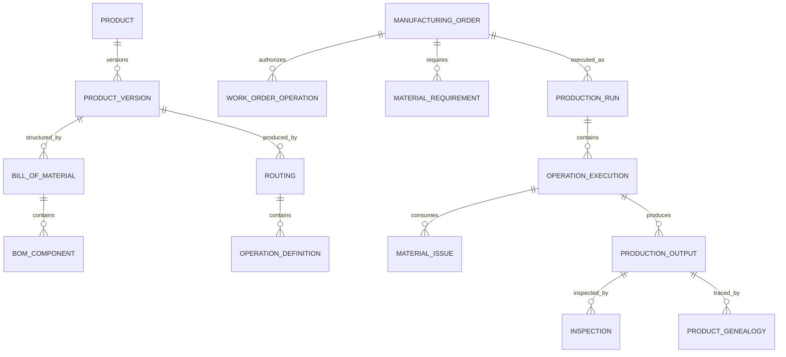

# Manufacturing Model Pattern

## Intent

Model organizations that define and engineer products, manage bills of material and process plans, source and control materials, plan capacity, authorize and execute production, record consumption and output, assure quality, maintain production resources, trace serialized or lot-controlled items, deploy finished products, and analyze cost, yield, reliability, and usage.

This pattern specializes Cross-Industry Party, Role, Product, Asset, Facility, Location, Agreement, Order, Work Effort, Schedule, Inventory, Measurement, Inspection, Cost, Event, Status, and Document concepts.

## Business overview

**Demand → Product Definition → Engineering Change → Material/Capacity Plan → Manufacturing Order → Material Issue → Production Operation → Inspection → Finished Inventory → Deployment/Usage → Feedback**

A Manufacturer defines Product Versions, Parts, Specifications, Bills of Material, Routings, and quality requirements. Customer demand, forecasts, replenishment policies, or project needs create supply requirements. Planning evaluates available inventory, lead times, supplier commitments, capacity, tooling, and labor, then recommends procurement, transfer, or Manufacturing Orders.

Released Manufacturing Orders reserve or issue components and authorize production. Production Runs and Operations record the resources, personnel, material lots, parameters, time, output, scrap, rework, inspections, and genealogy actually involved. Accepted output becomes inventory or is deployed to a customer, site, or higher assembly. Nonconformance, maintenance, warranty, field performance, and usage provide feedback into engineering, quality, planning, and service.

## Pattern variants

### Simple

Use for a small producer or production-tracking prototype.

Core concepts: Product; Part; Bill of Material; Work Center; Manufacturing Order; Production Run; Material Issue; Finished Output; Inspection; Inventory Item.

### Standard

Use as the default for operational manufacturing.

Adds: Product Version; Part Revision; Product Specification; Bill of Material Version; BOM Component; Engineering Change; Routing; Operation Definition; Resource Requirement; Facility; Work Center; Machine Asset; Tool; Material Lot; Inventory Position; Production Schedule; Work Order Operation; Labor Entry; Machine Entry; Quality Plan; Inspection Result; Nonconformance; Rework; Scrap; Product Genealogy; Cost Transaction.

### Enterprise

Use for multiple plants, global supply networks, regulated production, configured products, outsourced operations, or lifecycle integration.

Adds: Product Family; Product Configuration; Option Rule; Approved Manufacturer Part; Supplier Qualification; Contract Manufacturing Order; Master Production Schedule; Material Requirements Plan; Capacity Plan; Digital Work Instruction; Recipe; Batch Record; Calibration; Statistical Process Measure; Deviation; Corrective Action; Serialized Unit; Warranty; Product Deployment; Product Usage; Engineering and Manufacturing Change Board; Manufacturing Analytics Model.

## Roles

| Role | Meaning |
|---|---|
| Manufacturer | Organization responsible for producing or assembling products. |
| Product Owner | Role governing product purpose, market, and lifecycle. |
| Design Engineer | Role defining product design and specifications. |
| Manufacturing Engineer | Role defining producibility, routings, tooling, and work instructions. |
| Planner | Role balancing demand, materials, capacity, and order timing. |
| Production Supervisor | Role authorizing and coordinating shop-floor execution. |
| Operator | Person performing or recording production work. |
| Quality Inspector | Qualified role evaluating conformance. |
| Maintenance Technician | Role servicing production assets and tools. |
| Supplier | Party providing material, components, or outsourced operations. |
| Customer | Party purchasing or receiving manufactured output. |

Rule: Person identity, employee relationship, application user, qualification, and assigned production role remain separate and effective-dated.

## Product engineering concepts

### Product

Canonical concept: [Product](../model/requirements/manufacturing/product/product.md).

The canonical page contains the definition, logical attributes, rules, and source-specific detail.

### Product Version

Canonical concept: [Product Version](../model/requirements/manufacturing/product/product-version.md).

The canonical page contains the definition, logical attributes, rules, and source-specific detail.

### Part

Canonical concept: [Part](../model/requirements/manufacturing/product/part.md).

The canonical page contains the definition, logical attributes, rules, and source-specific detail.

### Part Revision

Canonical concept: [Part Revision](../model/requirements/manufacturing/product/part-revision.md).

The canonical page contains the definition, logical attributes, rules, and source-specific detail.

### Product Specification

Canonical concept: [Product Specification](../model/requirements/manufacturing/product/product-specification.md).

The canonical page contains the definition, logical attributes, rules, and source-specific detail.

### Bill of Material

Canonical concept: [Bill of Material](../model/requirements/manufacturing/product/bill-of-material.md).

The canonical page contains the definition, logical attributes, rules, and source-specific detail.

### BOM Component

Canonical concept: [BOM Component](../model/requirements/manufacturing/product/bom-component.md).

The canonical page contains the definition, logical attributes, rules, and source-specific detail.

### Engineering Change

Canonical concept: [Engineering Change](../model/requirements/manufacturing/product/engineering-change.md).

The canonical page contains the definition, logical attributes, rules, and source-specific detail.

## Process engineering concepts

### Routing

Canonical concept: [Routing](../model/requirements/manufacturing/routing/routing.md).

The canonical page contains the definition, logical attributes, rules, and source-specific detail.

### Operation Definition

Canonical concept: [Operation Definition](../model/requirements/manufacturing/routing/operation-definition.md).

The canonical page contains the definition, logical attributes, rules, and source-specific detail.

### Resource Requirement

Canonical concept: [Resource Requirement](../model/requirements/manufacturing/routing/resource-requirement.md).

The canonical page contains the definition, logical attributes, rules, and source-specific detail.

### Work Instruction

Canonical concept: [Work Instruction](../model/requirements/manufacturing/routing/work-instruction.md).

The canonical page contains the definition, logical attributes, rules, and source-specific detail.

### Recipe or Process Parameter

Canonical concept: [Recipe or Process Parameter](../model/requirements/manufacturing/routing/recipe-or-process-parameter.md).

The canonical page contains the definition, logical attributes, rules, and source-specific detail.

## Facility, capacity, and resources

### Manufacturing Facility

Canonical concept: [Manufacturing Facility](../model/requirements/manufacturing/manufacturing-facility/manufacturing-facility.md).

The canonical page contains the definition, logical attributes, rules, and source-specific detail.

### Work Center

Canonical concept: [Work Center](../model/requirements/manufacturing/manufacturing-facility/work-center.md).

The canonical page contains the definition, logical attributes, rules, and source-specific detail.

### Machine Asset

Canonical concept: [Machine Asset](../model/requirements/manufacturing/manufacturing-facility/machine-asset.md).

The canonical page contains the definition, logical attributes, rules, and source-specific detail.

### Tool

Canonical concept: [Tool](../model/requirements/manufacturing/manufacturing-facility/tool.md).

The canonical page contains the definition, logical attributes, rules, and source-specific detail.

### Capacity Plan

Canonical concept: [Capacity Plan](../model/requirements/manufacturing/manufacturing-facility/capacity-plan.md).

The canonical page contains the definition, logical attributes, rules, and source-specific detail.

## Demand, planning, and manufacturing orders

### Manufacturing Requirement

Canonical concept: [Manufacturing Requirement](../model/requirements/manufacturing/manufacturing-requirement/manufacturing-requirement.md).

The canonical page contains the definition, logical attributes, rules, and source-specific detail.

### Production Schedule

Canonical concept: [Production Schedule](../model/requirements/manufacturing/manufacturing-requirement/production-schedule.md).

The canonical page contains the definition, logical attributes, rules, and source-specific detail.

### Manufacturing Order

Canonical concept: [Manufacturing Order](../model/requirements/manufacturing/manufacturing-requirement/manufacturing-order.md).

The canonical page contains the definition, logical attributes, rules, and source-specific detail.

### Work Order Operation

Canonical concept: [Work Order Operation](../model/requirements/manufacturing/manufacturing-requirement/work-order-operation.md).

The canonical page contains the definition, logical attributes, rules, and source-specific detail.

### Material Requirement

Canonical concept: [Material Requirement](../model/requirements/manufacturing/manufacturing-requirement/material-requirement.md).

The canonical page contains the definition, logical attributes, rules, and source-specific detail.

## Inventory and material control

### Inventory Item

Canonical concept: [Inventory Item](../model/requirements/manufacturing/inventory-item/inventory-item.md).

The canonical page contains the definition, logical attributes, rules, and source-specific detail.

### Material Lot

Canonical concept: [Material Lot](../model/requirements/manufacturing/inventory-item/material-lot.md).

The canonical page contains the definition, logical attributes, rules, and source-specific detail.

### Inventory Transaction

Canonical concept: [Inventory Transaction](../model/requirements/manufacturing/inventory-item/inventory-transaction.md).

The canonical page contains the definition, logical attributes, rules, and source-specific detail.

### Material Reservation

Canonical concept: [Material Reservation](../model/requirements/manufacturing/inventory-item/material-reservation.md).

The canonical page contains the definition, logical attributes, rules, and source-specific detail.

### Material Issue

Canonical concept: [Material Issue](../model/requirements/manufacturing/inventory-item/material-issue.md).

The canonical page contains the definition, logical attributes, rules, and source-specific detail.

## Production execution

### Production Run

Canonical concept: [Production Run](../model/requirements/manufacturing/production-run/production-run.md).

The canonical page contains the definition, logical attributes, rules, and source-specific detail.

### Operation Execution

Canonical concept: [Operation Execution](../model/requirements/manufacturing/production-run/operation-execution.md).

The canonical page contains the definition, logical attributes, rules, and source-specific detail.

### Labor Entry

Canonical concept: [Labor Entry](../model/requirements/manufacturing/production-run/labor-entry.md).

The canonical page contains the definition, logical attributes, rules, and source-specific detail.

### Machine Entry

Canonical concept: [Machine Entry](../model/requirements/manufacturing/production-run/machine-entry.md).

The canonical page contains the definition, logical attributes, rules, and source-specific detail.

### Process Measurement

Canonical concept: [Process Measurement](../model/requirements/manufacturing/production-run/process-measurement.md).

The canonical page contains the definition, logical attributes, rules, and source-specific detail.

### Production Output

Canonical concept: [Production Output](../model/requirements/manufacturing/production-run/production-output.md).

The canonical page contains the definition, logical attributes, rules, and source-specific detail.

### Scrap and Rework

Canonical concept: [Scrap and Rework](../model/requirements/manufacturing/production-run/scrap-and-rework.md).

The canonical page contains the definition, logical attributes, rules, and source-specific detail.

## Quality and traceability

### Quality Plan

Canonical concept: [Quality Plan](../model/requirements/manufacturing/quality-plan/quality-plan.md).

The canonical page contains the definition, logical attributes, rules, and source-specific detail.

### Inspection

Canonical concept: [Inspection](../model/requirements/manufacturing/quality-plan/inspection.md).

The canonical page contains the definition, logical attributes, rules, and source-specific detail.

### Inspection Result

Canonical concept: [Inspection Result](../model/requirements/manufacturing/quality-plan/inspection-result.md).

The canonical page contains the definition, logical attributes, rules, and source-specific detail.

### Nonconformance

Canonical concept: [Nonconformance](../model/requirements/manufacturing/quality-plan/nonconformance.md).

The canonical page contains the definition, logical attributes, rules, and source-specific detail.

### Corrective Action

Canonical concept: [Corrective Action](../model/requirements/manufacturing/quality-plan/corrective-action.md).

The canonical page contains the definition, logical attributes, rules, and source-specific detail.

### Product Genealogy

Canonical concept: [Product Genealogy](../model/requirements/manufacturing/quality-plan/product-genealogy.md).

The canonical page contains the definition, logical attributes, rules, and source-specific detail.

## Maintenance, deployment, and usage

### Maintenance Work Order

Canonical concept: [Maintenance Work Order](../model/requirements/manufacturing/maintenance-work-order/maintenance-work-order.md).

The canonical page contains the definition, logical attributes, rules, and source-specific detail.

### Product Deployment

Canonical concept: [Product Deployment](../model/requirements/manufacturing/maintenance-work-order/product-deployment.md).

The canonical page contains the definition, logical attributes, rules, and source-specific detail.

### Product Usage

Canonical concept: [Product Usage](../model/requirements/manufacturing/maintenance-work-order/product-usage.md).

The canonical page contains the definition, logical attributes, rules, and source-specific detail.

### Warranty or Field Issue

Canonical concept: [Warranty or Field Issue](../model/requirements/manufacturing/maintenance-work-order/warranty-or-field-issue.md).

The canonical page contains the definition, logical attributes, rules, and source-specific detail.

## Relationship model

| Source | Relationship | Target | Cardinality |
|---|---|---|---|
| Product | has | Product Version | 1:M |
| Product Version | has | Product Specification | 1:M |
| Product Version | governed by | Bill of Material and Routing | 1:M versions |
| Bill of Material | contains | BOM Component | 1:M |
| BOM Component | references | Part Revision | M:1 |
| Engineering Change | changes | Product, Part, BOM, Routing, or Specification | M:M |
| Routing | contains | Operation Definition | 1:M |
| Operation Definition | has | Resource Requirement | 1:M |
| Facility | contains | Work Center | 1:M |
| Work Center | contains | Machine Asset | 1:M |
| Manufacturing Requirement | produces | Manufacturing Order | 1:M |
| Manufacturing Order | contains | Work Order Operation | 1:M |
| Manufacturing Order | contains | Material Requirement | 1:M |
| Material Requirement | receives | Material Reservation and Issue | 1:M |
| Manufacturing Order | has | Production Run | 1:M |
| Work Order Operation | receives | Operation Execution | 1:M |
| Operation Execution | consumes | Material Issue | 1:M |
| Operation Execution | produces | Production Output | 1:M |
| Operation Execution | records | Labor, Machine, and Process Measurement | 1:M each |
| Production Output | receives | Inspection | 1:M |
| Inspection | contains | Inspection Result | 1:M |
| Nonconformance | concerns | Material, Output, Process, or Asset | M:1 |
| Product Genealogy | links | Input to Output | M:M |
| Product Output | becomes | Inventory Item or Deployment | 1:M |
| Deployed Product | records | Product Usage or Field Issue | 1:M |

## Lifecycle models

### Engineering change

Proposed → Impact Analysis → Review → Approved → Scheduled → Implemented → Verified → Closed

Exception outcomes: Rejected; On Hold; Cancelled; Superseded.

### Manufacturing order

Planned → Firm → Released → In Production → Completed → Closed

Exception outcomes: On Hold; Shortage; Cancelled; Partially Completed; Terminated.

### Work order operation

Pending → Ready → Setup → Running → Inspection → Completed

Exception outcomes: Blocked; Paused; Rework; Skipped; Cancelled.

### Material lot

Created/Received → Available → Reserved → Issued/Consumed

Exception outcomes: Quarantined; Rejected; Expired; Reworked; Scrapped.

### Nonconformance

Open → Contained → Investigating → Disposition Approved → Corrected/Accepted/Scrapped → Closed

## Business events

- Product Version or Part Revision Released
- BOM, Routing, Specification, or Work Instruction Changed
- Engineering Change Proposed, Approved, or Implemented
- Demand Created or Forecast Changed
- Manufacturing Order Planned, Released, Held, Completed, or Cancelled
- Material Reserved, Issued, Returned, Transferred, or Scrapped
- Production Run or Operation Started, Paused, Resumed, or Completed
- Setup Completed
- Process Measurement Recorded
- Output Produced, Serialized, Accepted, Reworked, or Scrapped
- Inspection Completed
- Nonconformance Opened, Dispositioned, or Closed
- Machine Breakdown or Maintenance Work Order Opened
- Product Deployed, Used, Returned, or Reported Failed

## Baseline business and integrity rules

1. Released production must reference approved Product, Part, BOM, Routing, Specification, and instruction versions effective for the Order.
2. Engineering changes preserve prior versions, effectivity, approvals, impact analysis, and implementation evidence.
3. A Manufacturing Order identifies product version, quantity, facility, dates, unit, and source demand before release.
4. Required material, capacity, tools, instructions, qualifications, and quality plans must be available or explicitly exceptioned before an Operation becomes Ready.
5. Material Issues preserve Part Revision, quantity, unit, lot or serial, source location, order, operation, time, and issuer.
6. Substituted material must satisfy an approved alternate or deviation with traceable authorization.
7. Production Output cannot exceed recorded input and process logic without an explained yield, co-product, by-product, or adjustment.
8. Lot- or serial-controlled output must preserve genealogy to relevant inputs, Operations, Assets, tools, personnel, and inspections.
9. Operators and inspectors may act only under active role, qualification, assignment, and segregation-of-duty rules.
10. Critical Process Measurements outside approved limits trigger the defined hold, review, or nonconformance process.
11. Inspection results use the Quality Plan and limits effective at inspection or production time.
12. Nonconforming material cannot become available inventory without approved disposition and evidence.
13. Rework is authorized work with instructions, execution records, inspection, cost, and genealogy; it is not silent correction.
14. Completed production records are immutable; corrections use attributed adjustments or superseding records.
15. Machine Assets and Tools with blocking maintenance, calibration, or certification conditions cannot be scheduled for governed work.
16. Inventory balances reconcile to receipts, issues, output, transfers, returns, adjustments, and scrap.
17. Production quantities, labor, machine time, material consumption, scrap, and overhead retain the evidence needed for costing.
18. Deployed serialized or lot-controlled output remains traceable to production and field events.

## AI modeling questions

1. Is production discrete, process, batch, repetitive, project, configure-to-order, engineer-to-order, or mixed?
2. Which plants, lines, work centers, warehouses, subcontractors, currencies, calendars, and jurisdictions apply?
3. How are Products, Parts, Versions, Revisions, Specifications, BOMs, Routings, Recipes, and Instructions governed?
4. Which effectivity models apply: date, lot, serial, order, customer, plant, or configuration?
5. How are engineering changes requested, reviewed, approved, implemented, and verified?
6. What demand sources and planning horizons drive procurement, transfer, and production?
7. Which inventory dimensions require lot, serial, status, ownership, location, shelf life, or potency control?
8. How are material alternates, substitutions, backflush, scrap factors, co-products, and by-products handled?
9. Which resources, skills, tools, setup conditions, and capacity constraints govern Operations?
10. What production data is manual, machine-generated, derived, imported, or electronically signed?
11. Which inspections, sampling rules, tolerances, process controls, and release decisions are required?
12. How are deviations, nonconformance, rework, scrap, corrective action, and concession handled?
13. What traceability depth is required from supplier lot through deployed serialized unit?
14. Which cost methods and variance categories are required?
15. How are maintenance, calibration, tooling life, and downtime integrated with scheduling?
16. Which deployment, warranty, field failure, usage, and reliability feedback is retained?
17. Which operational, quality, delivery, inventory, cost, sustainability, and capacity measures are required?
18. Which external PLM, ERP, MES, WMS, QMS, maintenance, supplier, machine, and analytics systems are authoritative?

## Candidate capabilities and use cases

| Capability | Candidate actor-goal use cases |
|---|---|
| Product Engineering | Define Product Version; Maintain Part Revision; Release BOM; Approve Engineering Change |
| Process Engineering | Define Routing; Configure Operation; Publish Work Instruction; Define Quality Plan |
| Planning | Capture Demand; Plan Materials; Evaluate Capacity; Create Manufacturing Order |
| Material Control | Receive Material; Reserve Material; Issue Material; Substitute Material; Trace Lot |
| Production | Release Order; Start Setup; Execute Operation; Record Output; Complete Order |
| Quality | Perform Inspection; Open Nonconformance; Approve Disposition; Verify Rework |
| Resources | Assign Operator; Schedule Machine; Manage Tool; Record Downtime |
| Maintenance | Open Maintenance Order; Service Asset; Calibrate Tool; Release Asset |
| Deployment | Deploy Product; Record Usage; Register Warranty; Investigate Field Issue |
| Analytics | Analyze Yield; Analyze Variance; Monitor OEE; Trace Genealogy |

## MDE modeling guidance

- Keep Product, Product Version, Part, Part Revision, Inventory Item, Lot, and Serialized Unit distinct.
- Keep planned BOM and Routing definitions separate from actual Material Issues and Operation Executions.
- Model effectivity and versions explicitly; never reconstruct historical production from today's master data.
- Put release, substitution, capacity, execution, inspection, disposition, and traceability rules on authoritative entity operations.
- Use cases orchestrate actor goals while entity operations enforce production and quality invariants.
- Treat machine readings and supplier documents as sourced evidence with provenance and validation state.
- Add industry specializations only where recipes, regulations, traceability, or process behavior materially differ.

## Anti-patterns

### Product Equals Inventory Item

A Product defines what may be produced or sold. Inventory represents specific quantities, lots, serials, locations, statuses, and ownership.

### Current BOM Explains Historical Production

Production genealogy must retain the exact BOM, revisions, substitutions, and issues used at execution time.

### Manufacturing Order Equals Production Run

An Order authorizes output; Runs and Operation Executions record how, where, when, and with which resources work occurred.

### Quality as One Pass/Fail Field

Quality requires plans, characteristics, measurements, sampling, decisions, nonconformance, disposition, and evidence.

### Rework as Editing Output

Rework is additional authorized production activity and must preserve instructions, inputs, labor, measurements, results, cost, and genealogy.

### Machine Equals Work Center

A Work Center represents capacity and scheduling context; a Machine Asset is an individual maintained resource.

## Physical mapping examples

| Logical name | Example physical name |
|---|---|
| Product Version | `product_version` |
| Part Revision | `part_revision` |
| Bill of Material | `bill_of_material` |
| BOM Component | `bom_component` |
| Engineering Change | `engineering_change` |
| Work Order Operation | `work_order_operation` |
| Material Requirement | `material_requirement` |
| Operation Execution | `operation_execution` |
| Production Output | `production_output` |
| Inspection Result | `inspection_result` |
| Product Genealogy | `product_genealogy` |
| Maintenance Work Order | `maintenance_work_order` |

Logical names remain authoritative. Stack, production mode, plant, regulation, and integration rules generate physical names only after the logical model is accepted.

## Future knowledge-base expansion

A metamodel-conformant Manufacturing knowledge base should instantiate separate capabilities, entities, roles, business rules, use cases, workflows, pages, scenarios, and tests for Product Engineering, Process Engineering, Planning, Inventory, Production, Quality, Maintenance, Costing, Deployment, and Analytics. The first vertical slice should be:

**Release Product and BOM → Create Manufacturing Order → Reserve and Issue Material → Execute Operation → Record Output → Inspect Output → Receive Finished Inventory → Trace Genealogy**

## Canonical model bindings

This pattern selects and connects concepts in the [coherent model](../model/README.md). The sections below are views of those definitions. Industry lifecycles, events, baseline rules, and variant choices continue to constrain the selected concepts.

| Source term | Canonical concept | ABE |
|---|---|---|
| Product | [Product](../model/requirements/manufacturing/product/product.md) | [Product](../model/requirements/manufacturing/product/README.md) |
| Product Version | [Product Version](../model/requirements/manufacturing/product/product-version.md) | [Product](../model/requirements/manufacturing/product/README.md) |
| Part | [Part](../model/requirements/manufacturing/product/part.md) | [Product](../model/requirements/manufacturing/product/README.md) |
| Part Revision | [Part Revision](../model/requirements/manufacturing/product/part-revision.md) | [Product](../model/requirements/manufacturing/product/README.md) |
| Product Specification | [Product Specification](../model/requirements/manufacturing/product/product-specification.md) | [Product](../model/requirements/manufacturing/product/README.md) |
| Bill of Material | [Bill of Material](../model/requirements/manufacturing/product/bill-of-material.md) | [Product](../model/requirements/manufacturing/product/README.md) |
| BOM Component | [BOM Component](../model/requirements/manufacturing/product/bom-component.md) | [Product](../model/requirements/manufacturing/product/README.md) |
| Engineering Change | [Engineering Change](../model/requirements/manufacturing/product/engineering-change.md) | [Product](../model/requirements/manufacturing/product/README.md) |
| Routing | [Routing](../model/requirements/manufacturing/routing/routing.md) | [Routing](../model/requirements/manufacturing/routing/README.md) |
| Operation Definition | [Operation Definition](../model/requirements/manufacturing/routing/operation-definition.md) | [Routing](../model/requirements/manufacturing/routing/README.md) |
| Resource Requirement | [Resource Requirement](../model/requirements/manufacturing/routing/resource-requirement.md) | [Routing](../model/requirements/manufacturing/routing/README.md) |
| Work Instruction | [Work Instruction](../model/requirements/manufacturing/routing/work-instruction.md) | [Routing](../model/requirements/manufacturing/routing/README.md) |
| Recipe or Process Parameter | [Recipe or Process Parameter](../model/requirements/manufacturing/routing/recipe-or-process-parameter.md) | [Routing](../model/requirements/manufacturing/routing/README.md) |
| Manufacturing Facility | [Manufacturing Facility](../model/requirements/manufacturing/manufacturing-facility/manufacturing-facility.md) | [Manufacturing Facility](../model/requirements/manufacturing/manufacturing-facility/README.md) |
| Work Center | [Work Center](../model/requirements/manufacturing/manufacturing-facility/work-center.md) | [Manufacturing Facility](../model/requirements/manufacturing/manufacturing-facility/README.md) |
| Machine Asset | [Machine Asset](../model/requirements/manufacturing/manufacturing-facility/machine-asset.md) | [Manufacturing Facility](../model/requirements/manufacturing/manufacturing-facility/README.md) |
| Tool | [Tool](../model/requirements/manufacturing/manufacturing-facility/tool.md) | [Manufacturing Facility](../model/requirements/manufacturing/manufacturing-facility/README.md) |
| Capacity Plan | [Capacity Plan](../model/requirements/manufacturing/manufacturing-facility/capacity-plan.md) | [Manufacturing Facility](../model/requirements/manufacturing/manufacturing-facility/README.md) |
| Manufacturing Requirement | [Manufacturing Requirement](../model/requirements/manufacturing/manufacturing-requirement/manufacturing-requirement.md) | [Manufacturing Requirement](../model/requirements/manufacturing/manufacturing-requirement/README.md) |
| Production Schedule | [Production Schedule](../model/requirements/manufacturing/manufacturing-requirement/production-schedule.md) | [Manufacturing Requirement](../model/requirements/manufacturing/manufacturing-requirement/README.md) |
| Manufacturing Order | [Manufacturing Order](../model/requirements/manufacturing/manufacturing-requirement/manufacturing-order.md) | [Manufacturing Requirement](../model/requirements/manufacturing/manufacturing-requirement/README.md) |
| Work Order Operation | [Work Order Operation](../model/requirements/manufacturing/manufacturing-requirement/work-order-operation.md) | [Manufacturing Requirement](../model/requirements/manufacturing/manufacturing-requirement/README.md) |
| Material Requirement | [Material Requirement](../model/requirements/manufacturing/manufacturing-requirement/material-requirement.md) | [Manufacturing Requirement](../model/requirements/manufacturing/manufacturing-requirement/README.md) |
| Inventory Item | [Inventory Item](../model/requirements/manufacturing/inventory-item/inventory-item.md) | [Inventory Item](../model/requirements/manufacturing/inventory-item/README.md) |
| Material Lot | [Material Lot](../model/requirements/manufacturing/inventory-item/material-lot.md) | [Inventory Item](../model/requirements/manufacturing/inventory-item/README.md) |
| Inventory Transaction | [Inventory Transaction](../model/requirements/manufacturing/inventory-item/inventory-transaction.md) | [Inventory Item](../model/requirements/manufacturing/inventory-item/README.md) |
| Material Reservation | [Material Reservation](../model/requirements/manufacturing/inventory-item/material-reservation.md) | [Inventory Item](../model/requirements/manufacturing/inventory-item/README.md) |
| Material Issue | [Material Issue](../model/requirements/manufacturing/inventory-item/material-issue.md) | [Inventory Item](../model/requirements/manufacturing/inventory-item/README.md) |
| Production Run | [Production Run](../model/requirements/manufacturing/production-run/production-run.md) | [Production Run](../model/requirements/manufacturing/production-run/README.md) |
| Operation Execution | [Operation Execution](../model/requirements/manufacturing/production-run/operation-execution.md) | [Production Run](../model/requirements/manufacturing/production-run/README.md) |
| Labor Entry | [Labor Entry](../model/requirements/manufacturing/production-run/labor-entry.md) | [Production Run](../model/requirements/manufacturing/production-run/README.md) |
| Machine Entry | [Machine Entry](../model/requirements/manufacturing/production-run/machine-entry.md) | [Production Run](../model/requirements/manufacturing/production-run/README.md) |
| Process Measurement | [Process Measurement](../model/requirements/manufacturing/production-run/process-measurement.md) | [Production Run](../model/requirements/manufacturing/production-run/README.md) |
| Production Output | [Production Output](../model/requirements/manufacturing/production-run/production-output.md) | [Production Run](../model/requirements/manufacturing/production-run/README.md) |
| Scrap and Rework | [Scrap and Rework](../model/requirements/manufacturing/production-run/scrap-and-rework.md) | [Production Run](../model/requirements/manufacturing/production-run/README.md) |
| Quality Plan | [Quality Plan](../model/requirements/manufacturing/quality-plan/quality-plan.md) | [Quality Plan](../model/requirements/manufacturing/quality-plan/README.md) |
| Inspection | [Inspection](../model/requirements/manufacturing/quality-plan/inspection.md) | [Quality Plan](../model/requirements/manufacturing/quality-plan/README.md) |
| Inspection Result | [Inspection Result](../model/requirements/manufacturing/quality-plan/inspection-result.md) | [Quality Plan](../model/requirements/manufacturing/quality-plan/README.md) |
| Nonconformance | [Nonconformance](../model/requirements/manufacturing/quality-plan/nonconformance.md) | [Quality Plan](../model/requirements/manufacturing/quality-plan/README.md) |
| Corrective Action | [Corrective Action](../model/requirements/manufacturing/quality-plan/corrective-action.md) | [Quality Plan](../model/requirements/manufacturing/quality-plan/README.md) |
| Product Genealogy | [Product Genealogy](../model/requirements/manufacturing/quality-plan/product-genealogy.md) | [Quality Plan](../model/requirements/manufacturing/quality-plan/README.md) |
| Maintenance Work Order | [Maintenance Work Order](../model/requirements/manufacturing/maintenance-work-order/maintenance-work-order.md) | [Maintenance Work Order](../model/requirements/manufacturing/maintenance-work-order/README.md) |
| Product Deployment | [Product Deployment](../model/requirements/manufacturing/maintenance-work-order/product-deployment.md) | [Maintenance Work Order](../model/requirements/manufacturing/maintenance-work-order/README.md) |
| Product Usage | [Product Usage](../model/requirements/manufacturing/maintenance-work-order/product-usage.md) | [Maintenance Work Order](../model/requirements/manufacturing/maintenance-work-order/README.md) |
| Warranty or Field Issue | [Warranty or Field Issue](../model/requirements/manufacturing/maintenance-work-order/warranty-or-field-issue.md) | [Maintenance Work Order](../model/requirements/manufacturing/maintenance-work-order/README.md) |
