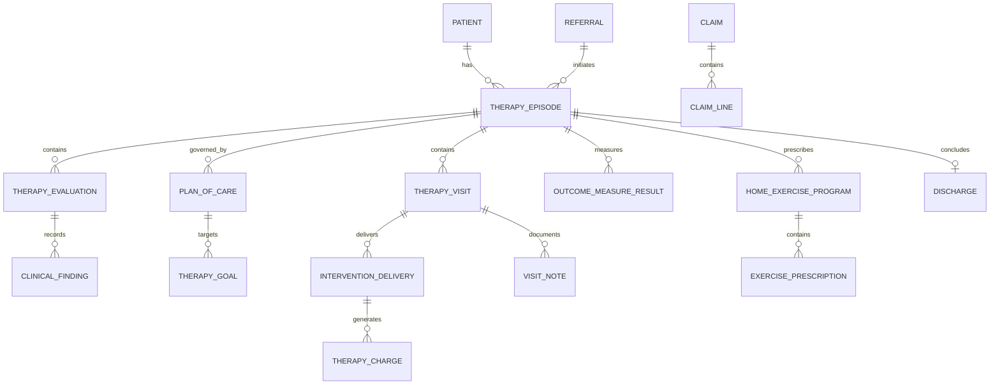

# Physical Therapy Clinic Model Pattern

## Classification

**Applied industry extension — outside the original industry subject list.**

This pattern specializes the [Health Care model pattern](health-care.md) for outpatient, hospital-based, home-based, and virtual physical therapy clinics. It reuses cross-industry Party, Role, Organization, Location, Scheduling, Agreement, Charge, Payment, Document, Status, and Event concepts.

## Intent

Model a physical therapy clinic that receives referrals or direct-access patients; verifies eligibility and authorization; schedules care; evaluates impairments and functional limitations; establishes a plan of care and measurable goals; delivers and documents therapeutic interventions; assigns home programs; measures outcomes; bills responsible parties; and discharges or transitions the patient safely.

This is a logical business and clinical operations pattern. It is not a clinical-practice guideline, coding standard, interoperability profile, privacy rule, or jurisdiction-specific regulatory model. Implementations must adapt professional scope, supervision, documentation, billing, consent, and retention rules to the applicable jurisdiction.

## Business overview

**Need/Referral → Intake → Eligibility/Authorization → Initial Evaluation → Plan of Care → Goals → Scheduled Visits → Treatment/Exercise → Progress Measurement → Reassessment → Billing → Discharge/Follow-up**

A Patient enters through a Referral or direct access. Clinic staff register the Patient, collect intake information, identify the referring and treating Providers, verify coverage and financial responsibility, and determine whether authorization is required. A Physical Therapist performs an Initial Evaluation, records the presenting condition, functional history, precautions, observations, tests, measures, assessment, and prognosis, then establishes a Plan of Care with measurable Therapy Goals, planned Interventions, frequency, and duration.

Appointments organize availability, but each attended treatment interaction becomes a Therapy Visit. During a Visit, the treating Provider records interventions actually delivered, time or units, Patient response, education, progress, and any adverse event. The clinic may issue a Home Exercise Program and track adherence. Periodic Progress Evaluations compare results with baselines and goals, support plan changes and authorization requests, and determine whether the Patient should continue, be referred, placed on hold, or discharged. Delivered services generate Charges, Claims, invoices, and Payments according to the applicable payer and contract.

## Pattern variants

### Simple

Use for a single-location cash-pay clinic or prototype.

Core concepts: Patient; Therapist; Appointment; Initial Evaluation; Plan of Care; Therapy Goal; Therapy Visit; Intervention; Home Exercise Program; Invoice; Payment; Discharge Summary.

### Standard

Use as the default for an operational clinic.

Adds: Clinic; Location; Referral; Referring Provider; Intake; Episode of Care; Coverage; Eligibility Verification; Authorization; Precaution; Functional Limitation; Clinical Finding; Outcome Measure; Treatment Plan Item; Visit Note; Intervention Delivery; Exercise Prescription; Progress Evaluation; Attendance Event; Charge; Claim; Claim Line; Patient Responsibility; Document; Consent; Audit Event.

### Enterprise

Use for multi-location groups, hospital departments, home health, occupational health, payer contracts, specialized programs, or integrated care networks.

Adds: Organization Network; Department; Provider Credential; Supervision Arrangement; Resource and Equipment Schedule; Waitlist; Care Pathway; Program Enrollment; Multidisciplinary Care Team; Referral Network; Contract; Fee Schedule; Authorization Utilization; Utilization Review; Quality Measure; Patient-Reported Outcome; Clinical Registry; Remote Monitoring; Work Injury Case; Legal Case; Data Sharing Agreement; Terminology Mapping.

## Actors and roles

| Role | Meaning |
|---|---|
| Patient | Person receiving physical therapy evaluation or treatment. |
| Physical Therapist | Licensed Provider accountable for evaluation, clinical judgment, and the Plan of Care as permitted by law. |
| Physical Therapist Assistant | Provider delivering delegated care under the required supervision. |
| Referring Provider | Provider requesting therapy or supplying a medical referral. |
| Clinic Administrator | Role managing registration, scheduling, documents, billing, and clinic operations. |
| Caregiver or Representative | Party supporting the Patient or acting under legal authority. |
| Payer | Party adjudicating or funding covered services. |
| Guarantor | Party responsible for amounts not paid by a Payer. |
| Employer or Case Manager | Party coordinating occupational, disability, or injury-related care. |
| Interpreter | Party supporting accessible communication. |

Rule: Person, Patient, Provider, employee, application user, and billing Party are distinct roles. One Party may perform several roles, and every clinical role must be supported by active credentials, organization context, scope, and effective dates.

## Organization, provider, and resource concepts

### Physical Therapy Clinic

Canonical concept: [Physical Therapy Clinic](../model/requirements/physical-therapy/physical-therapy-clinic/physical-therapy-clinic.md).

The canonical page contains the definition, logical attributes, rules, and source-specific detail.

### Clinic Location

Canonical concept: [Clinic Location](../model/requirements/physical-therapy/physical-therapy-clinic/clinic-location.md).

The canonical page contains the definition, logical attributes, rules, and source-specific detail.

### Therapy Provider

Canonical concept: [Therapy Provider](../model/requirements/physical-therapy/physical-therapy-clinic/therapy-provider.md).

The canonical page contains the definition, logical attributes, rules, and source-specific detail.

### Provider Assignment

Canonical concept: [Provider Assignment](../model/requirements/physical-therapy/physical-therapy-clinic/provider-assignment.md).

The canonical page contains the definition, logical attributes, rules, and source-specific detail.

### Therapy Resource

Canonical concept: [Therapy Resource](../model/requirements/physical-therapy/physical-therapy-clinic/therapy-resource.md).

The canonical page contains the definition, logical attributes, rules, and source-specific detail.

## Access, referral, and intake

### Referral

Canonical concept: [Referral](../model/requirements/health-care/schedule/referral.md).

The canonical page contains the definition, logical attributes, rules, and source-specific detail.

### Patient Intake

Canonical concept: [Patient Intake](../model/requirements/physical-therapy/patient-intake/patient-intake.md).

The canonical page contains the definition, logical attributes, rules, and source-specific detail.

### Intake Response

Canonical concept: [Intake Response](../model/requirements/physical-therapy/patient-intake/intake-response.md).

The canonical page contains the definition, logical attributes, rules, and source-specific detail.

### Eligibility Verification

Canonical concept: [Eligibility Verification](../model/requirements/physical-therapy/patient-intake/eligibility-verification.md).

The canonical page contains the definition, logical attributes, rules, and source-specific detail.

### Therapy Authorization

Canonical concept: [Therapy Authorization](../model/requirements/physical-therapy/patient-intake/therapy-authorization.md).

The canonical page contains the definition, logical attributes, rules, and source-specific detail.

### Attendance Event

Canonical concept: [Attendance Event](../model/requirements/physical-therapy/patient-intake/attendance-event.md).

The canonical page contains the definition, logical attributes, rules, and source-specific detail.

## Episode and care context

### Therapy Episode

Canonical concept: [Therapy Episode](../model/requirements/physical-therapy/therapy-episode/therapy-episode.md).

The canonical page contains the definition, logical attributes, rules, and source-specific detail.

### Presenting Concern

Canonical concept: [Presenting Concern](../model/requirements/physical-therapy/therapy-episode/presenting-concern.md).

The canonical page contains the definition, logical attributes, rules, and source-specific detail.

### Precaution or Contraindication

Canonical concept: [Precaution or Contraindication](../model/requirements/physical-therapy/therapy-episode/precaution-or-contraindication.md).

The canonical page contains the definition, logical attributes, rules, and source-specific detail.

### Functional Limitation

Canonical concept: [Functional Limitation](../model/requirements/physical-therapy/therapy-episode/functional-limitation.md).

The canonical page contains the definition, logical attributes, rules, and source-specific detail.

## Evaluation and clinical evidence

### Therapy Evaluation

Canonical concept: [Therapy Evaluation](../model/requirements/physical-therapy/therapy-evaluation/therapy-evaluation.md).

The canonical page contains the definition, logical attributes, rules, and source-specific detail.

### Subjective History

Canonical concept: [Subjective History](../model/requirements/physical-therapy/therapy-evaluation/subjective-history.md).

The canonical page contains the definition, logical attributes, rules, and source-specific detail.

### Clinical Finding

Canonical concept: [Clinical Finding](../model/requirements/physical-therapy/therapy-evaluation/clinical-finding.md).

The canonical page contains the definition, logical attributes, rules, and source-specific detail.

### Outcome Measure Definition

Canonical concept: [Outcome Measure Definition](../model/requirements/physical-therapy/therapy-evaluation/outcome-measure-definition.md).

The canonical page contains the definition, logical attributes, rules, and source-specific detail.

### Outcome Measure Result

Canonical concept: [Outcome Measure Result](../model/requirements/physical-therapy/therapy-evaluation/outcome-measure-result.md).

The canonical page contains the definition, logical attributes, rules, and source-specific detail.

### Therapy Assessment

Canonical concept: [Therapy Assessment](../model/requirements/physical-therapy/therapy-evaluation/therapy-assessment.md).

The canonical page contains the definition, logical attributes, rules, and source-specific detail.

## Plan of care and goals

### Plan of Care

Canonical concept: [Plan of Care](../model/requirements/physical-therapy/plan-of-care/plan-of-care.md).

The canonical page contains the definition, logical attributes, rules, and source-specific detail.

### Therapy Goal

Canonical concept: [Therapy Goal](../model/requirements/physical-therapy/plan-of-care/therapy-goal.md).

The canonical page contains the definition, logical attributes, rules, and source-specific detail.

### Goal Progress

Canonical concept: [Goal Progress](../model/requirements/physical-therapy/plan-of-care/goal-progress.md).

The canonical page contains the definition, logical attributes, rules, and source-specific detail.

### Treatment Plan Item

Canonical concept: [Treatment Plan Item](../model/requirements/physical-therapy/plan-of-care/treatment-plan-item.md).

The canonical page contains the definition, logical attributes, rules, and source-specific detail.

### Plan Approval or Certification

Canonical concept: [Plan Approval or Certification](../model/requirements/physical-therapy/plan-of-care/plan-approval-or-certification.md).

The canonical page contains the definition, logical attributes, rules, and source-specific detail.

## Scheduling and visit concepts

### Provider Schedule

Canonical concept: [Provider Schedule](../model/requirements/physical-therapy/provider-schedule/provider-schedule.md).

The canonical page contains the definition, logical attributes, rules, and source-specific detail.

### Therapy Appointment

Canonical concept: [Therapy Appointment](../model/requirements/physical-therapy/provider-schedule/therapy-appointment.md).

The canonical page contains the definition, logical attributes, rules, and source-specific detail.

### Therapy Visit

Canonical concept: [Therapy Visit](../model/requirements/physical-therapy/provider-schedule/therapy-visit.md).

The canonical page contains the definition, logical attributes, rules, and source-specific detail.

### Visit Note

Canonical concept: [Visit Note](../model/requirements/physical-therapy/provider-schedule/visit-note.md).

The canonical page contains the definition, logical attributes, rules, and source-specific detail.

## Intervention and exercise concepts

### Intervention Definition

Canonical concept: [Intervention Definition](../model/requirements/physical-therapy/intervention-definition/intervention-definition.md).

The canonical page contains the definition, logical attributes, rules, and source-specific detail.

### Intervention Delivery

Canonical concept: [Intervention Delivery](../model/requirements/physical-therapy/intervention-definition/intervention-delivery.md).

The canonical page contains the definition, logical attributes, rules, and source-specific detail.

### Exercise Definition

Canonical concept: [Exercise Definition](../model/requirements/physical-therapy/intervention-definition/exercise-definition.md).

The canonical page contains the definition, logical attributes, rules, and source-specific detail.

### Exercise Prescription

Canonical concept: [Exercise Prescription](../model/requirements/physical-therapy/intervention-definition/exercise-prescription.md).

The canonical page contains the definition, logical attributes, rules, and source-specific detail.

### Home Exercise Program

Canonical concept: [Home Exercise Program](../model/requirements/physical-therapy/intervention-definition/home-exercise-program.md).

The canonical page contains the definition, logical attributes, rules, and source-specific detail.

### Home Program Activity

Canonical concept: [Home Program Activity](../model/requirements/physical-therapy/intervention-definition/home-program-activity.md).

The canonical page contains the definition, logical attributes, rules, and source-specific detail.

### Patient Education

Canonical concept: [Patient Education](../model/requirements/physical-therapy/intervention-definition/patient-education.md).

The canonical page contains the definition, logical attributes, rules, and source-specific detail.

## Progress, safety, and discharge

### Progress Evaluation

Canonical concept: [Progress Evaluation](../model/requirements/physical-therapy/progress-evaluation/progress-evaluation.md).

The canonical page contains the definition, logical attributes, rules, and source-specific detail.

### Adverse Event

Canonical concept: [Adverse Event](../model/requirements/physical-therapy/progress-evaluation/adverse-event.md).

The canonical page contains the definition, logical attributes, rules, and source-specific detail.

### Clinical Communication

Canonical concept: [Clinical Communication](../model/requirements/physical-therapy/progress-evaluation/clinical-communication.md).

The canonical page contains the definition, logical attributes, rules, and source-specific detail.

### Discharge

Canonical concept: [Discharge](../model/requirements/physical-therapy/progress-evaluation/discharge.md).

The canonical page contains the definition, logical attributes, rules, and source-specific detail.

### Discharge Summary

Canonical concept: [Discharge Summary](../model/requirements/physical-therapy/progress-evaluation/discharge-summary.md).

The canonical page contains the definition, logical attributes, rules, and source-specific detail.

## Billing and payment

### Coverage

Canonical concept: [Coverage](../model/requirements/health-care/coverage/coverage.md).

The canonical page contains the definition, logical attributes, rules, and source-specific detail.

### Therapy Charge

Canonical concept: [Therapy Charge](../model/requirements/physical-therapy/therapy-charge/therapy-charge.md).

The canonical page contains the definition, logical attributes, rules, and source-specific detail.

### Claim

Canonical concept: [Claim](../model/requirements/health-care/coverage/claim.md).

The canonical page contains the definition, logical attributes, rules, and source-specific detail.

### Claim Line

Canonical concept: [Claim Line](../model/requirements/health-care/coverage/claim-line.md).

The canonical page contains the definition, logical attributes, rules, and source-specific detail.

### Adjudication

Canonical concept: [Adjudication](../model/requirements/health-care/coverage/adjudication.md).

The canonical page contains the definition, logical attributes, rules, and source-specific detail.

### Patient Invoice

Canonical concept: [Patient Invoice](../model/requirements/physical-therapy/therapy-charge/patient-invoice.md).

The canonical page contains the definition, logical attributes, rules, and source-specific detail.

### Payment

Canonical concept: [Payment](../model/requirements/finance/invoice/payment.md).

The canonical page contains the definition, logical attributes, rules, and source-specific detail.

## Relationship model

| Source | Relationship | Target | Cardinality |
|---|---|---|---|
| Physical Therapy Clinic | operates | Clinic Location | 1:M |
| Therapy Provider | receives | Provider Assignment | 1:M |
| Patient | has | Therapy Episode | 1:M |
| Referral | may initiate | Therapy Episode | 1:0..M |
| Therapy Episode | concerns | Presenting Concern | 1:M |
| Therapy Episode | has | Precaution or Contraindication | 1:M |
| Therapy Episode | has | Functional Limitation | 1:M |
| Therapy Episode | contains | Therapy Evaluation | 1:M |
| Therapy Evaluation | records | Clinical Finding | 1:M |
| Therapy Evaluation | produces | Therapy Assessment | 1:M |
| Therapy Episode | has | Outcome Measure Result | 1:M |
| Therapy Episode | governed by | Plan of Care | 1:M versions |
| Plan of Care | contains | Therapy Goal | 1:M |
| Therapy Goal | receives | Goal Progress | 1:M |
| Plan of Care | contains | Treatment Plan Item | 1:M |
| Plan of Care | receives | Approval or Certification | 1:M |
| Therapy Appointment | may result in | Therapy Visit | 1:0..1 |
| Therapy Episode | contains | Therapy Visit | 1:M |
| Therapy Visit | has | Visit Note | 1:M versions |
| Therapy Visit | contains | Intervention Delivery | 1:M |
| Intervention Delivery | instantiates | Intervention Definition | M:1 |
| Intervention Delivery | supports | Therapy Goal | M:M |
| Home Exercise Program | contains | Exercise Prescription | 1:M |
| Exercise Prescription | references | Exercise Definition | M:1 |
| Therapy Episode | has | Home Exercise Program | 1:M versions |
| Home Exercise Program | receives | Home Program Activity | 1:M |
| Therapy Episode | receives | Progress Evaluation | 1:M |
| Therapy Episode | concludes with | Discharge | 1:0..1 |
| Discharge | produces | Discharge Summary | 1:1 |
| Eligibility Verification | evaluates | Coverage | M:1 |
| Therapy Authorization | authorizes | Episode, Visit, or Service | 1:M |
| Intervention Delivery | produces | Therapy Charge | 1:M |
| Claim | contains | Claim Line | 1:M |
| Claim Line | references | Therapy Charge | M:1 |
| Claim | receives | Adjudication | 1:M |
| Adjudication or Invoice | receives | Payment | 1:M |

## Lifecycle models

### Referral

Received → Reviewed → Accepted → Scheduled → Fulfilled

Exception outcomes: More Information Required; Declined; Expired; Cancelled; Redirected.

### Patient intake

Started → In Progress → Ready for Review → Complete

Exception outcomes: On Hold; Incomplete; Withdrawn.

### Therapy authorization

Draft → Submitted → In Review → Approved → Active → Exhausted/Expired

Exception outcomes: Partially Approved; Denied; Appealed; Cancelled.

### Therapy episode

Proposed → Intake → Evaluation → Active Treatment → Progress Review → Discharge Pending → Closed

Exception outcomes: Waitlisted; On Hold; Transferred; Cancelled; Administrative Closure; Reopened.

### Plan of care

Draft → Reviewed → Active → Revised → Completed

Exception outcomes: Awaiting Certification; Rejected; On Hold; Discontinued; Superseded.

### Therapy goal

Proposed → Active → Progressing → Met → Closed

Exception outcomes: Not Met; Regressed; Deferred; Discontinued; Superseded.

### Therapy appointment

Requested → Booked → Confirmed → Arrived → Fulfilled

Exception outcomes: Waitlisted; Rescheduled; Cancelled; Late Cancellation; No Show.

### Therapy visit

Planned → Arrived → In Progress → Documentation Pending → Completed

Exception outcomes: Cancelled; Interrupted; Entered in Error.

### Visit note

Draft → In Review → Signed → Final

Correction outcomes: Amended; Corrected; Superseded; Entered in Error.

### Discharge

Proposed → Reviewed → Completed → Follow-up Pending → Closed

Exception outcomes: Deferred; Reopened.

## Business events

- Referral Received, Accepted, Declined, Expired, or Fulfilled
- Patient Intake Started or Completed
- Eligibility Verified
- Authorization Requested, Approved, Denied, Extended, Exhausted, or Expired
- Appointment Requested, Booked, Confirmed, Rescheduled, Cancelled, or Missed
- Patient Arrived
- Initial Evaluation Started, Signed, or Amended
- Precaution or Contraindication Identified
- Plan of Care Created, Certified, Activated, Revised, or Completed
- Therapy Goal Activated, Progressed, Met, Not Met, or Discontinued
- Therapy Visit Started or Completed
- Intervention Delivered
- Home Exercise Program Issued or Revised
- Outcome Measure Recorded
- Progress Evaluation Completed
- Adverse Event Recorded or Escalated
- Additional Visits Requested
- Patient Placed on Hold, Transferred, or Discharged
- Charge Created, Corrected, or Voided
- Claim Submitted, Rejected, Adjudicated, Denied, or Appealed
- Patient Invoice Issued
- Payment Received, Reversed, or Allocated
- Clinical Record Accessed, Disclosed, Signed, or Amended

## Baseline business and integrity rules

1. Every Therapy Episode must identify the Patient, responsible clinic, primary concern, managing Therapist, start date, and access basis such as Referral or direct access.
2. A Provider may evaluate, treat, delegate, supervise, or sign only within an active role, credential, organization, jurisdiction, and permitted scope.
3. Referral requirements are evaluated independently from payer authorization and clinical need.
4. An Initial Evaluation must precede active treatment unless an explicitly authorized screening, emergency, or protocol exception applies.
5. A Plan of Care must identify its author, effective period, frequency, duration, goals, intended interventions, precautions, and skilled-need rationale.
6. Only one Plan of Care version is authoritative for a given Episode and effective time; revisions preserve prior versions.
7. Each Therapy Goal must be measurable or explicitly qualitative, linked to a functional concern, and assigned a target or review condition.
8. A Therapy Appointment is a plan; a Therapy Visit records actual care. Billing cannot rely on Appointment status alone.
9. A completed Therapy Visit must identify the treating Provider, Patient, Episode, start and end time, location or channel, services delivered, Patient response, and next plan.
10. Intervention Delivery must record sufficient quantity, time, units, parameters, Provider, supervision, and response to support clinical and billing requirements.
11. Timed and untimed service units are calculated under the applicable payer, contract, and jurisdiction rules, with the calculation evidence retained.
12. A Physical Therapist Assistant or delegated role may provide only interventions permitted by the active Plan, delegation, supervision, and scope rules.
13. Outcome Measure Results preserve instrument name, version, date, score, method, respondent, and interpretation.
14. Progress Evaluation must compare current status with relevant baselines, prior measures, goals, attendance, intervention response, and authorization usage.
15. A Home Exercise Program is versioned; changes preserve prior instructions and identify the prescribing Provider and effective date.
16. A precaution, contraindication, red flag, or Adverse Event requiring escalation must prevent incompatible treatment until appropriately resolved.
17. Signed clinical notes are immutable; corrections use attributed amendments or superseding versions with reason and time.
18. Every Therapy Charge must trace to a completed, documented service and the responsible Provider, date, location, code, and units.
19. A Claim Line must trace to a valid Charge, Visit, diagnosis or reason, and authorization when required.
20. Used visits or units cannot exceed an active Authorization without a documented exception, alternate payer, or Patient financial agreement.
21. Discharge must record reason, functional status, goal outcomes, remaining limitations, home instructions, precautions, and recommended follow-up.
22. Patient information access and disclosure must be governed by role, purpose, consent or other authority, minimum-necessary scope, and immutable audit evidence.

## AI modeling questions

1. Is the clinic outpatient, hospital-based, home health, sports, pediatric, geriatric, neurological, orthopedic, pelvic health, occupational health, virtual, or multidisciplinary?
2. Which jurisdictions govern direct access, referral, scope, delegation, supervision, documentation, privacy, and retention?
3. Which Provider types and credentials may evaluate, treat, supervise, sign, or bill?
4. How are Referrals received, validated, accepted, expired, renewed, and linked to Episodes?
5. What intake forms, consent, medical history, red-flag screening, and accessibility information are required?
6. Which payer, employer, case-management, public-funding, or cash-pay arrangements are supported?
7. How are eligibility, visit limits, prior authorization, unit authorization, certification, and utilization tracked?
8. Which evaluation templates, body regions, tests, measures, and clinical classifications are required?
9. Which standardized outcome measures are used, and how are instrument versions and licenses governed?
10. How are Plans of Care authored, approved, certified, revised, and related to effective Visits?
11. How are Therapy Goals measured, reviewed, met, deferred, or discontinued?
12. Which intervention categories, service codes, timed-unit rules, modalities, supplies, and supervision rules apply?
13. How are Home Exercise Programs created, delivered, translated, acknowledged, and monitored?
14. Which attendance, cancellation, lateness, and no-show policies apply?
15. What conditions cause treatment to pause, require Provider contact, trigger emergency action, or cause referral elsewhere?
16. How are progress reports, recertification, requests for additional visits, and discharge decisions handled?
17. Which claims, invoices, remittances, denials, appeals, Patient balances, and payment workflows are needed?
18. Which clinical, functional, operational, financial, safety, satisfaction, and quality outcomes must be measured?
19. Which external systems are authoritative for identity, referrals, schedules, coverage, documentation, exercise content, claims, and payment?
20. What evidence must remain immutable for clinical, legal, payer, professional, and audit purposes?

## Candidate capabilities and use cases

| Capability | Candidate actor-goal use cases |
|---|---|
| Patient Access | Register Patient; Complete Intake; Capture Consent; Verify Coverage; Record Financial Responsibility |
| Referral Management | Receive Referral; Review Referral; Request Missing Information; Accept or Decline Referral |
| Scheduling | Find Availability; Book Appointment; Confirm Appointment; Check In Patient; Reschedule or Cancel |
| Evaluation | Conduct Initial Evaluation; Record Findings; Score Outcome Measure; Identify Precautions; Establish Prognosis |
| Plan of Care | Create Plan of Care; Define Therapy Goals; Obtain Certification; Revise Plan of Care |
| Treatment | Start Therapy Visit; Deliver Intervention; Record Patient Response; Provide Education; Complete Visit Note |
| Home Program | Create Home Exercise Program; Issue Program; Revise Prescription; Record Patient Adherence |
| Progress Management | Conduct Progress Evaluation; Assess Goal Progress; Request Additional Authorization; Place Episode on Hold |
| Safety | Record Adverse Event; Escalate Red Flag; Communicate with Referring Provider |
| Discharge | Evaluate for Discharge; Complete Discharge Summary; Issue Follow-up Plan; Reopen Episode |
| Revenue Cycle | Create Charges; Validate Units; Submit Claim; Resolve Denial; Invoice Patient; Allocate Payment |
| Governance | Amend Signed Note; Audit Record Access; Review Provider Credentials; Publish Quality Measures |

## MDE modeling guidance

- Specialize the Health Care pattern; do not fork duplicate definitions of Patient, Provider, Organization, Encounter, Consent, Coverage, Claim, or Payment without a material therapy-specific difference.
- Keep Referral, Appointment, Therapy Visit, Episode, Evaluation, Plan of Care, and Authorization distinct.
- Keep planned Treatment Plan Items separate from Intervention Deliveries actually performed.
- Keep reusable Exercise Definitions separate from Patient-specific Exercise Prescriptions and versioned Home Exercise Programs.
- Keep Clinical Findings, Outcome Measure Results, Therapy Assessments, and Goal Progress separate so their provenance and meaning remain clear.
- Attach business rules to authoritative entity operations such as activate plan, start visit, deliver intervention, sign note, calculate units, submit claim, and discharge episode.
- Let use cases orchestrate actor goals and branching; do not hide clinical or billing rules inside use-case prose.
- Model jurisdiction, payer, contract, credential, coding, and terminology differences as governed configurations or effective-dated rules.
- Treat imported referrals, histories, coverage responses, and external clinical documents as sourced assertions until verified.
- Apply data minimization and do not collect sensitive information merely because a generic health record can store it.

## Anti-patterns

### Appointment Equals Treatment

An Appointment reserves time. A Therapy Visit records actual care, and Intervention Delivery records what occurred.

### Evaluation Equals Plan of Care

The Evaluation supplies evidence and clinical reasoning. The Plan of Care is the governed, effective-dated plan that follows from it.

### Treatment Plan Equals Billing Codes

A Plan describes clinical intent and goals. Billing codes classify documented services after delivery under payer rules.

### One Free-Text Visit Note

A narrative alone cannot reliably support provenance, goal tracking, outcome comparison, intervention dosage, unit calculation, authorization consumption, or analytics.

### Current Plan Reconstructs Historical Care

Plan revisions change goals and interventions. Each Visit must retain the Plan version and rules effective when care occurred.

### Exercise Equals Home Program

An Exercise is reusable content. A Prescription is Patient-specific, and a Home Exercise Program is a versioned collection with instructions and effective dates.

### Goal Status Without Evidence

“Met” or “not met” must link to measurements, observations, Patient reports, clinical reasoning, and assessment date.

### Authorization Equals Clinical Approval

Payer permission does not establish clinical appropriateness, Patient consent, valid referral, or Provider scope.

### Scheduled Minutes Equal Billable Units

Scheduled duration, attended time, treatment time, timed minutes, untimed services, and billable units are different measures.

### Patient Equals Portal User

A Patient may have no account, and a caregiver or representative may use the portal under scoped authority.

## Physical mapping examples

| Logical name | Example physical name |
|---|---|
| Therapy Episode | `therapy_episode` |
| Patient Intake | `patient_intake` |
| Eligibility Verification | `eligibility_verification` |
| Therapy Authorization | `therapy_authorization` |
| Therapy Evaluation | `therapy_evaluation` |
| Clinical Finding | `clinical_finding` |
| Outcome Measure Result | `outcome_measure_result` |
| Plan of Care | `plan_of_care` |
| Therapy Goal | `therapy_goal` |
| Therapy Visit | `therapy_visit` |
| Intervention Delivery | `intervention_delivery` |
| Home Exercise Program | `home_exercise_program` |
| Exercise Prescription | `exercise_prescription` |
| Progress Evaluation | `progress_evaluation` |
| Discharge Summary | `discharge_summary` |

Logical names remain authoritative. Stack, jurisdiction, payer, coding, and clinic rules generate physical names only after the logical model is accepted.

## Future knowledge-base expansion

A metamodel-conformant Physical Therapy Clinic knowledge base should instantiate separate capability, entity, role, business-rule, use-case, page, workflow, scenario, and test artifacts from this logical pattern. The first end-to-end vertical slice should be:

**Receive Referral → Complete Intake → Conduct Initial Evaluation → Activate Plan of Care → Book and Complete Therapy Visit → Record Intervention Delivery → Assess Goal Progress → Create Charge → Discharge Episode**

Recommended verification scenarios include direct access without referral, authorization required before treatment, authorization exhausted, Patient no-show, Therapist unavailable, red flag identified, Plan revision after reassessment, delegated treatment under supervision, timed-unit validation, signed-note amendment, claim denial, goals met discharge, and administrative discharge for non-attendance.

## Canonical model bindings

This pattern selects and connects concepts in the [coherent model](../model/README.md). The sections below are views of those definitions. Industry lifecycles, events, baseline rules, and variant choices continue to constrain the selected concepts.

| Source term | Canonical concept | ABE |
|---|---|---|
| Physical Therapy Clinic | [Physical Therapy Clinic](../model/requirements/physical-therapy/physical-therapy-clinic/physical-therapy-clinic.md) | [Physical Therapy Clinic](../model/requirements/physical-therapy/physical-therapy-clinic/README.md) |
| Clinic Location | [Clinic Location](../model/requirements/physical-therapy/physical-therapy-clinic/clinic-location.md) | [Physical Therapy Clinic](../model/requirements/physical-therapy/physical-therapy-clinic/README.md) |
| Therapy Provider | [Therapy Provider](../model/requirements/physical-therapy/physical-therapy-clinic/therapy-provider.md) | [Physical Therapy Clinic](../model/requirements/physical-therapy/physical-therapy-clinic/README.md) |
| Provider Assignment | [Provider Assignment](../model/requirements/physical-therapy/physical-therapy-clinic/provider-assignment.md) | [Physical Therapy Clinic](../model/requirements/physical-therapy/physical-therapy-clinic/README.md) |
| Therapy Resource | [Therapy Resource](../model/requirements/physical-therapy/physical-therapy-clinic/therapy-resource.md) | [Physical Therapy Clinic](../model/requirements/physical-therapy/physical-therapy-clinic/README.md) |
| Referral | [Referral](../model/requirements/health-care/schedule/referral.md) | [Schedule](../model/requirements/health-care/schedule/README.md) |
| Patient Intake | [Patient Intake](../model/requirements/physical-therapy/patient-intake/patient-intake.md) | [Patient Intake](../model/requirements/physical-therapy/patient-intake/README.md) |
| Intake Response | [Intake Response](../model/requirements/physical-therapy/patient-intake/intake-response.md) | [Patient Intake](../model/requirements/physical-therapy/patient-intake/README.md) |
| Eligibility Verification | [Eligibility Verification](../model/requirements/physical-therapy/patient-intake/eligibility-verification.md) | [Patient Intake](../model/requirements/physical-therapy/patient-intake/README.md) |
| Therapy Authorization | [Therapy Authorization](../model/requirements/physical-therapy/patient-intake/therapy-authorization.md) | [Patient Intake](../model/requirements/physical-therapy/patient-intake/README.md) |
| Attendance Event | [Attendance Event](../model/requirements/physical-therapy/patient-intake/attendance-event.md) | [Patient Intake](../model/requirements/physical-therapy/patient-intake/README.md) |
| Therapy Episode | [Therapy Episode](../model/requirements/physical-therapy/therapy-episode/therapy-episode.md) | [Therapy Episode](../model/requirements/physical-therapy/therapy-episode/README.md) |
| Presenting Concern | [Presenting Concern](../model/requirements/physical-therapy/therapy-episode/presenting-concern.md) | [Therapy Episode](../model/requirements/physical-therapy/therapy-episode/README.md) |
| Precaution or Contraindication | [Precaution or Contraindication](../model/requirements/physical-therapy/therapy-episode/precaution-or-contraindication.md) | [Therapy Episode](../model/requirements/physical-therapy/therapy-episode/README.md) |
| Functional Limitation | [Functional Limitation](../model/requirements/physical-therapy/therapy-episode/functional-limitation.md) | [Therapy Episode](../model/requirements/physical-therapy/therapy-episode/README.md) |
| Therapy Evaluation | [Therapy Evaluation](../model/requirements/physical-therapy/therapy-evaluation/therapy-evaluation.md) | [Therapy Evaluation](../model/requirements/physical-therapy/therapy-evaluation/README.md) |
| Subjective History | [Subjective History](../model/requirements/physical-therapy/therapy-evaluation/subjective-history.md) | [Therapy Evaluation](../model/requirements/physical-therapy/therapy-evaluation/README.md) |
| Clinical Finding | [Clinical Finding](../model/requirements/physical-therapy/therapy-evaluation/clinical-finding.md) | [Therapy Evaluation](../model/requirements/physical-therapy/therapy-evaluation/README.md) |
| Outcome Measure Definition | [Outcome Measure Definition](../model/requirements/physical-therapy/therapy-evaluation/outcome-measure-definition.md) | [Therapy Evaluation](../model/requirements/physical-therapy/therapy-evaluation/README.md) |
| Outcome Measure Result | [Outcome Measure Result](../model/requirements/physical-therapy/therapy-evaluation/outcome-measure-result.md) | [Therapy Evaluation](../model/requirements/physical-therapy/therapy-evaluation/README.md) |
| Therapy Assessment | [Therapy Assessment](../model/requirements/physical-therapy/therapy-evaluation/therapy-assessment.md) | [Therapy Evaluation](../model/requirements/physical-therapy/therapy-evaluation/README.md) |
| Plan of Care | [Plan of Care](../model/requirements/physical-therapy/plan-of-care/plan-of-care.md) | [Plan of Care](../model/requirements/physical-therapy/plan-of-care/README.md) |
| Therapy Goal | [Therapy Goal](../model/requirements/physical-therapy/plan-of-care/therapy-goal.md) | [Plan of Care](../model/requirements/physical-therapy/plan-of-care/README.md) |
| Goal Progress | [Goal Progress](../model/requirements/physical-therapy/plan-of-care/goal-progress.md) | [Plan of Care](../model/requirements/physical-therapy/plan-of-care/README.md) |
| Treatment Plan Item | [Treatment Plan Item](../model/requirements/physical-therapy/plan-of-care/treatment-plan-item.md) | [Plan of Care](../model/requirements/physical-therapy/plan-of-care/README.md) |
| Plan Approval or Certification | [Plan Approval or Certification](../model/requirements/physical-therapy/plan-of-care/plan-approval-or-certification.md) | [Plan of Care](../model/requirements/physical-therapy/plan-of-care/README.md) |
| Provider Schedule | [Provider Schedule](../model/requirements/physical-therapy/provider-schedule/provider-schedule.md) | [Provider Schedule](../model/requirements/physical-therapy/provider-schedule/README.md) |
| Therapy Appointment | [Therapy Appointment](../model/requirements/physical-therapy/provider-schedule/therapy-appointment.md) | [Provider Schedule](../model/requirements/physical-therapy/provider-schedule/README.md) |
| Therapy Visit | [Therapy Visit](../model/requirements/physical-therapy/provider-schedule/therapy-visit.md) | [Provider Schedule](../model/requirements/physical-therapy/provider-schedule/README.md) |
| Visit Note | [Visit Note](../model/requirements/physical-therapy/provider-schedule/visit-note.md) | [Provider Schedule](../model/requirements/physical-therapy/provider-schedule/README.md) |
| Intervention Definition | [Intervention Definition](../model/requirements/physical-therapy/intervention-definition/intervention-definition.md) | [Intervention Definition](../model/requirements/physical-therapy/intervention-definition/README.md) |
| Intervention Delivery | [Intervention Delivery](../model/requirements/physical-therapy/intervention-definition/intervention-delivery.md) | [Intervention Definition](../model/requirements/physical-therapy/intervention-definition/README.md) |
| Exercise Definition | [Exercise Definition](../model/requirements/physical-therapy/intervention-definition/exercise-definition.md) | [Intervention Definition](../model/requirements/physical-therapy/intervention-definition/README.md) |
| Exercise Prescription | [Exercise Prescription](../model/requirements/physical-therapy/intervention-definition/exercise-prescription.md) | [Intervention Definition](../model/requirements/physical-therapy/intervention-definition/README.md) |
| Home Exercise Program | [Home Exercise Program](../model/requirements/physical-therapy/intervention-definition/home-exercise-program.md) | [Intervention Definition](../model/requirements/physical-therapy/intervention-definition/README.md) |
| Home Program Activity | [Home Program Activity](../model/requirements/physical-therapy/intervention-definition/home-program-activity.md) | [Intervention Definition](../model/requirements/physical-therapy/intervention-definition/README.md) |
| Patient Education | [Patient Education](../model/requirements/physical-therapy/intervention-definition/patient-education.md) | [Intervention Definition](../model/requirements/physical-therapy/intervention-definition/README.md) |
| Progress Evaluation | [Progress Evaluation](../model/requirements/physical-therapy/progress-evaluation/progress-evaluation.md) | [Progress Evaluation](../model/requirements/physical-therapy/progress-evaluation/README.md) |
| Adverse Event | [Adverse Event](../model/requirements/physical-therapy/progress-evaluation/adverse-event.md) | [Progress Evaluation](../model/requirements/physical-therapy/progress-evaluation/README.md) |
| Clinical Communication | [Clinical Communication](../model/requirements/physical-therapy/progress-evaluation/clinical-communication.md) | [Progress Evaluation](../model/requirements/physical-therapy/progress-evaluation/README.md) |
| Discharge | [Discharge](../model/requirements/physical-therapy/progress-evaluation/discharge.md) | [Progress Evaluation](../model/requirements/physical-therapy/progress-evaluation/README.md) |
| Discharge Summary | [Discharge Summary](../model/requirements/physical-therapy/progress-evaluation/discharge-summary.md) | [Progress Evaluation](../model/requirements/physical-therapy/progress-evaluation/README.md) |
| Coverage | [Coverage](../model/requirements/health-care/coverage/coverage.md) | [Coverage](../model/requirements/health-care/coverage/README.md) |
| Therapy Charge | [Therapy Charge](../model/requirements/physical-therapy/therapy-charge/therapy-charge.md) | [Therapy Charge](../model/requirements/physical-therapy/therapy-charge/README.md) |
| Claim | [Claim](../model/requirements/health-care/coverage/claim.md) | [Coverage](../model/requirements/health-care/coverage/README.md) |
| Claim Line | [Claim Line](../model/requirements/health-care/coverage/claim-line.md) | [Coverage](../model/requirements/health-care/coverage/README.md) |
| Adjudication | [Adjudication](../model/requirements/health-care/coverage/adjudication.md) | [Coverage](../model/requirements/health-care/coverage/README.md) |
| Patient Invoice | [Patient Invoice](../model/requirements/physical-therapy/therapy-charge/patient-invoice.md) | [Therapy Charge](../model/requirements/physical-therapy/therapy-charge/README.md) |
| Payment | [Payment](../model/requirements/finance/invoice/payment.md) | [Invoice](../model/requirements/finance/invoice/README.md) |
