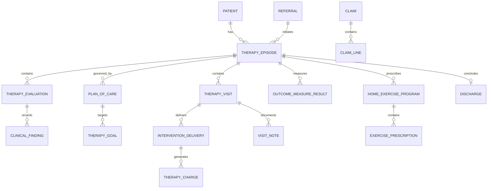

# Physical Therapy Clinic Model Pattern

## Classification

**Applied industry extension — outside the original industry subject list.**

This pattern specializes the [Health Care model pattern](health-care.md) for outpatient, hospital-based, home-based, and virtual physical therapy clinics. It reuses cross-industry Party, Role, Organization, Location, Scheduling, Agreement, Charge, Payment, Document, Status, and Event concepts.

## Intent

Model a physical therapy clinic that receives referrals or direct-access patients; verifies eligibility and authorization; schedules care; evaluates impairments and functional limitations; establishes a plan of care and measurable goals; delivers and documents therapeutic interventions; assigns home programs; measures outcomes; bills responsible parties; and discharges or transitions the patient safely.

This is a logical business and clinical operations pattern. It is not a clinical-practice guideline, coding standard, interoperability profile, privacy rule, or jurisdiction-specific regulatory model. Implementations must adapt professional scope, supervision, documentation, billing, consent, and retention rules to the applicable jurisdiction.

## Business overview

**Need/Referral → Intake → Eligibility/Authorization → Initial Evaluation → Plan of Care → Goals → Scheduled Visits → Treatment/Exercise → Progress Measurement → Reassessment → Billing → Discharge/Follow-up**

A Patient enters through a Referral or direct access. Clinic staff register the Patient, collect intake information, identify the referring and treating Providers, verify coverage and financial responsibility, and determine whether authorization is required. A Physical Therapist performs an Initial Evaluation, records the presenting condition, functional history, precautions, observations, tests, measures, assessment, and prognosis, then establishes a Plan of Care with measurable Therapy Goals, planned Interventions, frequency, and duration.

Appointments organize availability, but each attended treatment interaction becomes a Therapy Visit. During a Visit, the treating Provider records interventions actually delivered, time or units, Patient response, education, progress, and any adverse event. The clinic may issue a Home Exercise Program and track adherence. Periodic Progress Evaluations compare results with baselines and goals, support plan changes and authorization requests, and determine whether the Patient should continue, be referred, placed on hold, or discharged. Delivered services generate Charges, Claims, invoices, and Payments according to the applicable payer and contract.

## Pattern variants

### Simple

Use for a single-location cash-pay clinic or prototype.

Core concepts: Patient; Therapist; Appointment; Initial Evaluation; Plan of Care; Therapy Goal; Therapy Visit; Intervention; Home Exercise Program; Invoice; Payment; Discharge Summary.

### Standard

Use as the default for an operational clinic.

Adds: Clinic; Location; Referral; Referring Provider; Intake; Episode of Care; Coverage; Eligibility Verification; Authorization; Precaution; Functional Limitation; Clinical Finding; Outcome Measure; Treatment Plan Item; Visit Note; Intervention Delivery; Exercise Prescription; Progress Evaluation; Attendance Event; Charge; Claim; Claim Line; Patient Responsibility; Document; Consent; Audit Event.

### Enterprise

Use for multi-location groups, hospital departments, home health, occupational health, payer contracts, specialized programs, or integrated care networks.

Adds: Organization Network; Department; Provider Credential; Supervision Arrangement; Resource and Equipment Schedule; Waitlist; Care Pathway; Program Enrollment; Multidisciplinary Care Team; Referral Network; Contract; Fee Schedule; Authorization Utilization; Utilization Review; Quality Measure; Patient-Reported Outcome; Clinical Registry; Remote Monitoring; Work Injury Case; Legal Case; Data Sharing Agreement; Terminology Mapping.

## Actors and roles

| Role | Meaning |
|---|---|
| Patient | Person receiving physical therapy evaluation or treatment. |
| Physical Therapist | Licensed Provider accountable for evaluation, clinical judgment, and the Plan of Care as permitted by law. |
| Physical Therapist Assistant | Provider delivering delegated care under the required supervision. |
| Referring Provider | Provider requesting therapy or supplying a medical referral. |
| Clinic Administrator | Role managing registration, scheduling, documents, billing, and clinic operations. |
| Caregiver or Representative | Party supporting the Patient or acting under legal authority. |
| Payer | Party adjudicating or funding covered services. |
| Guarantor | Party responsible for amounts not paid by a Payer. |
| Employer or Case Manager | Party coordinating occupational, disability, or injury-related care. |
| Interpreter | Party supporting accessible communication. |

Rule: Person, Patient, Provider, employee, application user, and billing Party are distinct roles. One Party may perform several roles, and every clinical role must be supported by active credentials, organization context, scope, and effective dates.

## Organization, provider, and resource concepts

### Physical Therapy Clinic

A Health Care Organization or organizational unit responsible for providing physical therapy services.

Logical attributes: Clinic Identifier; Clinic Name; Clinic Type; Clinic Status; Legal Entity; Operating Hours; Contact; Effective From; Effective Through.

### Clinic Location

A physical, mobile, home-care, or virtual setting in which clinic services are organized or delivered.

Logical attributes: Location Identifier; Location Name; Location Type; Address or Virtual Endpoint; Accessibility Features; Time Zone; Capacity; Operational Status.

### Therapy Provider

A Practitioner acting as a Physical Therapist, Physical Therapist Assistant, aide, or other permitted care role.

Logical attributes: Provider Identifier; Provider Type; Professional Status; Specialty; License Reference; Effective From; Effective Through.

### Provider Assignment

A Provider's responsibility within an Episode, Plan of Care, Visit, or program.

Logical attributes: Assignment Identifier; Assignment Role; Assignment Status; Assigned Date; Effective From; Effective Through; Supervising Provider; Responsibility.

### Therapy Resource

A room, treatment area, device, equipment item, pool, exercise station, or other schedulable resource.

Logical attributes: Resource Identifier; Resource Type; Resource Name; Resource Status; Location; Capacity; Maintenance Status.

## Access, referral, and intake

### Referral

A request or recommendation for physical therapy evaluation or treatment.

Logical attributes: Referral Identifier; Referral Type; Referral Status; Referral Date; Referring Provider; Reason; Diagnosis or Concern; Requested Service; Priority; Expiration Date; Visit Limit.

Referral types may include physician referral, internal referral, self-referral, employer referral, insurer referral, or post-operative protocol.

### Patient Intake

A controlled collection of demographic, contact, medical, functional, financial, consent, and administrative information before care begins.

Logical attributes: Intake Identifier; Intake Status; Started Date; Completed Date; Source; Preferred Communication; Accessibility Need; Responsible Staff.

### Intake Response

A Patient- or representative-supplied response to a clinic question.

Logical attributes: Response Identifier; Question Code; Response Value; Recorded Date; Respondent; Source; Verification Status.

### Eligibility Verification

Evidence that coverage or another funding arrangement was checked for planned services.

Logical attributes: Verification Identifier; Coverage; Verification Status; Verified Date; Service Type; Effective From; Effective Through; Benefit Detail; Source; Reference.

### Therapy Authorization

A Payer, employer, case-manager, or organizational decision permitting specified therapy services under stated conditions.

Logical attributes: Authorization Identifier; Authorization Number; Authorization Status; Requested Date; Decision Date; Effective From; Effective Through; Authorized Visits or Units; Used Visits or Units; Service Scope; Conditions.

Rule: Referral, clinical order, Patient consent, payer authorization, and clinic acceptance are separate decisions.

### Attendance Event

A record of arrival, cancellation, rescheduling, lateness, or failure to attend.

Logical attributes: Attendance Event Identifier; Event Type; Event Time; Appointment; Recorded By; Reason; Notice Duration; Policy Outcome.

## Episode and care context

### Therapy Episode

An Episode of Care grouping related physical therapy evaluation, plans, visits, outcomes, and discharge activity for a Patient concern.

Logical attributes: Episode Identifier; Episode Type; Episode Status; Start Date; End Date; Primary Concern; Referring Provider; Managing Therapist; Location; Outcome.

### Presenting Concern

The Patient's reported reason for seeking therapy and its effect on function and participation.

Logical attributes: Concern Identifier; Concern Type; Description; Onset Date; Mechanism; Irritability; Severity; Patient Priority; Status.

### Precaution or Contraindication

A condition or risk affecting evaluation, treatment choice, intensity, supervision, or need for referral.

Logical attributes: Precaution Identifier; Precaution Type; Status; Description; Source; Identified Date; Effective From; Effective Through; Required Action.

### Functional Limitation

A limitation in activity or participation relevant to the Patient's daily life and therapy goals.

Logical attributes: Limitation Identifier; Activity Domain; Description; Severity; Baseline Status; Patient Priority; Onset Date; Resolution Date.

Examples include walking, stairs, transfers, lifting, reaching, dressing, work, sport, balance, endurance, and pain-limited participation.

## Evaluation and clinical evidence

### Therapy Evaluation

A structured clinical assessment performed to determine therapy needs, diagnosis or classification, prognosis, goals, and Plan of Care.

Logical attributes: Evaluation Identifier; Evaluation Type; Evaluation Status; Evaluation Date; Evaluating Therapist; Episode; Referral; Complexity; Clinical Impression; Prognosis; Recommendation.

Evaluation types may include initial evaluation, progress evaluation, reassessment, re-evaluation, screening, and discharge evaluation.

### Subjective History

Patient- or representative-reported symptoms, function, history, goals, and contextual factors.

Logical attributes: History Identifier; Recorded Date; Symptom Description; Functional History; Relevant Medical History; Prior Level of Function; Current Level of Function; Patient Goal; Source.

### Clinical Finding

A measured, observed, tested, or asserted fact recorded during evaluation or treatment.

Logical attributes: Finding Identifier; Finding Type; Code; Status; Observed Date/Time; Value; Unit; Body Region; Side; Method; Position; Interpretation; Performer; Source.

Finding types may include pain, range of motion, strength, sensation, posture, gait, balance, edema, endurance, coordination, mobility, and special-test results.

### Outcome Measure Definition

A governed definition of a standardized or clinic-defined instrument.

Logical attributes: Measure Definition Identifier; Measure Name; Version; Domain; Scoring Method; Minimum Value; Maximum Value; Interpretation Guidance; License Reference.

### Outcome Measure Result

A scored result for a Patient at a declared point in the Episode.

Logical attributes: Result Identifier; Measure Definition; Assessment Date; Raw Responses Reference; Score; Unit; Interpretation; Completed By; Administered By; Episode; Visit.

### Therapy Assessment

The Therapist's reasoned synthesis of history, findings, function, response, prognosis, and need for skilled care.

Logical attributes: Assessment Identifier; Assessment Status; Authored Date; Author; Clinical Classification; Problem Summary; Skilled Need; Prognosis; Rationale; Evidence Reference.

Rule: raw findings, standardized outcome scores, and the Therapist's clinical assessment remain distinct and traceable.

## Plan of care and goals

### Plan of Care

An effective-dated clinical plan governing the intended physical therapy services for an Episode.

Logical attributes: Plan Identifier; Plan Status; Version; Authored Date; Effective From; Effective Through; Responsible Therapist; Frequency; Duration; Certification Due Date; Medical Necessity Rationale.

### Therapy Goal

A measurable desired improvement in impairment, activity, participation, self-management, or risk.

Logical attributes: Goal Identifier; Goal Type; Goal Status; Description; Baseline Value; Target Value; Unit; Target Date; Priority; Patient Agreement; Outcome Measure Reference.

Goal types may include short-term, long-term, maintenance, prevention, or Patient-defined goals.

### Goal Progress

An evidence-based assessment of progress toward a Therapy Goal.

Logical attributes: Progress Identifier; Goal; Assessment Date; Progress Status; Measured Value; Percent Progress; Evidence; Assessed By; Comment.

Progress statuses may include not started, progressing, met, partially met, not met, regressed, deferred, and discontinued.

### Treatment Plan Item

A planned category of intervention, education, monitoring, or coordination within a Plan of Care.

Logical attributes: Plan Item Identifier; Intervention Type; Plan Item Status; Intended Frequency; Intended Duration; Dosage Guidance; Responsible Role; Goal Reference; Precaution Reference.

### Plan Approval or Certification

An attestation, approval, or certification of a Plan of Care when required.

Logical attributes: Approval Identifier; Approval Type; Approval Status; Requested Date; Decision Date; Approving Party; Effective From; Effective Through; Conditions; Signature Reference.

Rule: retain every Plan of Care version and the goals, approvals, frequency, duration, and rationale effective for each Visit.

## Scheduling and visit concepts

### Provider Schedule

Planned availability of a Provider, Location, or Therapy Resource.

Logical attributes: Schedule Identifier; Schedule Type; Effective From; Effective Through; Time Zone; Capacity; Schedule Status.

### Therapy Appointment

A planned allocation of time, Provider, Patient, Location, and resources.

Logical attributes: Appointment Identifier; Appointment Type; Appointment Status; Scheduled Start; Scheduled End; Patient; Provider; Location; Episode; Reason; Channel.

### Therapy Visit

The actual bounded care interaction during which physical therapy is evaluated, delivered, discussed, or documented.

Logical attributes: Visit Identifier; Visit Type; Visit Status; Start Date/Time; End Date/Time; Patient; Episode; Treating Provider; Supervising Provider; Location or Channel; Visit Number; Disposition.

Visit types may include initial evaluation, treatment, progress evaluation, re-evaluation, group therapy, aquatic therapy, home visit, tele-rehabilitation, and discharge visit.

### Visit Note

A versioned clinical document describing the Visit.

Logical attributes: Note Identifier; Note Type; Note Status; Authored At; Author; Signed At; Signer; Visit; Plan Version; Version; Supersedes Note; Amendment Reason.

Common logical sections include subjective report, objective findings, interventions, response, assessment, plan, education, and required attestations.

## Intervention and exercise concepts

### Intervention Definition

A governed type of therapeutic service or activity.

Logical attributes: Intervention Definition Identifier; Intervention Code; Intervention Name; Intervention Category; Description; Standard Unit; Required Provider Type; Status.

Categories may include therapeutic exercise, therapeutic activity, neuromuscular re-education, manual therapy, gait training, self-care education, modalities, group therapy, and remote monitoring.

### Intervention Delivery

Evidence that an Intervention was actually performed during a Visit.

Logical attributes: Delivery Identifier; Visit; Intervention Definition; Delivery Status; Start Time; End Time; Timed Minutes; Untimed Units; Body Region; Parameters; Delivering Provider; Supervising Provider; Patient Response; Goal Reference.

### Exercise Definition

A reusable definition of a movement or activity that may be prescribed or performed.

Logical attributes: Exercise Identifier; Exercise Name; Exercise Category; Instructions; Media Reference; Default Precautions; Status.

### Exercise Prescription

A Patient-specific exercise instruction within a clinic or Home Exercise Program.

Logical attributes: Prescription Identifier; Exercise Definition; Status; Sets; Repetitions; Duration; Frequency; Resistance; Hold Time; Side; Progression Criteria; Start Date; End Date; Prescribed By.

### Home Exercise Program

A versioned set of Patient instructions, exercises, education, precautions, and progression guidance intended outside supervised Visits.

Logical attributes: Program Identifier; Program Status; Version; Issued Date; Effective From; Effective Through; Patient; Episode; Prescribing Therapist; Delivery Method; Language.

### Home Program Activity

A record of Patient-reported or remotely observed home-program performance.

Logical attributes: Activity Identifier; Program; Activity Date; Exercise Prescription; Completion Status; Quantity; Symptom Response; Patient Comment; Source.

### Patient Education

Education delivered to the Patient or caregiver concerning condition, safety, exercises, self-management, equipment, or prevention.

Logical attributes: Education Identifier; Visit; Topic; Recipient; Method; Material Reference; Understanding Status; Teach-Back Result; Educator.

## Progress, safety, and discharge

### Progress Evaluation

A periodic comparison of Patient status with baseline, prior results, Plan of Care, and Therapy Goals.

Logical attributes: Progress Evaluation Identifier; Evaluation Date; Evaluator; Episode; Plan Version; Visit Range; Progress Summary; Continued Skilled Need; Recommendation.

### Adverse Event

An unintended event, symptom escalation, injury, fall, equipment incident, or other safety concern occurring in relation to care.

Logical attributes: Adverse Event Identifier; Event Type; Event Status; Occurred At; Detected At; Patient; Visit; Severity; Description; Immediate Action; Reported By; Review Outcome.

### Clinical Communication

A communication with a Patient, Provider, caregiver, Payer, employer, or case manager concerning care.

Logical attributes: Communication Identifier; Communication Type; Status; Occurred At; Sender; Recipient; Subject; Summary; Episode; Follow-up Required.

### Discharge

The clinical and administrative conclusion or transition of a Therapy Episode.

Logical attributes: Discharge Identifier; Discharge Date; Discharge Status; Disposition; Reason; Discharging Therapist; Goal Summary; Functional Status; Follow-up Plan; Referral Recommendation.

Discharge reasons may include goals met, maximum benefit, independent self-management, transfer, medical change, non-attendance, authorization exhausted, Patient choice, or administrative closure.

### Discharge Summary

A finalized clinical document summarizing the Episode, services, outcomes, remaining limitations, home plan, precautions, and follow-up.

Logical attributes: Summary Identifier; Document Status; Authored At; Author; Signed At; Episode; Plan Version; Final Outcome Results; Recipient List.

## Billing and payment

### Coverage

A Patient's entitlement to insured, public, employer-funded, or other third-party-funded services.

Logical attributes: Coverage Identifier; Coverage Type; Coverage Status; Payer; Plan; Member Identifier; Effective From; Effective Through.

### Therapy Charge

A billable amount arising from a documented evaluation, intervention, supply, or other service.

Logical attributes: Charge Identifier; Charge Code; Charge Status; Service Date; Visit; Intervention Delivery; Quantity; Unit; Unit Price; Amount; Currency; Rendering Provider; Location.

### Claim

A request to a Payer for adjudication of covered therapy services.

Logical attributes: Claim Identifier; Claim Number; Claim Status; Submitted Date; Patient; Provider; Payer; Service Period; Total Claimed Amount.

### Claim Line

A detailed service or charge within a Claim.

Logical attributes: Claim Line Identifier; Line Number; Service Code; Service Date; Units; Claimed Amount; Diagnosis Reference; Authorization Reference; Rendering Provider; Charge Reference.

### Adjudication

A Payer decision determining allowed, paid, adjusted, denied, and Patient-responsibility amounts.

Logical attributes: Adjudication Identifier; Decision Date; Decision Status; Allowed Amount; Paid Amount; Adjustment Amount; Patient Responsibility; Denial Reason; Remittance Reference.

### Patient Invoice

A request for payment of Patient or guarantor responsibility.

Logical attributes: Invoice Identifier; Invoice Number; Invoice Date; Due Date; Invoice Status; Patient or Guarantor; Amount; Currency; Source Charges.

### Payment

A transfer of funds settling a Claim, Invoice, or Patient balance.

Logical attributes: Payment Identifier; Payment Date; Amount; Currency; Payment Type; Payment Status; Payer or Patient; Allocation Reference.

## Relationship model

| Source | Relationship | Target | Cardinality |
|---|---|---|---|
| Physical Therapy Clinic | operates | Clinic Location | 1:M |
| Therapy Provider | receives | Provider Assignment | 1:M |
| Patient | has | Therapy Episode | 1:M |
| Referral | may initiate | Therapy Episode | 1:0..M |
| Therapy Episode | concerns | Presenting Concern | 1:M |
| Therapy Episode | has | Precaution or Contraindication | 1:M |
| Therapy Episode | has | Functional Limitation | 1:M |
| Therapy Episode | contains | Therapy Evaluation | 1:M |
| Therapy Evaluation | records | Clinical Finding | 1:M |
| Therapy Evaluation | produces | Therapy Assessment | 1:M |
| Therapy Episode | has | Outcome Measure Result | 1:M |
| Therapy Episode | governed by | Plan of Care | 1:M versions |
| Plan of Care | contains | Therapy Goal | 1:M |
| Therapy Goal | receives | Goal Progress | 1:M |
| Plan of Care | contains | Treatment Plan Item | 1:M |
| Plan of Care | receives | Approval or Certification | 1:M |
| Therapy Appointment | may result in | Therapy Visit | 1:0..1 |
| Therapy Episode | contains | Therapy Visit | 1:M |
| Therapy Visit | has | Visit Note | 1:M versions |
| Therapy Visit | contains | Intervention Delivery | 1:M |
| Intervention Delivery | instantiates | Intervention Definition | M:1 |
| Intervention Delivery | supports | Therapy Goal | M:M |
| Home Exercise Program | contains | Exercise Prescription | 1:M |
| Exercise Prescription | references | Exercise Definition | M:1 |
| Therapy Episode | has | Home Exercise Program | 1:M versions |
| Home Exercise Program | receives | Home Program Activity | 1:M |
| Therapy Episode | receives | Progress Evaluation | 1:M |
| Therapy Episode | concludes with | Discharge | 1:0..1 |
| Discharge | produces | Discharge Summary | 1:1 |
| Eligibility Verification | evaluates | Coverage | M:1 |
| Therapy Authorization | authorizes | Episode, Visit, or Service | 1:M |
| Intervention Delivery | produces | Therapy Charge | 1:M |
| Claim | contains | Claim Line | 1:M |
| Claim Line | references | Therapy Charge | M:1 |
| Claim | receives | Adjudication | 1:M |
| Adjudication or Invoice | receives | Payment | 1:M |

## Lifecycle models

### Referral

Received → Reviewed → Accepted → Scheduled → Fulfilled

Exception outcomes: More Information Required; Declined; Expired; Cancelled; Redirected.

### Patient intake

Started → In Progress → Ready for Review → Complete

Exception outcomes: On Hold; Incomplete; Withdrawn.

### Therapy authorization

Draft → Submitted → In Review → Approved → Active → Exhausted/Expired

Exception outcomes: Partially Approved; Denied; Appealed; Cancelled.

### Therapy episode

Proposed → Intake → Evaluation → Active Treatment → Progress Review → Discharge Pending → Closed

Exception outcomes: Waitlisted; On Hold; Transferred; Cancelled; Administrative Closure; Reopened.

### Plan of care

Draft → Reviewed → Active → Revised → Completed

Exception outcomes: Awaiting Certification; Rejected; On Hold; Discontinued; Superseded.

### Therapy goal

Proposed → Active → Progressing → Met → Closed

Exception outcomes: Not Met; Regressed; Deferred; Discontinued; Superseded.

### Therapy appointment

Requested → Booked → Confirmed → Arrived → Fulfilled

Exception outcomes: Waitlisted; Rescheduled; Cancelled; Late Cancellation; No Show.

### Therapy visit

Planned → Arrived → In Progress → Documentation Pending → Completed

Exception outcomes: Cancelled; Interrupted; Entered in Error.

### Visit note

Draft → In Review → Signed → Final

Correction outcomes: Amended; Corrected; Superseded; Entered in Error.

### Discharge

Proposed → Reviewed → Completed → Follow-up Pending → Closed

Exception outcomes: Deferred; Reopened.

## Business events

- Referral Received, Accepted, Declined, Expired, or Fulfilled
- Patient Intake Started or Completed
- Eligibility Verified
- Authorization Requested, Approved, Denied, Extended, Exhausted, or Expired
- Appointment Requested, Booked, Confirmed, Rescheduled, Cancelled, or Missed
- Patient Arrived
- Initial Evaluation Started, Signed, or Amended
- Precaution or Contraindication Identified
- Plan of Care Created, Certified, Activated, Revised, or Completed
- Therapy Goal Activated, Progressed, Met, Not Met, or Discontinued
- Therapy Visit Started or Completed
- Intervention Delivered
- Home Exercise Program Issued or Revised
- Outcome Measure Recorded
- Progress Evaluation Completed
- Adverse Event Recorded or Escalated
- Additional Visits Requested
- Patient Placed on Hold, Transferred, or Discharged
- Charge Created, Corrected, or Voided
- Claim Submitted, Rejected, Adjudicated, Denied, or Appealed
- Patient Invoice Issued
- Payment Received, Reversed, or Allocated
- Clinical Record Accessed, Disclosed, Signed, or Amended

## Baseline business and integrity rules

1. Every Therapy Episode must identify the Patient, responsible clinic, primary concern, managing Therapist, start date, and access basis such as Referral or direct access.
2. A Provider may evaluate, treat, delegate, supervise, or sign only within an active role, credential, organization, jurisdiction, and permitted scope.
3. Referral requirements are evaluated independently from payer authorization and clinical need.
4. An Initial Evaluation must precede active treatment unless an explicitly authorized screening, emergency, or protocol exception applies.
5. A Plan of Care must identify its author, effective period, frequency, duration, goals, intended interventions, precautions, and skilled-need rationale.
6. Only one Plan of Care version is authoritative for a given Episode and effective time; revisions preserve prior versions.
7. Each Therapy Goal must be measurable or explicitly qualitative, linked to a functional concern, and assigned a target or review condition.
8. A Therapy Appointment is a plan; a Therapy Visit records actual care. Billing cannot rely on Appointment status alone.
9. A completed Therapy Visit must identify the treating Provider, Patient, Episode, start and end time, location or channel, services delivered, Patient response, and next plan.
10. Intervention Delivery must record sufficient quantity, time, units, parameters, Provider, supervision, and response to support clinical and billing requirements.
11. Timed and untimed service units are calculated under the applicable payer, contract, and jurisdiction rules, with the calculation evidence retained.
12. A Physical Therapist Assistant or delegated role may provide only interventions permitted by the active Plan, delegation, supervision, and scope rules.
13. Outcome Measure Results preserve instrument name, version, date, score, method, respondent, and interpretation.
14. Progress Evaluation must compare current status with relevant baselines, prior measures, goals, attendance, intervention response, and authorization usage.
15. A Home Exercise Program is versioned; changes preserve prior instructions and identify the prescribing Provider and effective date.
16. A precaution, contraindication, red flag, or Adverse Event requiring escalation must prevent incompatible treatment until appropriately resolved.
17. Signed clinical notes are immutable; corrections use attributed amendments or superseding versions with reason and time.
18. Every Therapy Charge must trace to a completed, documented service and the responsible Provider, date, location, code, and units.
19. A Claim Line must trace to a valid Charge, Visit, diagnosis or reason, and authorization when required.
20. Used visits or units cannot exceed an active Authorization without a documented exception, alternate payer, or Patient financial agreement.
21. Discharge must record reason, functional status, goal outcomes, remaining limitations, home instructions, precautions, and recommended follow-up.
22. Patient information access and disclosure must be governed by role, purpose, consent or other authority, minimum-necessary scope, and immutable audit evidence.

## AI modeling questions

1. Is the clinic outpatient, hospital-based, home health, sports, pediatric, geriatric, neurological, orthopedic, pelvic health, occupational health, virtual, or multidisciplinary?
2. Which jurisdictions govern direct access, referral, scope, delegation, supervision, documentation, privacy, and retention?
3. Which Provider types and credentials may evaluate, treat, supervise, sign, or bill?
4. How are Referrals received, validated, accepted, expired, renewed, and linked to Episodes?
5. What intake forms, consent, medical history, red-flag screening, and accessibility information are required?
6. Which payer, employer, case-management, public-funding, or cash-pay arrangements are supported?
7. How are eligibility, visit limits, prior authorization, unit authorization, certification, and utilization tracked?
8. Which evaluation templates, body regions, tests, measures, and clinical classifications are required?
9. Which standardized outcome measures are used, and how are instrument versions and licenses governed?
10. How are Plans of Care authored, approved, certified, revised, and related to effective Visits?
11. How are Therapy Goals measured, reviewed, met, deferred, or discontinued?
12. Which intervention categories, service codes, timed-unit rules, modalities, supplies, and supervision rules apply?
13. How are Home Exercise Programs created, delivered, translated, acknowledged, and monitored?
14. Which attendance, cancellation, lateness, and no-show policies apply?
15. What conditions cause treatment to pause, require Provider contact, trigger emergency action, or cause referral elsewhere?
16. How are progress reports, recertification, requests for additional visits, and discharge decisions handled?
17. Which claims, invoices, remittances, denials, appeals, Patient balances, and payment workflows are needed?
18. Which clinical, functional, operational, financial, safety, satisfaction, and quality outcomes must be measured?
19. Which external systems are authoritative for identity, referrals, schedules, coverage, documentation, exercise content, claims, and payment?
20. What evidence must remain immutable for clinical, legal, payer, professional, and audit purposes?

## Candidate capabilities and use cases

| Capability | Candidate actor-goal use cases |
|---|---|
| Patient Access | Register Patient; Complete Intake; Capture Consent; Verify Coverage; Record Financial Responsibility |
| Referral Management | Receive Referral; Review Referral; Request Missing Information; Accept or Decline Referral |
| Scheduling | Find Availability; Book Appointment; Confirm Appointment; Check In Patient; Reschedule or Cancel |
| Evaluation | Conduct Initial Evaluation; Record Findings; Score Outcome Measure; Identify Precautions; Establish Prognosis |
| Plan of Care | Create Plan of Care; Define Therapy Goals; Obtain Certification; Revise Plan of Care |
| Treatment | Start Therapy Visit; Deliver Intervention; Record Patient Response; Provide Education; Complete Visit Note |
| Home Program | Create Home Exercise Program; Issue Program; Revise Prescription; Record Patient Adherence |
| Progress Management | Conduct Progress Evaluation; Assess Goal Progress; Request Additional Authorization; Place Episode on Hold |
| Safety | Record Adverse Event; Escalate Red Flag; Communicate with Referring Provider |
| Discharge | Evaluate for Discharge; Complete Discharge Summary; Issue Follow-up Plan; Reopen Episode |
| Revenue Cycle | Create Charges; Validate Units; Submit Claim; Resolve Denial; Invoice Patient; Allocate Payment |
| Governance | Amend Signed Note; Audit Record Access; Review Provider Credentials; Publish Quality Measures |

## MDE modeling guidance

- Specialize the Health Care pattern; do not fork duplicate definitions of Patient, Provider, Organization, Encounter, Consent, Coverage, Claim, or Payment without a material therapy-specific difference.
- Keep Referral, Appointment, Therapy Visit, Episode, Evaluation, Plan of Care, and Authorization distinct.
- Keep planned Treatment Plan Items separate from Intervention Deliveries actually performed.
- Keep reusable Exercise Definitions separate from Patient-specific Exercise Prescriptions and versioned Home Exercise Programs.
- Keep Clinical Findings, Outcome Measure Results, Therapy Assessments, and Goal Progress separate so their provenance and meaning remain clear.
- Attach business rules to authoritative entity operations such as activate plan, start visit, deliver intervention, sign note, calculate units, submit claim, and discharge episode.
- Let use cases orchestrate actor goals and branching; do not hide clinical or billing rules inside use-case prose.
- Model jurisdiction, payer, contract, credential, coding, and terminology differences as governed configurations or effective-dated rules.
- Treat imported referrals, histories, coverage responses, and external clinical documents as sourced assertions until verified.
- Apply data minimization and do not collect sensitive information merely because a generic health record can store it.

## Anti-patterns

### Appointment Equals Treatment

An Appointment reserves time. A Therapy Visit records actual care, and Intervention Delivery records what occurred.

### Evaluation Equals Plan of Care

The Evaluation supplies evidence and clinical reasoning. The Plan of Care is the governed, effective-dated plan that follows from it.

### Treatment Plan Equals Billing Codes

A Plan describes clinical intent and goals. Billing codes classify documented services after delivery under payer rules.

### One Free-Text Visit Note

A narrative alone cannot reliably support provenance, goal tracking, outcome comparison, intervention dosage, unit calculation, authorization consumption, or analytics.

### Current Plan Reconstructs Historical Care

Plan revisions change goals and interventions. Each Visit must retain the Plan version and rules effective when care occurred.

### Exercise Equals Home Program

An Exercise is reusable content. A Prescription is Patient-specific, and a Home Exercise Program is a versioned collection with instructions and effective dates.

### Goal Status Without Evidence

“Met” or “not met” must link to measurements, observations, Patient reports, clinical reasoning, and assessment date.

### Authorization Equals Clinical Approval

Payer permission does not establish clinical appropriateness, Patient consent, valid referral, or Provider scope.

### Scheduled Minutes Equal Billable Units

Scheduled duration, attended time, treatment time, timed minutes, untimed services, and billable units are different measures.

### Patient Equals Portal User

A Patient may have no account, and a caregiver or representative may use the portal under scoped authority.

## Physical mapping examples

| Logical name | Example physical name |
|---|---|
| Therapy Episode | `therapy_episode` |
| Patient Intake | `patient_intake` |
| Eligibility Verification | `eligibility_verification` |
| Therapy Authorization | `therapy_authorization` |
| Therapy Evaluation | `therapy_evaluation` |
| Clinical Finding | `clinical_finding` |
| Outcome Measure Result | `outcome_measure_result` |
| Plan of Care | `plan_of_care` |
| Therapy Goal | `therapy_goal` |
| Therapy Visit | `therapy_visit` |
| Intervention Delivery | `intervention_delivery` |
| Home Exercise Program | `home_exercise_program` |
| Exercise Prescription | `exercise_prescription` |
| Progress Evaluation | `progress_evaluation` |
| Discharge Summary | `discharge_summary` |

Logical names remain authoritative. Stack, jurisdiction, payer, coding, and clinic rules generate physical names only after the logical model is accepted.

## Future knowledge-base expansion

A metamodel-conformant Physical Therapy Clinic knowledge base should instantiate separate capability, entity, role, business-rule, use-case, page, workflow, scenario, and test artifacts from this logical pattern. The first end-to-end vertical slice should be:

**Receive Referral → Complete Intake → Conduct Initial Evaluation → Activate Plan of Care → Book and Complete Therapy Visit → Record Intervention Delivery → Assess Goal Progress → Create Charge → Discharge Episode**

Recommended verification scenarios include direct access without referral, authorization required before treatment, authorization exhausted, Patient no-show, Therapist unavailable, red flag identified, Plan revision after reassessment, delegated treatment under supervision, timed-unit validation, signed-note amendment, claim denial, goals met discharge, and administrative discharge for non-attendance.
