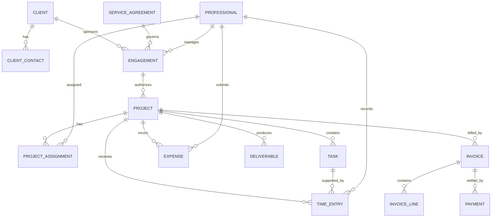

# Professional Services Pattern

## Intent

Model organizations that deliver professional work through client engagements, projects or matters, assignments, time and expenses, approvals, deliverables, billing, and payment.

MDE selection signals include client engagement, project delivery, billable work, approvals, invoicing, resource planning, utilization, or matter management.

## Business overview

The core decomposition is:

**Client → Engagement → Project/Matter → Assignment/Task → Time/Expense → Approval → Billing → Payment**

A client sponsors an engagement. An engagement and its service agreement authorize one or more projects or matters. Projects contain tasks and receive professional assignments. Work produces time entries, expenses, and deliverables. Required approvals control acceptance and billing. Invoice lines charge for approved work or billing events, and payments settle invoices.

## Core concepts

- Client and Client Contact
- Professional
- Engagement and Service Agreement
- Project and Project Assignment
- Task
- Time Entry and Expense
- Billing Rate
- Deliverable
- Approval
- Invoice and Invoice Line
- Payment

## Enterprise extensions

- Practice Area and Service Offering
- Skill and Resource Plan
- Client Account
- Matter
- Hierarchical Work Effort
- Billing Event for milestone-, time-, or expense-driven billing

## Important relationship roles

- Client sponsors Engagement.
- Engagement is governed by Service Agreement.
- Engagement authorizes Project or Matter.
- Project contains Task.
- Professional receives Project Assignment.
- Professional performs Task.
- Time Entry and Expense record work against an authorized work unit.
- Approval accepts or rejects Time Entry, Expense, Deliverable, or Invoice.
- Billing Event generates Invoice Line.
- Invoice Line bills approved time, expense, deliverable, or milestone.
- Payment settles Invoice.

## Modeling questions

1. Does the organization distinguish engagement, project, matter, and work effort?
2. Is billing based on time, expenses, fixed fees, milestones, retainers, or a combination?
3. Which records require approval, by whom, and in what sequence?
4. Are deliverables formally tracked and accepted?
5. Are skills, resource plans, capacity, and utilization required?
6. At which level are billing rates established and overridden?
7. Are multiple currencies, taxes, or legal entities required?

## Anti-patterns

- **Project as Everything** — collapsing engagement, agreement, work, billing, and delivery into Project.
- **User Equals Professional** — confusing authentication identity with the business role and resource.
- **Invoice Directly from Project** — omitting invoice lines and therefore losing the reason and composition of a charge.

## Current boundary

This pattern provides business context, concepts, relationships, and operational structure. It does not yet contain formal MDE capabilities, use cases, business-rule definitions, state-transition models, pages, or test scenarios.

## Detailed logical model

The earlier summary contained actual model content. The following restores that content rather than merely naming the concepts.

### Simple variant

| Concept | Definition | Logical attributes |
|---|---|---|
| Client | Canonical definition: [Client](../model/requirements/professional-services/project/client.md). | See canonical concept for logical attributes. |
| Professional | Canonical definition: [Professional](../model/requirements/professional-services/project/professional.md). | See canonical concept for logical attributes. |
| Project | Canonical definition: [Project](../model/requirements/professional-services/project/project.md). | See canonical concept for logical attributes. |
| Task | Canonical definition: [Task](../model/requirements/professional-services/project/task.md). | See canonical concept for logical attributes. |
| Time Entry | Canonical definition: [Time Entry](../model/requirements/professional-services/project/time-entry.md). | See canonical concept for logical attributes. |
| Expense | Canonical definition: [Expense](../model/requirements/professional-services/project/expense.md). | See canonical concept for logical attributes. |
| Invoice | Canonical definition: [Invoice](../model/requirements/finance/invoice/invoice.md). | See canonical concept for logical attributes. |

### Standard extensions

| Concept | Definition | Logical attributes |
|---|---|---|
| Engagement | Canonical definition: [Engagement](../model/requirements/professional-services/project/engagement.md). | See canonical concept for logical attributes. |
| Service Agreement | Canonical definition: [Service Agreement](../model/requirements/professional-services/project/service-agreement.md). | See canonical concept for logical attributes. |
| Project Assignment | Canonical definition: [Project Assignment](../model/requirements/professional-services/project/project-assignment.md). | See canonical concept for logical attributes. |
| Billing Rate | Canonical definition: [Billing Rate](../model/requirements/professional-services/project/billing-rate.md). | See canonical concept for logical attributes. |
| Deliverable | Canonical definition: [Deliverable](../model/requirements/professional-services/project/deliverable.md). | See canonical concept for logical attributes. |
| Approval | Canonical definition: [Approval](../model/requirements/professional-services/project/approval.md). | See canonical concept for logical attributes. |
| Invoice Line | Canonical definition: [Invoice Line](../model/requirements/finance/invoice/invoice-line.md). | See canonical concept for logical attributes. |
| Payment | Canonical definition: [Payment](../model/requirements/finance/invoice/payment.md). | See canonical concept for logical attributes. |

### Relationship model

| Source | Relationship | Target | Cardinality |
|---|---|---|---|
| Client | has | Client Contact | 1:M |
| Client | sponsors | Engagement | 1:M |
| Service Agreement | governs | Engagement | 1:M |
| Professional | manages | Engagement | 1:M |
| Engagement | authorizes | Project | 1:M |
| Project | has | Project Assignment | 1:M |
| Professional | participates through | Project Assignment | 1:M |
| Project | contains | Task | 1:M |
| Project | receives | Time Entry | 1:M |
| Task | is supported by | Time Entry | 1:M |
| Professional | records | Time Entry | 1:M |
| Project | incurs | Expense | 1:M |
| Professional | submits | Expense | 1:M |
| Project | produces | Deliverable | 1:M |
| Time Entry, Expense, or Deliverable | receives | Approval | 1:M |
| Client | receives | Invoice | 1:M |
| Project | is billed by | Invoice | 1:M |
| Invoice | contains | Invoice Line | 1:M |
| Invoice | is settled by | Payment | 1:M |
| Billing Rate | prices | Project Assignment or Invoice Line | 1:M |

### Enterprise concepts

- **Practice Area** — Canonical concept: [Practice Area](../model/requirements/professional-services/project/practice-area.md).
- **Service Offering** — Canonical concept: [Service Offering](../model/requirements/professional-services/project/service-offering.md).
- **Skill** — Canonical concept: [Skill](../model/requirements/professional-services/project/skill.md).
- **Resource Plan** — Canonical concept: [Resource Plan](../model/requirements/professional-services/project/resource-plan.md).
- **Client Account** — Canonical concept: [Client Account](../model/requirements/professional-services/project/client-account.md).
- **Matter** — Canonical concept: [Matter](../model/requirements/professional-services/project/matter.md).
- **Work Effort** — Canonical concept: [Work Effort](../model/requirements/professional-services/project/work-effort.md).
- **Billing Event** — Canonical concept: [Billing Event](../model/requirements/professional-services/project/billing-event.md).

### Physical mapping

Keep logical names authoritative. Example physical mappings are Client → `client`, Client Identifier → `client_id`, Service Agreement → `service_agreement`, Project Assignment → `project_assignment`, Time Entry → `time_entry`, Billing Rate → `billing_rate`, and Invoice Line → `invoice_line`. Final naming is generated by the selected technology-stack rules.

## Canonical model bindings

This pattern selects and connects concepts in the [coherent model](../model/README.md). The sections below are views of those definitions. Industry lifecycles, events, baseline rules, and variant choices continue to constrain the selected concepts.

| Source term | Canonical concept | ABE |
|---|---|---|
| Client | [Client](../model/requirements/professional-services/project/client.md) | [Project](../model/requirements/professional-services/project/README.md) |
| Professional | [Professional](../model/requirements/professional-services/project/professional.md) | [Project](../model/requirements/professional-services/project/README.md) |
| Project | [Project](../model/requirements/professional-services/project/project.md) | [Project](../model/requirements/professional-services/project/README.md) |
| Task | [Task](../model/requirements/professional-services/project/task.md) | [Project](../model/requirements/professional-services/project/README.md) |
| Time Entry | [Time Entry](../model/requirements/professional-services/project/time-entry.md) | [Project](../model/requirements/professional-services/project/README.md) |
| Expense | [Expense](../model/requirements/professional-services/project/expense.md) | [Project](../model/requirements/professional-services/project/README.md) |
| Invoice | [Invoice](../model/requirements/finance/invoice/invoice.md) | [Invoice](../model/requirements/finance/invoice/README.md) |
| Engagement | [Engagement](../model/requirements/professional-services/project/engagement.md) | [Project](../model/requirements/professional-services/project/README.md) |
| Service Agreement | [Service Agreement](../model/requirements/professional-services/project/service-agreement.md) | [Project](../model/requirements/professional-services/project/README.md) |
| Project Assignment | [Project Assignment](../model/requirements/professional-services/project/project-assignment.md) | [Project](../model/requirements/professional-services/project/README.md) |
| Billing Rate | [Billing Rate](../model/requirements/professional-services/project/billing-rate.md) | [Project](../model/requirements/professional-services/project/README.md) |
| Deliverable | [Deliverable](../model/requirements/professional-services/project/deliverable.md) | [Project](../model/requirements/professional-services/project/README.md) |
| Approval | [Approval](../model/requirements/professional-services/project/approval.md) | [Project](../model/requirements/professional-services/project/README.md) |
| Invoice Line | [Invoice Line](../model/requirements/finance/invoice/invoice-line.md) | [Invoice](../model/requirements/finance/invoice/README.md) |
| Payment | [Payment](../model/requirements/finance/invoice/payment.md) | [Invoice](../model/requirements/finance/invoice/README.md) |
| Practice Area | [Practice Area](../model/requirements/professional-services/project/practice-area.md) | [Project](../model/requirements/professional-services/project/README.md) |
| Service Offering | [Service Offering](../model/requirements/professional-services/project/service-offering.md) | [Project](../model/requirements/professional-services/project/README.md) |
| Skill | [Skill](../model/requirements/professional-services/project/skill.md) | [Project](../model/requirements/professional-services/project/README.md) |
| Resource Plan | [Resource Plan](../model/requirements/professional-services/project/resource-plan.md) | [Project](../model/requirements/professional-services/project/README.md) |
| Client Account | [Client Account](../model/requirements/professional-services/project/client-account.md) | [Project](../model/requirements/professional-services/project/README.md) |
| Matter | [Matter](../model/requirements/professional-services/project/matter.md) | [Project](../model/requirements/professional-services/project/README.md) |
| Work Effort | [Work Effort](../model/requirements/professional-services/project/work-effort.md) | [Project](../model/requirements/professional-services/project/README.md) |
| Billing Event | [Billing Event](../model/requirements/professional-services/project/billing-event.md) | [Project](../model/requirements/professional-services/project/README.md) |
