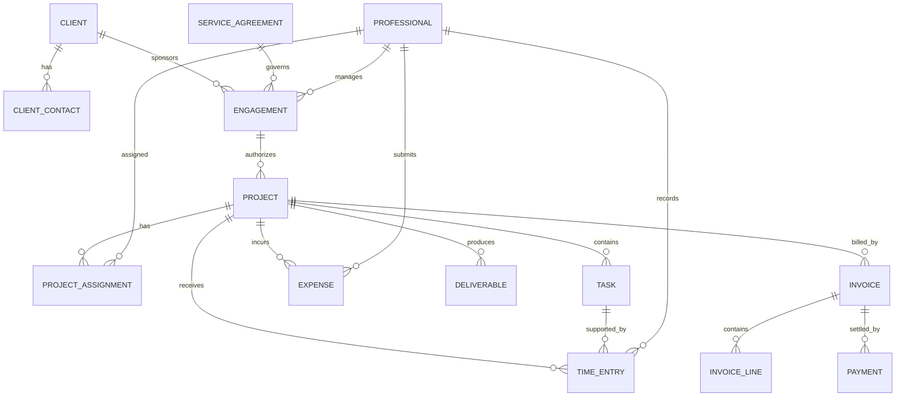

# Professional Services Pattern

## Intent

Model organizations that deliver professional work through client engagements, projects or matters, assignments, time and expenses, approvals, deliverables, billing, and payment.

MDE selection signals include client engagement, project delivery, billable work, approvals, invoicing, resource planning, utilization, or matter management.

## Business overview

The core decomposition is:

**Client → Engagement → Project/Matter → Assignment/Task → Time/Expense → Approval → Billing → Payment**

A client sponsors an engagement. An engagement and its service agreement authorize one or more projects or matters. Projects contain tasks and receive professional assignments. Work produces time entries, expenses, and deliverables. Required approvals control acceptance and billing. Invoice lines charge for approved work or billing events, and payments settle invoices.

## Core concepts

- Client and Client Contact
- Professional
- Engagement and Service Agreement
- Project and Project Assignment
- Task
- Time Entry and Expense
- Billing Rate
- Deliverable
- Approval
- Invoice and Invoice Line
- Payment

## Enterprise extensions

- Practice Area and Service Offering
- Skill and Resource Plan
- Client Account
- Matter
- Hierarchical Work Effort
- Billing Event for milestone-, time-, or expense-driven billing

## Important relationship roles

- Client sponsors Engagement.
- Engagement is governed by Service Agreement.
- Engagement authorizes Project or Matter.
- Project contains Task.
- Professional receives Project Assignment.
- Professional performs Task.
- Time Entry and Expense record work against an authorized work unit.
- Approval accepts or rejects Time Entry, Expense, Deliverable, or Invoice.
- Billing Event generates Invoice Line.
- Invoice Line bills approved time, expense, deliverable, or milestone.
- Payment settles Invoice.

## Modeling questions

1. Does the organization distinguish engagement, project, matter, and work effort?
2. Is billing based on time, expenses, fixed fees, milestones, retainers, or a combination?
3. Which records require approval, by whom, and in what sequence?
4. Are deliverables formally tracked and accepted?
5. Are skills, resource plans, capacity, and utilization required?
6. At which level are billing rates established and overridden?
7. Are multiple currencies, taxes, or legal entities required?

## Anti-patterns

- **Project as Everything** — collapsing engagement, agreement, work, billing, and delivery into Project.
- **User Equals Professional** — confusing authentication identity with the business role and resource.
- **Invoice Directly from Project** — omitting invoice lines and therefore losing the reason and composition of a charge.

## Current boundary

This pattern provides business context, concepts, relationships, and operational structure. It does not yet contain formal MDE capabilities, use cases, business-rule definitions, state-transition models, pages, or test scenarios.

## Detailed logical model

The earlier summary contained actual model content. The following restores that content rather than merely naming the concepts.

### Simple variant

| Concept | Definition | Logical attributes |
|---|---|---|
| Client | Person or organization receiving professional services. | Client Identifier; Client Name; Client Type; Client Status; Primary Contact Name; Primary Email Address; Primary Phone Number; Billing Address |
| Professional | Staff member, contractor, partner, consultant, lawyer, accountant, or other service provider. | Professional Identifier; Professional Name; Professional Role; Professional Status; Standard Billing Rate; Standard Cost Rate; Email Address |
| Project | Body of work performed for a Client. | Project Identifier; Project Name; Project Description; Project Status; Start Date; Target End Date; Actual End Date; Billing Method; Budget Amount |
| Task | Unit of work within a Project. | Task Identifier; Task Name; Task Description; Task Status; Planned Start Date; Planned End Date; Estimated Hours; Actual Hours |
| Time Entry | Recorded labor time. | Time Entry Identifier; Work Date; Hours Worked; Billable Indicator; Time Entry Status; Work Description |
| Expense | Reimbursable or non-reimbursable project cost. | Expense Identifier; Expense Date; Expense Type; Expense Amount; Billable Indicator; Expense Status; Expense Description |
| Invoice | Billing document sent to a Client. | Invoice Identifier; Invoice Number; Invoice Date; Invoice Status; Invoice Total Amount; Due Date |

### Standard extensions

| Concept | Definition | Logical attributes |
|---|---|---|
| Engagement | Commercial relationship under which professional work is delivered. | Engagement Identifier; Engagement Name; Engagement Type; Engagement Status; Engagement Start Date; Engagement End Date; Billing Arrangement; Contract Reference; Approved Budget Amount |
| Service Agreement | Contractual terms governing the professional service. | Service Agreement Identifier; Agreement Number; Agreement Type; Agreement Status; Effective Date; Expiration Date; Payment Terms; Billing Frequency; Retainer Amount; Fixed Fee Amount |
| Project Assignment | A Professional's role and responsibility on a Project. | Assignment Identifier; Assignment Role; Assignment Status; Assignment Start Date; Assignment End Date; Allocation Percentage; Planned Hours; Billing Rate Override |
| Billing Rate | Rate used to bill professional work. | Billing Rate Identifier; Rate Name; Rate Type; Billing Rate Amount; Currency; Effective Date; Expiration Date |
| Deliverable | Work product delivered to the Client. | Deliverable Identifier; Deliverable Name; Deliverable Type; Deliverable Status; Due Date; Delivery Date; Acceptance Date |
| Approval | Formal approval of time, expense, deliverable, invoice, or project change. | Approval Identifier; Approval Subject Type; Approval Status; Requested Date; Approved Date; Rejection Reason; Approval Notes |
| Invoice Line | One explainable component of an Invoice. | Invoice Line Identifier; Line Number; Description; Quantity; Unit Rate; Line Amount; Line Type |
| Payment | Money received against an Invoice. | Payment Identifier; Payment Date; Payment Amount; Payment Method; Payment Status; Payment Reference |

### Relationship model

| Source | Relationship | Target | Cardinality |
|---|---|---|---|
| Client | has | Client Contact | 1:M |
| Client | sponsors | Engagement | 1:M |
| Service Agreement | governs | Engagement | 1:M |
| Professional | manages | Engagement | 1:M |
| Engagement | authorizes | Project | 1:M |
| Project | has | Project Assignment | 1:M |
| Professional | participates through | Project Assignment | 1:M |
| Project | contains | Task | 1:M |
| Project | receives | Time Entry | 1:M |
| Task | is supported by | Time Entry | 1:M |
| Professional | records | Time Entry | 1:M |
| Project | incurs | Expense | 1:M |
| Professional | submits | Expense | 1:M |
| Project | produces | Deliverable | 1:M |
| Time Entry, Expense, or Deliverable | receives | Approval | 1:M |
| Client | receives | Invoice | 1:M |
| Project | is billed by | Invoice | 1:M |
| Invoice | contains | Invoice Line | 1:M |
| Invoice | is settled by | Payment | 1:M |
| Billing Rate | prices | Project Assignment or Invoice Line | 1:M |

### Enterprise concepts

- **Practice Area** — service line, department, or specialty; owns Engagements, groups Professionals, and provides Service Offerings.
- **Service Offering** — professional service sold through an Engagement and delivered through a Project.
- **Skill** — capability, certification, technology, domain, language, or credential; Professionals have Skills and Projects require them.
- **Resource Plan** — forecasts staffing needs and allocates Professional capacity.
- **Client Account** — continuing commercial relationship that groups Engagements.
- **Matter** — case-like work unit governed by an Engagement.
- **Work Effort** — generalized task, phase, milestone, activity, or matter step; may contain child Work Efforts.
- **Billing Event** — approved time, milestone, retainer, installment, expense, or deliverable acceptance that generates an Invoice Line.

### Physical mapping

Keep logical names authoritative. Example physical mappings are Client → `client`, Client Identifier → `client_id`, Service Agreement → `service_agreement`, Project Assignment → `project_assignment`, Time Entry → `time_entry`, Billing Rate → `billing_rate`, and Invoice Line → `invoice_line`. Final naming is generated by the selected technology-stack rules.
