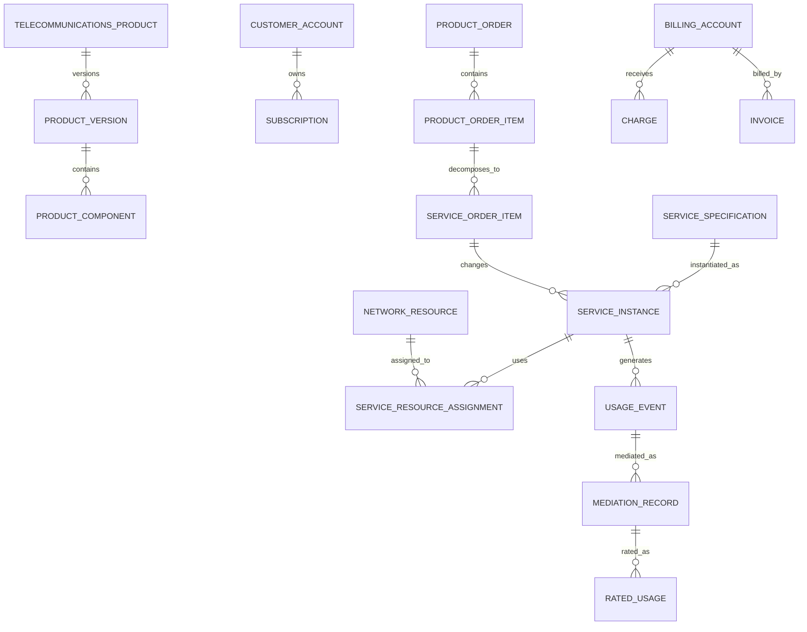

# Telecommunications Model Pattern

## Intent

Model telecommunications providers that define commercial products and technical services; qualify service availability; quote and contract customers; capture and decompose orders; reserve, configure, activate, and assure network resources; manage subscriptions and identifiers; collect and mediate usage; rate charges; invoice customers; settle partners; and disconnect or migrate services.

This pattern specializes Cross-Industry Party, Role, Product, Offering, Agreement, Order, Service, Asset, Resource, Network, Location, Identifier, Work Effort, Usage, Charge, Invoice, Payment, Event, Status, and Document concepts.

## Business overview

**Customer Need → Product/Offer → Service Qualification → Quote/Agreement → Service Order → Order Decomposition → Resource Assignment → Provisioning/Activation → Usage/Assurance → Rating/Billing → Change/Suspend/Disconnect**

A Communications Service Provider defines Product Offerings that bundle commercial terms with technical Service Specifications. A Customer requests service at one or more locations or endpoints. Qualification evaluates coverage, capacity, compatibility, construction, portability, and delivery feasibility. An accepted offer creates a Customer Agreement, Subscription, and Service Order.

The Service Order is decomposed into service and resource work. Logical Services are designed, network resources and identifiers are reserved, physical or virtual components are installed or configured, and testing supports activation. Once active, telemetry, alarms, trouble reports, and usage records support assurance and billing. Usage is collected, normalized, correlated, rated, and converted into charges. Changes, moves, upgrades, suspensions, migrations, and termination are handled as effective-dated service actions while preserving the configuration and commercial terms that applied at each time.

## Pattern variants

### Simple

Use for a focused subscription, connectivity, or usage-billing prototype.

Core concepts: Customer; Telecommunications Product; Service Offering; Subscription; Service Order; Telecommunications Service; Network Resource; Service Identifier; Usage Record; Charge; Invoice; Payment.

### Standard

Use as the default for an operational provider.

Adds: Product Version; Service Specification; Resource Specification; Service Qualification; Customer Agreement; Order Item; Service Order Item; Service Instance; Service Location; Network Endpoint; Circuit; Connection; Resource Reservation; Provisioning Task; Activation Test; Trouble Ticket; Alarm; Service Level Agreement; Usage Event; Mediation Record; Rating Rule; Billing Account; Adjustment.

### Enterprise

Use for multi-network, wholesale, roaming, partner, converged, or regulated operations.

Adds: Legal Entity; Brand; Market; Channel; Product Bundle; Eligibility Rule; Network Domain; Network Topology; Logical Resource; Physical Resource; Virtual Network Function; Numbering Inventory; Spectrum Resource; Interconnect Agreement; Partner Service; Wholesale Order; Portability Request; Field Work Order; Capacity Plan; Network Change; Service Impact; Performance Measure; Roaming Event; Settlement; Revenue Assurance Case; Regulatory Obligation.

## Actors and roles

| Role | Meaning |
|---|---|
| Communications Service Provider | Party offering and operating telecommunications services. |
| Customer | Party purchasing or consuming a product or service. |
| Subscriber | Party holding a Subscription. |
| Account Holder | Party responsible for a Customer or Billing Account. |
| Service User | Person, organization, device, or system using a Service. |
| Service Provider | Party technically responsible for all or part of a Service. |
| Network Operator | Party operating network infrastructure or a network domain. |
| Wholesale Partner | Provider supplying or purchasing wholesale services. |
| Dealer or Agent | Intermediary selling or servicing offerings. |
| Field Technician | Role installing, testing, repairing, or recovering resources. |
| Network Engineer | Role designing and changing services or network resources. |
| Service Assurance Agent | Role receiving, diagnosing, and resolving service problems. |

Rule: Customer, Subscriber, Account Holder, Service User, Contact, and authenticated User are distinct Party Roles and may be performed by different Parties.

## Product, service, and resource specifications

### Telecommunications Product

A governed commercial definition of connectivity, voice, messaging, data, media, managed network, device, or related service.

Logical attributes: Product Identifier; Product Name; Product Type; Product Status; Market; Customer Segment; Effective From; Effective Through.

### Product Version

A versioned definition of product components, eligibility, commercial terms, dependencies, and lifecycle actions.

Logical attributes: Product Version Identifier; Version; Status; Effective From; Effective Through; Approval Reference; Superseded By.

### Product Offering

A Product Version made available through a channel, market, geography, or customer segment at defined prices and terms.

Logical attributes: Offering Identifier; Offering Name; Offering Status; Channel; Market; Geography; Available From; Available Through; Price Plan.

### Product Component

A required, optional, or conditional element of a Product bundle.

Logical attributes: Component Identifier; Component Type; Referenced Product or Service Specification; Minimum Quantity; Maximum Quantity; Default Indicator; Dependency Rule.

### Service Specification

A reusable definition of the technical and operational behavior of a Service.

Logical attributes: Service Specification Identifier; Name; Service Type; Version; Status; Performance Profile; Effective From; Effective Through.

### Resource Specification

A reusable definition of a physical, logical, virtual, software, identifier, or capacity resource.

Logical attributes: Resource Specification Identifier; Name; Resource Type; Version; Status; Capacity Type; Compatibility Rule; Effective From; Effective Through.

Rule: commercial Product, Product Offering, technical Service Specification, and Resource Specification are separate layers connected by governed mappings.

## Customer, account, agreement, and subscription

### Customer Account

The provider's commercial relationship with a Customer.

Logical attributes: Customer Account Identifier; Account Number; Account Status; Customer; Segment; Credit Status; Responsible Organization; Opened Date; Closed Date.

### Billing Account

A grouping of recurring, usage, one-time, adjustment, tax, invoice, and payment activity.

Logical attributes: Billing Account Identifier; Billing Account Number; Status; Bill Cycle; Currency; Payment Terms; Responsible Party; Delivery Preference.

### Customer Agreement

An Agreement defining products, terms, commitments, pricing, service levels, responsibilities, and effective periods.

Logical attributes: Agreement Identifier; Agreement Number; Agreement Type; Agreement Status; Provider; Customer; Effective Date; Expiration Date; Currency; Renewal Policy.

### Subscription

A Customer's ongoing entitlement to and responsibility for one or more Product or Service instances.

Logical attributes: Subscription Identifier; Subscription Number; Subscription Status; Customer Account; Product Offering; Start Date; End Date; Commitment End; Billing Account.

### Subscription Party

A Party participating in a Subscription in a defined role.

Logical attributes: Subscription Party Identifier; Party; Role Type; Status; Effective From; Effective Through; Authority.

## Qualification and availability

### Service Request

An expression of Customer need before an order is accepted.

Logical attributes: Request Identifier; Request Type; Status; Requested Date; Customer; Requested Product; Location; Desired Date; Requirements.

### Service Location

A physical, geographic, virtual, or logical place where service is delivered or terminated.

Logical attributes: Location Identifier; Location Type; Address or Coordinates; Premises; Building; Floor; Room; Coverage Zone; Validation Status.

### Service Qualification

A controlled evaluation of whether and how a requested Service can be delivered.

Logical attributes: Qualification Identifier; Qualification Type; Status; Requested At; Completed At; Offering; Location; Requested Characteristics; Result; Valid Through.

### Qualification Result

An available, unavailable, conditionally available, or build-required outcome with evidence.

Logical attributes: Result Identifier; Result Type; Feasible Date; Available Capacity; Technology; Estimated Construction; Constraint; Evidence Source.

### Serviceability Rule

A governed rule determining commercial or technical availability.

Logical attributes: Rule Identifier; Rule Type; Version; Geography; Technology; Eligibility Condition; Effective From; Effective Through.

Rule: commercial eligibility, geographic coverage, technical feasibility, available capacity, and committed delivery date are independent decisions.

## Quote, order, and decomposition

### Telecommunications Quote

A time-bounded proposal of products, services, installation, recurring charges, usage rates, commitments, and assumptions.

Logical attributes: Quote Identifier; Quote Number; Quote Status; Issued Date; Expiration Date; Customer; Currency; Total One-Time Charge; Estimated Recurring Charge.

### Product Order

A Customer-facing request to add, change, move, suspend, resume, migrate, or terminate products.

Logical attributes: Product Order Identifier; Order Number; Order Type; Order Status; Requested Date; Requested Completion; Customer Account; Agreement; Channel; Priority.

### Product Order Item

An order line concerning a Product Offering or Subscription action.

Logical attributes: Order Item Identifier; Action; Status; Offering; Quantity; Subscription; Requested Start; Requested Characteristics; Parent Item.

### Service Order

An operational order to create, modify, test, activate, suspend, migrate, or terminate Services.

Logical attributes: Service Order Identifier; Service Order Number; Order Type; Status; Product Order; Planned Start; Planned Completion; Actual Completion; Priority.

### Service Order Item

An action concerning a Service Specification or Service Instance.

Logical attributes: Service Order Item Identifier; Action; Status; Service Specification; Service Instance; Requested Configuration; Dependency; Sequence.

### Resource Order

An order to reserve, install, configure, move, recover, or retire Resources.

Logical attributes: Resource Order Identifier; Order Type; Status; Service Order; Planned Dates; Responsible Organization.

Rule: Product Order expresses the Customer commitment; Service and Resource Orders implement it. Their structures and lifecycles must not be collapsed.

## Service and network inventory

### Service Instance

An individually managed realization of a Service Specification.

Logical attributes: Service Identifier; Service Number; Service Type; Service Status; Specification Version; Subscription; Start Date; End Date; Provider; Customer-Facing Indicator.

### Service Characteristic

An effective value configuring or describing a Service.

Logical attributes: Characteristic Identifier; Characteristic Name; Value; Unit; Effective From; Effective Through; Source; Configuration Status.

### Network Resource

An individually managed physical, logical, or virtual network element or capacity.

Logical attributes: Resource Identifier; Resource Type; Resource Status; Specification; Owner; Operator; Location; Capacity; Installed Date; Retired Date.

### Network Component

A device, module, port, card, antenna, fiber, cable, server, function, or other resource component.

Logical attributes: Component Identifier; Component Type; Model; Serial or Logical Identifier; Status; Parent Resource; Location.

### Network Endpoint

A termination or attachment point through which a Service or Connection participates in a Network.

Logical attributes: Endpoint Identifier; Endpoint Type; Status; Resource; Location; Address or Identifier; Capacity; Direction.

### Circuit

A managed end-to-end or segment connectivity construct.

Logical attributes: Circuit Identifier; Circuit Number; Circuit Type; Circuit Status; Bandwidth; Start Endpoint; End Endpoint; Protection Type; Effective From; Effective Through.

### Network Connection

A relationship connecting two or more Endpoints or Resources.

Logical attributes: Connection Identifier; Connection Type; Status; Endpoint A; Endpoint B; Capacity; Technology; Effective From; Effective Through.

### Service-Resource Assignment

An effective-dated allocation of a Resource, Circuit, Endpoint, Identifier, or capacity to a Service Instance.

Logical attributes: Assignment Identifier; Service; Resource; Assignment Type; Quantity; Effective From; Effective Through; Status.

### Communication Identifier

A number, address, domain, subscriber identity, circuit identifier, device identity, or other routable or customer-visible identifier.

Logical attributes: Identifier Record Identifier; Identifier Type; Identifier Value; Status; Inventory Pool; Assigned Service; Assigned From; Assigned Through.

Examples include telephone number, IP address, SIM/eSIM identifier, IMSI, MAC address, circuit ID, domain, email-like service identity, or network access identifier.

## Provisioning, activation, and field work

### Resource Reservation

A temporary allocation of resource or capacity for an Order.

Logical attributes: Reservation Identifier; Resource or Pool; Quantity; Service Order; Reserved From; Reserved Through; Status; Expiration.

### Provisioning Task

A unit of configuration, activation, installation, testing, or recovery work.

Logical attributes: Task Identifier; Task Type; Task Status; Service or Resource Order; Assigned Role or System; Planned Start; Actual Start; Completed At; Result.

### Field Work Order

An instruction for on-site installation, repair, survey, replacement, or recovery.

Logical attributes: Work Order Identifier; Work Type; Status; Site; Appointment; Assigned Technician; Required Skill; Equipment; Planned Start; Completed At.

### Service Configuration

A versioned representation of intended or actual Service characteristics and resource relationships.

Logical attributes: Configuration Identifier; Service; Version; Configuration Status; Effective From; Effective Through; Source Order; Applied At.

### Activation Test

A controlled test demonstrating that a Service or Resource meets release criteria.

Logical attributes: Test Identifier; Test Type; Test Status; Executed At; Service or Resource; Expected Result; Actual Result; Evidence; Executed By.

### Service Activation

An authorized event making a Service available for use and, where applicable, billing.

Logical attributes: Activation Identifier; Service; Activation Status; Requested At; Activated At; Activated By; Configuration; Test Evidence; Billing Effective Date.

## Assurance and performance

### Trouble Ticket

A managed case concerning degraded, unavailable, incorrect, or disputed Service behavior.

Logical attributes: Ticket Identifier; Ticket Number; Ticket Type; Ticket Status; Reported At; Customer; Service; Priority; Impact; Assigned Group; Resolved At.

### Alarm

A system-generated indication of a resource, service, capacity, configuration, or environmental condition.

Logical attributes: Alarm Identifier; Alarm Type; Severity; Alarm Status; Raised At; Cleared At; Resource; Probable Cause; Correlation Reference.

### Service Impact

An assessment of which Services, Customers, locations, or obligations are affected by an Event or Resource condition.

Logical attributes: Impact Identifier; Event; Service; Impact Type; Severity; Start Time; End Time; Customer Impact; SLA Impact.

### Performance Measurement

A measured value concerning availability, latency, loss, throughput, signal, error, utilization, quality, or another service metric.

Logical attributes: Measurement Identifier; Metric; Observed At; Interval; Value; Unit; Service or Resource; Threshold Status; Source.

### Service Level Agreement

A governed commitment for service performance, restoration, response, availability, or support.

Logical attributes: SLA Identifier; SLA Type; Status; Agreement; Service Scope; Effective From; Effective Through; Measurement Rule; Target; Remedy.

### Outage

A confirmed period of service unavailability or material degradation.

Logical attributes: Outage Identifier; Outage Type; Status; Start Time; End Time; Cause; Affected Domain; Restoration; Planned Indicator.

Rule: Alarm, Trouble Ticket, Incident, Outage, Service Impact, and SLA violation are related but distinct concepts.

## Usage, mediation, rating, and billing

### Usage Event

A raw or source-received record of service consumption or network activity.

Logical attributes: Usage Event Identifier; Event Type; Source; Source Reference; Start Time; End Time; Quantity; Unit; Origin; Destination; Service Identifier; Received At.

### Mediation Record

A normalized, validated, enriched, correlated, or aggregated usage record.

Logical attributes: Mediation Record Identifier; Usage Event; Mediation Status; Processed At; Service; Customer; Quantity; Unit; Duplicate Status; Error Reason.

### Rating Rule

A governed rule converting usage, subscription, time, destination, quality, allowance, or event conditions into charge amounts.

Logical attributes: Rating Rule Identifier; Rule Type; Version; Effective From; Effective Through; Unit; Rate; Currency; Condition; Priority.

### Rated Usage

A rated result derived from one or more Mediation Records.

Logical attributes: Rated Usage Identifier; Service; Billing Account; Usage Period; Quantity; Unit; Rate; Amount; Currency; Rating Rule Version; Status.

### Allowance or Bucket

A tracked entitlement such as included minutes, messages, data, credit, or shared capacity.

Logical attributes: Allowance Identifier; Allowance Type; Subscription; Initial Quantity; Remaining Quantity; Unit; Period Start; Period End; Rollover Rule.

### Charge

A one-time, recurring, usage, adjustment, penalty, credit, tax, or discount amount.

Logical attributes: Charge Identifier; Charge Type; Charge Status; Billing Account; Service or Subscription; Charge Date; Period; Amount; Currency; Source.

### Invoice

A request for payment grouping approved Charges.

Logical attributes: Invoice Identifier; Invoice Number; Invoice Date; Due Date; Billing Account; Invoice Status; Currency; Previous Balance; New Charges; Tax; Total Due.

### Payment and Adjustment

A financial settlement or correction applied to a Billing Account or Invoice.

Logical attributes: Transaction Identifier; Transaction Type; Status; Effective Date; Amount; Currency; Reason; Source Invoice; Allocation.

## Partners, interconnect, and settlement

### Interconnect Agreement

An Agreement governing network interconnection, traffic exchange, rates, quality, and settlement with another Provider.

Logical attributes: Agreement Identifier; Agreement Number; Status; Partner; Effective Date; Expiration Date; Currency; Traffic Scope.

### Partner Service

A Service supplied by or to another Provider.

Logical attributes: Partner Service Identifier; Service Type; Status; Partner; External Reference; Effective From; Effective Through; Related Service.

### Partner Usage

Usage attributed to an interconnect, roaming, wholesale, or content Partner.

Logical attributes: Partner Usage Identifier; Partner; Direction; Service Type; Period; Quantity; Unit; Source; Reconciliation Status.

### Settlement

A calculated obligation between Providers for exchanged services or usage.

Logical attributes: Settlement Identifier; Settlement Type; Status; Partner; Period; Gross Amount; Adjustments; Net Amount; Currency; Settled Date.

## Relationship model

| Source | Relationship | Target | Cardinality |
|---|---|---|---|
| Telecommunications Product | has | Product Version | 1:M |
| Product Version | contains | Product Component | 1:M |
| Product Offering | offers | Product Version | M:1 |
| Product Component | maps to | Service Specification | M:M |
| Service Specification | requires | Resource Specification | M:M |
| Customer | owns | Customer Account | 1:M |
| Customer Account | has | Billing Account | 1:M |
| Customer Agreement | governs | Subscription | 1:M |
| Subscription | instantiates | Product Offering | M:1 |
| Service Request | receives | Service Qualification | 1:M |
| Product Order | contains | Product Order Item | 1:M |
| Product Order Item | decomposes into | Service Order Item | 1:M |
| Service Order | contains | Service Order Item | 1:M |
| Service Order Item | creates or changes | Service Instance | M:1 |
| Service Instance | instantiates | Service Specification | M:1 |
| Service Instance | has | Service Characteristic | 1:M |
| Service Instance | uses | Network Resource | M:M through assignment |
| Circuit | connects | Network Endpoint | M:M |
| Resource Reservation | reserves | Network Resource or capacity | M:1 |
| Service Order | contains | Provisioning Task | 1:M |
| Service Activation | activates | Service Instance | M:1 |
| Trouble Ticket | concerns | Service Instance | M:1 |
| Alarm | concerns | Network Resource | M:1 |
| Alarm or Outage | creates | Service Impact | 1:M |
| Service Instance | produces | Usage Event | 1:M |
| Usage Event | produces | Mediation Record | 1:M |
| Mediation Record | produces | Rated Usage | M:M |
| Rated Usage | produces | Charge | 1:M |
| Billing Account | receives | Charge, Invoice, and Payment | 1:M each |
| Interconnect Agreement | governs | Partner Service and Settlement | 1:M |

## Lifecycle models

### Product order

Draft → Submitted → Acknowledged → In Progress → Completed → Closed

Exception outcomes: Pending Information; Rejected; Held; Partially Completed; Cancelled; Failed.

### Service order item

Pending → Designed → Resource Assigned → Provisioning → Testing → Activated → Completed

Exception outcomes: Blocked; Fallout; Rework; Cancelled; Failed.

### Service instance

Feasibility → Designed → Reserved → Provisioning → Testing → Active

Operational outcomes: Suspended; Restricted; Migrating; Degraded; Disconnected; Retired.

### Trouble ticket

Reported → Validated → Diagnosing → Repairing → Monitoring → Resolved → Closed

Exception outcomes: Awaiting Customer; Awaiting Partner; Duplicate; Cancelled; Reopened.

### Usage record

Received → Validated → Normalized → Correlated → Rated → Billed → Archived

Exception outcomes: Duplicate; Rejected; Suspended; Reprocessed.

## Business events

- Offering Published, Changed, or Withdrawn
- Service Qualification Requested or Completed
- Quote Issued or Accepted
- Product Order Submitted, Changed, Cancelled, or Completed
- Service Order Decomposed
- Resource Reserved, Assigned, Configured, Recovered, or Retired
- Number or Address Reserved, Assigned, Ported, Released, or Quarantined
- Field Appointment Scheduled or Completed
- Service Tested, Activated, Suspended, Resumed, Migrated, or Disconnected
- Alarm Raised, Acknowledged, Correlated, or Cleared
- Trouble Reported, Resolved, or Reopened
- Outage Started or Restored
- Usage Event Received, Rejected, Reprocessed, or Rated
- Allowance Consumed or Reset
- Charge Created, Adjusted, or Reversed
- Invoice Issued or Payment Received
- Partner Usage Reconciled or Settlement Completed

## Baseline business and integrity rules

1. An Offering must reference approved Product and pricing versions effective for its market, channel, and order date.
2. Qualification results retain the requested characteristics, location, evidence sources, constraints, result, and validity period.
3. A Product Order identifies Customer Account, action, Offering or Subscription, requested dates, channel, and agreement before submission.
4. Order decomposition preserves traceability from Product Order Item to all Service and Resource Order Items.
5. Order dependencies and completion rules prevent activation when blocking predecessor work is incomplete.
6. A Service Instance identifies its Specification version, Customer or Subscription context, service location, lifecycle state, and effective dates.
7. Resource assignments cannot exceed available capacity or overlap incompatibly unless governed sharing rules allow it.
8. Communication Identifiers must be unique within their governed namespace and preserve reservation, assignment, portability, quarantine, and release history.
9. Service activation requires the approved configuration, completed blocking tasks, valid resource assignments, required testing, and authorized release.
10. Actual Service Configuration is versioned; changes preserve the configuration and resources effective at any historical time.
11. Trouble, alarm, outage, impact, and SLA records preserve independent status and evidence.
12. Usage Events preserve source, source reference, event time, received time, quantity, unit, service identity, and processing lineage.
13. Duplicate usage must be detected before rating or billing using governed uniqueness and correction rules.
14. Rating retains the usage inputs, allowances, rule version, rate, currency, rounding, taxes, discounts, and result.
15. Charges trace to a Subscription, Service, Order, usage, adjustment, or contractual source.
16. Suspended, disconnected, migrated, or terminated Services follow explicit usage, billing, identifier, and resource-release rules.
17. Manual adjustments require reason, authority, source charge or invoice, effective date, and audit evidence.
18. Partner traffic and settlement reconcile to exchanged records, agreement terms, disputes, and final obligations.
19. Finalized orders, configurations, usage lineage, invoices, and assurance evidence are corrected by amendment or supersession, not overwrite.
20. Access to Customer communications, location, usage, identifiers, and network data follows purpose, role, jurisdiction, and minimum-necessary rules.

## AI modeling questions

1. Which sectors are in scope: fixed, mobile, broadband, voice, messaging, cable, satellite, media, IoT, managed network, wholesale, or converged?
2. Which providers, brands, markets, legal entities, network domains, currencies, and jurisdictions apply?
3. How are Products, Offerings, bundles, prices, Service Specifications, and Resource Specifications governed and versioned?
4. Which serviceability, coverage, capacity, construction, portability, and appointment checks are required?
5. Which Customer, Account, Subscriber, User, Contact, and payer roles exist?
6. Which order actions and decomposition rules apply to add, change, move, suspend, resume, migrate, and disconnect?
7. Which Services are customer-facing, resource-facing, partner-supplied, shared, or composite?
8. Which physical, logical, virtual, identifier, spectrum, and capacity resources must be inventoried?
9. How are circuits, connections, endpoints, topology, protection, diversity, and service-resource assignments modeled?
10. Which provisioning tasks are automated, field-based, partner-dependent, or manually approved?
11. What tests and evidence are required before activation and billing?
12. How are alarms correlated to Services, Customers, outages, trouble tickets, and planned changes?
13. Which performance measures, SLAs, thresholds, remedies, and reporting periods apply?
14. What usage formats, sources, mediation stages, duplicate rules, corrections, and late-arrival rules are required?
15. How do allowances, sharing, tiers, time bands, roaming, partner rates, discounts, taxes, and rounding affect rating?
16. Which interconnect, wholesale, roaming, number-portability, and partner-settlement processes apply?
17. Which fraud, revenue-assurance, privacy, lawful-access, retention, and regulatory controls are required?
18. Which CRM, catalog, order management, inventory, activation, network, assurance, mediation, charging, billing, and partner systems are authoritative?

## Candidate capabilities and use cases

| Capability | Candidate actor-goal use cases |
|---|---|
| Product Catalog | Define Product Version; Publish Offering; Configure Bundle; Retire Offering |
| Customer and Agreement | Register Customer; Establish Agreement; Create Subscription; Manage Billing Account |
| Qualification | Validate Location; Check Coverage; Check Capacity; Complete Service Qualification |
| Order Management | Submit Product Order; Decompose Order; Amend Order; Resolve Order Fallout |
| Service Design | Design Service; Assign Characteristics; Select Network Path; Create Configuration |
| Resource Management | Reserve Resource; Assign Circuit; Allocate Identifier; Recover Resource |
| Provisioning | Execute Provisioning Task; Dispatch Technician; Test Service; Activate Service |
| Assurance | Report Trouble; Correlate Alarm; Assess Impact; Restore Service; Evaluate SLA |
| Usage and Charging | Collect Usage; Mediate Record; Apply Allowance; Rate Usage; Create Charge |
| Billing | Generate Invoice; Apply Payment; Adjust Charge; Resolve Billing Dispute |
| Partner Management | Order Partner Service; Reconcile Partner Usage; Settle Interconnect Charges |

## MDE modeling guidance

- Separate commercial Product and Offering from technical Service and Resource specifications.
- Separate Customer-facing Product Orders from Service and Resource fulfillment orders.
- Keep Service Instance, Service Configuration, Resource, Circuit, Endpoint, Connection, and Identifier distinct.
- Use versioned, effective-dated inventory relationships so past service configurations remain reconstructible.
- Put qualification, decomposition, capacity, assignment, activation, mediation, rating, and billing rules on authoritative entity operations.
- Use cases orchestrate actor goals; entity operations enforce network, commercial, and financial invariants.
- Treat external coverage, inventory, alarms, usage, and partner records as sourced evidence with provenance.
- Add technology-specific specializations only where behavior, identifiers, topology, or regulation materially differ.

## Anti-patterns

### Product Equals Service

A Product is what the Customer buys; a Service is the technical capability delivered. One Product may require several Services.

### Service Equals Network Resource

A Service may use many changing Resources, and one Resource may support many Services.

### Product Order Equals Provisioning Task

Customer intent, service design, resource work, field work, and activation require separate control and traceability.

### Current Inventory Explains Historical Service

Resources and configurations change. Assurance, billing, and compliance require effective-dated service-resource history.

### Alarm Equals Trouble Ticket

An Alarm is a technical signal. A Trouble Ticket is a managed service case and may exist without an Alarm or aggregate many Alarms.

### Raw Usage Equals Billable Usage

Usage must be validated, normalized, correlated, deduplicated, enriched, and rated under effective rules before billing.

### One Status for Order and Service

Orders, order items, tasks, resources, Services, tests, appointments, and billing each have independent lifecycles.

### Telephone Number Stored on Customer

Identifiers are managed inventory assigned to Services or subscriptions over time, not permanent Customer attributes.

## Physical mapping examples

| Logical name | Example physical name |
|---|---|
| Product Offering | `product_offering` |
| Service Specification | `service_specification` |
| Resource Specification | `resource_specification` |
| Service Qualification | `service_qualification` |
| Product Order Item | `product_order_item` |
| Service Order Item | `service_order_item` |
| Service Instance | `service_instance` |
| Network Resource | `network_resource` |
| Service Resource Assignment | `service_resource_assignment` |
| Communication Identifier | `communication_identifier` |
| Mediation Record | `mediation_record` |
| Rated Usage | `rated_usage` |

Logical names remain authoritative. Stack, service domain, network technology, market, and regulation rules generate physical names only after the logical model is accepted.

## Future knowledge-base expansion

A metamodel-conformant Telecommunications knowledge base should instantiate separate capabilities, entities, roles, business rules, use cases, workflows, pages, scenarios, and tests for Catalog, Customer, Qualification, Ordering, Service Design, Inventory, Provisioning, Activation, Assurance, Usage, Charging, Billing, and Partners. The first vertical slice should be:

**Qualify Service → Submit Product Order → Decompose Order → Reserve Resources and Identifier → Configure and Test Service → Activate Subscription → Mediate Usage → Rate Charge → Generate Invoice**
