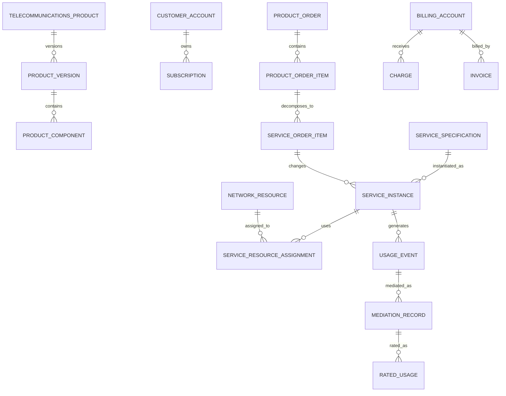

# Telecommunications Model Pattern

## Intent

Model telecommunications providers that define commercial products and technical services; qualify service availability; quote and contract customers; capture and decompose orders; reserve, configure, activate, and assure network resources; manage subscriptions and identifiers; collect and mediate usage; rate charges; invoice customers; settle partners; and disconnect or migrate services.

This pattern specializes Cross-Industry Party, Role, Product, Offering, Agreement, Order, Service, Asset, Resource, Network, Location, Identifier, Work Effort, Usage, Charge, Invoice, Payment, Event, Status, and Document concepts.

## Business overview

**Customer Need → Product/Offer → Service Qualification → Quote/Agreement → Service Order → Order Decomposition → Resource Assignment → Provisioning/Activation → Usage/Assurance → Rating/Billing → Change/Suspend/Disconnect**

A Communications Service Provider defines Product Offerings that bundle commercial terms with technical Service Specifications. A Customer requests service at one or more locations or endpoints. Qualification evaluates coverage, capacity, compatibility, construction, portability, and delivery feasibility. An accepted offer creates a Customer Agreement, Subscription, and Service Order.

The Service Order is decomposed into service and resource work. Logical Services are designed, network resources and identifiers are reserved, physical or virtual components are installed or configured, and testing supports activation. Once active, telemetry, alarms, trouble reports, and usage records support assurance and billing. Usage is collected, normalized, correlated, rated, and converted into charges. Changes, moves, upgrades, suspensions, migrations, and termination are handled as effective-dated service actions while preserving the configuration and commercial terms that applied at each time.

## Pattern variants

### Simple

Use for a focused subscription, connectivity, or usage-billing prototype.

Core concepts: Customer; Telecommunications Product; Service Offering; Subscription; Service Order; Telecommunications Service; Network Resource; Service Identifier; Usage Record; Charge; Invoice; Payment.

### Standard

Use as the default for an operational provider.

Adds: Product Version; Service Specification; Resource Specification; Service Qualification; Customer Agreement; Order Item; Service Order Item; Service Instance; Service Location; Network Endpoint; Circuit; Connection; Resource Reservation; Provisioning Task; Activation Test; Trouble Ticket; Alarm; Service Level Agreement; Usage Event; Mediation Record; Rating Rule; Billing Account; Adjustment.

### Enterprise

Use for multi-network, wholesale, roaming, partner, converged, or regulated operations.

Adds: Legal Entity; Brand; Market; Channel; Product Bundle; Eligibility Rule; Network Domain; Network Topology; Logical Resource; Physical Resource; Virtual Network Function; Numbering Inventory; Spectrum Resource; Interconnect Agreement; Partner Service; Wholesale Order; Portability Request; Field Work Order; Capacity Plan; Network Change; Service Impact; Performance Measure; Roaming Event; Settlement; Revenue Assurance Case; Regulatory Obligation.

## Actors and roles

| Role | Meaning |
|---|---|
| Communications Service Provider | Party offering and operating telecommunications services. |
| Customer | Party purchasing or consuming a product or service. |
| Subscriber | Party holding a Subscription. |
| Account Holder | Party responsible for a Customer or Billing Account. |
| Service User | Person, organization, device, or system using a Service. |
| Service Provider | Party technically responsible for all or part of a Service. |
| Network Operator | Party operating network infrastructure or a network domain. |
| Wholesale Partner | Provider supplying or purchasing wholesale services. |
| Dealer or Agent | Intermediary selling or servicing offerings. |
| Field Technician | Role installing, testing, repairing, or recovering resources. |
| Network Engineer | Role designing and changing services or network resources. |
| Service Assurance Agent | Role receiving, diagnosing, and resolving service problems. |

Rule: Customer, Subscriber, Account Holder, Service User, Contact, and authenticated User are distinct Party Roles and may be performed by different Parties.

## Product, service, and resource specifications

### Telecommunications Product

Canonical concept: [Telecommunications Product](../model/requirements/telecommunications/telecommunications-product/telecommunications-product.md).

The canonical page contains the definition, logical attributes, rules, and source-specific detail.

### Product Version

Canonical concept: [Product Version](../model/requirements/telecommunications/telecommunications-product/product-version.md).

The canonical page contains the definition, logical attributes, rules, and source-specific detail.

### Product Offering

Canonical concept: [Product Offering](../model/requirements/telecommunications/telecommunications-product/product-offering.md).

The canonical page contains the definition, logical attributes, rules, and source-specific detail.

### Product Component

Canonical concept: [Product Component](../model/requirements/telecommunications/telecommunications-product/product-component.md).

The canonical page contains the definition, logical attributes, rules, and source-specific detail.

### Service Specification

Canonical concept: [Service Specification](../model/requirements/telecommunications/telecommunications-product/service-specification.md).

The canonical page contains the definition, logical attributes, rules, and source-specific detail.

### Resource Specification

Canonical concept: [Resource Specification](../model/requirements/telecommunications/telecommunications-product/resource-specification.md).

The canonical page contains the definition, logical attributes, rules, and source-specific detail.

## Customer, account, agreement, and subscription

### Customer Account

Canonical concept: [Customer Account](../model/requirements/telecommunications/customer-account/customer-account.md).

The canonical page contains the definition, logical attributes, rules, and source-specific detail.

### Billing Account

Canonical concept: [Billing Account](../model/requirements/telecommunications/customer-account/billing-account.md).

The canonical page contains the definition, logical attributes, rules, and source-specific detail.

### Customer Agreement

Canonical concept: [Customer Agreement](../model/requirements/telecommunications/customer-account/customer-agreement.md).

The canonical page contains the definition, logical attributes, rules, and source-specific detail.

### Subscription

Canonical concept: [Subscription](../model/requirements/telecommunications/customer-account/subscription.md).

The canonical page contains the definition, logical attributes, rules, and source-specific detail.

### Subscription Party

Canonical concept: [Subscription Party](../model/requirements/telecommunications/customer-account/subscription-party.md).

The canonical page contains the definition, logical attributes, rules, and source-specific detail.

## Qualification and availability

### Service Request

Canonical concept: [Service Request](../model/requirements/telecommunications/service-request/service-request.md).

The canonical page contains the definition, logical attributes, rules, and source-specific detail.

### Service Location

Canonical concept: [Service Location](../model/requirements/telecommunications/service-request/service-location.md).

The canonical page contains the definition, logical attributes, rules, and source-specific detail.

### Service Qualification

Canonical concept: [Service Qualification](../model/requirements/telecommunications/service-request/service-qualification.md).

The canonical page contains the definition, logical attributes, rules, and source-specific detail.

### Qualification Result

Canonical concept: [Qualification Result](../model/requirements/telecommunications/service-request/qualification-result.md).

The canonical page contains the definition, logical attributes, rules, and source-specific detail.

### Serviceability Rule

Canonical concept: [Serviceability Rule](../model/requirements/telecommunications/service-request/serviceability-rule.md).

The canonical page contains the definition, logical attributes, rules, and source-specific detail.

## Quote, order, and decomposition

### Telecommunications Quote

Canonical concept: [Telecommunications Quote](../model/requirements/telecommunications/telecommunications-quote/telecommunications-quote.md).

The canonical page contains the definition, logical attributes, rules, and source-specific detail.

### Product Order

Canonical concept: [Product Order](../model/requirements/telecommunications/telecommunications-quote/product-order.md).

The canonical page contains the definition, logical attributes, rules, and source-specific detail.

### Product Order Item

Canonical concept: [Product Order Item](../model/requirements/telecommunications/telecommunications-quote/product-order-item.md).

The canonical page contains the definition, logical attributes, rules, and source-specific detail.

### Service Order

Canonical concept: [Service Order](../model/requirements/telecommunications/telecommunications-quote/service-order.md).

The canonical page contains the definition, logical attributes, rules, and source-specific detail.

### Service Order Item

Canonical concept: [Service Order Item](../model/requirements/telecommunications/telecommunications-quote/service-order-item.md).

The canonical page contains the definition, logical attributes, rules, and source-specific detail.

### Resource Order

Canonical concept: [Resource Order](../model/requirements/telecommunications/telecommunications-quote/resource-order.md).

The canonical page contains the definition, logical attributes, rules, and source-specific detail.

## Service and network inventory

### Service Instance

Canonical concept: [Service Instance](../model/requirements/telecommunications/service-instance/service-instance.md).

The canonical page contains the definition, logical attributes, rules, and source-specific detail.

### Service Characteristic

Canonical concept: [Service Characteristic](../model/requirements/telecommunications/service-instance/service-characteristic.md).

The canonical page contains the definition, logical attributes, rules, and source-specific detail.

### Network Resource

Canonical concept: [Network Resource](../model/requirements/telecommunications/service-instance/network-resource.md).

The canonical page contains the definition, logical attributes, rules, and source-specific detail.

### Network Component

Canonical concept: [Network Component](../model/requirements/telecommunications/service-instance/network-component.md).

The canonical page contains the definition, logical attributes, rules, and source-specific detail.

### Network Endpoint

Canonical concept: [Network Endpoint](../model/requirements/telecommunications/service-instance/network-endpoint.md).

The canonical page contains the definition, logical attributes, rules, and source-specific detail.

### Circuit

Canonical concept: [Circuit](../model/requirements/telecommunications/service-instance/circuit.md).

The canonical page contains the definition, logical attributes, rules, and source-specific detail.

### Network Connection

Canonical concept: [Network Connection](../model/requirements/telecommunications/service-instance/network-connection.md).

The canonical page contains the definition, logical attributes, rules, and source-specific detail.

### Service-Resource Assignment

Canonical concept: [Service-Resource Assignment](../model/requirements/telecommunications/service-instance/service-resource-assignment.md).

The canonical page contains the definition, logical attributes, rules, and source-specific detail.

### Communication Identifier

Canonical concept: [Communication Identifier](../model/requirements/telecommunications/service-instance/communication-identifier.md).

The canonical page contains the definition, logical attributes, rules, and source-specific detail.

## Provisioning, activation, and field work

### Resource Reservation

Canonical concept: [Resource Reservation](../model/requirements/telecommunications/resource-reservation/resource-reservation.md).

The canonical page contains the definition, logical attributes, rules, and source-specific detail.

### Provisioning Task

Canonical concept: [Provisioning Task](../model/requirements/telecommunications/resource-reservation/provisioning-task.md).

The canonical page contains the definition, logical attributes, rules, and source-specific detail.

### Field Work Order

Canonical concept: [Field Work Order](../model/requirements/telecommunications/resource-reservation/field-work-order.md).

The canonical page contains the definition, logical attributes, rules, and source-specific detail.

### Service Configuration

Canonical concept: [Service Configuration](../model/requirements/telecommunications/resource-reservation/service-configuration.md).

The canonical page contains the definition, logical attributes, rules, and source-specific detail.

### Activation Test

Canonical concept: [Activation Test](../model/requirements/telecommunications/resource-reservation/activation-test.md).

The canonical page contains the definition, logical attributes, rules, and source-specific detail.

### Service Activation

Canonical concept: [Service Activation](../model/requirements/telecommunications/resource-reservation/service-activation.md).

The canonical page contains the definition, logical attributes, rules, and source-specific detail.

## Assurance and performance

### Trouble Ticket

Canonical concept: [Trouble Ticket](../model/requirements/telecommunications/trouble-ticket/trouble-ticket.md).

The canonical page contains the definition, logical attributes, rules, and source-specific detail.

### Alarm

Canonical concept: [Alarm](../model/requirements/telecommunications/trouble-ticket/alarm.md).

The canonical page contains the definition, logical attributes, rules, and source-specific detail.

### Service Impact

Canonical concept: [Service Impact](../model/requirements/telecommunications/trouble-ticket/service-impact.md).

The canonical page contains the definition, logical attributes, rules, and source-specific detail.

### Performance Measurement

Canonical concept: [Performance Measurement](../model/requirements/telecommunications/trouble-ticket/performance-measurement.md).

The canonical page contains the definition, logical attributes, rules, and source-specific detail.

### Service Level Agreement

Canonical concept: [Service Level Agreement](../model/requirements/telecommunications/trouble-ticket/service-level-agreement.md).

The canonical page contains the definition, logical attributes, rules, and source-specific detail.

### Outage

Canonical concept: [Outage](../model/requirements/telecommunications/trouble-ticket/outage.md).

The canonical page contains the definition, logical attributes, rules, and source-specific detail.

## Usage, mediation, rating, and billing

### Usage Event

Canonical concept: [Usage Event](../model/requirements/telecommunications/usage-event/usage-event.md).

The canonical page contains the definition, logical attributes, rules, and source-specific detail.

### Mediation Record

Canonical concept: [Mediation Record](../model/requirements/telecommunications/usage-event/mediation-record.md).

The canonical page contains the definition, logical attributes, rules, and source-specific detail.

### Rating Rule

Canonical concept: [Rating Rule](../model/requirements/telecommunications/usage-event/rating-rule.md).

The canonical page contains the definition, logical attributes, rules, and source-specific detail.

### Rated Usage

Canonical concept: [Rated Usage](../model/requirements/telecommunications/usage-event/rated-usage.md).

The canonical page contains the definition, logical attributes, rules, and source-specific detail.

### Allowance or Bucket

Canonical concept: [Allowance or Bucket](../model/requirements/telecommunications/usage-event/allowance-or-bucket.md).

The canonical page contains the definition, logical attributes, rules, and source-specific detail.

### Charge

Canonical concept: [Charge](../model/requirements/telecommunications/usage-event/charge.md).

The canonical page contains the definition, logical attributes, rules, and source-specific detail.

### Invoice

Canonical concept: [Invoice](../model/requirements/finance/invoice/invoice.md).

The canonical page contains the definition, logical attributes, rules, and source-specific detail.

### Payment and Adjustment

Canonical concept: [Payment and Adjustment](../model/requirements/telecommunications/usage-event/payment-and-adjustment.md).

The canonical page contains the definition, logical attributes, rules, and source-specific detail.

## Partners, interconnect, and settlement

### Interconnect Agreement

Canonical concept: [Interconnect Agreement](../model/requirements/telecommunications/interconnect-agreement/interconnect-agreement.md).

The canonical page contains the definition, logical attributes, rules, and source-specific detail.

### Partner Service

Canonical concept: [Partner Service](../model/requirements/telecommunications/interconnect-agreement/partner-service.md).

The canonical page contains the definition, logical attributes, rules, and source-specific detail.

### Partner Usage

Canonical concept: [Partner Usage](../model/requirements/telecommunications/interconnect-agreement/partner-usage.md).

The canonical page contains the definition, logical attributes, rules, and source-specific detail.

### Settlement

Canonical concept: [Settlement](../model/requirements/telecommunications/interconnect-agreement/settlement.md).

The canonical page contains the definition, logical attributes, rules, and source-specific detail.

## Relationship model

| Source | Relationship | Target | Cardinality |
|---|---|---|---|
| Telecommunications Product | has | Product Version | 1:M |
| Product Version | contains | Product Component | 1:M |
| Product Offering | offers | Product Version | M:1 |
| Product Component | maps to | Service Specification | M:M |
| Service Specification | requires | Resource Specification | M:M |
| Customer | owns | Customer Account | 1:M |
| Customer Account | has | Billing Account | 1:M |
| Customer Agreement | governs | Subscription | 1:M |
| Subscription | instantiates | Product Offering | M:1 |
| Service Request | receives | Service Qualification | 1:M |
| Product Order | contains | Product Order Item | 1:M |
| Product Order Item | decomposes into | Service Order Item | 1:M |
| Service Order | contains | Service Order Item | 1:M |
| Service Order Item | creates or changes | Service Instance | M:1 |
| Service Instance | instantiates | Service Specification | M:1 |
| Service Instance | has | Service Characteristic | 1:M |
| Service Instance | uses | Network Resource | M:M through assignment |
| Circuit | connects | Network Endpoint | M:M |
| Resource Reservation | reserves | Network Resource or capacity | M:1 |
| Service Order | contains | Provisioning Task | 1:M |
| Service Activation | activates | Service Instance | M:1 |
| Trouble Ticket | concerns | Service Instance | M:1 |
| Alarm | concerns | Network Resource | M:1 |
| Alarm or Outage | creates | Service Impact | 1:M |
| Service Instance | produces | Usage Event | 1:M |
| Usage Event | produces | Mediation Record | 1:M |
| Mediation Record | produces | Rated Usage | M:M |
| Rated Usage | produces | Charge | 1:M |
| Billing Account | receives | Charge, Invoice, and Payment | 1:M each |
| Interconnect Agreement | governs | Partner Service and Settlement | 1:M |

## Lifecycle models

### Product order

Draft → Submitted → Acknowledged → In Progress → Completed → Closed

Exception outcomes: Pending Information; Rejected; Held; Partially Completed; Cancelled; Failed.

### Service order item

Pending → Designed → Resource Assigned → Provisioning → Testing → Activated → Completed

Exception outcomes: Blocked; Fallout; Rework; Cancelled; Failed.

### Service instance

Feasibility → Designed → Reserved → Provisioning → Testing → Active

Operational outcomes: Suspended; Restricted; Migrating; Degraded; Disconnected; Retired.

### Trouble ticket

Reported → Validated → Diagnosing → Repairing → Monitoring → Resolved → Closed

Exception outcomes: Awaiting Customer; Awaiting Partner; Duplicate; Cancelled; Reopened.

### Usage record

Received → Validated → Normalized → Correlated → Rated → Billed → Archived

Exception outcomes: Duplicate; Rejected; Suspended; Reprocessed.

## Business events

- Offering Published, Changed, or Withdrawn
- Service Qualification Requested or Completed
- Quote Issued or Accepted
- Product Order Submitted, Changed, Cancelled, or Completed
- Service Order Decomposed
- Resource Reserved, Assigned, Configured, Recovered, or Retired
- Number or Address Reserved, Assigned, Ported, Released, or Quarantined
- Field Appointment Scheduled or Completed
- Service Tested, Activated, Suspended, Resumed, Migrated, or Disconnected
- Alarm Raised, Acknowledged, Correlated, or Cleared
- Trouble Reported, Resolved, or Reopened
- Outage Started or Restored
- Usage Event Received, Rejected, Reprocessed, or Rated
- Allowance Consumed or Reset
- Charge Created, Adjusted, or Reversed
- Invoice Issued or Payment Received
- Partner Usage Reconciled or Settlement Completed

## Baseline business and integrity rules

1. An Offering must reference approved Product and pricing versions effective for its market, channel, and order date.
2. Qualification results retain the requested characteristics, location, evidence sources, constraints, result, and validity period.
3. A Product Order identifies Customer Account, action, Offering or Subscription, requested dates, channel, and agreement before submission.
4. Order decomposition preserves traceability from Product Order Item to all Service and Resource Order Items.
5. Order dependencies and completion rules prevent activation when blocking predecessor work is incomplete.
6. A Service Instance identifies its Specification version, Customer or Subscription context, service location, lifecycle state, and effective dates.
7. Resource assignments cannot exceed available capacity or overlap incompatibly unless governed sharing rules allow it.
8. Communication Identifiers must be unique within their governed namespace and preserve reservation, assignment, portability, quarantine, and release history.
9. Service activation requires the approved configuration, completed blocking tasks, valid resource assignments, required testing, and authorized release.
10. Actual Service Configuration is versioned; changes preserve the configuration and resources effective at any historical time.
11. Trouble, alarm, outage, impact, and SLA records preserve independent status and evidence.
12. Usage Events preserve source, source reference, event time, received time, quantity, unit, service identity, and processing lineage.
13. Duplicate usage must be detected before rating or billing using governed uniqueness and correction rules.
14. Rating retains the usage inputs, allowances, rule version, rate, currency, rounding, taxes, discounts, and result.
15. Charges trace to a Subscription, Service, Order, usage, adjustment, or contractual source.
16. Suspended, disconnected, migrated, or terminated Services follow explicit usage, billing, identifier, and resource-release rules.
17. Manual adjustments require reason, authority, source charge or invoice, effective date, and audit evidence.
18. Partner traffic and settlement reconcile to exchanged records, agreement terms, disputes, and final obligations.
19. Finalized orders, configurations, usage lineage, invoices, and assurance evidence are corrected by amendment or supersession, not overwrite.
20. Access to Customer communications, location, usage, identifiers, and network data follows purpose, role, jurisdiction, and minimum-necessary rules.

## AI modeling questions

1. Which sectors are in scope: fixed, mobile, broadband, voice, messaging, cable, satellite, media, IoT, managed network, wholesale, or converged?
2. Which providers, brands, markets, legal entities, network domains, currencies, and jurisdictions apply?
3. How are Products, Offerings, bundles, prices, Service Specifications, and Resource Specifications governed and versioned?
4. Which serviceability, coverage, capacity, construction, portability, and appointment checks are required?
5. Which Customer, Account, Subscriber, User, Contact, and payer roles exist?
6. Which order actions and decomposition rules apply to add, change, move, suspend, resume, migrate, and disconnect?
7. Which Services are customer-facing, resource-facing, partner-supplied, shared, or composite?
8. Which physical, logical, virtual, identifier, spectrum, and capacity resources must be inventoried?
9. How are circuits, connections, endpoints, topology, protection, diversity, and service-resource assignments modeled?
10. Which provisioning tasks are automated, field-based, partner-dependent, or manually approved?
11. What tests and evidence are required before activation and billing?
12. How are alarms correlated to Services, Customers, outages, trouble tickets, and planned changes?
13. Which performance measures, SLAs, thresholds, remedies, and reporting periods apply?
14. What usage formats, sources, mediation stages, duplicate rules, corrections, and late-arrival rules are required?
15. How do allowances, sharing, tiers, time bands, roaming, partner rates, discounts, taxes, and rounding affect rating?
16. Which interconnect, wholesale, roaming, number-portability, and partner-settlement processes apply?
17. Which fraud, revenue-assurance, privacy, lawful-access, retention, and regulatory controls are required?
18. Which CRM, catalog, order management, inventory, activation, network, assurance, mediation, charging, billing, and partner systems are authoritative?

## Candidate capabilities and use cases

| Capability | Candidate actor-goal use cases |
|---|---|
| Product Catalog | Define Product Version; Publish Offering; Configure Bundle; Retire Offering |
| Customer and Agreement | Register Customer; Establish Agreement; Create Subscription; Manage Billing Account |
| Qualification | Validate Location; Check Coverage; Check Capacity; Complete Service Qualification |
| Order Management | Submit Product Order; Decompose Order; Amend Order; Resolve Order Fallout |
| Service Design | Design Service; Assign Characteristics; Select Network Path; Create Configuration |
| Resource Management | Reserve Resource; Assign Circuit; Allocate Identifier; Recover Resource |
| Provisioning | Execute Provisioning Task; Dispatch Technician; Test Service; Activate Service |
| Assurance | Report Trouble; Correlate Alarm; Assess Impact; Restore Service; Evaluate SLA |
| Usage and Charging | Collect Usage; Mediate Record; Apply Allowance; Rate Usage; Create Charge |
| Billing | Generate Invoice; Apply Payment; Adjust Charge; Resolve Billing Dispute |
| Partner Management | Order Partner Service; Reconcile Partner Usage; Settle Interconnect Charges |

## MDE modeling guidance

- Separate commercial Product and Offering from technical Service and Resource specifications.
- Separate Customer-facing Product Orders from Service and Resource fulfillment orders.
- Keep Service Instance, Service Configuration, Resource, Circuit, Endpoint, Connection, and Identifier distinct.
- Use versioned, effective-dated inventory relationships so past service configurations remain reconstructible.
- Put qualification, decomposition, capacity, assignment, activation, mediation, rating, and billing rules on authoritative entity operations.
- Use cases orchestrate actor goals; entity operations enforce network, commercial, and financial invariants.
- Treat external coverage, inventory, alarms, usage, and partner records as sourced evidence with provenance.
- Add technology-specific specializations only where behavior, identifiers, topology, or regulation materially differ.

## Anti-patterns

### Product Equals Service

A Product is what the Customer buys; a Service is the technical capability delivered. One Product may require several Services.

### Service Equals Network Resource

A Service may use many changing Resources, and one Resource may support many Services.

### Product Order Equals Provisioning Task

Customer intent, service design, resource work, field work, and activation require separate control and traceability.

### Current Inventory Explains Historical Service

Resources and configurations change. Assurance, billing, and compliance require effective-dated service-resource history.

### Alarm Equals Trouble Ticket

An Alarm is a technical signal. A Trouble Ticket is a managed service case and may exist without an Alarm or aggregate many Alarms.

### Raw Usage Equals Billable Usage

Usage must be validated, normalized, correlated, deduplicated, enriched, and rated under effective rules before billing.

### One Status for Order and Service

Orders, order items, tasks, resources, Services, tests, appointments, and billing each have independent lifecycles.

### Telephone Number Stored on Customer

Identifiers are managed inventory assigned to Services or subscriptions over time, not permanent Customer attributes.

## Physical mapping examples

| Logical name | Example physical name |
|---|---|
| Product Offering | `product_offering` |
| Service Specification | `service_specification` |
| Resource Specification | `resource_specification` |
| Service Qualification | `service_qualification` |
| Product Order Item | `product_order_item` |
| Service Order Item | `service_order_item` |
| Service Instance | `service_instance` |
| Network Resource | `network_resource` |
| Service Resource Assignment | `service_resource_assignment` |
| Communication Identifier | `communication_identifier` |
| Mediation Record | `mediation_record` |
| Rated Usage | `rated_usage` |

Logical names remain authoritative. Stack, service domain, network technology, market, and regulation rules generate physical names only after the logical model is accepted.

## Future knowledge-base expansion

A metamodel-conformant Telecommunications knowledge base should instantiate separate capabilities, entities, roles, business rules, use cases, workflows, pages, scenarios, and tests for Catalog, Customer, Qualification, Ordering, Service Design, Inventory, Provisioning, Activation, Assurance, Usage, Charging, Billing, and Partners. The first vertical slice should be:

**Qualify Service → Submit Product Order → Decompose Order → Reserve Resources and Identifier → Configure and Test Service → Activate Subscription → Mediate Usage → Rate Charge → Generate Invoice**

## Canonical model bindings

This pattern selects and connects concepts in the [coherent model](../model/README.md). The sections below are views of those definitions. Industry lifecycles, events, baseline rules, and variant choices continue to constrain the selected concepts.

| Source term | Canonical concept | ABE |
|---|---|---|
| Telecommunications Product | [Telecommunications Product](../model/requirements/telecommunications/telecommunications-product/telecommunications-product.md) | [Telecommunications Product](../model/requirements/telecommunications/telecommunications-product/README.md) |
| Product Version | [Product Version](../model/requirements/telecommunications/telecommunications-product/product-version.md) | [Telecommunications Product](../model/requirements/telecommunications/telecommunications-product/README.md) |
| Product Offering | [Product Offering](../model/requirements/telecommunications/telecommunications-product/product-offering.md) | [Telecommunications Product](../model/requirements/telecommunications/telecommunications-product/README.md) |
| Product Component | [Product Component](../model/requirements/telecommunications/telecommunications-product/product-component.md) | [Telecommunications Product](../model/requirements/telecommunications/telecommunications-product/README.md) |
| Service Specification | [Service Specification](../model/requirements/telecommunications/telecommunications-product/service-specification.md) | [Telecommunications Product](../model/requirements/telecommunications/telecommunications-product/README.md) |
| Resource Specification | [Resource Specification](../model/requirements/telecommunications/telecommunications-product/resource-specification.md) | [Telecommunications Product](../model/requirements/telecommunications/telecommunications-product/README.md) |
| Customer Account | [Customer Account](../model/requirements/telecommunications/customer-account/customer-account.md) | [Customer Account](../model/requirements/telecommunications/customer-account/README.md) |
| Billing Account | [Billing Account](../model/requirements/telecommunications/customer-account/billing-account.md) | [Customer Account](../model/requirements/telecommunications/customer-account/README.md) |
| Customer Agreement | [Customer Agreement](../model/requirements/telecommunications/customer-account/customer-agreement.md) | [Customer Account](../model/requirements/telecommunications/customer-account/README.md) |
| Subscription | [Subscription](../model/requirements/telecommunications/customer-account/subscription.md) | [Customer Account](../model/requirements/telecommunications/customer-account/README.md) |
| Subscription Party | [Subscription Party](../model/requirements/telecommunications/customer-account/subscription-party.md) | [Customer Account](../model/requirements/telecommunications/customer-account/README.md) |
| Service Request | [Service Request](../model/requirements/telecommunications/service-request/service-request.md) | [Service Request](../model/requirements/telecommunications/service-request/README.md) |
| Service Location | [Service Location](../model/requirements/telecommunications/service-request/service-location.md) | [Service Request](../model/requirements/telecommunications/service-request/README.md) |
| Service Qualification | [Service Qualification](../model/requirements/telecommunications/service-request/service-qualification.md) | [Service Request](../model/requirements/telecommunications/service-request/README.md) |
| Qualification Result | [Qualification Result](../model/requirements/telecommunications/service-request/qualification-result.md) | [Service Request](../model/requirements/telecommunications/service-request/README.md) |
| Serviceability Rule | [Serviceability Rule](../model/requirements/telecommunications/service-request/serviceability-rule.md) | [Service Request](../model/requirements/telecommunications/service-request/README.md) |
| Telecommunications Quote | [Telecommunications Quote](../model/requirements/telecommunications/telecommunications-quote/telecommunications-quote.md) | [Telecommunications Quote](../model/requirements/telecommunications/telecommunications-quote/README.md) |
| Product Order | [Product Order](../model/requirements/telecommunications/telecommunications-quote/product-order.md) | [Telecommunications Quote](../model/requirements/telecommunications/telecommunications-quote/README.md) |
| Product Order Item | [Product Order Item](../model/requirements/telecommunications/telecommunications-quote/product-order-item.md) | [Telecommunications Quote](../model/requirements/telecommunications/telecommunications-quote/README.md) |
| Service Order | [Service Order](../model/requirements/telecommunications/telecommunications-quote/service-order.md) | [Telecommunications Quote](../model/requirements/telecommunications/telecommunications-quote/README.md) |
| Service Order Item | [Service Order Item](../model/requirements/telecommunications/telecommunications-quote/service-order-item.md) | [Telecommunications Quote](../model/requirements/telecommunications/telecommunications-quote/README.md) |
| Resource Order | [Resource Order](../model/requirements/telecommunications/telecommunications-quote/resource-order.md) | [Telecommunications Quote](../model/requirements/telecommunications/telecommunications-quote/README.md) |
| Service Instance | [Service Instance](../model/requirements/telecommunications/service-instance/service-instance.md) | [Service Instance](../model/requirements/telecommunications/service-instance/README.md) |
| Service Characteristic | [Service Characteristic](../model/requirements/telecommunications/service-instance/service-characteristic.md) | [Service Instance](../model/requirements/telecommunications/service-instance/README.md) |
| Network Resource | [Network Resource](../model/requirements/telecommunications/service-instance/network-resource.md) | [Service Instance](../model/requirements/telecommunications/service-instance/README.md) |
| Network Component | [Network Component](../model/requirements/telecommunications/service-instance/network-component.md) | [Service Instance](../model/requirements/telecommunications/service-instance/README.md) |
| Network Endpoint | [Network Endpoint](../model/requirements/telecommunications/service-instance/network-endpoint.md) | [Service Instance](../model/requirements/telecommunications/service-instance/README.md) |
| Circuit | [Circuit](../model/requirements/telecommunications/service-instance/circuit.md) | [Service Instance](../model/requirements/telecommunications/service-instance/README.md) |
| Network Connection | [Network Connection](../model/requirements/telecommunications/service-instance/network-connection.md) | [Service Instance](../model/requirements/telecommunications/service-instance/README.md) |
| Service-Resource Assignment | [Service-Resource Assignment](../model/requirements/telecommunications/service-instance/service-resource-assignment.md) | [Service Instance](../model/requirements/telecommunications/service-instance/README.md) |
| Communication Identifier | [Communication Identifier](../model/requirements/telecommunications/service-instance/communication-identifier.md) | [Service Instance](../model/requirements/telecommunications/service-instance/README.md) |
| Resource Reservation | [Resource Reservation](../model/requirements/telecommunications/resource-reservation/resource-reservation.md) | [Resource Reservation](../model/requirements/telecommunications/resource-reservation/README.md) |
| Provisioning Task | [Provisioning Task](../model/requirements/telecommunications/resource-reservation/provisioning-task.md) | [Resource Reservation](../model/requirements/telecommunications/resource-reservation/README.md) |
| Field Work Order | [Field Work Order](../model/requirements/telecommunications/resource-reservation/field-work-order.md) | [Resource Reservation](../model/requirements/telecommunications/resource-reservation/README.md) |
| Service Configuration | [Service Configuration](../model/requirements/telecommunications/resource-reservation/service-configuration.md) | [Resource Reservation](../model/requirements/telecommunications/resource-reservation/README.md) |
| Activation Test | [Activation Test](../model/requirements/telecommunications/resource-reservation/activation-test.md) | [Resource Reservation](../model/requirements/telecommunications/resource-reservation/README.md) |
| Service Activation | [Service Activation](../model/requirements/telecommunications/resource-reservation/service-activation.md) | [Resource Reservation](../model/requirements/telecommunications/resource-reservation/README.md) |
| Trouble Ticket | [Trouble Ticket](../model/requirements/telecommunications/trouble-ticket/trouble-ticket.md) | [Trouble Ticket](../model/requirements/telecommunications/trouble-ticket/README.md) |
| Alarm | [Alarm](../model/requirements/telecommunications/trouble-ticket/alarm.md) | [Trouble Ticket](../model/requirements/telecommunications/trouble-ticket/README.md) |
| Service Impact | [Service Impact](../model/requirements/telecommunications/trouble-ticket/service-impact.md) | [Trouble Ticket](../model/requirements/telecommunications/trouble-ticket/README.md) |
| Performance Measurement | [Performance Measurement](../model/requirements/telecommunications/trouble-ticket/performance-measurement.md) | [Trouble Ticket](../model/requirements/telecommunications/trouble-ticket/README.md) |
| Service Level Agreement | [Service Level Agreement](../model/requirements/telecommunications/trouble-ticket/service-level-agreement.md) | [Trouble Ticket](../model/requirements/telecommunications/trouble-ticket/README.md) |
| Outage | [Outage](../model/requirements/telecommunications/trouble-ticket/outage.md) | [Trouble Ticket](../model/requirements/telecommunications/trouble-ticket/README.md) |
| Usage Event | [Usage Event](../model/requirements/telecommunications/usage-event/usage-event.md) | [Usage Event](../model/requirements/telecommunications/usage-event/README.md) |
| Mediation Record | [Mediation Record](../model/requirements/telecommunications/usage-event/mediation-record.md) | [Usage Event](../model/requirements/telecommunications/usage-event/README.md) |
| Rating Rule | [Rating Rule](../model/requirements/telecommunications/usage-event/rating-rule.md) | [Usage Event](../model/requirements/telecommunications/usage-event/README.md) |
| Rated Usage | [Rated Usage](../model/requirements/telecommunications/usage-event/rated-usage.md) | [Usage Event](../model/requirements/telecommunications/usage-event/README.md) |
| Allowance or Bucket | [Allowance or Bucket](../model/requirements/telecommunications/usage-event/allowance-or-bucket.md) | [Usage Event](../model/requirements/telecommunications/usage-event/README.md) |
| Charge | [Charge](../model/requirements/telecommunications/usage-event/charge.md) | [Usage Event](../model/requirements/telecommunications/usage-event/README.md) |
| Invoice | [Invoice](../model/requirements/finance/invoice/invoice.md) | [Invoice](../model/requirements/finance/invoice/README.md) |
| Payment and Adjustment | [Payment and Adjustment](../model/requirements/telecommunications/usage-event/payment-and-adjustment.md) | [Usage Event](../model/requirements/telecommunications/usage-event/README.md) |
| Interconnect Agreement | [Interconnect Agreement](../model/requirements/telecommunications/interconnect-agreement/interconnect-agreement.md) | [Interconnect Agreement](../model/requirements/telecommunications/interconnect-agreement/README.md) |
| Partner Service | [Partner Service](../model/requirements/telecommunications/interconnect-agreement/partner-service.md) | [Interconnect Agreement](../model/requirements/telecommunications/interconnect-agreement/README.md) |
| Partner Usage | [Partner Usage](../model/requirements/telecommunications/interconnect-agreement/partner-usage.md) | [Interconnect Agreement](../model/requirements/telecommunications/interconnect-agreement/README.md) |
| Settlement | [Settlement](../model/requirements/telecommunications/interconnect-agreement/settlement.md) | [Interconnect Agreement](../model/requirements/telecommunications/interconnect-agreement/README.md) |
