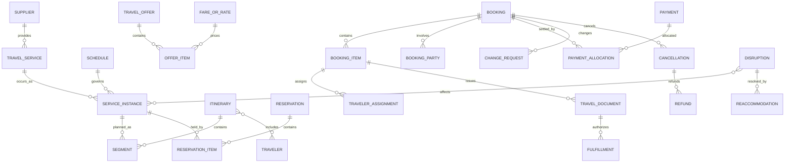

# Travel Model Pattern

## Intent

Model travel businesses that publish and sell transport, lodging, activities, packages, and related services; build itineraries; reserve supplier inventory; issue travel documents; collect payment; manage changes and cancellations; and respond to operational disruptions.

This pattern specializes the Cross-Industry Party, Role, Product, Service, Offering, Agreement, Order, Fulfillment, Price, Payment, Event, Status, Location, and Measurement concepts.

## Business overview

**Traveler Need → Search/Offer → Itinerary → Reservation → Booking → Payment → Ticket/Voucher → Service Fulfillment → Change/Disruption/Refund**

Travel Suppliers publish scheduled or availability-based Travel Services. Distributors assemble those services into Offers and Itineraries. A Customer or Travel Arranger selects an Offer and supplies Traveler details. Reservations hold inventory; an accepted commercial transaction produces a Booking containing one or more Booking Items and Segments. Payment and supplier confirmation enable tickets, vouchers, or other fulfillment documents. Before or during travel, voluntary changes and supplier disruptions may cause rebooking, cancellation, additional collection, exchange, refund, or compensation.

## Pattern variants

### Simple

Use for one supplier type or a focused booking prototype.

Core concepts: Traveler; Travel Service; Offer; Itinerary; Reservation; Booking; Booking Item; Payment; Ticket or Voucher.

### Standard

Use as the default for operational travel applications.

Adds: Customer; Travel Arranger; Supplier; Distribution Channel; Location; Schedule; Service Instance; Availability; Fare or Rate; Price Component; Traveler Document; Segment; Reservation Item; Booking Party; Ancillary Service; Ticket; Voucher; Fulfillment; Change Request; Cancellation; Refund; Disruption.

### Enterprise

Use for travel marketplaces, agencies, tour operators, corporate travel, global distribution, packages, loyalty, settlement, or multi-supplier servicing.

Adds: Supplier Agreement; Distribution Agreement; Agency; Corporate Account; Travel Policy; Approval; Package; Package Component; Inventory Allotment; Married Segment; Fare Rule; Rate Plan; Commission; Markup; Currency Conversion; Loyalty Account; Loyalty Transaction; Settlement; Exchange Document; Electronic Miscellaneous Document; Interline Agreement; Disruption Protection; Duty of Care Case.

## Travel roles

| Role | Meaning |
|---|---|
| Traveler | Person who consumes the travel service. |
| Customer | Party purchasing, arranging, or owning the commercial relationship. |
| Travel Arranger | Party or role acting for one or more Travelers. |
| Supplier | Airline, rail operator, hotel, vehicle provider, cruise line, tour operator, activity provider, or other service provider. |
| Distributor | Party presenting and selling supplier or packaged travel services. |
| Agent | Person or organization assisting search, booking, servicing, or disruption handling. |
| Payer | Party providing payment; may differ from Customer and Traveler. |
| Beneficiary | Party receiving refund, compensation, insurance, or loyalty benefit. |

Rule: Traveler, Customer, Booker, Arranger, Payer, and Beneficiary may be different Parties.

## Product, service, and schedule concepts

### Travel Product

Canonical concept: [Travel Product](../model/requirements/travel/travel-product/travel-product.md).

The canonical page contains the definition, logical attributes, rules, and source-specific detail.

### Travel Service

Canonical concept: [Travel Service](../model/requirements/travel/travel-product/travel-service.md).

The canonical page contains the definition, logical attributes, rules, and source-specific detail.

### Service Instance

Canonical concept: [Service Instance](../model/requirements/travel/travel-product/service-instance.md).

The canonical page contains the definition, logical attributes, rules, and source-specific detail.

### Schedule

Canonical concept: [Schedule](../model/requirements/travel/travel-product/schedule.md).

The canonical page contains the definition, logical attributes, rules, and source-specific detail.

### Location

Canonical concept: [Location](../model/requirements/travel/travel-product/location.md).

The canonical page contains the definition, logical attributes, rules, and source-specific detail.

### Availability

Canonical concept: [Availability](../model/requirements/travel/travel-product/availability.md).

The canonical page contains the definition, logical attributes, rules, and source-specific detail.

## Offering and pricing

### Travel Offer

Canonical concept: [Travel Offer](../model/requirements/travel/travel-offer/travel-offer.md).

The canonical page contains the definition, logical attributes, rules, and source-specific detail.

### Offer Item

Canonical concept: [Offer Item](../model/requirements/travel/travel-offer/offer-item.md).

The canonical page contains the definition, logical attributes, rules, and source-specific detail.

### Fare or Rate

Canonical concept: [Fare or Rate](../model/requirements/travel/travel-offer/fare-or-rate.md).

The canonical page contains the definition, logical attributes, rules, and source-specific detail.

### Price Component

Canonical concept: [Price Component](../model/requirements/travel/travel-offer/price-component.md).

The canonical page contains the definition, logical attributes, rules, and source-specific detail.

### Fare Rule or Rate Rule

Canonical concept: [Fare Rule or Rate Rule](../model/requirements/travel/travel-offer/fare-rule-or-rate-rule.md).

The canonical page contains the definition, logical attributes, rules, and source-specific detail.

### Ancillary Service

Canonical concept: [Ancillary Service](../model/requirements/travel/travel-offer/ancillary-service.md).

The canonical page contains the definition, logical attributes, rules, and source-specific detail.

## Traveler and itinerary concepts

### Traveler

Canonical concept: [Traveler](../model/requirements/travel/traveler/traveler.md).

The canonical page contains the definition, logical attributes, rules, and source-specific detail.

### Traveler Document

Canonical concept: [Traveler Document](../model/requirements/travel/traveler/traveler-document.md).

The canonical page contains the definition, logical attributes, rules, and source-specific detail.

### Itinerary

Canonical concept: [Itinerary](../model/requirements/travel/traveler/itinerary.md).

The canonical page contains the definition, logical attributes, rules, and source-specific detail.

### Segment

Canonical concept: [Segment](../model/requirements/travel/traveler/segment.md).

The canonical page contains the definition, logical attributes, rules, and source-specific detail.

### Connection

Canonical concept: [Connection](../model/requirements/travel/traveler/connection.md).

The canonical page contains the definition, logical attributes, rules, and source-specific detail.

## Reservation and booking concepts

### Reservation

Canonical concept: [Reservation](../model/requirements/travel/reservation/reservation.md).

The canonical page contains the definition, logical attributes, rules, and source-specific detail.

### Reservation Item

Canonical concept: [Reservation Item](../model/requirements/travel/reservation/reservation-item.md).

The canonical page contains the definition, logical attributes, rules, and source-specific detail.

### Booking

Canonical concept: [Booking](../model/requirements/travel/reservation/booking.md).

The canonical page contains the definition, logical attributes, rules, and source-specific detail.

### Booking Item

Canonical concept: [Booking Item](../model/requirements/travel/reservation/booking-item.md).

The canonical page contains the definition, logical attributes, rules, and source-specific detail.

### Booking Party

Canonical concept: [Booking Party](../model/requirements/travel/reservation/booking-party.md).

The canonical page contains the definition, logical attributes, rules, and source-specific detail.

### Traveler Assignment

Canonical concept: [Traveler Assignment](../model/requirements/travel/reservation/traveler-assignment.md).

The canonical page contains the definition, logical attributes, rules, and source-specific detail.

### Supplier Confirmation

Canonical concept: [Supplier Confirmation](../model/requirements/travel/reservation/supplier-confirmation.md).

The canonical page contains the definition, logical attributes, rules, and source-specific detail.

## Payment and settlement

### Payment Authorization

Canonical concept: [Payment Authorization](../model/requirements/travel/payment-authorization/payment-authorization.md).

The canonical page contains the definition, logical attributes, rules, and source-specific detail.

### Payment

Canonical concept: [Payment](../model/requirements/finance/invoice/payment.md).

The canonical page contains the definition, logical attributes, rules, and source-specific detail.

### Payment Allocation

Canonical concept: [Payment Allocation](../model/requirements/finance/invoice/payment-allocation.md).

The canonical page contains the definition, logical attributes, rules, and source-specific detail.

### Commission or Markup

Canonical concept: [Commission or Markup](../model/requirements/travel/payment-authorization/commission-or-markup.md).

The canonical page contains the definition, logical attributes, rules, and source-specific detail.

### Supplier Settlement

Canonical concept: [Supplier Settlement](../model/requirements/travel/payment-authorization/supplier-settlement.md).

The canonical page contains the definition, logical attributes, rules, and source-specific detail.

## Ticketing and fulfillment

### Travel Document

Canonical concept: [Travel Document](../model/requirements/travel/travel-document/travel-document.md).

The canonical page contains the definition, logical attributes, rules, and source-specific detail.

### Ticket Coupon

Canonical concept: [Ticket Coupon](../model/requirements/travel/travel-document/ticket-coupon.md).

The canonical page contains the definition, logical attributes, rules, and source-specific detail.

### Voucher

Canonical concept: [Voucher](../model/requirements/travel/travel-document/voucher.md).

The canonical page contains the definition, logical attributes, rules, and source-specific detail.

### Fulfillment

Canonical concept: [Fulfillment](../model/requirements/travel/travel-document/fulfillment.md).

The canonical page contains the definition, logical attributes, rules, and source-specific detail.

## Change, cancellation, and disruption

### Change Request

Canonical concept: [Change Request](../model/requirements/travel/change-request/change-request.md).

The canonical page contains the definition, logical attributes, rules, and source-specific detail.

### Booking Change

Canonical concept: [Booking Change](../model/requirements/travel/change-request/booking-change.md).

The canonical page contains the definition, logical attributes, rules, and source-specific detail.

### Cancellation

Canonical concept: [Cancellation](../model/requirements/travel/change-request/cancellation.md).

The canonical page contains the definition, logical attributes, rules, and source-specific detail.

### Refund

Canonical concept: [Refund](../model/requirements/travel/change-request/refund.md).

The canonical page contains the definition, logical attributes, rules, and source-specific detail.

### Disruption

Canonical concept: [Disruption](../model/requirements/travel/change-request/disruption.md).

The canonical page contains the definition, logical attributes, rules, and source-specific detail.

### Reaccommodation

Canonical concept: [Reaccommodation](../model/requirements/travel/change-request/reaccommodation.md).

The canonical page contains the definition, logical attributes, rules, and source-specific detail.

### Duty of Care Case

Canonical concept: [Duty of Care Case](../model/requirements/travel/change-request/duty-of-care-case.md).

The canonical page contains the definition, logical attributes, rules, and source-specific detail.

## Relationship model

| Source | Relationship | Target | Cardinality |
|---|---|---|---|
| Supplier | defines | Travel Product or Service | 1:M |
| Travel Service | occurs as | Service Instance | 1:M |
| Schedule | generates or governs | Service Instance | 1:M |
| Service Instance | uses | Location | M:M |
| Availability | describes | Service Instance or inventory class | M:1 |
| Travel Offer | contains | Offer Item | 1:M |
| Offer Item | proposes | Service Instance or Ancillary Service | M:1 |
| Fare or Rate | prices | Offer Item | 1:M |
| Offer Item | contains | Price Component | 1:M |
| Itinerary | contains | Segment | 1:M ordered |
| Segment | references | Service Instance | M:0..1 |
| Itinerary | includes | Traveler | M:M |
| Segment | connects through | Connection | 1:M |
| Reservation | contains | Reservation Item | 1:M |
| Reservation Item | holds | Service Instance inventory | M:1 |
| Accepted Offer or Reservation | produces | Booking | 1:0..1 |
| Booking | contains | Booking Item | 1:M |
| Booking | has | Booking Party | 1:M |
| Booking Item | receives | Traveler Assignment | 1:M |
| Booking Item | receives | Supplier Confirmation | 1:M |
| Booking | receives | Payment | M:M through Payment Allocation |
| Booking Item | issues | Travel Document | 1:M |
| Ticket | contains | Ticket Coupon | 1:M |
| Travel Document | authorizes | Fulfillment | 1:M |
| Booking or Booking Item | receives | Change Request | 1:M |
| Accepted Change Request | produces | Booking Change | 1:1 |
| Booking or Booking Item | receives | Cancellation | 1:M |
| Cancellation or Booking Change | may produce | Refund | 1:M |
| Disruption | affects | Service Instance | M:M |
| Disruption | may produce | Reaccommodation or Duty of Care Case | 1:M |

## Lifecycle models

### Travel offer

Draft → Priced → Available → Selected → Accepted

Exception outcomes: Expired; Withdrawn; Repriced; Unavailable.

### Reservation

Requested → Held → Confirmed → Converted

Exception outcomes: Waitlisted; Rejected; Expired; Released; Cancelled.

### Booking

Draft → Pending Confirmation → Confirmed → Ticketed/Fulfilled → In Travel → Completed

Exception outcomes: On Hold; Partially Confirmed; Changed; Partially Cancelled; Cancelled.

### Travel document

Pending → Issued → Active → Used

Exception outcomes: Exchanged; Refunded; Voided; Expired.

### Change request

Requested → Priced → Accepted → Applied → Completed

Exception outcomes: Declined; Expired; Withdrawn; Failed.

### Refund

Requested → Validated → Approved → Processing → Completed

Exception outcomes: Rejected; Failed; Reversed.

### Disruption

Detected → Assessed → Options Available → Traveler Contacted → Resolved → Closed

Exception outcomes: Escalated; Unresolved; Duty of Care Active.

## Business events

- Search Requested
- Offer Created, Repriced, Selected, Accepted, or Expired
- Availability Checked
- Inventory Held, Confirmed, Released, or Waitlisted
- Booking Created, Confirmed, Changed, Cancelled, or Completed
- Supplier Confirmation Received or Rejected
- Payment Authorized, Captured, Failed, or Refunded
- Ticket or Voucher Issued, Exchanged, Voided, Used, or Refunded
- Traveler Checked In, Boarded, Arrived, or No-Show
- Service Delayed, Cancelled, Overbooked, or Unavailable
- Connection Missed
- Reaccommodation Offered or Accepted
- Duty of Care Case Opened or Closed
- Supplier Settlement Completed

## Baseline business and integrity rules

1. An Offer must identify its supplier or seller, included services, Travelers or occupancy assumptions, currency, price components, conditions, and expiration.
2. Availability, price, tax, and rules must be revalidated before Booking confirmation.
3. A Booking retains the accepted Product, service, schedule, price, tax, rule, and participant snapshots required to explain the transaction.
4. Traveler identity and required documents must match supplier, destination, and jurisdictional requirements for the service date.
5. Reservation expiry releases held inventory unless a confirmed Booking or explicit extension exists.
6. One Booking may contain several Suppliers, Travelers, Segments, payments, currencies, and fulfillment documents when the business model supports them.
7. Payment capture cannot exceed authorized or payable value unless an approved change creates additional collection.
8. A Travel Document must trace to a confirmed Booking Item and the Party entitled to use it.
9. Fulfillment cannot exceed the booked quantity or entitlement.
10. Changes and cancellations preserve prior commercial and itinerary versions.
11. Refund amount must be explainable from unused value, rules, penalties, supplier response, prior refunds, and currency treatment.
12. Disruption handling distinguishes supplier-caused, traveler-requested, protected-connection, and force-majeure outcomes.
13. Sensitive identity and travel-document data is collected and disclosed only for an authorized purpose and minimum scope.
14. Supplier settlement, commission, markup, payment, exchange, and refund amounts must reconcile to their source transactions.

## AI modeling questions

1. Is the business a Supplier, agency, marketplace, tour operator, corporate travel manager, or a combination?
2. Which travel services are supported: air, rail, hotel, vehicle, cruise, tour, transfer, activity, insurance, or package?
3. Are Products, Services, Service Instances, Offers, Reservations, and Bookings independently meaningful?
4. Which distribution channels and supplier connectivity models are used?
5. Are Travelers, Customers, Arrangers, Bookers, Payers, and Beneficiaries different roles?
6. Which identity, passport, visa, accessibility, loyalty, and traveler-preference data is legitimately required?
7. Is inventory live, allotted, request-based, on-demand, or externally confirmed?
8. How long may inventory and price be held?
9. Which fare/rate rules, taxes, fees, commissions, markups, and currencies apply?
10. Can an Itinerary contain multiple Suppliers and independently changeable Segments?
11. Which services require tickets, vouchers, passes, confirmations, or no document?
12. How are voluntary changes, involuntary disruptions, exchanges, cancellations, refunds, and no-shows handled?
13. Which connections are protected, and who owns reaccommodation?
14. Are corporate policy, approval, duty of care, or traveler tracking required?
15. How are supplier settlement and financial reconciliation performed?
16. Which operational, customer, financial, and sustainability measures are required?

## MDE modeling guidance

- Reuse Cross-Industry Party and Party Role; do not collapse Traveler, Customer, Arranger, Payer, and User.
- Keep Product, Service, Service Instance, Offer, Reservation, Booking, Booking Item, Travel Document, and Fulfillment distinct.
- Treat Itinerary as the Traveler's organized plan and Booking as the commercial servicing record.
- Preserve supplier references and accepted commercial snapshots; current supplier content cannot reconstruct history reliably.
- Model multi-segment, multi-traveler, multi-supplier, split-payment, exchange, and partial-refund relationships explicitly.
- Keep voluntary Change, Cancellation, supplier Disruption, and Reaccommodation as separate concepts.
- Put availability, eligibility, pricing, ticketing, change, refund, and settlement rules on authoritative operations.
- Use cases orchestrate search, choice, servicing, and exception paths while invoking those operations.

## Anti-patterns

### Itinerary Equals Booking

An Itinerary organizes travel intent and sequence; a Booking records accepted commercial commitments and servicing references.

### Offer Equals Reservation Equals Ticket

An Offer proposes; a Reservation holds; a Booking confirms; a Ticket or Voucher proves entitlement.

### Traveler Equals Customer Equals Payer

The traveler may be a child, employee, guest, or beneficiary while another Party arranges and pays.

### One Booking, One Supplier, One Traveler

This fails for families, groups, packages, corporate travel, connections, and marketplaces.

### Current Schedule Reconstructs History

Schedules and supplier content change. Historical Bookings require accepted snapshots and source references.

### Cancellation Equals Refund

Cancellation terminates service; refund determines recoverable value and payment. Either may occur without the other.

### Booking Status as Everything

Reservation, payment, supplier confirmation, ticket, Segment, fulfillment, change, refund, and disruption require independent states.

## Physical mapping examples

| Logical name | Example physical name |
|---|---|
| Service Instance | `service_instance` |
| Travel Offer | `travel_offer` |
| Offer Item | `offer_item` |
| Reservation Item | `reservation_item` |
| Booking Item | `booking_item` |
| Booking Party | `booking_party` |
| Traveler Assignment | `traveler_assignment` |
| Supplier Confirmation | `supplier_confirmation` |
| Travel Document | `travel_document` |
| Change Request | `change_request` |
| Booking Change | `booking_change` |
| Duty of Care Case | `duty_of_care_case` |

Logical names remain authoritative. Technology-stack and supplier-integration rules generate physical names only after the logical model is accepted.

## Future behavioral expansion

This file is an actual logical industry pattern. A metamodel-conformant Travel knowledge base should create separate capabilities, entities, roles, rules, use cases, and workflows for Content and Availability, Shopping and Offers, Itinerary Planning, Reservation and Booking, Payment and Ticketing, Travel Fulfillment, Servicing and Refunds, Disruption Management, and Supplier Settlement. Candidate actor-goal use cases include Search Travel, Build Itinerary, Price Offer, Hold Inventory, Confirm Booking, Add Traveler, Collect Payment, Issue Ticket or Voucher, Change Booking, Cancel Booking, Calculate Refund, Manage Disruption, Reaccommodate Traveler, and Reconcile Supplier Settlement.

## Canonical model bindings

This pattern selects and connects concepts in the [coherent model](../model/README.md). The sections below are views of those definitions. Industry lifecycles, events, baseline rules, and variant choices continue to constrain the selected concepts.

| Source term | Canonical concept | ABE |
|---|---|---|
| Travel Product | [Travel Product](../model/requirements/travel/travel-product/travel-product.md) | [Travel Product](../model/requirements/travel/travel-product/README.md) |
| Travel Service | [Travel Service](../model/requirements/travel/travel-product/travel-service.md) | [Travel Product](../model/requirements/travel/travel-product/README.md) |
| Service Instance | [Service Instance](../model/requirements/travel/travel-product/service-instance.md) | [Travel Product](../model/requirements/travel/travel-product/README.md) |
| Schedule | [Schedule](../model/requirements/travel/travel-product/schedule.md) | [Travel Product](../model/requirements/travel/travel-product/README.md) |
| Location | [Location](../model/requirements/travel/travel-product/location.md) | [Travel Product](../model/requirements/travel/travel-product/README.md) |
| Availability | [Availability](../model/requirements/travel/travel-product/availability.md) | [Travel Product](../model/requirements/travel/travel-product/README.md) |
| Travel Offer | [Travel Offer](../model/requirements/travel/travel-offer/travel-offer.md) | [Travel Offer](../model/requirements/travel/travel-offer/README.md) |
| Offer Item | [Offer Item](../model/requirements/travel/travel-offer/offer-item.md) | [Travel Offer](../model/requirements/travel/travel-offer/README.md) |
| Fare or Rate | [Fare or Rate](../model/requirements/travel/travel-offer/fare-or-rate.md) | [Travel Offer](../model/requirements/travel/travel-offer/README.md) |
| Price Component | [Price Component](../model/requirements/travel/travel-offer/price-component.md) | [Travel Offer](../model/requirements/travel/travel-offer/README.md) |
| Fare Rule or Rate Rule | [Fare Rule or Rate Rule](../model/requirements/travel/travel-offer/fare-rule-or-rate-rule.md) | [Travel Offer](../model/requirements/travel/travel-offer/README.md) |
| Ancillary Service | [Ancillary Service](../model/requirements/travel/travel-offer/ancillary-service.md) | [Travel Offer](../model/requirements/travel/travel-offer/README.md) |
| Traveler | [Traveler](../model/requirements/travel/traveler/traveler.md) | [Traveler](../model/requirements/travel/traveler/README.md) |
| Traveler Document | [Traveler Document](../model/requirements/travel/traveler/traveler-document.md) | [Traveler](../model/requirements/travel/traveler/README.md) |
| Itinerary | [Itinerary](../model/requirements/travel/traveler/itinerary.md) | [Traveler](../model/requirements/travel/traveler/README.md) |
| Segment | [Segment](../model/requirements/travel/traveler/segment.md) | [Traveler](../model/requirements/travel/traveler/README.md) |
| Connection | [Connection](../model/requirements/travel/traveler/connection.md) | [Traveler](../model/requirements/travel/traveler/README.md) |
| Reservation | [Reservation](../model/requirements/travel/reservation/reservation.md) | [Reservation](../model/requirements/travel/reservation/README.md) |
| Reservation Item | [Reservation Item](../model/requirements/travel/reservation/reservation-item.md) | [Reservation](../model/requirements/travel/reservation/README.md) |
| Booking | [Booking](../model/requirements/travel/reservation/booking.md) | [Reservation](../model/requirements/travel/reservation/README.md) |
| Booking Item | [Booking Item](../model/requirements/travel/reservation/booking-item.md) | [Reservation](../model/requirements/travel/reservation/README.md) |
| Booking Party | [Booking Party](../model/requirements/travel/reservation/booking-party.md) | [Reservation](../model/requirements/travel/reservation/README.md) |
| Traveler Assignment | [Traveler Assignment](../model/requirements/travel/reservation/traveler-assignment.md) | [Reservation](../model/requirements/travel/reservation/README.md) |
| Supplier Confirmation | [Supplier Confirmation](../model/requirements/travel/reservation/supplier-confirmation.md) | [Reservation](../model/requirements/travel/reservation/README.md) |
| Payment Authorization | [Payment Authorization](../model/requirements/travel/payment-authorization/payment-authorization.md) | [Payment Authorization](../model/requirements/travel/payment-authorization/README.md) |
| Payment | [Payment](../model/requirements/finance/invoice/payment.md) | [Invoice](../model/requirements/finance/invoice/README.md) |
| Payment Allocation | [Payment Allocation](../model/requirements/finance/invoice/payment-allocation.md) | [Invoice](../model/requirements/finance/invoice/README.md) |
| Commission or Markup | [Commission or Markup](../model/requirements/travel/payment-authorization/commission-or-markup.md) | [Payment Authorization](../model/requirements/travel/payment-authorization/README.md) |
| Supplier Settlement | [Supplier Settlement](../model/requirements/travel/payment-authorization/supplier-settlement.md) | [Payment Authorization](../model/requirements/travel/payment-authorization/README.md) |
| Travel Document | [Travel Document](../model/requirements/travel/travel-document/travel-document.md) | [Travel Document](../model/requirements/travel/travel-document/README.md) |
| Ticket Coupon | [Ticket Coupon](../model/requirements/travel/travel-document/ticket-coupon.md) | [Travel Document](../model/requirements/travel/travel-document/README.md) |
| Voucher | [Voucher](../model/requirements/travel/travel-document/voucher.md) | [Travel Document](../model/requirements/travel/travel-document/README.md) |
| Fulfillment | [Fulfillment](../model/requirements/travel/travel-document/fulfillment.md) | [Travel Document](../model/requirements/travel/travel-document/README.md) |
| Change Request | [Change Request](../model/requirements/travel/change-request/change-request.md) | [Change Request](../model/requirements/travel/change-request/README.md) |
| Booking Change | [Booking Change](../model/requirements/travel/change-request/booking-change.md) | [Change Request](../model/requirements/travel/change-request/README.md) |
| Cancellation | [Cancellation](../model/requirements/travel/change-request/cancellation.md) | [Change Request](../model/requirements/travel/change-request/README.md) |
| Refund | [Refund](../model/requirements/travel/change-request/refund.md) | [Change Request](../model/requirements/travel/change-request/README.md) |
| Disruption | [Disruption](../model/requirements/travel/change-request/disruption.md) | [Change Request](../model/requirements/travel/change-request/README.md) |
| Reaccommodation | [Reaccommodation](../model/requirements/travel/change-request/reaccommodation.md) | [Change Request](../model/requirements/travel/change-request/README.md) |
| Duty of Care Case | [Duty of Care Case](../model/requirements/travel/change-request/duty-of-care-case.md) | [Change Request](../model/requirements/travel/change-request/README.md) |
