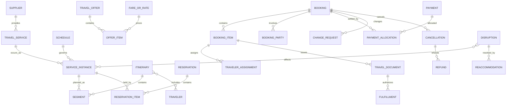

# Travel Model Pattern

## Intent

Model travel businesses that publish and sell transport, lodging, activities, packages, and related services; build itineraries; reserve supplier inventory; issue travel documents; collect payment; manage changes and cancellations; and respond to operational disruptions.

This pattern specializes the Cross-Industry Party, Role, Product, Service, Offering, Agreement, Order, Fulfillment, Price, Payment, Event, Status, Location, and Measurement concepts.

## Business overview

**Traveler Need → Search/Offer → Itinerary → Reservation → Booking → Payment → Ticket/Voucher → Service Fulfillment → Change/Disruption/Refund**

Travel Suppliers publish scheduled or availability-based Travel Services. Distributors assemble those services into Offers and Itineraries. A Customer or Travel Arranger selects an Offer and supplies Traveler details. Reservations hold inventory; an accepted commercial transaction produces a Booking containing one or more Booking Items and Segments. Payment and supplier confirmation enable tickets, vouchers, or other fulfillment documents. Before or during travel, voluntary changes and supplier disruptions may cause rebooking, cancellation, additional collection, exchange, refund, or compensation.

## Pattern variants

### Simple

Use for one supplier type or a focused booking prototype.

Core concepts: Traveler; Travel Service; Offer; Itinerary; Reservation; Booking; Booking Item; Payment; Ticket or Voucher.

### Standard

Use as the default for operational travel applications.

Adds: Customer; Travel Arranger; Supplier; Distribution Channel; Location; Schedule; Service Instance; Availability; Fare or Rate; Price Component; Traveler Document; Segment; Reservation Item; Booking Party; Ancillary Service; Ticket; Voucher; Fulfillment; Change Request; Cancellation; Refund; Disruption.

### Enterprise

Use for travel marketplaces, agencies, tour operators, corporate travel, global distribution, packages, loyalty, settlement, or multi-supplier servicing.

Adds: Supplier Agreement; Distribution Agreement; Agency; Corporate Account; Travel Policy; Approval; Package; Package Component; Inventory Allotment; Married Segment; Fare Rule; Rate Plan; Commission; Markup; Currency Conversion; Loyalty Account; Loyalty Transaction; Settlement; Exchange Document; Electronic Miscellaneous Document; Interline Agreement; Disruption Protection; Duty of Care Case.

## Travel roles

| Role | Meaning |
|---|---|
| Traveler | Person who consumes the travel service. |
| Customer | Party purchasing, arranging, or owning the commercial relationship. |
| Travel Arranger | Party or role acting for one or more Travelers. |
| Supplier | Airline, rail operator, hotel, vehicle provider, cruise line, tour operator, activity provider, or other service provider. |
| Distributor | Party presenting and selling supplier or packaged travel services. |
| Agent | Person or organization assisting search, booking, servicing, or disruption handling. |
| Payer | Party providing payment; may differ from Customer and Traveler. |
| Beneficiary | Party receiving refund, compensation, insurance, or loyalty benefit. |

Rule: Traveler, Customer, Booker, Arranger, Payer, and Beneficiary may be different Parties.

## Product, service, and schedule concepts

### Travel Product

A reusable definition of a transport, lodging, vehicle, cruise, activity, package, or related travel product.

Logical attributes: Product Identifier; Product Name; Product Type; Product Status; Supplier; Description; Effective From; Effective Through.

### Travel Service

A service capability supplied to a Traveler.

Logical attributes: Service Identifier; Service Name; Service Type; Service Status; Supplier; Origin or Location; Destination; Standard Duration; Service Class.

### Service Instance

A dated or otherwise bounded occurrence of a Travel Service.

Logical attributes: Service Instance Identifier; Service Date; Scheduled Start; Scheduled End; Actual Start; Actual End; Instance Status; Origin; Destination; Equipment or Property Reference.

Examples: a specific flight, train, hotel-night stay, vehicle rental period, cruise sailing, tour departure, or event performance.

### Schedule

A governed pattern of planned Service Instances.

Logical attributes: Schedule Identifier; Schedule Type; Operating Days; Start Time; End Time; Time Zone; Effective From; Effective Through; Schedule Status.

### Location

An airport, station, city, hotel, terminal, port, address, pickup point, region, or virtual meeting location.

Logical attributes: Location Identifier; Location Code; Location Name; Location Type; Time Zone; Parent Location; Geographic Coordinates; Status.

### Availability

A statement or calculation of capacity available for a Product, Service Instance, room type, vehicle class, or allotment.

Logical attributes: Availability Identifier; Inventory Type; Available Quantity; Held Quantity; Sold Quantity; Availability Status; Checked At; Source.

Rule: availability is time-sensitive sourced information, not a timeless attribute of the Product.

## Offering and pricing

### Travel Offer

A time-bounded commercial proposal for one or more travel services.

Logical attributes: Offer Identifier; Offer Status; Created At; Expires At; Currency; Total Price; Channel; Supplier; Customer Segment; Offer Source.

### Offer Item

One priced travel service, package component, or ancillary within an Offer.

Logical attributes: Offer Item Identifier; Item Type; Quantity; Unit Price; Total Price; Service Instance; Fare or Rate; Conditions Summary.

### Fare or Rate

A governed price basis and commercial condition for a Travel Service.

Logical attributes: Fare or Rate Identifier; Code; Type; Amount; Currency; Cabin or Room Class; Occupancy; Effective From; Effective Through; Rule Reference.

### Price Component

A base amount, tax, fee, surcharge, discount, commission, markup, or other explainable component of a price.

Logical attributes: Price Component Identifier; Component Type; Description; Amount; Currency; Jurisdiction; Source; Refundable Indicator.

### Fare Rule or Rate Rule

A condition governing eligibility, changes, cancellation, refund, advance purchase, stay, occupancy, baggage, or another commercial constraint.

Logical attributes: Rule Identifier; Rule Type; Rule Status; Condition; Result; Penalty; Effective From; Effective Through.

### Ancillary Service

An optional or separately priced service associated with a travel component.

Logical attributes: Ancillary Identifier; Ancillary Type; Description; Status; Quantity; Price; Fulfillment Method.

Examples: baggage, seat, meal, lounge, transfer, insurance, equipment, early check-in, or activity add-on.

## Traveler and itinerary concepts

### Traveler

A Person participating in an Itinerary or consuming a Travel Service.

Logical attributes: Traveler Identifier; Traveler Type; Name; Date of Birth where required; Preferred Language; Loyalty References; Accessibility Needs.

### Traveler Document

A passport, identity document, visa, permit, trusted-traveler credential, or other document required for travel.

Logical attributes: Document Identifier; Document Type; Document Number; Issuing Authority; Nationality; Issue Date; Expiration Date; Verification Status.

Sensitive document values require restricted access and appropriate protection.

### Itinerary

An organized travel plan containing ordered Segments and services for one or more Travelers.

Logical attributes: Itinerary Identifier; Itinerary Name; Itinerary Status; Start Date; End Date; Primary Destination; Created At; Owner.

### Segment

One ordered movement, stay, rental, activity, or other component of an Itinerary.

Logical attributes: Segment Identifier; Segment Type; Sequence; Planned Start; Planned End; Origin or Location; Destination; Segment Status; Service Instance.

### Connection

A relationship between consecutive Segments requiring continuity or transfer.

Logical attributes: Connection Identifier; Connection Type; Minimum Connection Time; Planned Connection Time; Protected Indicator; Status.

## Reservation and booking concepts

### Reservation

A temporary or confirmed hold on supplier inventory before or as part of Booking.

Logical attributes: Reservation Identifier; Reservation Reference; Reservation Status; Created At; Expires At; Supplier; Source System.

### Reservation Item

A held quantity or entitlement for one Service Instance, rate, room, seat, vehicle, or ancillary.

Logical attributes: Reservation Item Identifier; Item Type; Quantity; Hold Status; Service Instance; Fare or Rate; Traveler Assignment.

### Booking

The durable commercial and servicing record accepted by the seller or Supplier.

Logical attributes: Booking Identifier; Booking Reference; Booking Status; Booked At; Channel; Currency; Total Amount; Customer; Servicing Party.

### Booking Item

One purchased or confirmed travel component.

Logical attributes: Booking Item Identifier; Item Type; Item Status; Quantity; Description Snapshot; Service Date; Unit Price; Total Price; Supplier Confirmation Reference.

Rule: Booking Items preserve accepted service, price, rule, tax, and participant snapshots even when current Offers later change.

### Booking Party

A Party participating in a Booking in a stated role.

Logical attributes: Booking Party Identifier; Role Type; Role Status; Effective From; Effective Through; Contact Reference.

### Traveler Assignment

Assignment of a Traveler to a Booking Item, Segment, seat, room, vehicle, or ancillary.

Logical attributes: Assignment Identifier; Assignment Type; Assignment Status; Traveler; Booking Item; Service Preference; Confirmation Reference.

### Supplier Confirmation

Evidence that a Supplier accepted or confirmed a Reservation or Booking Item.

Logical attributes: Confirmation Identifier; Supplier Reference; Confirmation Status; Confirmed At; Source; Conditions.

## Payment and settlement

### Payment Authorization

Approval to reserve spending capacity for a Booking or change.

Logical attributes: Authorization Identifier; Provider Reference; Amount; Currency; Authorization Status; Authorized At; Expires At.

### Payment

A captured or received transfer of value.

Logical attributes: Payment Identifier; Payment Date; Amount; Currency; Method; Payment Status; Provider Reference; Payer.

### Payment Allocation

Application of a Payment to Booking Items, invoices, fees, or change collections.

Logical attributes: Allocation Identifier; Allocation Type; Allocated Amount; Allocation Date; Status.

### Commission or Markup

Distributor compensation or price adjustment.

Logical attributes: Compensation Identifier; Type; Basis Amount; Rate; Amount; Currency; Status; Recipient.

### Supplier Settlement

A financial settlement between Distributor and Supplier.

Logical attributes: Settlement Identifier; Settlement Period; Currency; Gross Amount; Commission Amount; Adjustments; Net Amount; Settlement Status; Settlement Date.

## Ticketing and fulfillment

### Travel Document

A ticket, voucher, confirmation, pass, coupon, certificate, or other evidence of entitlement.

Logical attributes: Travel Document Identifier; Document Type; Document Number; Document Status; Issued At; Issuer; Valid From; Valid Through; Holder; Booking Item.

### Ticket Coupon

A ticketed entitlement for one transport Segment or service portion.

Logical attributes: Coupon Identifier; Coupon Number; Coupon Status; Segment; Fare Basis; Validating Supplier; Used At.

### Voucher

A document authorizing lodging, rental, activity, transfer, or another non-ticket service.

Logical attributes: Voucher Identifier; Voucher Number; Voucher Status; Service; Supplier; Valid From; Valid Through; Redemption Reference.

### Fulfillment

Evidence that a booked travel service or ancillary was delivered, used, boarded, checked in, stayed, rented, attended, or otherwise consumed.

Logical attributes: Fulfillment Identifier; Fulfillment Type; Fulfillment Status; Started At; Completed At; Quantity; Evidence Reference.

## Change, cancellation, and disruption

### Change Request

A request to modify Traveler, date, route, service, class, room, vehicle, ancillary, or another Booking condition.

Logical attributes: Change Request Identifier; Change Type; Change Status; Requested At; Requested By; Reason; Affected Items; Desired Result.

### Booking Change

An accepted modification with commercial and fulfillment consequences.

Logical attributes: Booking Change Identifier; Change Type; Change Status; Effective At; Prior Item Reference; Resulting Item Reference; Additional Collection; Refund Amount; Penalty.

### Cancellation

An accepted request or supplier action terminating all or part of a Reservation or Booking.

Logical attributes: Cancellation Identifier; Cancellation Type; Cancellation Status; Requested At; Effective At; Reason; Cancelled Quantity; Penalty.

### Refund

A return of money or credit arising from cancellation, change, disruption, overpayment, or service failure.

Logical attributes: Refund Identifier; Refund Type; Refund Status; Requested At; Approved At; Completed At; Amount; Currency; Beneficiary; Reason.

### Disruption

An operational event that prevents or materially changes planned travel.

Logical attributes: Disruption Identifier; Disruption Type; Disruption Status; Detected At; Supplier; Affected Service Instances; Severity; Description.

Examples: delay, cancellation, missed connection, closure, overbooking, equipment change, property unavailable, or force majeure.

### Reaccommodation

Replacement travel or service arranged in response to Disruption.

Logical attributes: Reaccommodation Identifier; Status; Proposed At; Accepted At; Original Item; Replacement Item; Additional Cost; Responsible Party.

### Duty of Care Case

A managed safety or traveler-support case caused by risk, disruption, emergency, or policy concern.

Logical attributes: Case Identifier; Case Type; Case Status; Priority; Opened At; Traveler; Location; Coordinator; Resolution.

## Relationship model

| Source | Relationship | Target | Cardinality |
|---|---|---|---|
| Supplier | defines | Travel Product or Service | 1:M |
| Travel Service | occurs as | Service Instance | 1:M |
| Schedule | generates or governs | Service Instance | 1:M |
| Service Instance | uses | Location | M:M |
| Availability | describes | Service Instance or inventory class | M:1 |
| Travel Offer | contains | Offer Item | 1:M |
| Offer Item | proposes | Service Instance or Ancillary Service | M:1 |
| Fare or Rate | prices | Offer Item | 1:M |
| Offer Item | contains | Price Component | 1:M |
| Itinerary | contains | Segment | 1:M ordered |
| Segment | references | Service Instance | M:0..1 |
| Itinerary | includes | Traveler | M:M |
| Segment | connects through | Connection | 1:M |
| Reservation | contains | Reservation Item | 1:M |
| Reservation Item | holds | Service Instance inventory | M:1 |
| Accepted Offer or Reservation | produces | Booking | 1:0..1 |
| Booking | contains | Booking Item | 1:M |
| Booking | has | Booking Party | 1:M |
| Booking Item | receives | Traveler Assignment | 1:M |
| Booking Item | receives | Supplier Confirmation | 1:M |
| Booking | receives | Payment | M:M through Payment Allocation |
| Booking Item | issues | Travel Document | 1:M |
| Ticket | contains | Ticket Coupon | 1:M |
| Travel Document | authorizes | Fulfillment | 1:M |
| Booking or Booking Item | receives | Change Request | 1:M |
| Accepted Change Request | produces | Booking Change | 1:1 |
| Booking or Booking Item | receives | Cancellation | 1:M |
| Cancellation or Booking Change | may produce | Refund | 1:M |
| Disruption | affects | Service Instance | M:M |
| Disruption | may produce | Reaccommodation or Duty of Care Case | 1:M |

## Lifecycle models

### Travel offer

Draft → Priced → Available → Selected → Accepted

Exception outcomes: Expired; Withdrawn; Repriced; Unavailable.

### Reservation

Requested → Held → Confirmed → Converted

Exception outcomes: Waitlisted; Rejected; Expired; Released; Cancelled.

### Booking

Draft → Pending Confirmation → Confirmed → Ticketed/Fulfilled → In Travel → Completed

Exception outcomes: On Hold; Partially Confirmed; Changed; Partially Cancelled; Cancelled.

### Travel document

Pending → Issued → Active → Used

Exception outcomes: Exchanged; Refunded; Voided; Expired.

### Change request

Requested → Priced → Accepted → Applied → Completed

Exception outcomes: Declined; Expired; Withdrawn; Failed.

### Refund

Requested → Validated → Approved → Processing → Completed

Exception outcomes: Rejected; Failed; Reversed.

### Disruption

Detected → Assessed → Options Available → Traveler Contacted → Resolved → Closed

Exception outcomes: Escalated; Unresolved; Duty of Care Active.

## Business events

- Search Requested
- Offer Created, Repriced, Selected, Accepted, or Expired
- Availability Checked
- Inventory Held, Confirmed, Released, or Waitlisted
- Booking Created, Confirmed, Changed, Cancelled, or Completed
- Supplier Confirmation Received or Rejected
- Payment Authorized, Captured, Failed, or Refunded
- Ticket or Voucher Issued, Exchanged, Voided, Used, or Refunded
- Traveler Checked In, Boarded, Arrived, or No-Show
- Service Delayed, Cancelled, Overbooked, or Unavailable
- Connection Missed
- Reaccommodation Offered or Accepted
- Duty of Care Case Opened or Closed
- Supplier Settlement Completed

## Baseline business and integrity rules

1. An Offer must identify its supplier or seller, included services, Travelers or occupancy assumptions, currency, price components, conditions, and expiration.
2. Availability, price, tax, and rules must be revalidated before Booking confirmation.
3. A Booking retains the accepted Product, service, schedule, price, tax, rule, and participant snapshots required to explain the transaction.
4. Traveler identity and required documents must match supplier, destination, and jurisdictional requirements for the service date.
5. Reservation expiry releases held inventory unless a confirmed Booking or explicit extension exists.
6. One Booking may contain several Suppliers, Travelers, Segments, payments, currencies, and fulfillment documents when the business model supports them.
7. Payment capture cannot exceed authorized or payable value unless an approved change creates additional collection.
8. A Travel Document must trace to a confirmed Booking Item and the Party entitled to use it.
9. Fulfillment cannot exceed the booked quantity or entitlement.
10. Changes and cancellations preserve prior commercial and itinerary versions.
11. Refund amount must be explainable from unused value, rules, penalties, supplier response, prior refunds, and currency treatment.
12. Disruption handling distinguishes supplier-caused, traveler-requested, protected-connection, and force-majeure outcomes.
13. Sensitive identity and travel-document data is collected and disclosed only for an authorized purpose and minimum scope.
14. Supplier settlement, commission, markup, payment, exchange, and refund amounts must reconcile to their source transactions.

## AI modeling questions

1. Is the business a Supplier, agency, marketplace, tour operator, corporate travel manager, or a combination?
2. Which travel services are supported: air, rail, hotel, vehicle, cruise, tour, transfer, activity, insurance, or package?
3. Are Products, Services, Service Instances, Offers, Reservations, and Bookings independently meaningful?
4. Which distribution channels and supplier connectivity models are used?
5. Are Travelers, Customers, Arrangers, Bookers, Payers, and Beneficiaries different roles?
6. Which identity, passport, visa, accessibility, loyalty, and traveler-preference data is legitimately required?
7. Is inventory live, allotted, request-based, on-demand, or externally confirmed?
8. How long may inventory and price be held?
9. Which fare/rate rules, taxes, fees, commissions, markups, and currencies apply?
10. Can an Itinerary contain multiple Suppliers and independently changeable Segments?
11. Which services require tickets, vouchers, passes, confirmations, or no document?
12. How are voluntary changes, involuntary disruptions, exchanges, cancellations, refunds, and no-shows handled?
13. Which connections are protected, and who owns reaccommodation?
14. Are corporate policy, approval, duty of care, or traveler tracking required?
15. How are supplier settlement and financial reconciliation performed?
16. Which operational, customer, financial, and sustainability measures are required?

## MDE modeling guidance

- Reuse Cross-Industry Party and Party Role; do not collapse Traveler, Customer, Arranger, Payer, and User.
- Keep Product, Service, Service Instance, Offer, Reservation, Booking, Booking Item, Travel Document, and Fulfillment distinct.
- Treat Itinerary as the Traveler's organized plan and Booking as the commercial servicing record.
- Preserve supplier references and accepted commercial snapshots; current supplier content cannot reconstruct history reliably.
- Model multi-segment, multi-traveler, multi-supplier, split-payment, exchange, and partial-refund relationships explicitly.
- Keep voluntary Change, Cancellation, supplier Disruption, and Reaccommodation as separate concepts.
- Put availability, eligibility, pricing, ticketing, change, refund, and settlement rules on authoritative operations.
- Use cases orchestrate search, choice, servicing, and exception paths while invoking those operations.

## Anti-patterns

### Itinerary Equals Booking

An Itinerary organizes travel intent and sequence; a Booking records accepted commercial commitments and servicing references.

### Offer Equals Reservation Equals Ticket

An Offer proposes; a Reservation holds; a Booking confirms; a Ticket or Voucher proves entitlement.

### Traveler Equals Customer Equals Payer

The traveler may be a child, employee, guest, or beneficiary while another Party arranges and pays.

### One Booking, One Supplier, One Traveler

This fails for families, groups, packages, corporate travel, connections, and marketplaces.

### Current Schedule Reconstructs History

Schedules and supplier content change. Historical Bookings require accepted snapshots and source references.

### Cancellation Equals Refund

Cancellation terminates service; refund determines recoverable value and payment. Either may occur without the other.

### Booking Status as Everything

Reservation, payment, supplier confirmation, ticket, Segment, fulfillment, change, refund, and disruption require independent states.

## Physical mapping examples

| Logical name | Example physical name |
|---|---|
| Service Instance | `service_instance` |
| Travel Offer | `travel_offer` |
| Offer Item | `offer_item` |
| Reservation Item | `reservation_item` |
| Booking Item | `booking_item` |
| Booking Party | `booking_party` |
| Traveler Assignment | `traveler_assignment` |
| Supplier Confirmation | `supplier_confirmation` |
| Travel Document | `travel_document` |
| Change Request | `change_request` |
| Booking Change | `booking_change` |
| Duty of Care Case | `duty_of_care_case` |

Logical names remain authoritative. Technology-stack and supplier-integration rules generate physical names only after the logical model is accepted.

## Future behavioral expansion

This file is an actual logical industry pattern. A metamodel-conformant Travel knowledge base should create separate capabilities, entities, roles, rules, use cases, and workflows for Content and Availability, Shopping and Offers, Itinerary Planning, Reservation and Booking, Payment and Ticketing, Travel Fulfillment, Servicing and Refunds, Disruption Management, and Supplier Settlement. Candidate actor-goal use cases include Search Travel, Build Itinerary, Price Offer, Hold Inventory, Confirm Booking, Add Traveler, Collect Payment, Issue Ticket or Voucher, Change Booking, Cancel Booking, Calculate Refund, Manage Disruption, Reaccommodate Traveler, and Reconcile Supplier Settlement.
